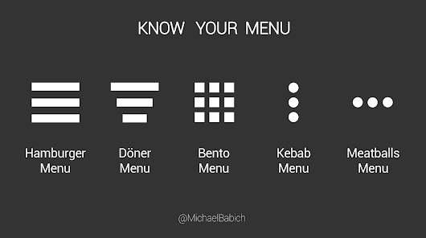

# UI/UX Design Glossary

> https://uxplanet.org/ui-ux-design-glossary-navigation-elements-b552130711c8 참고

2021.12.28

---

[TOC]

---

## Navigation

> the set of actions and techniques guiding users throughout the app or website, enabling them to fulfill their goals and successfully interact with the product.

## Menu

> a graphical control that presents the options of interactions with the interface.

## CTA

> `Call to Action` is the word of phrase which stimulates users to interact with a product in a way and for the aim it is designed for.

## Bar

> a section of the user interface with clickable elements enabling a user to quickly take some core steps of interaction with the product or it can also inform the user about the current stage of process.

### Tap bar

- in mobile applications, it appears at the bottom of an app screen and provides the ability to quickly switch between different sections of an app.

### Loading bar

- the control informing user on the current stage of action, when the process is in active stage and user can see the flow via timing or percentage shown in progress

### Progress bar

- provides feedback on a result of the current process so far, for example, showing how much of the planned activity has been done.

## Button

## Switch

## Picker

## Checkbox

***Copyright* © 2021 Song_Artish**