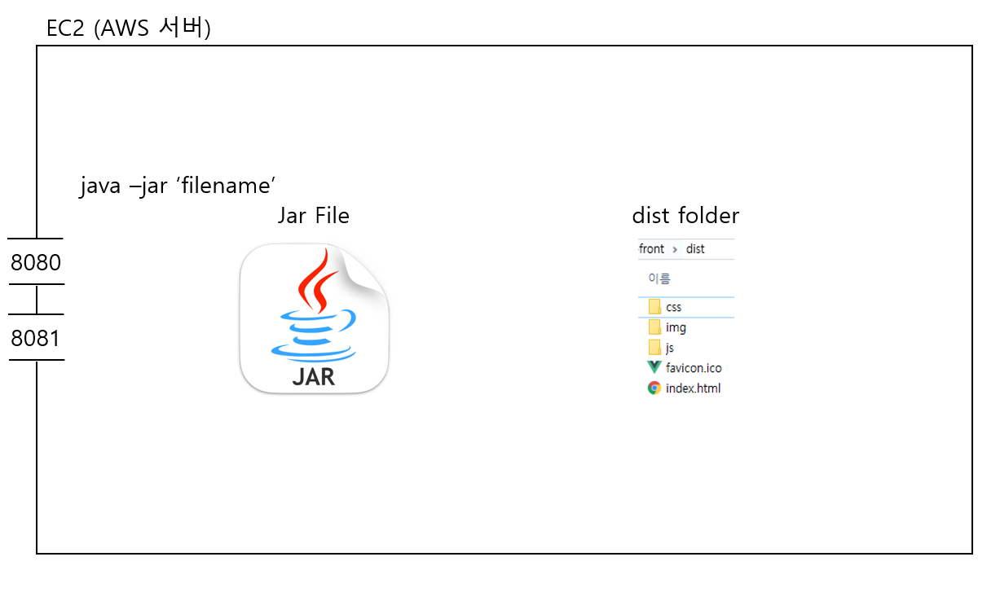

# AWS EC2

2021.02.01

---

[TOC]

---


## JAR파일 배포

> Springboot에서의 JAR파일을 AWS EC2에서 배포한다.

### `JAR` 생성

Springboot를 실행하면 JAR파일이 생성된다.

- `JAR` 파일은 독립적으로 `tomcat`을 가지고 있다.
- 따라서 JAR은 8080 localhost를 쓰며, Vue는 8081 localhost를 할당받게 된다.

:ballot_box_with_check: 아래의 명령어는 jar 파일을 빌딩해준다.

```bash
mvn package
```

:ballot_box_with_check: 아래의 명령어로 jar파일을 실행할 수 있다. 

```bash
java -jar <JAR 파일이름>.jar
```


### 배포

> 예시에서는 `movaxterm`이라는 프로그램을 사용한다!

- jar 파일을 드래그앤드랍한다.

- jar 파일이 있는 위치로 이동한다.

- 아래의 명령어를 입력하면 위에서와 같이 jar 파일을 실행할 수 있다.

  ```bash
  java -jar <JAR 파일이름>.jar
  ```



`(출처: 김명석 코치님 자료)`

:ballot_box_with_check: 추후 배포자동화를 통해 관리하면 편리하다!

- gitlab
- jenkins


***Copyright* © 2021 Song_Artish**