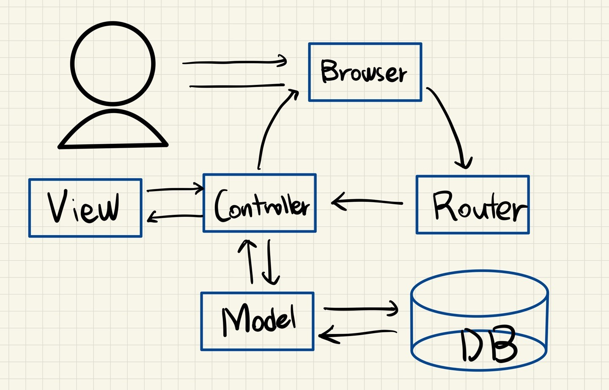

# MVC Design Pattern

---

[TOC]

---

## Overview

MVC(**M**odel **V**iew **C**ontroller) is a SW Architecture Design Pattern that separates application functionalities, and it promotes organized programming.

Below are the examples of web framework which uses MVC concepts.

- Ruby on Rails (Ruby), Laravel(PHP), Codeigniter(PHP), Django(Python), Express(JS), Backbone(JS), Angular(JS), Flask(Python)

## Model

Model is a knowledge. It handles data, interacting with database.

## View

View is a visual representation of a model. It represents what the users see. (UI)

## Controller

Controller processes requests, receiving input, getting data from a model, and passing data to the view.

***Copyright* © 2022 Song_Artish**

