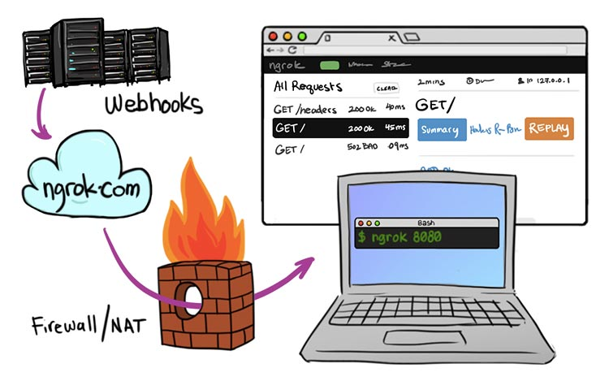

# ngrok

---

[TOC]

---


## Overview

ngrok(엔그록)은 방화벽을 넘어서 외부에서 로컬에 접속할 수 있게 하는 터널 프로그램(Secure tunnels to localhost)이다. HTTP로 만들어진 서버를 HTTPS 프로토콜로 터널링 해준다.



`(출처: ngrok.com)`


## 시작하기

다음의 명령어로 ngrok agent를 설치한다.

```shell
choco install ngrok
```

설치한 ngrok agent를 ngrok 계정에 등록한다. Authtoken은 ngrok 사이트에 회원가입(로그인) 후에 `Dashboard > Getting Started > Your Authtoken`에서 가져올 수 있다.

```bash
ngrok config add-authtoken <TOKEN>
```

포트를 열고 해당 포트를 등록한다.

```shell
ngrok http <PORT>
ngrok http 8000	# 예시
```

위 명령어를 입력하면 터미널 창 전체가 ngrok의 접속 상태를 알 수 있는 대시보드처럼 나오는데, 여기서 `*.nogrok.io`로 표시되는 주소를 사용하면 다른 컴퓨터나 기기에서도 해당 포트에 접속할 수 있게 된다.

```
...
warding                    https://f08a-220-72-126-167.jp.ngrok.io -> http://localhost:550
...
```


## Issues

### `Invalid Host header`가 발생하는 경우

ngrok 주소로 접속했는데 `Invalid Host header`라는 에러가 발생하였다.

**해결 방안**

- `ngrok http <PORT>` 명령어 대신, 다음과 같은 명령어를 입력하여 ngrok을 실행한다.

```bash
ngrok http 8080 --host-header=”localhost:8080”
```


***Copyright* © 2022 Song_Artish**

