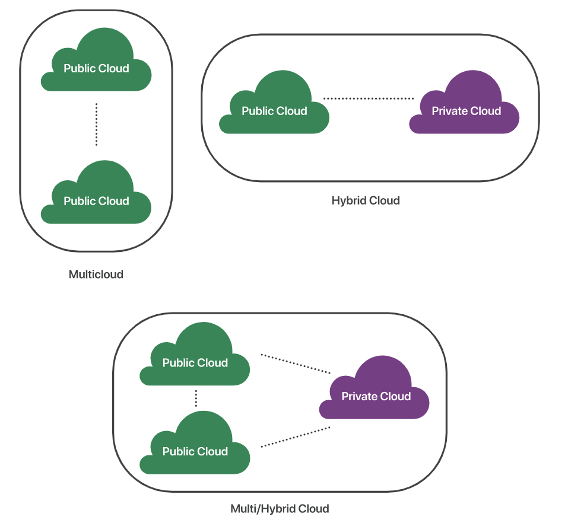

# Cloud

2022.03.01

---

[TOC]

---


## Overview


## Background

- History
  - 1980년대 전후, 원격지와 컴퓨터 근처에 있는 단말기 사이에 있는 수많은 네트워크 장비를 전부 그리지 않고 구름을 통해 추상화한 것이 시초
  - 2000년대에 들어 `클라우드 컴퓨팅` 개념이 완성됨
- IDC(Internet Data Center): 서버 및 네트워크 장비를 안정적이고 전문적으로 관리하기 위한 시설


## Type

1. Public Cloud
   - 클라우드 컴퓨팅의 일반적인 유형
   - 클라우드 리소스(ex.서버 및 스토리지)는 타사 클라우드 서비스 공급자가 소유하고 운영하며 인터넷을 통해 제공
   - 모든 HW, SW 및 기타 지원 인프라를 클라우드 공급자가 소유/관리한다.
2. Private Cloud
   - 기업 혹은 조직에서 독점적으로 사용하는 클라우드
   - 서비스와 인프라가 항상 프라이빗 네트워크에서 유지 관리되며, HW와 SW는 조직에서만 전용으로 사용된다.
3. Hybrid Cloud
   - On-promise 혹은 Private Cloud와 Public Cloud를 결합하는 클라우드 컴퓨팅 유형
   - 개발/런칭/배포 등 전방적인 Dev/Ops 관점 및 규모 유연성, 비즈니스 지향적이기 때문에 효율적인 IT 인력 운영이 가능


`(출처: https://judo0179.tistory.com/113?category=280270`

4. Multi/Hybrid Cloud

   - 다수이 클라우드와 결합하여 사용

   - 서비스의 안정성 규모 확장, 의존성을 줄이는 방식

   - 서로 상이한 클라우드끼리 통신하기 위해서 다음과 같은 방법을 사용한다.

     ```
     - API: Aplication Programming Interfaces
     - VPN: Virtual Private Network
     - WAN: Wide Area Networks
     ```

     

## Public Cloud 3사

> 대표적으로 `Amazon AWS`, `Microsoft Azure`, `Google Cloud Platform(GCP)`가 있다.


***Copyright* © 2022 Song_Artish**