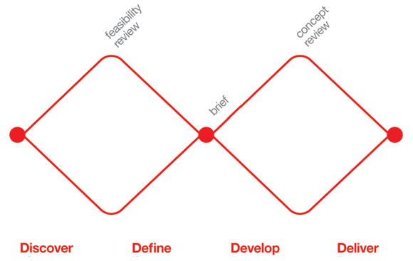
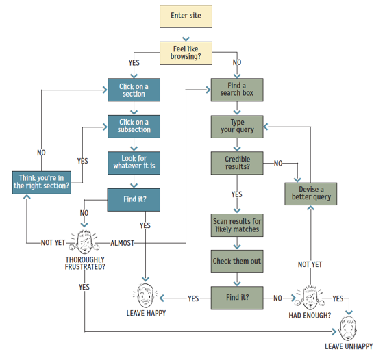
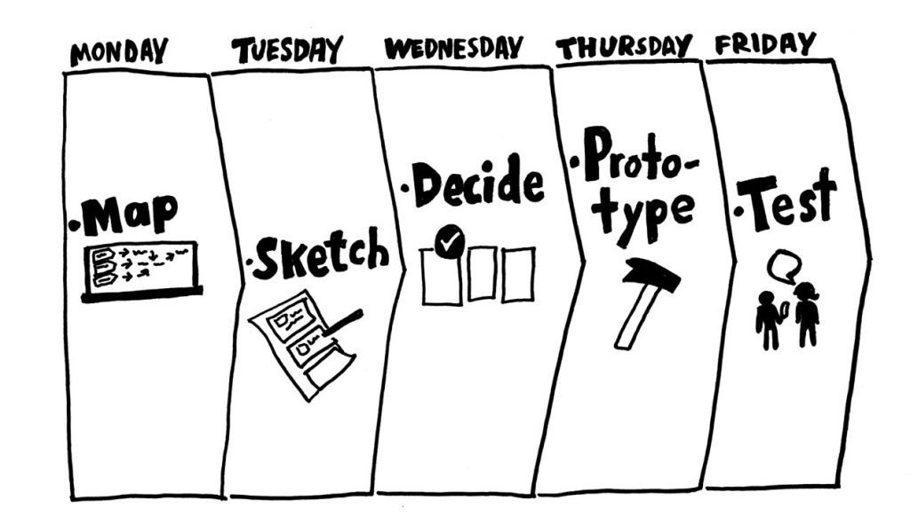
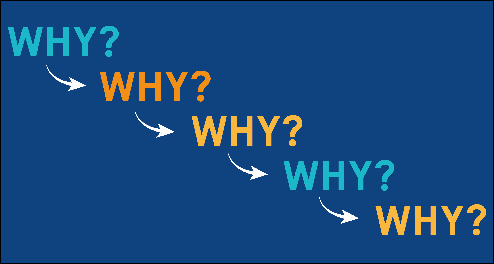
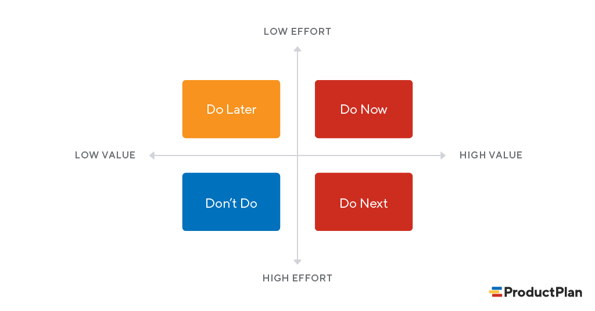
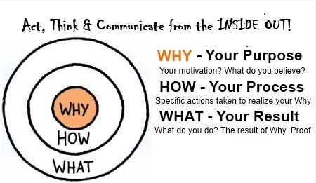

# UX 디자인개론 Intro

---

[TOC]

---


## 학습 목표

1. 사용자를 관찰하고 이해하는 방법
2. 인사이트가 해결책으로 구체화되는 과정
3. 사용자의 행동을 유도하는 방법
4. 데이터 기반 의사결정


## What is UX?

> UX는 1) **사용자를 이해**하고, 2) **사용자의 결핍을 발견**하고,3) **문제를 해결**하는데 도움을 주는 도구이다.

**UX/UI 디자이너의 역할**

1. **전통적인 역할**: 제품의 시각적인 부분을 아름답게 표현
2. **새롭게 요구되는 역할**: 프로젝트 전반에서 종합적으로 디자인에 참여

```markdown
- 사용자 리서치
- UX 기획/설계 = 스토리보드 작성
- 와이어프레임
- UI 디자인
- 프로토타이핑
- 프로젝트 진행(커뮤니케이션)
- 브랜딩 및 편집 디자인
- HTML/CSS 코딩
```


## UX 디자인 프로세스

|  #   |     Step     |             Desc.             |
| :--: | :----------: | :---------------------------: |
|  1   | **Research** |          니즈를 조사          |
|  2   | **Concept**  |    Uncertainty -> Insights    |
|  3   |  **Design**  | Insights -> Clarity & Focuses |


### Double Diamond 모델

> 사용자 중심의 디자인 프로세스를 나타내는 대표적인 방법론



`(출처: https://m.blog.naver.com/youngdisplay/60205111308)`

1. Discover

   ```
   - 사용자 관찰
   - 비즈니스 골과 이해관계자들의 의견 경청
   - 문제 파악 및 사용자 학습
   - 양질의 정보 수집과 관찰이 이루어져야 함
   ```

2. Define

   ```
   - 사용자의 문제를 명확하게 정의
   - Discover 단계에서 배운 인사이트를 종합하여 솔루션 도출
   ```

   - 다이아몬드 간의 접점

   ```
   - 전체 프로젝트에서 방향성 및 전략을 결정하는 단계
   - 솔루션 정의, 서비스 컨셉 등
   ```

3. Develop

   ```
   - 많은 스케치와 프로토타입 등을 통해서 아이디어 시각화 및 구체화
   - 프로토타입(시안) 단계에서 시각적인 디자인 부분(`비주얼 디자인`)도 포함
   ```

4. Deliver

   ```
   - 시각화된 솔루션 테스트
   - 사용성 테스트등
   ```

   

### UX vs UI

> User experience encompasses all aspects of the end-user's interaction with the company, its services, and its products. - Donald Norman

**UX Design**

- 서비스/제품을 사용하면서 총체적으로 느끼는 사용자의 경험을 디자인

  ```
  - Personas
  - User Stories
  - User Research
  - Usability Testing
  - Wireframes
  ```

**UI Design**

- 사용자가 서비스/제품을 사용하면서 interaction하게 되는 제품의 접점을 디자인

  ```
  - Wireframes
  - Layout
  - Visual Design
  - Branding
  ```

> Good UI is not always Beautiful UI!

- 예시
  - Facebook
    - 다양한 문화, 나이, 성별을 포괄하는 서비스
    - 심플하지만 직관적인 디자인
  - Amazon
    - 쇼핑을 위한 정보를 잘 표시
    - 결제를 빠르게 진행할 수 있도록 설계됨


### 어떻게 사용자의 니즈를 알아낼까?

1. **Context**: 사용자가 제품을 사용하는 시간, 장소, 상황, 사회문화적 배경
2. **Behavior**: 사용자가 제품과 실제로 interaction하는 방식
3. **Needs**: 무언가를 필요로 하는 내적 욕구
4. **Attitude**: 대상에 대해서 갖는 인지적, 정서적 반응
5. **Motivation**: 행동을 일으키게하는 요인


## 제품 개발 프로세스

### 개발 방법론

**1. Waterfall**

- 폭포수와 같이디자인,개발 등 각각의 프로세스가 **순차적**으로 진행됨
- 미리 모두 정해진 요구사항을 바탕으로 기획-디자인-개발 프로세스가 순서대로 진행되며 출시하는 방식의 개발 프로세스
- 각 단계의 요구사항의 변화나 문제가 발생했을 경우 유연한 대처가 어려움

**2. Agile**

> Waterfall의 단점을 보완하기 위한 개발 방법론

- 큰 프로젝트(scope)를 잘개 쪼개어 진행하기 때문에 요구사항 변경이나 이슈가 생겼을 때 유연하게 대처가 가능

```markdown
- 포괄적인 문서 < 작동하는 소프트웨어
- 계액, 협상 < 고객과의 협력
- 계획 < 변화의 대응
```

- scope(프로젝트의 범위)이 작기 때문에 각 쪼개어진 프로젝트에서 실무자들 간의 협업을 통해 수정사항의 반영이나 사용자들의 피드백, 클라이언트의 의견 등이 유연하게 반영될 수 있다
- 빠르게 개발과 가설 검증을 통해 변화에 대처할 수 있음
- 디자인 프로세스를 빠르게 실행 가능
- 전체 product의 작은 부분별로 집중하여 개선이 가능
- 개발자, 마케터, 클라이언트와 가깝게 커뮤니케이션하며 수정사항을 유연하게 반영 가능


### Agile 조직의 제품 개발 방식

1. 비전/로드맵

   - 연 단위의 장기적인 계획
   - 월 단위의 단기적인 목표

2. 우선 순위 정하기

   > 계획과 목표를 달성하기 위한 많은 feature들이 `백로그`에 쌓이게 된다.

   - 백로그를 관리하고 우선 순위 정하기

3. 디자인/개발

   >  우선 순위가 높은 feature는 `sprint`라는 사이클 안에 들어가게 된다.

   - Sprint(짧게는 2주, 길게는 4주 정도의 과정) 안에서 실제 디자인과 개발이 이루어진다.
   - PM은 sprint를 진행하며 실무자들과 협업을 하기 위해 **데일리 스탠드업**을 진행한다.

4. 배포, 회고, 가설 검증

   - 테스트 후 배포
   - 매번 sprint가 끝날 때마다 잘된 것, 부족했던 것, 개선할 점에 대해서 회고
   - 지표/가설에 대한 점검
   - 이후 다음 sprint로 넘아감


### UX/UI 디자이너가 하는 일

1. **사용자 리서치**: 먼저 사용자들로부터 인사이트를 얻기 위해 사용자 리서치를 진행한다. UX 리서쳐
2. **인사이트 도출**: 직접 사용자 인터뷰를 통해 얻은 데이터를 분류하고 정리하는 과정에서 인사이트를도출하는 데이터 모델링 과정을 거치고 사용자들의 니즈를 만족시키기 위해서는어떤 feature가 필요할 지에 대한 기획을 진행하기도 한다.
3. **시각화**:  Feature들은 어떤 요소가 필요하고 어떤 과정을 통해 실행되어야 하는지를 시각적으로보여주는 **와이어프레임**을 그리기도 하는데, 이 때 UX 리서치 결과가 시각적으로 변환되게 된다.
4. **유저 플로우 작성**: 단지 시각적인 부분 뿐만 아니라 실제 개발을 위해 필요한 예외 케이스나 조건에 따라 보여져야 하는 다양한 로직들에 대한 고려를 개발자와 함께 논의하고 이미지와 같은 **유저 플로우**를 작성한다.



`(출처: 패스트캠퍼스)`

5. **UI 디자인**:  컬러, 간격, 폰트 등이 고려된 high-fidelity 목업을 제작한다.
6. **프로토타입 제작**: 필요에 따라 내부 커뮤니케이션이나 설명을 위해 프로토타입을 제작하기도 한다.
7. **서비스 운영 참여**: 사용자 단 뿐만 아니라 서비스가 실제로 운영되기 위해 필요한 백오피스를 기획하기도 하고, 작은조직에서는 UX 디자이너가 서비스 운영에 관여하기도 한다.
8. **테스트**: 디자인한 의도대로 개발이 다 잘 되었는지, 버그는 발생하지 않는지등을 확인하기 위해 테스트를 진행해야 한다.
9. **모니터링**: 개발된 feature를 통해서 검증해보려고 했던 가설과 지표들을 지속적으로 모니터링하고 내부에 공유하는 일에도 디자이너들이 점점 참여하는 추세이다.
   사용자들의 행동 데이터를 바탕으로 가설을 세우고 디자인의 방향성을 도출해 내는 역량이 점점 중요해지고 있다.


## 모바일 UX/UI 역사

### 1. Skeuomorphism

> 스큐어모피즘

- 사용자의 인지를 돕기 위해 현실 세계를 반영한 형태의 UI

- 실재하는 대상의 본래 모습을 최대한 사실적으로 표현하는 기법

- 디자인 하는데 리소스가 많이 들고 쏟아져나오는 디바이스들에 대한 대응 어려움

- 예시

  - iPhone의 계산기, 녹음 앱(마이크)

    

`(출처: 클래스101)`

### 2. Flat Design

> 플랫 디자인

- 스큐어모피즘의 해결책

- 사용자가 인지할 수 있을 정도의 형태를 유지한 채 선과 컬러 등을 플랫하게 단순화하여 디자인하는 것

- 2차원적 형태로 그림자, 하이라이트 등 심도나 차원을 나타내는 요소 배제

- 다양한 디바이스와 스크린 사이즈에 맞춰 쉽게 사이즈를 조절하거나 배열 조절 가능

- :exclamation: 플랫 디자인에 집착하면 정보 우선순위와 사용성, 가독성 등을 해칠 수 있다. (사용자의 이해 방해)

- :exclamation:플랫 디자인을 적용한 서비스들의 획일화된 디자인 (서비스 제품만의 identity를 나타내기 어려움)

- 예시 

  - MS Window 8 (Metro UI, 2012년)

    

    `(출처: 클래스101)`

  - iOS 7 (2013)

    

    `(출처: 클래스101)`

### 3.Google Material Design

- 구글의 시각적 언어

- 모든 디바이스에 일관성 있는 경험

- 플랫 디자인과 달리 3차원 z축을 이용해 입체감을 더함

- 디지털 종이들이 layered layer를 구성

- 각각의 표면 뒤의 그림자가 생성되어 깊이감을 표현

- 사용자에게 정보 구조를 표현하기에 더 적합

  

  `(출처: 클래스101)`

- Apple에서는 material design과는 달리 gradient나 blur 처리를 통해서 요소 간의 우선순위를 표현 (**Flat 2.0**)


## 최신 UX 트렌드

### 1. Personalization

- 사용자 데이터를 활용하여 더 적절한 콘텐츠를 보여주며 interaction이 가능
- 사용자 데이터를 수집하여 사용자별로 맞춤형 콘텐츠나 서비스를 제공
- 인공지능이나 머신러닝 기술을 사용
- 예시
  - 넷플릭스의 맞춤 추천

### 2. 사용자 맥락을 고려한 콘텐츠

- 사용자의 input 적극 반영
- 여러 가지 경험이 연결되고 통합됨

### 3. Micro Interaction

- 간결한 제스처와비주얼 피드백을 활용하여 사용자의 인지를 돕는다.
- 서비스 identity를 표현하는데 도움이 된다.

### 4. VUI

> Voice User Interface

- 애플의 시리, 구글의 OK 구글, MS의 Cortana, Amazon의 Alexa 등
- **Zero UI**, **스크린리스 시대의 디자인**


### <참고 자료>

- **Google Material Guideline**: https://material.io/design/
- **Apple Human Interface Guideline**: https://developer.apple.com/design/human-interface-guidelines/
- **UX 트렌드를 접할 수있는 사이트**
  - https://www.fastcompany.com/co-design
  - https://medium.com/
  - https://techcrunch.com/


## Lean Startup

> 완벽한 제품을 오랜시간에 거쳐 개발 후 출시하는 것이 아니라 **가설**을 가지고 **최소한의 제품**으로 **빠르게 출시**하여 고객의 피드백을 얻고 이를 바탕으로 개선해나가는 방식

- 빠르게 변화하는 시장에서 작은 제품을 빠르게 개발해서 시장에 내놓고 고객 반응을 통해 성공 여부를 측정하고 방향성을 수정해나가고 고도화해나감

  ```
  처음에 원을 그리면 가늘지만, 계속해서 원을 그리면 더 두꺼운 원이 된다.
  ```


### Google Sprint

> 아이디어를 짧은 시간에 prototype을 통해서 테스트해보는 방법론

- 구글벤처스 제이크 크냅에 의해 고안됨
- 구글 뿐만 아니라 페이스북, 에어비앤비 등 다양한 기업에서 활용



`(출처: Line Engineering)`

1. Map
   - 이해관계자들과 현재 상황을 파악하고 문제 나열
2. Sketch
   - 문제 해결을 위한 다양한 스케치 활동을 통해 아이데이션 진행
3. Decide
   - 구성원들이 낸 아이디어 스케치를 pitching하고 투표를 통해 아이디어 선별
4. Prototype
   - 선별된 아이디어들을 데모가 가능한 프로토타입으로 발전시킨다.
5. Test
   - 프로토타입을 가지고 고객 테스트와 피드백 수렴
   - 이를 통해 처음 세웠던 가설을 검증하고 개선하는 작업 


### MVP

> Minimun Viable Product

- 최소한의 노력으로 사용자의 니즈를 검증할 수 있는 제품
- 한 번에 완벽한 product를 만드는 것이 아니라 **최소 존속 가능한 제품**으로 **빠르게 출시**하고 시장의 반응에 따라 개선해나가는 프로세스가 가능
- 사용자의 니즈를 충족시킬 수 있어야한다.
  - cf) MLP(Minimun Lovable Product)
- 최초 가설을 검증할 수 있어야한다.


## 문제 해결을 위한 생각 도구들

> 문제를 해결하는데 한 시간이 주어진다면, 삼분의 이 이상의 시간을 **문제가 무엇인지** 정의하는데 쓸 것이다. - Mattew Wakeman

### 1. 5 Whys

발견한 현상에 대해서 이유의 이유를 계속해서 파고들어가 가장 근본적인 문제의 원인을 파악하는데 효과적인 방법



`(출처: URBACT)`


### 2. 2x2 Matrix

우선순위를 세워 의사결정을 하는 데 도움이 되는 방법론



`(출처: ProductPlan)`

- X축: 얼마나 효율적인가? (리소스 대비 효율)
- Y축: 사용자에게 얼마나 큰 가치를 주는가?
- 즉,`Do Now`에 있는 feature들이 지금 당장 개발해야 할 feature이다.


### 3. Golden Circle

무엇을 만들까라는 고민을 하기 전 왜 만들어야 하는지에 대한 고민이 선행되어야 함



`(출처: Medium)`


***Copyright* © 2021 Song_Artish**