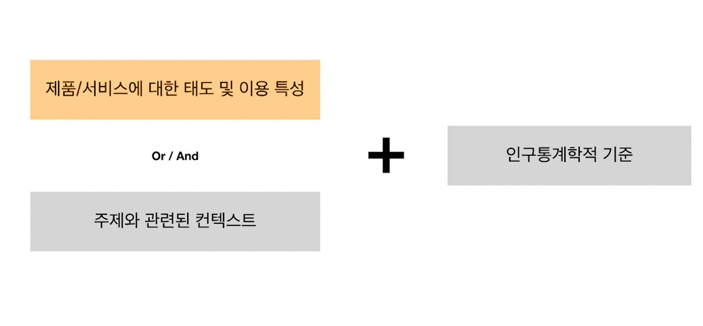
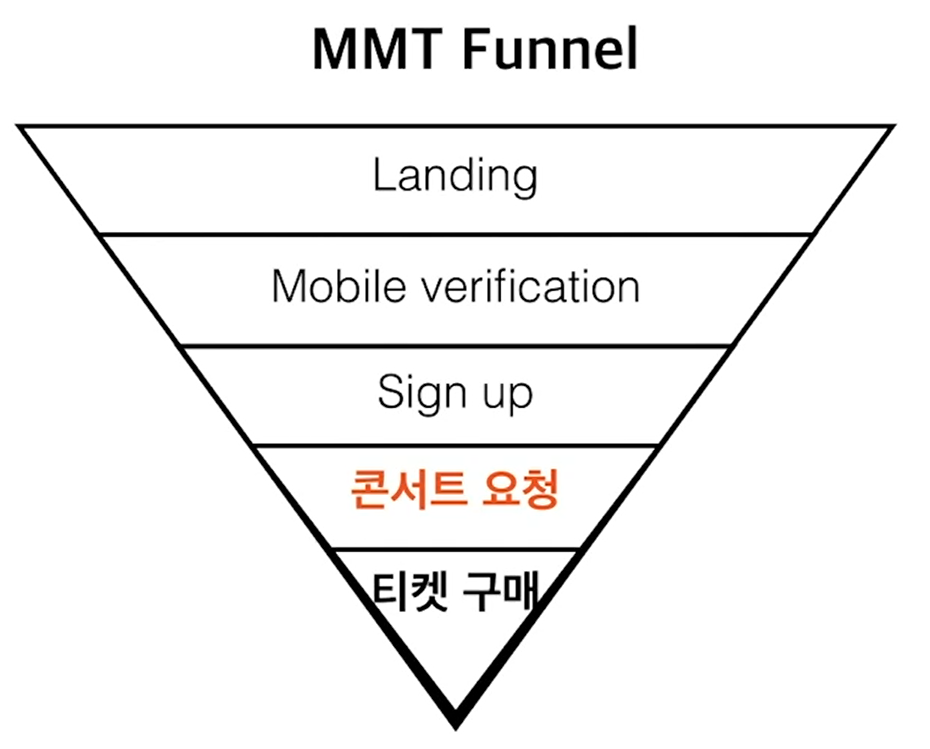
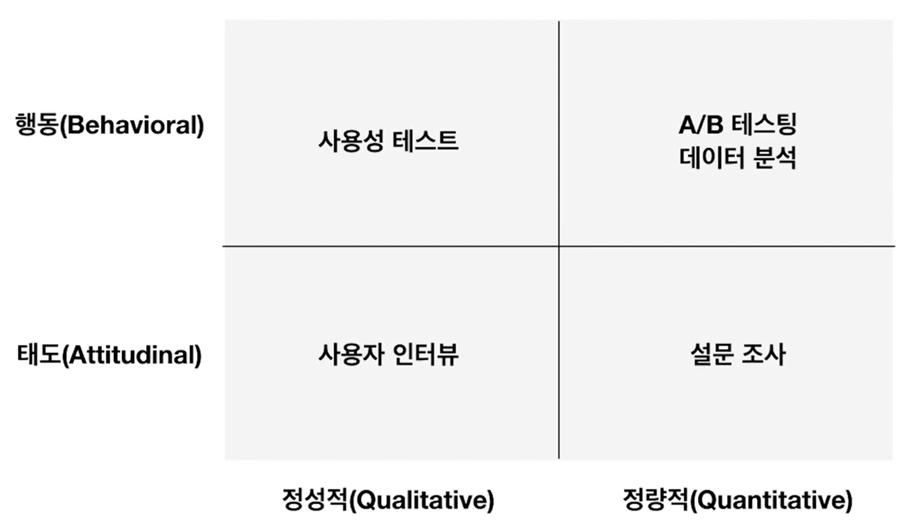

# UX Research

---

[TOC]

---


## 비즈니스 목표 이해

---

### 성공적인 프로젝트를 위한 요소

UX 프로젝트를 시작하기 전 이해관계자 인터뷰를 통해서 프로젝트의 맥락과 배경 및 목표 등에 대해서 디테일하게 조사할 필요가 있다.

1. 프로젝트 목표 (장기적/단기적)
2. 타겟 유저
3. 요구 사항
4. 예산 및 스케줄
5. 제한 사항 및 리스크

### 이해관계자(Stakeholder) 인터뷰

- 이해관계자: 프로젝트와 직/간접적으로 관련된 업무를 하는 사람들
- 프로젝트의 첫 시작을 위해 이해관계자들과 함께 하는 미팅을 **Kick-off 미팅**이라고 한다.
- 인터뷰에서는 해결책이나 세부 기능들에 집중하기보다 타겟 유저는 누구인지, 문제점은 어떤 것이 있는지, 프로젝트에 목표는 무엇인지 등에 집중해야 한다.

1. 비즈니스

   ```
   - 프로젝트의 성공을 어떻게 정의하고 있나요?
   - 주요 성과지표가 있나요(KPI)?
     - KPI: Key Performance Indicator로 기업의 목표를 달성하기 위한 성과 지표
   - 어떤 사업적 기회가 있나요?
   - 비즈니스적, 기술적, 사업적 제약은 없나요?
   ```

2. 경쟁사

   ```
   - 경쟁 서비스는 어떤 것이 있나요?
   - 경쟁사와 비교하여 더 나은 점(차별점)은 무엇인가요?
   - 우리가 사용자에게 주는 가치로 만들 수 있는 진입장벽은 무엇이 있나요?
   ```

3. 사용자

   ```
   - 사용자들은 누구이고 어떤 특성(행동/상황)을 가지고 있나요?
   - 사용자들은 무엇을 하려고 노력하고 어떤 어려움을 가지고 있나요?
   - 그들은 왜 이것에 관심을 가지나요?
   - 궁극적으로 사용자에게 제공하고자하는 가치는 어떤 것인가요?
   - 사용자들에 대해 어떤 가설을 가지고 있나요?
   - 이때까지 어떤 시도들이 성공했고 어떤 시도들이 실패했나요?
   - 사용자들이 어떻게 행동하기를 바라고 그것은 비즈니스와 어떤 연관이 있나요?
   ```

- 효과

  ```
  - 내부 정치(대립,입장 차이 등) 중화
  - 요구사항을 더 효과적으로 수집
  - 조직의 우선 순위 이해 -> 더욱 빠른 의사결정 가능
  - 이해관계자의 지원 얻기
  ```

### 프로젝트 개요 구성: Mission

1. 어떤 문제를 해결하려고 하나요?
2. 사용자는 누구인가요?
3. 사용자들은 왜 불편함을 느끼고 어떤 니즈가 있나요?
4. 사용자들은 현재 문제를 어떤 식으로 해결하고 있나요?
5. 문제를 해결하는데 가장 큰 challenge(장애물)는 무엇인가요?


## Market Research

---

1. 시장조사
2. 포지셔닝 맵
3. 기능별 분석
4. UI 및 Task Flow 등에 대한 공통점/차이점 분석
5. Comparative Analysis(비교분석): 경쟁 상대를 비교하는 것이 아닌, 접목할 수 있는 카테고리에 대해서 비교 분석하는 것


## UX Research

- 설문조사, 데스크 리서치 등을 통해 파악할 수 있는 리서치 결과는 거시적이고 구조적인 이해는 가능하지만, <u>세밀하고 미시적인 동기나 이용행태를 파악</u>하기 힘들다.
- 여러 리서치 결과들을 연결하고 분석하다 보면 이전에는 알 수 없었던, <u>새로운 아이디어</u>가 나오기도 한다.
- 내가 생각한 문제는 문제가 아닐 수 있다.
- 리서치 없이 디자인을 하게 되면 <u>사용자들의 맥락이나 행동</u>들을 무시하게 된다. 사용자가 특정 상황에서 필요한 기능이나 정보를 디자이너의 판단만으로 결정할 가능성이 있다.
- 정성적 리서치가 필요한 이유: 데이터는 모든 것을 말해주지 않는다.


## ㄴ Qualitative Research

---

- 정성적 리서치
- 사용자들의 동기, 의견, 니즈 등을 직접적으로 파악할 수 있음

### 1. In-depth Interview

- 응답자 내면의 생각, 동기, 맥락을 깊게 파악 가능

- 인터뷰 진행 스킬이나 분위기에 영향을 받기도 함

- 실무에서 가장 많이 쓰이는 방법 중 하나이고 한 프로젝트에 5명의 인터뷰가 진행되는 경우가 일반적

- **설계&실행 프로세스**

  1. **인터뷰 대상자 선정**

     ```
     - 타겟 유저와 알맞은 대상자를 선정하는 것이 중요
     - 예시
       - 인디 밴드 공연을 월 1회 이상 다니는 + 20~30대
       - 배달 서비스 사용 경험이 있고 + 자취를 하는 + 30대 직장인
       - 주 1회 이상 옷을 구매한느 + 20대 초/중반 여성
     - 스크리닝을 진행
     ```

     

     `(출처: Class101)`

  2. **이슈 리스트 작성**

     ```
     - 알고자 하는 큰 범주와 카테고리를 정한다.
     - 사용자, 맥락, 동기, 서비스/제품 특성, 행동
     - 예시
       - 의류 구매에 대한 니즈
       - 오프라인 쇼핑 행태
       - 구매를 결정하는 요소 등
     - 이슈 리스트는 `리서치목적`, `이슈 리스트`,`참가자 조건` 등을 작성한다.
     ```

  3. **인터뷰 질문 설계**

  4. **대상자 recruiting**

  5. **인터뷰 진행**: 사용자 인터뷰를 통해 이슈와 관련된 사용자들의 니즈, 행동, 맥락 등을 파악한다.

     ```
     5.1 시작하기
     - 소개와 시간을 내준 것에 감사 표하기
     - 대화의 목적과 주제를 설명하되 참여자의 대답에 영향을 줄만큼 자세하지 않게
     - 인터뷰 내용이 어떻게 이용되고 공유될 지 설명
     - 대화를 녹음해도 되는지 허락 받기
     - 편안한 분위기를 위한 아이스브레이킹 진행 (질문 1~3개 정도)
     
     5.2 이어가기
     - 네, 아니오로 답하는 폐쇄형 질문을 피하자
     - 계속해서 질문으로 인터뷰 이어가기(why! why! why!)
       - ex) 무엇 때문에 그런 생각을 하게 되셨나요?
     - 인터뷰의 질문을 준비해가되, 리스트에서 벗어나는 질문을 하는 것을 두려워하지 말자
     - 비언어적 표현에도 주의를 기울이자
     - 대답에 영향을 줄 수 있는 leading question하지 않기
       - ex) 이번 xx 새 기능은 문제라고 느끼신 적 없나요?
     - 모호한 질문 피하기
       - ex) 구글 제품에 대해서 어떻게 생각하나요? 회사 생활은 어떠세요?
     - 구체적인 질문하기
       - ex) 음악을 언제 들으시나요? (Bad question)
       - ex) 가장 최근에(이번 주에) 스트리밍 서비스로 음악을 언제 들으셨나요? (Good question)
     
     5.3 마무리하기
     - 더 해주실 말씀은 없나요?
     - 시간을 내준 것에 대한 감사와 보상(있다면)에 대한 설명
     - 끝까지 친절하고 정중하게 인터뷰 마무리하기
     ```

### 2. Focus Group Interview (FGI)

- 소수의 응답자들 간의 자유로운 대화 과정에서 조사 목적과 관련된 유용한 정보를 얻는데 사용
- 참여자들이 상호 작용하면서 많은 생각과 의견을 교환
- 전체적인 그룹의 의견에 의해 개개인의 의견이 편향되지 않도록 주의 필요

### 3. Contextual Inquiry

- 사용자의 공간 안에 들어가서 사용자의 행동을 관찰함으로써 사용자의 숨겨진 니즈를 찾아낼 수 있음
- 사용자의 실제 맥락과 행동을 파악할 수 있고, 인터뷰 진행자에게 유리한 대답을 하는 등의 인터뷰 기법의 단점이 보완될 수 있다는 장점이 있지만 시간과 리소스가 많이 든다.
- 현장의 경험이 중요하거나 전문적이어서 인터뷰만으로는 맥락/행동을 파악하기 힘들 때 유용함

### 4. Wizard of Oz

- 완성되지 않은 시스템을 테스트하기 위해 Task Scenario에 따라 Wizard가 사용자와 인터랙션하며 사용자의 행동과 반응을 이끌어냄
- 특히 AI 기반의 Voice Interaction과 IOT 서비스의 프로토타입을 테스트할 때 유용하게 쓰임

### <참고> Session Recording

> https://hereisspringpark.tistory.com/35

1. **Hotjar**: [www.hotjar.com/](https://www.hotjar.com/)
2. **Fullstory**: [www.fullstory.com/](https://www.fullstory.com/)
3. **Smartlook**: [www.smartlook.com/](https://www.smartlook.com/)
4. **Inspectlet**: [www.inspectlet.com/](https://www.inspectlet.com/)
5. **Microsoft Clarity**: [clarity.microsoft.com/](https://clarity.microsoft.com/)


## ㄴ Quantitative Research

- 정량적 리서치: 구체적인 숫자를 통해 사용자 행동데이터를 수집하고 분석하는 방식의 리서치
- 측량이 가능하거나 분석이 가능한 수량적 데이터를 바탕으로 사용자의 행동들을 분석하기 위해서 사용됨
- 넓고 큰 범위의 사용자들을 대상으로 실험하므로 객관적인 지표로 설득력을 가진다.
- 서비스, 제품에 대한 추측보다 실제 데이터를 가지고 의사결정을 내릴 수 있다.
- 정성적인 리서치를 통해 세운 가설을 검증할 수 있다.

### 1. Surveys (설문 조사)

- 모수가 충분히 큰 경우

### 2. A/B Testing

> 사용자를 실험군과 대조군 임의의 두 집단으로 나누고 한 집단에는 A안을, 다른 집단에는 B안을 보여줘서 A안과 B안 중 어느 것이 더 나은지 정량적으로 평가하는 방식

```
- 2개 이상의 안을 선택하기 위해 사용
- 페이지의 구성에 큰 변하를 가져오거나 일반적으로 페이지에 요소를 제거하거나 더해야하는 경우에 적합
- 테스트를 단순하고 신속하게 진행할 수 있다.
- 결과에 대한 의사결정 판단이 쉽다.
- 가설과 목표를 명확히 세우고 테스팅 설계
```

### 3. Funnel 분석

> 단계별 분석, 깔때기 분석

- 사용자가 유입되고 전환에 이르기까지의 주요 단계를 트래킹 해보면서 사용자들이 어떤 단계에서 이탈을 하고 서비스의 취약 단계를 파악
- 전환(`Conversion`)에 이르는 고객 경험 프로세스를 단계별로 나누어 언제, 어디서, 어떻게 이탈하는지를 파악해서 이탈 원인을 파악하고 이를 개선하여 전환율을 높이는 것이 목표



`(출처: Class101)`

#### 3.1 AARRR

> Acqusition, Activation, Retention, Revenue, Referral

- 데이브 맥클루어가 개발한 분석 프레임
- 고객 유입부터 활동, 재방문, 추천, 구매에 이르는 여정을 효과적으로 단계별로 관리할 수 있다.

|      단계      | 핵심                                                   | 예시                            |
| :------------: | ------------------------------------------------------ | ------------------------------- |
| **Acqusition** | 사용자가 어떤 경로로 유입했는가?                       | 바이럴 마케팅, 방문자 수        |
| **Activation** | 어떻게 처음으로 회원가입이나 제품 사용이 이루어지는가? | 로그인, 회원가입, 구독          |
| **Retention**  | 한 번 사용해본 사람이 계속 이용하는가?                 | 이탈률, Retention, DAU, MAU     |
|  **Revenue**   | 사용자의 활동이 매출로 이어지는가?                     | ARPU(사용자 당 평균 매출), 구매 |
|  **Referral**  | 사용자들이 주변에 제품을 소개하는가?                   | 초대 쿠폰, 바이럴 계수, 공유    |

- Retention Rate의 반대말은 `Churn Rate`
  - Churn: 고객이 유지되지 않고 제품을 그만 사용함을 의미
- Rentention(꾸준한 전환과 사용)을 높이는 것은 `Customer Lifetime Value(고객생애가치)`를 높이는 것이다.

#### 3.2 Cohort 분석

> Retention 분석

- **Cohort**: 특정 기간 동안 공통된 특성이나 경험을 갖는 사용자 집단
  - 예, 저번 주 가입한 집단과 이번 주 가입한 집단 간의 분석
- 일반적으로 사용자 retention에 대한 분석에 자주 사용됨

### 4. 사용자 데이터 분석

#### 4.1 ARPU, ARPPU

> Revenue 측정

- **ARPU** (Average Revenue Per User)
  - 가입한 사용자 1인당 평균 결제 금액
  - ARPU = 총 매출액 / 사용자 수
- **ARPPU** (Average Revenue Per Paying User)
  - 지출한 사용자 1인당 평균 결제 금액
  - ARPPU = 총 매출액 / <u>결제를 한 사용자 수</u>

#### 4.2 Referral

- 사용자들이 다른 사람들에게 제품을 추천해서 **확산되는 과정**
- 트래킹할 수 있는 데이터로는 초대 쿠폰, 공유 수 등이 있다.

#### 4.3 A ha! Moment

> 사용자가 서비스의 가치를 깨닫게 되는 순간

- A ha! Moment 찾기
- 예시
  - 페이스북: 일주일 내에 10명의 친구 추가
  - 트위터: 30명 이상의 팔로워
  - 슬랙: 팀 내 2,000개 이상의 메시지




***Copyright* © 2021 Song_Artish**