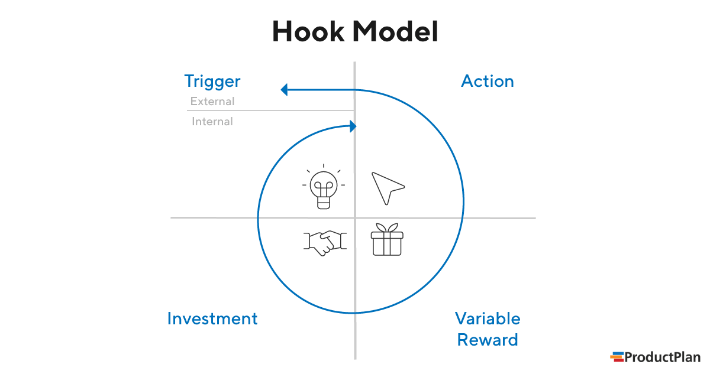

# 사용자 심리/행동

---

[TOC]

---


## 행동경제학

>  구매율을 높이는 행동 경제학

### 1. 희소성 (Scarcity)

- 제한적 공급
- 시간, 수량을 한정

### 2. 즉각적인 혜택

- 가치 제공 시점을 즉각적으로
- 타이머를 통해서 긴급한 느낌을 주는 것

### 3.디폴트의 힘

- 디폴트를 활용하여 사용자의 행동을 유도

### 4. Choice Overload

- 선택지가 너무 많을 때보다는 오히려 적을 때 선택하기가 쉬움
- 너무 많은 정보를 요구하면 사용자가 행동을 못하게 됨

### 5. Social Proof

- 다른 사람들의 행동이 개인의 행동에 영향을 미치는 현상
- 자신과 맥락이 비슷할수록 같은 행동을 할 가능성 높아짐

### 6. 상대성/유인책 사용

- Relativity
- 사람들이 비슷한 요소를 가지는 대상들을 비교하는 경향이 있음
- 들러리 옵션 추가

### 7.  Peak-End Rule

> 데니얼 카너만

- 제품을 경험하는 journey의 마지막 경험은 해당 서비스/제품의 전체적인 경험에서 긍정적이고 부정적인 정도를 결정하는데 큰 영향을 미침
- 사람들의 기억은 경험의 **양극단 평균**에 기반한다.
- Duration Neglect: 경험의 길이는 사람들의 기억에는 영향을 미치지 않는다.


## Hook Model

```
Hook 사이클의 반복 순환으로 사용자의 습관 형성
```

- 사용자가 서비스를 여러 번 사용해서 결국에는 사용자의 일상의 한 부분, 습관이 되는 사이클이 되는 것



`(출처: ProductPlan)`

- 장점
  - WOM이 되어 다른 사용자에게 빠르게 전파될 수 있음
  - Customer Lifetime Value 증가

### 1단계: Trigger

> 계기

- 습관이 되기 위한 첫 단계
- **내부계기**가 충분하면 외부계기가 더 이상 필요하지 않다.

**External Trigger**

- 사용자에게 **다음 행동**을 알려주는 정보 내포

**Internal Trigger**

- 사용자의 기억 속에 저장되어 있는 서비스와의 **연결고리**이다.
- 감정, 욕구의 연결

### 2단계: Action

> 행동

```
쉽게 만들라!
```

- 행동이 쉽게 일어나도록 만들라

### 3단계: Variable Reward

> 보상

- 사용자를 유혹하기 위해 `가변적 보상`(예측하지 못한 보상)을 사용
- 사용자의 욕구를 충족시키면서 **재참여를 유도**할 수 있는 **가변적 보상 체계**를 만들어야 한다.
- 자율성

### 4단계: Investment

> 투자

- 사람들은 특정 상품이나 서비스에 많은 **시간**과 **노력**을 투자할수록 그것을 더 중요시한다.


## 심리학 기법

### Hick's Law

> 사용자에게 선택지가 많아질수록 결정을 내리는데 걸리는 시간이 증가한다.

- UI를 디자인 할 때는 사용자의 인지를 낮춰주는 방향으로 텍스트 필드 개수나 버튼 수 구성을 고려해야 한다.

### Fitt's Law

> 사용자의 행동(ex. 클릭)에 걸리는 시간은 대상과의 거리에 비례하고 목표물의 크기(폭)에 반비례한다.

$$
T = a + blog2(\frac{D}W+1)
$$

- iOS 가이드에서 터치 target은 최소 44pt 이상으로 디자인하기를 권장
  - 버튼을 터치하는 손가락을 고려

### Proximity

> 근접성의 원리

- 서로 이웃해 있는 요소들을 하나의 그룹으로 인지하는 현상
- 정보를 구조화하거나 관련 있는 컨텐츠끼리 묶고, 관련이 없는 요소들끼리는 멀리 배치하는 등을 고려

### Similarity

> 유사성의 원리

- 시각적으로 공통점을 가지는 요소들끼리 묶어서 인지하는 경향
- 요소적으로 비슷하게 묶여야하는 대상들의 컬러, 사이즈, 모양 등을 공유할 수 있도록 디자인


***Copyright* © 2022 Song_Artish**
