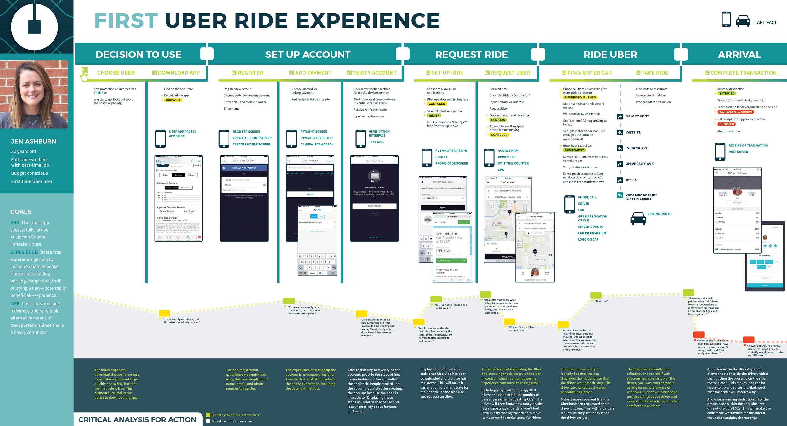
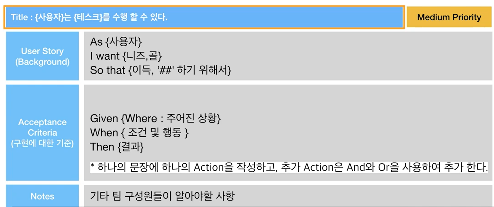
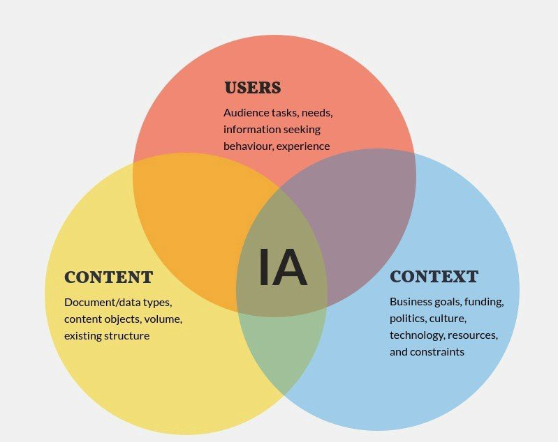
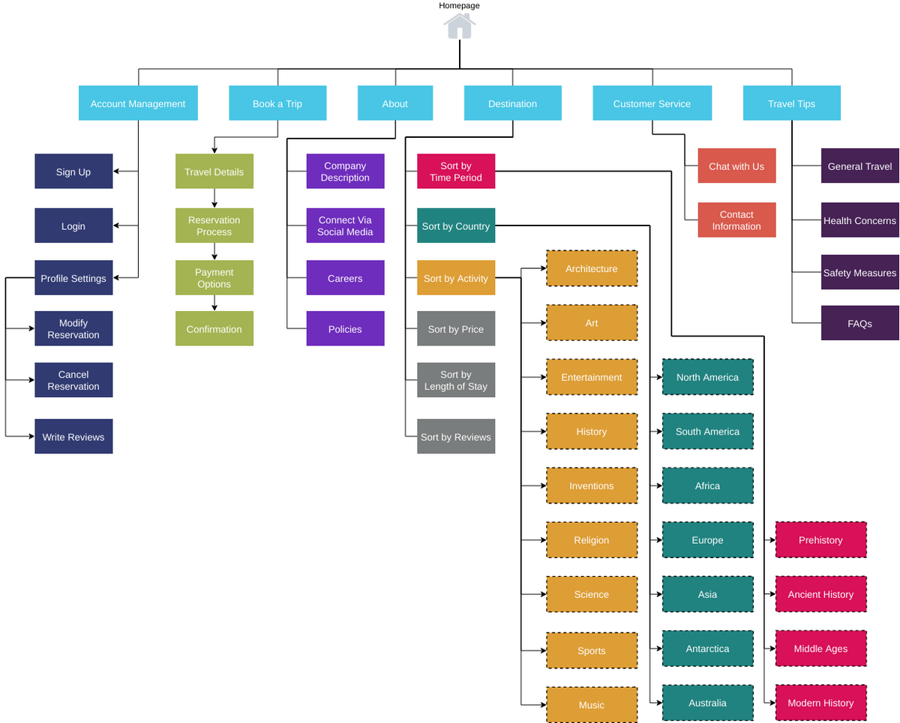
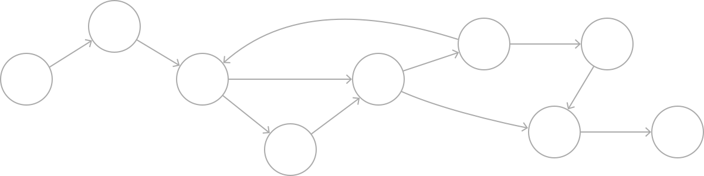

# 서비스 기획

---

[TOC]

---


## User Scenario

- 서비스/제품이 제공할 새로운 사용자 경험을 이야기 형태로 기술
- 페르소나와 결합되었을 때, 사용자의 테스크와 목표, 동기를 이해하면서 서비스/제품을 디자인하는데 유용하다.

> **스토리보드**
> 사용자가 제품을 사용하거나 불편을 겪는 상황을 그림으로 그린 것

**구성 요소**

```
- 사용자: 정의한 페르소나
- 목표: 무엇을 성취하려고 하는가?
- 동기: 왜 그것을 달성하려고 하는가?
- External Factors
  - 사용자는 어디에 있는가? 감정 상태는 어떤가? 어떤 상황에 처해있는가?
  - 모바일 기기를 사용하는가? 데스크탑을 이용하는가?
```


## User Journey

- 사용자의 서비스 이용 흐름을 시각화하여 표현
- 사용자들이 수행하는 제품 및 서비스의 이용 흐름을 조망하고 문제를 발견하는 툴
- 전체 사용자 경험을 한눈에 파악
- 이용 흐름 중 문제가 있는지 쉽게 발견 가능
- 다양한 기준과 관점으로 서비스 흐름을 분석 가능



`(출처: Erin Balderson)`


## User Story

> Feature를 구체화하고 팀을 Align하는 User Story

- Team의 consensus를 맞추기위해서 필요
- Features, 혹은 더 작은 기능 단위를 사용하는 주체, 기능, 목적을 정의한다.
- 프로젝트에 연관된 실무자들을 위한 커뮤니케이션 도구 역할을 한다.
- 문서에서 모든 내용을 정의할 수 없기 때문에 유저 스토리를 통해 무엇을 구현해야하는지에 대해서 합의점을 이끌어낸다.

### 구성 요소

```
As a <user role>
I want <goal>
so that <benefic>.
```

1. 사용자의 역할
2. 사용자의 목표
3. 그것을 함으로써 얻어지는 이득

```
[예시]
As {이송영}
I want to {구글 계정 로그인}
So that {간편하고 빠르게 로그인 하기 위해서}
```

### Agile 제품 개발 프로세스

1. 비전/로드맵
2. 우선 순위정하기 (Product Backlog)
3. Sprint Backlog
   - -> User Story: 주로 PM, PO가 작성
4. 디자인/개발 (Iteration)
5. 배포,회고,가설 검증

### Gherkin Syntax

> Gherkin 문법

- `As`,`I want`, `So that` 만으로는 feature가정확하게 구현되었다는 것을 판단할만한 기준이 모호하기 때문에, 사용자의 액션과 결과까지 기술하는 방법
- 사용자 행동을 기반으로 개발하는 BDD(Behavior Driven Development)



`(출처: CLASS101)`

- 제일 아래 `Notes`에는 구성원들이 이 스토리에 대해서 알고 있어야 하는 추가적인 설명을 작성 (ex.디자인 스크린샷, 링크 등)

> 잘 작성된 사용자 스토리는 개발 구현을 테스트 할 수 있는 TC로 활용 가능하다.


## Task Flow & User Flow

> `Draw.io`라는 tool을 실무에서도 자주 사용함

- 사용자가 서비스/제품을 이요하면서 수행하는 task들의 흐름을 나타낸다.
- 하나 이상의 유저 스토리의 실제 path를 확인할 수 있다.

**구성 요소**


`(출처: CLASS101)`

User Flow의 각 단계 아래에 매칭 되는 스크린을 배치해봄으로써 Wireframe도 작성할 수 있다.

> 아래는 조금 더 복잡한 User Flow를 그릴 수 있는 component들이다.


`(출처: CLASS101)`


## Wireframe

> User Story와 User Flow를 시각적으로 표현할 수 있는 도구

- Low-fidelity

- **Wireflow**(와이어플로우): Wireframe에 순서가 추가된 것

- Tools

  ```
  - Balsamiz
  - Kakao Oven (https://ovenapp.io)
  - Sketch: Fidelity가 높음(맥북에서만 사용가능)
  - Adobe XD
  - Figma
  ```


## 서비스 기획서

> 서비스의 각 페이지 구성 요소나 콘텐츠의 설명, 페이지 간의 이동 흐름, 로직 등을 기술한 문서

- Agile에서는 자세한 기획서보다 User Story와 UI 디자인으로 빠르게 커뮤니케이션 하는 것이 더 효율적

### 작성법

- Flow의 시작과 끝이 한 눈에 보이게 그린다.
- 각 구성 요소의 역할이 명확하게 드러나게 작성한다.
- Description은 짧고 간결하게 작성한다.
- 한 화면씩 상세 설명할 때는 해당 화면이 전체 서비스 정보 구조에서 어떤 위치에 있는지 명확히 표기한다.
  - ex. Home > 수업 상세 page > 결제 page

### 에러케이스

> 아래는 에러케이스 예시이다.


`(출처: CLASS101)`


## Back Office 기획

> 관리자 페이지

- 제품/서비스가 사용자에게 잘 보여질 수 있도록 운영 관리를 목적으로 개발된다.
- 콘텐츠 관리, 상품 관리, 사용자 관리 등 서비스의 운영과 관련된 모든 부분이 포함될 수 있다.


## Information Architecture

> 정보 구조

- 제품/서비스를 구성하는 요소들의 네비게이션, 구조 등을 도식화 한 것
- 잘 설계된 정보 구조는 사용자의 접근성을 높임
- 잘못된 정보 설계는 사용자의 이탈률과 오류를 높임



`(출처: Medium)`

- 상위와 하위의 개념이 잘 gruoping 되는 것이 필요



`(출처: AltexSoft)`

### Card Sorting

> 정성적 사용자 리서치 방법

- 상위 메뉴와 하위 메뉴들이적힌 카드가 나열되어 있음
- 리서치 참가자는 자신이 생각하는 기준으로 우선순위를 세우고 grouping하는 과정을 거침
- 사용자가 생각하는 우선순위를 파악할 수 있음

### Navigation의 종류

#### 1) Hierarchical Navigation

- 한 화면에서 시작해서 한 depth 씩 아래로 내려가는 방식의 네비게이션
- 다른 메뉴로 가기 위해서는 처음 시작한 화면으로 되돌아와야 한다.
- 설정 앱이나 이메일 앱에서 흔히 발견되는 네이게이션 형태


`(출처: Apple Developer)`

#### 2) Flat Navigation

- 여러 카테고리의 메뉴 이동이 가능한 형태
- 앱 스토어나 스포티파이 등에서 보이는 구조
- 주로 하단 탭이 있는 모바일 앱에서 보여진다.
  - Android: `Bottom Navigation`
  - iOS: `Tab Bar`


`(출처: Apple Developer)`

#### 3) Content-Driven Navigation

- 콘텐츠의 이동이 자유로운 구조
- 게임, E-book 등에서 많이 보이는 형태



`(출처: Apple Developer)`


***Copyright* © 2022 Song_Artish**
