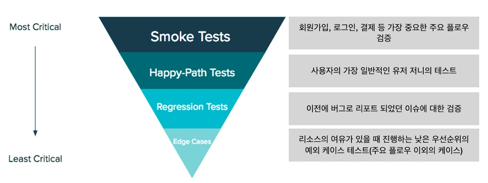

# 서비스 테스트

---

[TOC]

---


## Quality Assurance

- 서비스가 일정 이상의 품질을 유지할 수 있도록 테스트 및 품질 향상 업무를 수행

- Testing < Quality Control < Quality Assurance

- QA 프로세스

  - 개발이 완료되면 QA를 위해 빌드된 버전에서 테스트를 진행

  ```
  1. QA 환경 배포
     - TC 할당
  2. 1차 테스트 및 버그 수정
  3. Staging 환경 배포
     - Staging은 Production과 동일한 환경을 갖추고 있는 것이 보통이다.
  4. 최종 확인 및 릴리즈
  5. 스모크 테스트
  ```

  

## TC 작성

- 스토리 기반

- 100% Pass가 목표가 아닌, 놓치는 것을 커버해주는 방식으로 진행하는 것이 중요

- 카테고리

  ```
  1. 대분류
  2. 소분류
  3. 테스트 시나리오
     - ex. 이용 약관 확인, 개인 정보 처리방침 확인
  4. 테스트 조건
  5. 실행 순서
  6. Pass Result
  7. 테스트 환경
  8. P/F
     - Pass
     - Fail
     - Block: 여러 원으로 시험 진행이 보류
     - N/A: 개발이 지연/취소되는 기능, 사업자/개발담당자와 협의에 의해 테스트를 진행하지 않는 경우
     - N/T: Not Tested. 테스트가 가능하나 같은 기능 단위 테스트 항목에서 발생한 결함으로 인해 같은 항목의 테스트케이스를 진행할 수 없음
  ```


## 테스트 종류

### 1. Exploratory Testing

> 탐색적 테스트

- TC 작성의 시간을 최소화하면서 tester의 발견적인(heuristic) 지적 능력을 최대한 활용하여 테스트를 수행
- 한 시간에서 두 시간 정도의 "제한된 시간(Time-Boxing)" 내에 스프린트 목표에 따라 테스트를 수행하고 수행 후 "요약 보고(Debriefing)"하는 형태

### 2. Usability Testing

> 사용성 테스트

- 사용자가 제품과 서비스를 사용할 때 얼마나 사용하기 쉽고 혼란 없이 task를 수행할 수 있는지를 측정하는 테스트

- 설계 순서

  ```
  1. 사용자를 대표할 수 있는 참가자 선정
     - 5명의 참가자를 대상으로 테스트하는 것이 적절
  2. 수행할 수있는 현실적인 과제(Tasks) 선정
     - ex. 라이브 영상을 보고 카카오페이로 구매하기, 회원가입 하기 등
  3. 사용성 테스트 설계 및 시나리오 작성
     - 검증 & 관찰하고자 하는 중요한 메인 테스트 3~5개를 선정
     - 테스트 시간을 고려하여 과제의 우선 순위를 세운다.
     - 사용자가 테스트를 일찍 끝냈을 경우를 대비하여 여분의 task를 준비
  4. 테스트 진행
     - Moderator(진행자)는 테스트 목적과 과정을 소개
     - 참여자들을 편안한 분위기에서 자연스럽게 행동할 수 있는 분위기 조성
     - **Thinking Aloud**: 사용자들이 보는 화면과 task 순서, 어떤 행동을 했을 때 기대하는 결과값 등 머리속에 떠오르는 생각을 계속 말하도록 한다.
     - 사용자의 말뿐만 아니라 특정 화면에서 오래 머문다던지, 실수나 잘못 이해하는 부분 등 비언어적인 부분도 관찰하여 기록한다.
     - 한 명은 사용성 테스트를 진행하고 다른 한 명은 기록을 작성
  5. 결과 분석 및 정리
     - 테스트에서 얻은 데이터를 기반으로 결과 분석
     - 테스트 중 발생된 이슈들을 모아 우선순위를 정한다.
     - 종합하여 얻어낸 인사이트를 디자인에 반영하고 최종 디자인이 업데이트 되면 다시 한 번 사용성 테스트를 진행한다.
  ```

### 기타



`(출처: CLASS101)`


## 10 Usability Heuristics

> 경험에 기반하여 문제를 해결하거나 학습 또는 발견하는 방법 (by Jacob Nielsen)

### 1. Visibility of System Status

- 사용자에게 시스템의 현재 상태를 시각화해서 보여주는 것
- 서비스나 제품에서 자신의 위치와 시스템의 현재 상태를 인지할 수 있도록

### 2. Match between System and the Real World

- 현실 세계를 반영한 시스템을 설계해야 한다.
- 예시: `Medium`에서는 실제 책을 읽으며 표시할 수 있는 highlight 기능을 제공

### 3. User control and freedom

- 사용자에게 적절한 통제권 부여
- 예시: Email 발송 Undo 버튼, 취소 버튼

### 4. Consistency and Standards

- 일관성과 표준성
- 한 서비스 내에서 디자인과 wording의 tone & manner 등 일관성을 유지
- 참고
  - Apple Human Interface Guideline
  - Google Material Design
- 모든 페이지 내에서 동일한 레이아웃을 사용했는지? 콘텐츠의 정보 표현 방식이 문법적으로, 시각적으로 일관성이 있는지?

### 5. Error Prevention

- 사용자의 실수를 미연에 방지할 수 있도록 설계
- 사용자의 의도를 반영한 디자인은 에러 발생률과 이탈률을 줄여줄 수 있다.

### 6. Recognition rather than Recall

- 사용자가 적은 인지적 노력으로 시스템을 사용할 수 있도록 해야한다.
- 사용자가 했던 행동이나 히스토리를 맥락에 맞게 제공하여 자연스럽게 떠올리고 작업 단계를 쉽게 쫓아갈 수 있도록 배려해야 한다.

### 7. Flexibility and Efficiency of Use

- 유연하고 효율적인 사용
- 헤비 유저 및 초기 유저 모두를 위해 다양한 interaction이 고려되어야 한다.
- 예시: 회원가입을 위한 다양한 방법 제공

### 8. Aesthetic and Minimalist Design

- 심미적이고 미니멀한 디자인
- 심플하고 간결한 디자인은 정보의 가독성을 올리고 접근성을 높임

### 9. Help users recognize, Diagnose, and Recover from errors

- 에러 발생 시 사용자 스스로 문제를 파악하고 수정할 수 있도록 설계

### 10. Help and Documentation

- 사용자가 어려움을 겪거나 궁금증이 있을 때 찾을 수 있는 도움말이 제공되어야 한다.
- 이런 document는 검색과 접근이 쉽고 정보를 해석하는데 어려움이 없도록 만들어져야 한다.


***Copyright* © 2022 Song_Artish**
