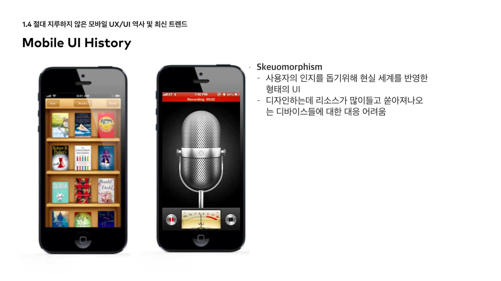
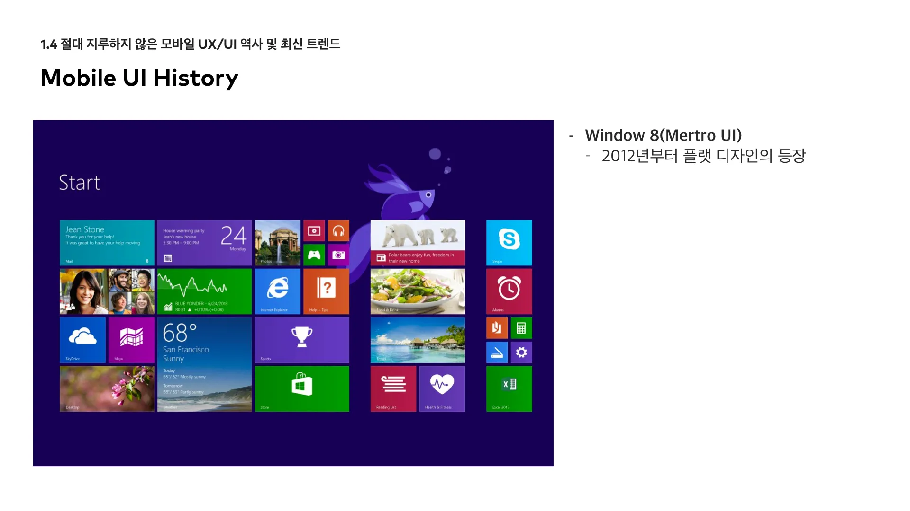
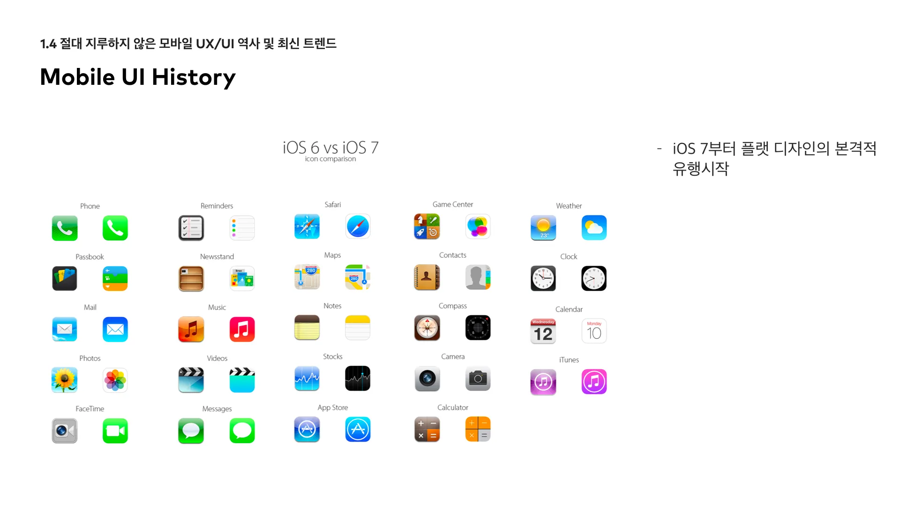
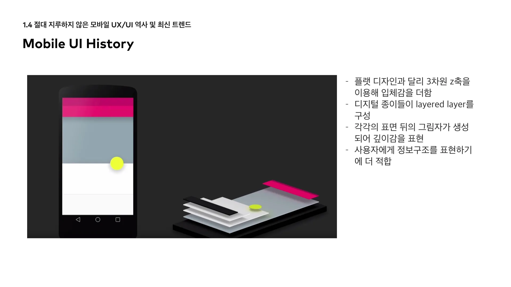

# 모바일 UX/UI 역사 및 최신 트렌드

2021.12.20

---

[TOC]

---

## 모바일 UX/UI 역사

### 1. Skeuomorphism

> 스큐어모피즘

- 사용자의 인지를 돕기 위해 현실 세계를 반영한 형태의 UI

- 실재하는 대상의 본래 모습을 최대한 사실적으로 표현하는 기법

- 디자인 하는데 리소스가 많이 들고 쏟아져나오는 디바이스들에 대한 대응 어려움

- 예시

  - iPhone의 계산기, 녹음 앱(마이크)

    

`(출처: 클래스101)`

### 2. Flat Design

> 플랫 디자인

- 스큐어모피즘의 해결책

- 사용자가 인지할 수 있을 정도의 형태를 유지한 채 선과 컬러 등을 플랫하게 단순화하여 디자인하는 것

- 2차원적 형태로 그림자, 하이라이트 등 심도나 차원을 나타내는 요소 배제

- 다양한 디바이스와 스크린 사이즈에 맞춰 쉽게 사이즈를 조절하거나 배열 조절 가능

- :exclamation: 플랫 디자인에 집착하면 정보 우선순위와 사용성, 가독성 등을 해칠 수 있다. (사용자의 이해 방해)

- :exclamation:플랫 디자인을 적용한 서비스들의 획일화된 디자인 (서비스 제품만의 identity를 나타내기 어려움)

- 예시 

  - MS Window 8 (Metro UI, 2012년)

    

    `(출처: 클래스101)`

  - iOS 7 (2013)

    

    `(출처: 클래스101)`

### 3.Google Material Design

- 구글의 시각적 언어

- 모든 디바이스에 일관성 있는 경험

- 플랫 디자인과 달리 3차원 z축을 이용해 입체감을 더함

- 디지털 종이들이 layered layer를 구성

- 각각의 표면 뒤의 그림자가 생성되어 깊이감을 표현

- 사용자에게 정보 구조를 표현하기에 더 적합

  

  `(출처: 클래스101)`

- Apple에서는 material design과는 달리 gradient나 blur 처리를 통해서 요소 간의 우선순위를 표현 (**Flat 2.0**)

## 최신 UX 트렌드

### 1. Personalization

- 사용자 데이터를 활용하여 더 적절한 콘텐츠를 보여주며 interaction이 가능
- 사용자 데이터를 수집하여 사용자별로 맞춤형 콘텐츠나 서비스를 제공
- 인공지능이나 머신러닝 기술을 사용
- 예시
  - 넷플릭스의 맞춤 추천

### 2. 사용자 맥락을 고려한 콘텐츠

- 사용자의 input 적극 반영
- 여러 가지 경험이 연결되고 통합됨

### 3. Micro Interaction

- 간결한 제스처와비주얼 피드백을 활용하여 사용자의 인지를 돕는다.
- 서비스 identity를 표현하는데 도움이 된다.

### 4. VUI

> Voice User Interface

- 애플의 시리, 구글의 OK 구글, MS의 Cortana, Amazon의 Alexa 등
- **Zero UI**, **스크린리스 시대의 디자인**

## <참고 자료>

### Google Material Guideline

- https://material.io/design/

### Apple Human Interface Guideline

- https://developer.apple.com/design/human-interface-guidelines/

### UX 트렌드를 접할 수있는 사이트

- https://www.fastcompany.com/co-design
- https://medium.com/
- https://techcrunch.com/

***Copyright* © 2021 Song_Artish**