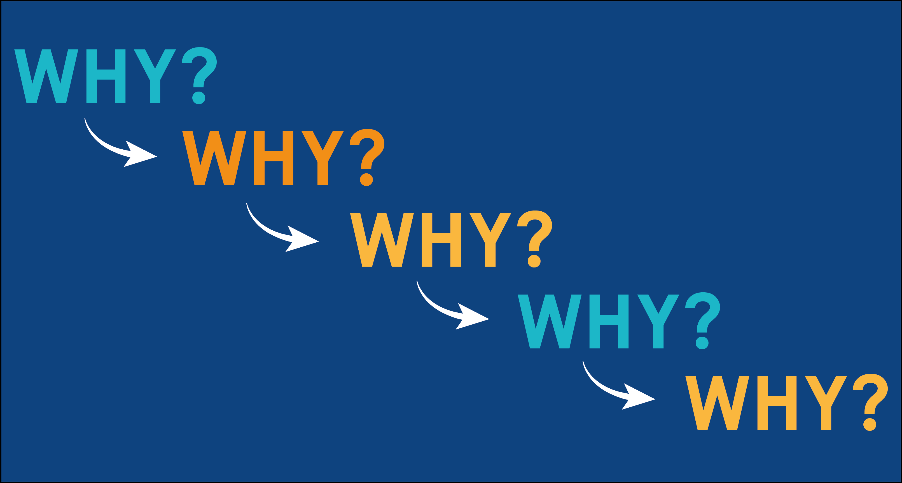
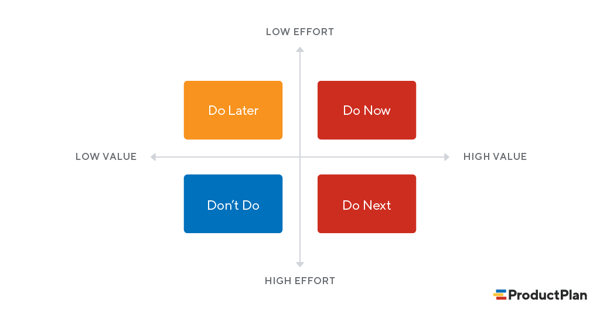

# 문제 해결을 위한 생각 도구들

2021.12.21

---

[TOC]

---

## 문제 정의하기

> 문제를 해결하는데 한 시간이 주어진다면, 삼분의 이 이상의 시간을 **문제가 무엇인지** 정의하는데 쓸 것이다. - Mattew Wakeman

## 1. 5 Whys

발견한 현상에 대해서 이유의 이유를 계속해서 파고들어가 가장 근본적인 문제의 원인을 파악하는데 효과적인 방법

`(출처: URBACT)`

## 2. 2x2 Matrix

우선순위를 세워 의사결정을 하는 데 도움이 되는 방법론

`(출처: ProductPlan)`

- X축: 얼마나 효율적인가? (리소스 대비 효율)
- Y축: 사용자에게 얼마나 큰 가치를 주는가?
- 즉,`Do Now`에 있는 feature들이 지금 당장 개발해야 할 feature이다.

## 3. Golden Circle

무엇을 만들까라는 고민을 하기 전 왜 만들어야 하는지에 대한 고민이 선행되어야 함

`(출처: Medium)`

***Copyright* © 2021 Song_Artish**