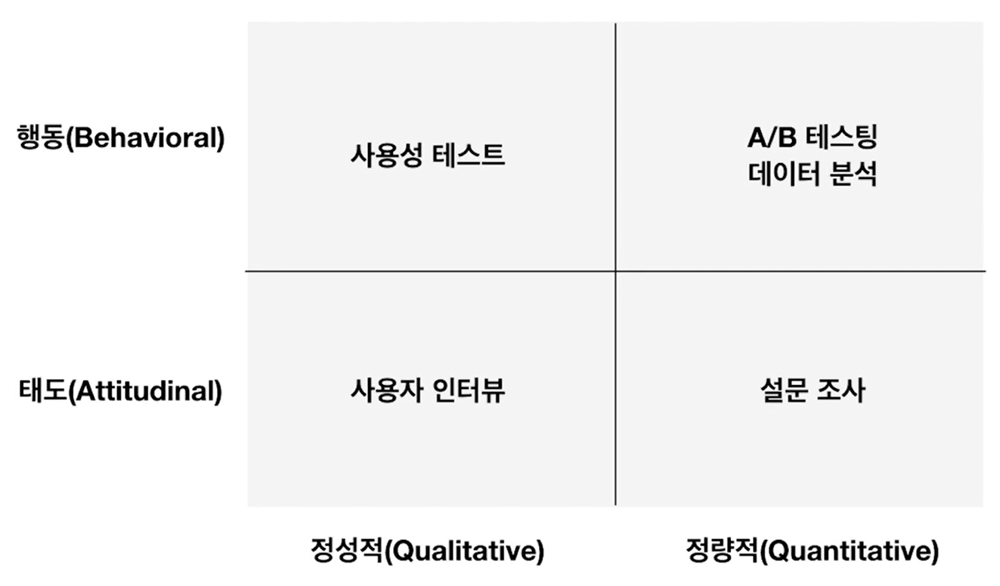

# 정성적/정량적 분석

> Qualitative-Quantitative

2021.12.27

---

[TOC]

---

## 1. Qualitative

> 정성적 리서치

사용자들의 동기, 의견, 니즈 등을 직접적으로 파악할 수 있음

- In-depth Interview
- Focus Group Interview
- Contextual Inquiry
- Wizard of Oz

## 2. Quantitative

> 정량적 리서치

측량이 가능하거나 분석이 가능한 수량적 데이터를 바탕으로 사용자의 행동들을 분석하기 위해서 사용됨

- 설문 조사 (모수가 충분히 큰 경우)
- A/B Testing
- 사용자 데이터 분석

## 정성적 vs 정량적

`(출처:Class101)`

***Copyright* © 2021 Song_Artish**