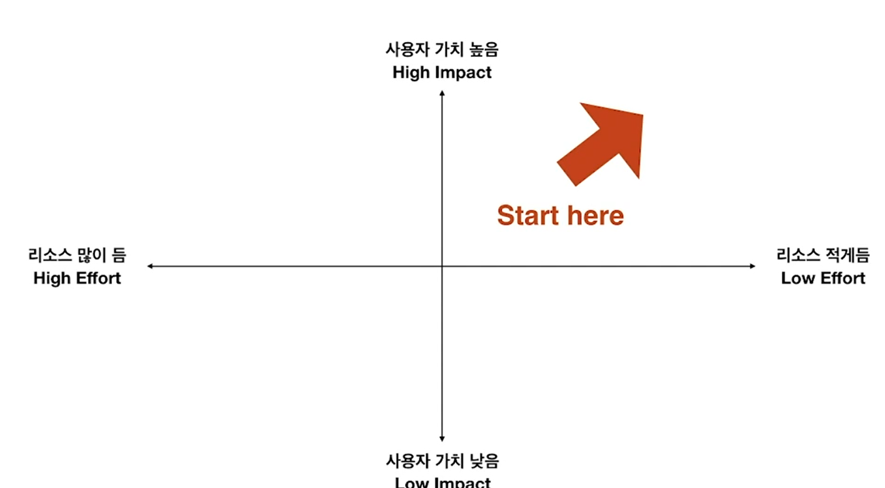

# 기능 우선순위 세우기

2022.01.13

---

[TOC]

---

## Feature Prioritization

> 기능 우선순위

- 제한된 리소스로 최선을 선택을 해야함
- `Feature Creep`이 되어서는 안 됨
- 사용자의 니즈, 비즈니스 방향, 기술적인 제한을 모두 고려해야 함

## 방향성 정하기

`(출처: CLASS101)`

***Copyright* © 2022 Song_Artish**
