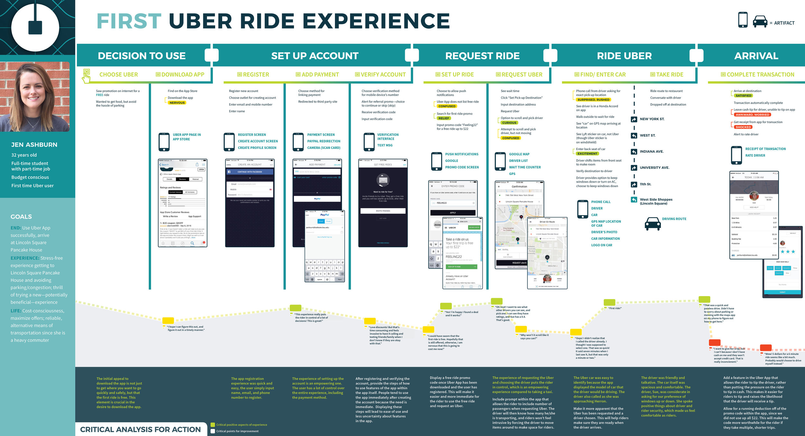

# User Scenario & Journey Map

> 사용자의 맥락을 반영

2022.01.13

---

[TOC]

---

## User Scenario

- 서비스/제품이 제공할 새로운 사용자 경험을 이야기 형태로 기술
- 페르소나와 결합되었을 때, 사용자의 테스크와 목표, 동기를 이해하면서 서비스/제품을 디자인하는데 유용하다.

> **스토리보드**
> 사용자가 제품을 사용하거나 불편을 겪는 상황을 그림으로 그린 것

### 구성 요소

- 사용자: 정의한 페르소나
- 목표: 무엇을 성취하려고 하는가?
- 동기: 왜 그것을 달성하려고 하는가?
- External Factors
  - 사용자는 어디에 있는가? 감정 상태는 어떤가? 어떤 상황에 처해있는가?
  - 모바일 기기를 사용하는가? 데스크탑을 이용하는가?

## User Journey

- 사용자의 서비스 이용 흐름을 시각화하여 표현
- 사용자들이 수행하는 제품 및 서비스의 이용 흐름을 조망하고 문제를 발견하는 툴
- 전체 사용자 경험을 한눈에 파악
- 이용 흐름 중 문제가 있는지 쉽게 발견 가능
- 다양한 기준과 관점으로 서비스 흐름을 분석 가능

`(출처: Erin Balderson)`

***Copyright* © 2022 Song_Artish**
