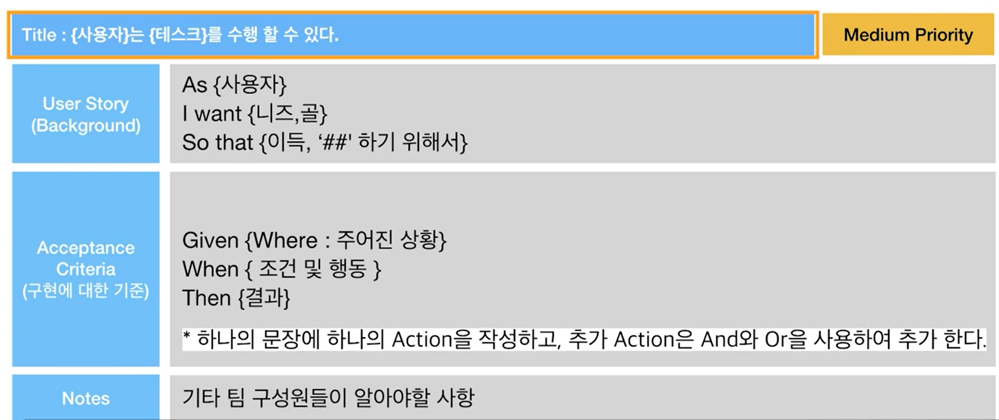

# User Story

> Feature를 구체화하고 팀을 Align하는 User Story

2022.01.13

---

[TOC]

---


## Overview

> 사용자 스토리

- Team의 consensus를 맞추기위해서 필요
- Features, 혹은 더 작은 기능 단위를 사용하는 주체, 기능, 목적을 정의한다.
- 프로젝트에 연관된 실무자들을 위한 커뮤니케이션 도구 역할을 한다.
- 문서에서 모든 내용을 정의할 수 없기 때문에 유저 스토리를 통해 무엇을 구현해야하는지에 대해서 합의점을 이끌어낸다.


## 구성 요소

```
As a <user role>
I want <goal>
so that <benefic>.
```

1. 사용자의 역할
2. 사용자의 목표
3. 그것을 함으로써 얻어지는 이득

```
[예시]
As {이송영}
I want to {구글 계정 로그인}
So that {간편하고 빠르게 로그인 하기 위해서}
```


## Agile 제품 개발 프로세스

1. 비전/로드맵
2. 우선 순위정하기 (Product Backlog)
3. Sprint Backlog
   - -> User Story: 주로 PM, PO가 작성
4. 디자인/개발 (Iteration)
5. 배포,회고,가설 검증


## Gherkin Syntax

> Gherkin 문법

- `As`,`I want`, `So that` 만으로는 feature가정확하게 구현되었다는 것을 판단할만한 기준이 모호하기 때문에, 사용자의 액션과 결과까지 기술하는 방법
- 사용자 행동을 기반으로 개발하는 BDD(Behavior Driven Development)



`(출처: CLASS101)`

- 제일 아래 `Notes`에는 구성원들이 이 스토리에 대해서 알고 있어야 하는 추가적인 설명을 작성 (ex.디자인 스크린샷, 링크 등)

> 잘 작성된 사용자 스토리는 개발 구현을 테스트 할 수 있는 TC로 활용 가능하다.


***Copyright* © 2022 Song_Artish**
