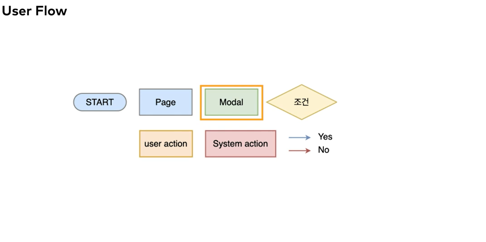

# User Flow & Wireframe

2022.01.17

---

[TOC]

---

## Task Flow & User Flow

- 사용자가 서비스/제품을 이요하면서 수행하는 task들의 흐름을 나타낸다.
- 하나 이상의 유저 스토리의 실제 path를 확인할 수 있다.

### 구성 요소

`(출처: CLASS101)`

User Flow의 각 단계 아래에 매칭 되는 스크린을 배치해봄으로써 Wireframe도 작성할 수 있다.

> 아래는 조금 더 복잡한 User Flow를 그릴 수 있는 component들이다.

`(출처: CLASS101)`

### Tools

- `Draw.io`라는 tool을 실무에서도 자주 사용함

## Wireframe

> User Story와 User Flow를 시각적으로 표현할 수 있는 도구

- Low-fidelity
- **Wireflow**(와이어플로우): Wireframe에 순서가 추가된 것

### Tools

- `Balsamiq`
- Kakao `Oven` (https://ovenapp.io)
- `Sketch`
  - Fidelity가 높음
  - 맥북에서만 사용 가능
- `Adove XD`
- `Figma`

***Copyright* © 2022 Song_Artish**
