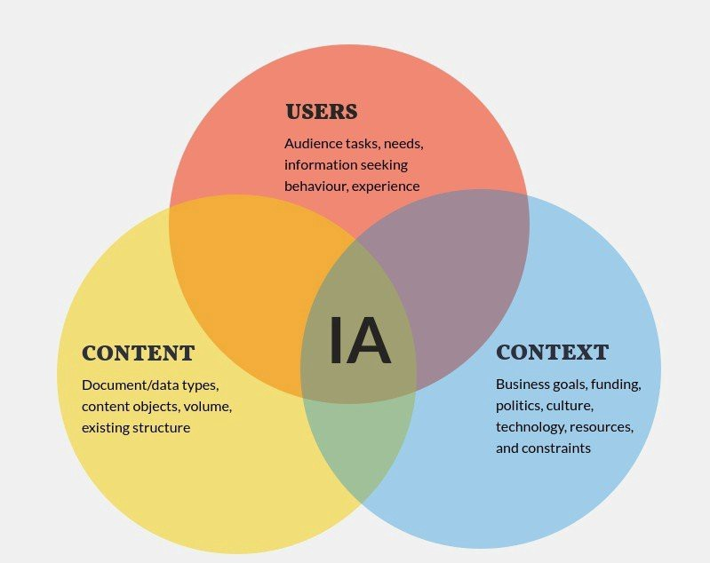
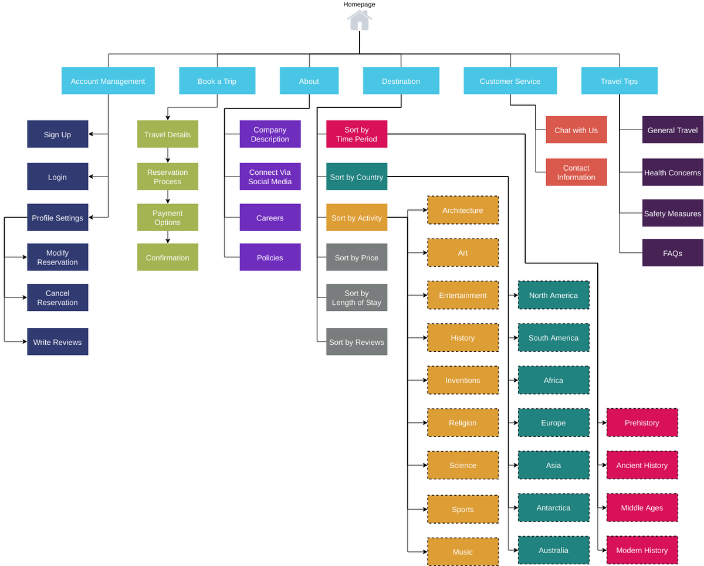
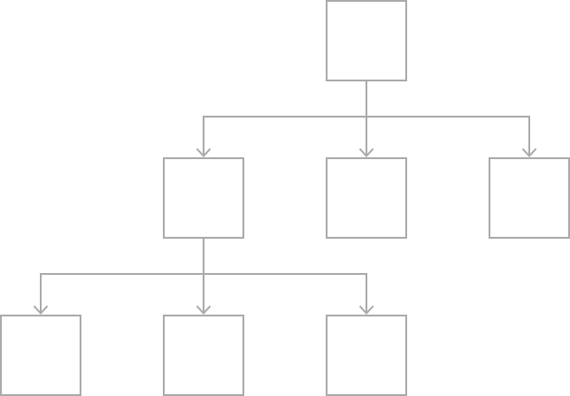
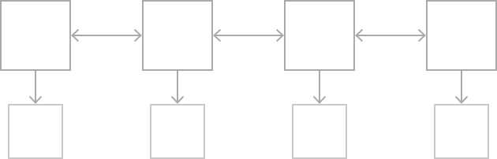
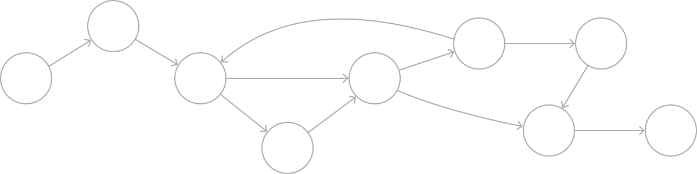

# Information Architecture

2022.01.18

---

[TOC]

---

## Overview

> 정보 구조

- 제품/서비스를 구성하는 요소들의 네비게이션, 구조 등을 도식화 한 것
- 잘 설계된 정보 구조는 사용자의 접근성을 높임
- 잘못된 정보 설계는 사용자의 이탈률과 오류를 높임

`(출처: Medium)`

- 상위와 하위의 개념이 잘 gruoping 되는 것이 필요

`(출처: AltexSoft)`

## Card Sorting

> 정성적 사용자 리서치 방법

- 상위 메뉴와 하위 메뉴들이적힌 카드가 나열되어 있음
- 리서치 참가자는 자신이 생각하는 기준으로 우선순위를 세우고 grouping하는 과정을 거침
- 사용자가 생각하는 우선순위를 파악할 수 있음

## Navigation의 종류

### 1) Hierarchical Navigation

- 한 화면에서 시작해서 한 depth 씩 아래로 내려가는 방식의 네비게이션
- 다른 메뉴로 가기 위해서는 처음 시작한 화면으로 되돌아와야 한다.
- 설정 앱이나 이메일 앱에서 흔히 발견되는 네이게이션 형태

`(출처: Apple Developer)`

### 2) Flat Navigation

- 여러 카테고리의 메뉴 이동이 가능한 형태
- 앱 스토어나 스포티파이 등에서 보이는 구조
- 주로 하단 탭이 있는 모바일 앱에서 보여진다.
  - Android: `Bottom Navigation`
  - iOS: `Tab Bar`

`(출처: Apple Developer)`

### 3) Content-Driven Navigation

- 콘텐츠의 이동이 자유로운 구조
- 게임, E-book 등에서 많이 보이는 형태

`(출처: Apple Developer)`

***Copyright* © 2022 Song_Artish**
