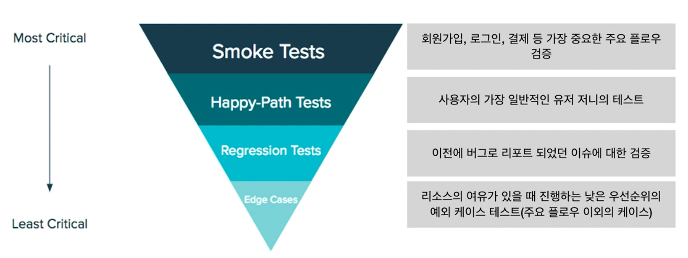

# 테스트 케이스와 QA

2022.01.18

---

[TOC]

---

## QA

> Quality Assurance

- 서비스가 일정 이상의 품질을 유지할 수 있도록 테스트 및 품질 향상 어무를 수행
- Testing < Quality Control < Quality Assurance

## QA 프로세스

개발이 완료되면 QA를 위해 빌드된 버전에서 테스트를 진행

1. QA 환경 배포
   - TC 할당
2. 1차 테스트 및 버그 수정
3. Staging 환경 배포
   - Staging은 Production과 동일한 환경을 갖추고 있는 것이 보통이다.
4. 최종 확인 및 릴리즈
5. 스모크 테스트
   - 회원가입, 결제 등 중요한 기능들을 다시 한 번 확인 (Core Test)

## TC 작성

> 스토리 기반

- 100% Pass가 목표가 아닌, 놓치는 것을 커버해주는 방식으로 진행하는 것이 중요

### Category

1. 대분류
2. 소분류
3. 테스트 시나리오
   - ex. 이용 약관 확인, 개인 정보 처리방침 확인
4. 테스트 조건
5. 실행 순서
6. Pass Result
7. 테스트 환경
8. P/F
   - Pass
   - Fail
   - Block: 여러 원으로 시험 진행이 보류
   - N/A: 개발이 지연되거나 개발이 취소되는 기능, 사업자/개발담당자와 협의에 의해 테스트를 진행하지 않는 경우
   - N/T: Not Tested. 테스트가 가능하나 같은 기능 단위 테스트 항목에서 발생한 결함으로 인해 같은 항목의 테스트케이스를 진행할 수 없음

## Exploratory Testing

> 탐색적 테스트

- TC 작성의 시간을 최소화하면서 tester의 발견적인(heuristic) 지적 능력을 최대한 활용하여 테스트를 수행
- 한 시간에서 두 시간 정도의 "제한된 시간(Time-Boxing)" 내에 스프린트 목표에 따라 테스트를 수행하고 수행 후 "요약 보고(Debriefing)"하는 형태

## 기타 테스트 종류

`(출처: CLASS101)`

***Copyright* © 2022 Song_Artish**
