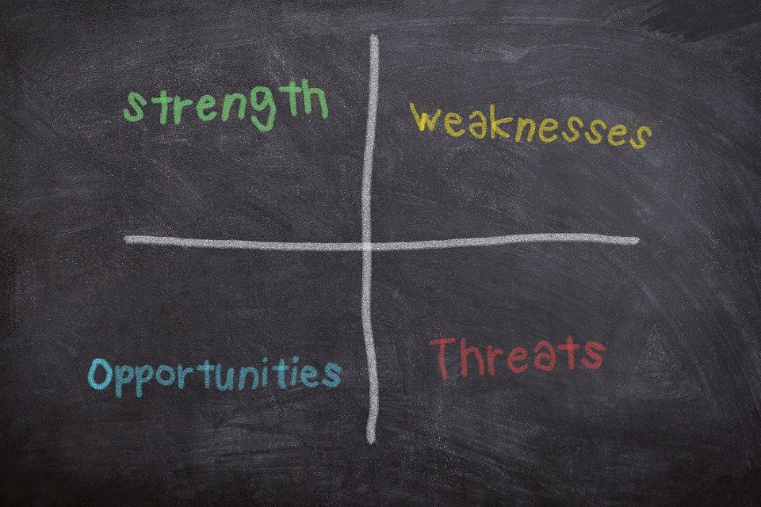

# 사업전략 세우기

2022.04.20

---

[TOC]

---

## 9 Building Block

기존 비즈니스 모델을 운영 중인 기업이 사업성 및 서비스의 부족한 점에 대해서 확인할 수 있음

- 고객과의 직접적인 관계에 대해 생각할 수 있음
- 사업을 진행함에 있어 필요충분조건 검토
- 구체적인 사업성 파악

| Item            | Desc.                                                        |
| --------------- | ------------------------------------------------------------ |
| **핵심 파트너** | 해당 서비스의 핵심파트너는? 핵심파트너의 주요 활동은?        |
| **핵심 활동**   | 가치제안을 위해 필요한 핵심 활동                             |
| **핵심 자원**   | 가치 제안을 위해 필요한 핵심 자원                            |
| **가치 제안**   | 고객이 가장 매력적으로 느끼는 고유 가치 List                 |
| **고객 관계**   | 어떤 유형의 고객 관계를 형성하고 유지할 것인가               |
| **채널**        | 고객과의 접촉할만한 마케팅 창구                              |
| **고객군**      | TAM(전체시장), SAM(장기적인 기회의 시장), SOM(단기 목표 시장) |
| **비용 구조**   | 현재 및 미래의 예상 비용 ex. 마케팅 비용, 서버 비용, 인건비 등 |
| **수익원**      | 현재 및 미래의 수익 모델 ex. 마케팅 수익, 프리미엄 서비스 출시 등 |

## Lean Canvas

초기 스타트업/팀들이 어떤 점을 집중할지 파악할 수 있음

- 초기 스타트업(소프트웨어 기업 중심) 집중할 점 파악
- 사업을 진행함에 있어 필요충분조건 검토
- 구체적인 사업성 파악

| Item          | Desc.                                                        |
| ------------- | ------------------------------------------------------------ |
| **문제점**    | 객관적인 현황과 이를 토대로 한 현재의 문제점 + 기존 대안까지 |
| **솔루션**    | 문제점을 해결할 기능                                         |
| **핵심 지표** | 해당 서비스와 사업을 위한 핵심 목표 지표                     |
| **고유 가치** | 고객이 가장 매력적으로 느끼는 고유 가치 List                 |
| **경쟁 우위** | 쉽게 모방할 수 없는 경쟁우위 / 차별성                        |
| **채널**      | 고객과의 접촉할만한 마케팅 창구                              |
| **고객군**    | TAM(전체시장), SAM(장기적인 기회의 시장), SOM(단기 목표 시장) |
| **비용 구조** | 현재 및 미래의 예상 비용 ex. 마케팅 비용, 서버 비용, 인건비 등 |
| **수익원**    | 현재 및 미래의 수익 모델 ex. 마케팅 수익, 프리미엄 서비스 출시 등 |

## 사업계획서 작성

Lean Canvas를 토대로 효과적으로 사업계획서 작성

## SWOT 분석

- 서비스에 대한 부족한 점, 강점 등의 여러가지 방향에 대해서 파악할 수 있음

| Factor          | Description                    |
| --------------- | ------------------------------ |
| **Strength**    | (내부적 요인) Build & Enhance  |
| **Weakness**    | (내부적 요인) Resolve & Reduce |
| **Opportunity** | (외부적 요인) Exploit & Expand |
| **Threat**      | (외부적 요인) Avoid & Prevent  |

## STP 전략

> 나에게 명확한 고객층 및 다른 서비스들과의 명확한 차별성을 파악할 수 있음

- Segmentation: t시장을 분석하여 고객을 세분화
- Targeting: 최적의 타겟층 선택
- Positioning: 제품 시장 중 포지셔닝

***Copyright* © 2022 Song_Artish**