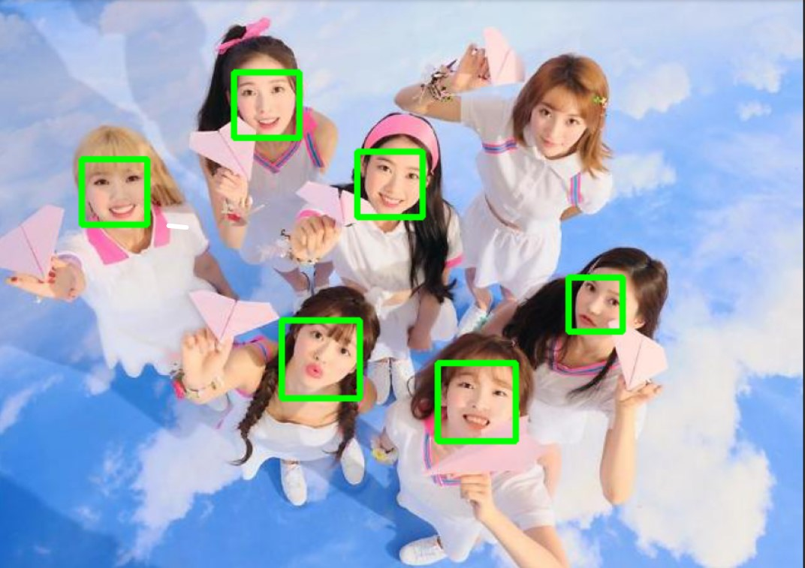
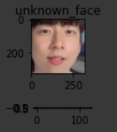

# Google Colab 기반 얼굴인식 입문PJT

2020.12.22

---

[TOC]

---


## Google Colab

> 마크다운 에디터 + 소스코드 추가/편집 + 소스코드 실행 + 실행결과를 웹화면에 출력/저장 + 고속의 구글 클라우드 서버

**특징**

- Google에서 서비스하는 웹 기반 Python 실행환경
- 무료로 Google Cloud Server의 GPU 및 TPU 사용가능
- 코드와 실행결과 / 마크다운 텍스트를 문서내에 포함가능
- 미리 정의된 코드를 간단하게 클릭해서 적용 가능 (코드스니펫)
- Data Science와 Machine Learning에 최적의 개발환경
- 무료 서비스의 경우 12시간 이상 연속 접속이 불가능

### 코드 스니펫

> **스니펫**(**snippet**)은 재사용 가능한 소스 **코드**, 기계어, 텍스트의 작은 부분을 일컫는 프로그래밍 용어이다. (출처: 위키백과)

- Google Colab에서 왼쪽 메뉴바 3번째 아이콘을 클릭하면 코드 스니펫을 볼 수 있다.


## OpenCV

> 가장 널리 쓰이는 그래픽 라이브러리
>
> [공식사이트](https://opencv.org/)
> [OpenCV 파이썬 튜토리얼](https://docs.opencv.org/master/d6/d00/tutorial_py_root.html)

```python
import cv2
import numpy as np
from matplotlib import pyplot as plt

# 이미지 버퍼 생성
buffer = np.full((256, 256, 3), 255, np.uint8)

# 이미지 버퍼 가공

# 이미지 버퍼 출력
plt.imshow(buffer)
plt.show
```

### 도형 그리기

> 다양한 모양의 도형을 그릴 수 있다.

:ballot_box_with_check: **Line** 

`cv2.line(img, start, end, color, thickness)`

> - `img` - 그림을 그릴 이미지 파일
> - `start` - 시작 좌표(ex. (0,0))
> - `end` - 종료 좌표(ex. (500, 500))
> - `color` - BGR 형태의 Color(ex. (255, 0, 0) = Blue)
> - `thickness` (int) - 선의 두께. pixel

```python
import numpy as np
import cv2

#모두 0으로 되어 있는 빈 Canvas(검정색)
img = np.zeros((512, 512, 3), np.uint8)
img = cv2.line(img, (0, 0), (511, 511), (255, 0, 0), 5)

cv2.imshow('image',img)
cv2.waitKey(0)
cv2.destroyAllWindows()
```

:ballot_box_with_check: **Rectangle**

`cv2.rectangle(img, start, end, color, thickness)`

```python
img = cv2.rectangle(img, (384, 0), (510, 128), (0,255,0), 3)
```

:ballot_box_with_check: **Circle**

`cv2.circle(img, center, radian, color, thickness)`

> - `img` - 그림을 그릴 이미지
> - `center` - 원의 중심 좌표 (x, y)
> - `radian` - 반지름
> - `color` - BGR 형태의 Color
> - `thickness` - 선의 두께, -1이면 원 안쪽을 채움

```python
img = cv2.circle(img, (447,63), 63, (0,0,255), -1)
```

:ballot_box_with_check: **Ellipse(타원)**

`cv2.ellipse(img, center, axes, angle, startAngle, endAngle, color[, thickness[, lineType[, shift]]] -> img)

> - `center` - 타원의 중심
> - `axes` - 중심에서 가장 큰 거리와 작은 거리
> - `angle` - 타원의 기울기 각
> - `startAngle` - 타원의 시작 각도
> - `endAngle` - 타원이 끝나는 각도
> - `color` - 타원의 색
> - `thickness` - 선 ㅜ께 -1이면 안쪽을 채움

```python
img = cv2.ellipse(img, (256,256), (100,50), 0, 0, 180, 255, -1)
```

:ballot_box_with_check: **Polygon**

`cv2.polylines(img, pts, isClosed, color, thickness)

> - `img` - image
> - `pts` (array) - 연결할 꼭지점 좌표
> - `isClosed` - 닫힌 도형 여부
> - `color` - Color
> - `thickness` - 선 두께

```python
pts = np.array([[10,5], [20,30], [70,20], [50,10]], np.int32) # 각 꼭지점은 2차원 행렬로 선언
# 이미지에 표현하기 위해 3차원 행렬로 변환. 변환이전과 이후의 행렬 갯수는 동일해야함.
# -1은 원본에 해당하는 값을 그대로 유지.
pts = pts.reshape((-1, 1, 2))
img = cv2.polylines(img, [pts], True, (0,255,255))
```

:ballot_box_with_check: **이미지에 Text 추가**

`cv2.putText(img, text, org, font, fontScale, color)`

> - `img` - image
> - `text` - 표시할 문자열
> - `org` - 문자열이 표시될 위치. 문자열의 bottom-left corner 점
> - `font` - font type. CV2.FONT_XXX
> - `fontScale` - Font Size
> - `color` - font coloe

```python
cv2.putText(img, 'OpenCV', (10,500), cv2.FONT_HERSHEY_SIMPLEX, 4, (255,255,255), 2)
```


## face-recognition 1.3.0

> [얼굴인식 오프소스](https://pypi.org/project/face-recognition/)
>
> * 참고: Google Teachable Machine
> * 어떻게 활용할 수 있을까?
>   * `오프라인 매장 초개인화 마케팅 데이터`

```bash
$ pip install face-recognition
```

**특징**

- distance(0.0 ~ 1.0)가 0.6 이하면 동일인으로 볼 수 있다.
- 그러나 실제로는 다른 사람의 얼굴이 0.5x 대의 수치를 반환하는 경우가 있음
- 엄격하게 사용하려면 distance 0.5 이하를 동일인으로 가정

### Face Detaction 연습

- Google Colab에서는 pip install을 다음과 같이 진행할 수 있다.

```python
!pip install face-recognition
```

- 먼저 패키지를 import하고, Google Drive의 이미지파일 경로를 입력한다.

```python
import cv2, os
import face_recognition as fr
from IPython.display import Image, display
from matplotlib import pyplot as plt

image_path = "/content/drive/My Drive/omg.jpg"
```

- 이미지를 불러오기 전, **드라이브 접근 권한**을 받는다.

```python
from google.colab import drive
drive.mount('/content/drive')
```

- 이후 이미지를 불러와서 Face Detaction을 하는 코드를 작성한다.

```python
image = fr.load_image_file(image_path)
face_locations = fr.face_locations(image)

for (top, right, bottom, left) in face_locations:
  cv2.rectangle(image, (left, top), (right, bottom), (0,255,0), 3)

# 이미지 버퍼 출력
plt.rcParams["figure.figsize"] = (16, 16)
plt.imshow(image)
plt.show()
```

- 오마이걸 사진을 face detaction하면 다음과 같은 결과가 나온다.



### Face Recognition 연습

- 먼저 동일인물 사진 2장과 나머지 다른 인물의 사진을 준비한다.
  
  - <참고> 인물 사진은 [unsplash - 무료 공개 이미지 사이트](http://unsplash.com)에서 가져와서 사용할 수 있다.
  
- 예시 사진은 다음과 같다.

  - 비교 target

  

  - 비교 data

  

```python
## 인물 얼굴 가져오기
!pip install face-recognition
import cv2, os
import face_recognition as fr
from IPython.display import Image, display
from matplotlib import pyplot as plt

from google.colab import drive
drive.mount('/content/drive')

plt.rcParams["figure.figsize"] = (1, 1)

# 이미지 파일을 로드하여 img_list 리스트 생성
img_list = []
img_list.append(fr.load_image_file("/content/drive/My Drive/Colab Notebooks/faces2.jpg"))

# 얼굴 인식을 하여 감지된 부분을 잘라낸 다음 known_face_list에 저장
known_face_list = []
for person in fr.face_locations(img):
  # 얼굴좌표를 알아내서 잘라낸다
  top, right, bottom, left = person
  face_image = img[top:bottom, left:right]

  # known_face_list에 잘라낸 face_image를 저장
  known_face_list.append(face_image)

# known_face_list에 저장된 얼굴들 출력
for face in known_face_list:
  plt.imshow(face)
  plt.show()
```

- 얼굴을 인식하여 감지된 부분을 잘라내어 저장한 known_face_list는 다음과 같다.


- 비교대상의 얼굴을 가져온다.

```python
## 비교 대상 가져오기

# 기존리스트에 없는 새로운 파일을 열어서
unknown_person = fr.load_image_file("/content/drive/My Drive/Colab Notebooks/face1.jpg")

# 얼굴좌표를 알아내서 잘라낸다
top, right, bottom, left = fr.face_locations(unknown_person)[0]
unknown_face = unknown_person[top:bottom, left:right]

# unknown_face 라는 타이틀을 붙여서 표시
plt.title("unknown_face")
plt.imshow(unknown_face)
plt.show()

# unknown_person_face를 인코딩
enc_unknown_face = fr.face_encodings(unknown_face)

# 화면에 표시해보면 다음과 같다.
plt.imshow(enc_unknown_face)
plt.show()
```

- 비교 대상이 되는 unkown_face는 다음과 같다.



- 마지막으로 동일인물인지 비교한다.

```python
# 등록된 얼굴리스트를 비교
for face in known_face_list:

  # 등록된 얼굴을 128-dimensional face 인코딩
  enc_known_face = fr.face_encodings(face)
  # 등록된 얼굴과 새로운 얼굴의 distance를 얻기
  distance = fr.face_distance(enc_known_face, enc_unknown_face[0])
  # distance 수치를 포함한 얼굴 출력
  if distance < 0.5:
    plt.title("distance: " + str(distance))
    plt.imshow(face)
    plt.show()
```

- distance가 0.5 미만, 즉 동일인물이라고 판단되는 known_face_list의 face 결과를 출력하면 다음과 같다.
  - `distance는 보통 0.6 이하, 엄격하게 적용하면 0.5 이하일 때 동일 인물이라고 간주할 수 있다.`


***Copyright* © 2020 Song_Artish**