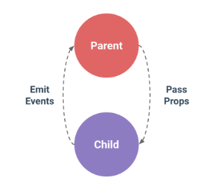
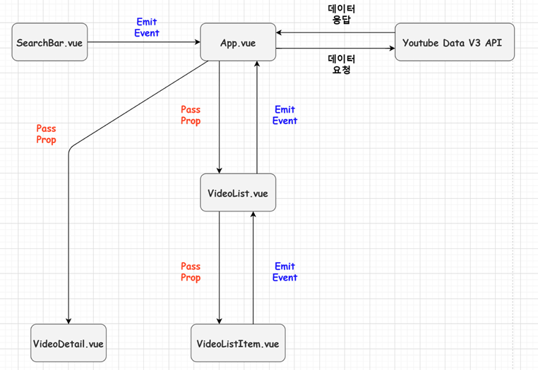

# SFC

2020.11.11

> `SFC(Single File Component)`는 화면의 특정 영역에 대한 HTML, CSS, JavaScript 코드를 하나의 파일(.vue)에서 관리하는 형태이다.

---

[TOC]

---


## 0. 개념

### 1) Component

> 컴포넌트는 다시 사용할 수 있는 범용성을 위해 개발된 소프트웨어 구성 요소를 일컫는다. (재사용 가능한 코드)

- 목적: 유지, 보수, 재사용성
- Vue 컴포넌트 === Vue 인스턴스 === `.vue` 파일

---

```markdown
그렇다면 SFC 형태로 어떻게 개발할까?
```

---

### 2) npm

>`npm(Node Package Manager)`는 자바스크립트 프로그래밍 언어를 위한 패키지 관리자이며, 자바스크립트 런타임 환경 `Node.js`의 기본 패키지 관리자이다.

**설치하기**

- `bash` 창에서 **Vue CLI**를 설치하기 위해 다음의 명령어를 입력한다.

```bash
$ npm install -g @vue/cli
```

- 위 명령어에서, `g`는 global에 설치한다는 것을 의미한다!
- 설치 후 vue 버전을 확인해본다.

```bash
$ vue --version
```


### 3) Node.js

> `JavaScript Runtime Environment`로, 자바스크립트를 브라우저 밖에서 실행할 수 있는 새로운 환경을 제공한다.

**다운로드**

- [node.js 사이트](https://nodejs.org/ko/)에서 안정성이 높은 구버전을 다운로드한다.
- 단, 설치시 `Tools for Native Modules`의 체크박스는 체크하지 않는다!!
- 다운로드가 완료되면 버전을 체크해준다.

```bash
$ node -v
```

- `Node`를 설치하면 `npm`이 자동으로 설치된다.

```bash
$ npm -v
```


### 4) Babel

> 파편화된(크로스 브라우징 이슈) JavaScript 문법을 `변환/변역`하기 위해 존재하는 도구 (`compiler`)


### 5) Webpack

>모듈 간의 의존성 문제를 해결하기 위해 존재하는 도구 (`bundler`)


## 1. Vue CLI 프로젝트 구조

### **`node_modules`**

> `npm`으로  node.js 환경의 여러 의존성 모듈

- :white_check_mark: 절대로 git으로 관리해서는 안된다!

### **`public/index.html`**

> Vue 앱의 뼈대가 되는 html 파일

- `main.js`에서 `$mount('#app')` 마운트의 대상이 되는 DOM Element가 존재한다.
- 실제 배포를 하기 우해 `npm run build`한 결과물은 이 html 문서 한 장에 모두 묶이게 된다.

### **`package.json`**

> 모듈들을 기록해 놓는 공간이다. [문서](https://docs.npmjs.com/cli/v6/configuring-npm/package-json) 참조

- 다음의 명령어를 통해 `package.json`에 기록되어 있는 `node_modules`를 설치한다.

  ```bash
  $ npm install (혹은 i)
  ```

### **`package-lock.json`**

>`node_modules` 에 설치되는 모듈과 관련해서 모든 의존성을 알아서 설정한다. (패키지 버전을 고정) [문서](https://docs.npmjs.com/cli/v6/configuring-npm/package-lock-json) 참조
>
>- `npm install` 명렁어에 생성된다.

### **`babel.config.js`**

> 바벨 설정과 관련된 내용이 들어가는 파일

### **`src/assets/`**

> webpack에 의해 빌드된 정적 파일이 관리되는 공간

### **`src/components/`**

> 하위 컴포넌트가 작성되는 공간

### **`src/App.vue`**

> 최상위 컴포넌트

### **`src/main.js`**

> Webpack이 빌드를 시작할 때 가장 먼저 불러오는 진입점으로, 실제 단일 파일에서 DOM과 Data를 연결 했던 것과 동일한 작업이 이루어지는 파일
>
> - Vue 전역에서 활용 할 모듈을 등록할 수 있는 파일


## <실습> Vue CLI 프로젝트

### :arrow_forward: 시작하기

**설치하기**

- `Vue CLI`를 설치한다.

```bash
$ npm install -g @vue/cli
```

- `package.json`에 들어있는 모듈 패키지를 설치한다.

```bash
$ npm install
```

**프로젝트 생성**

```bash
$ vue create <프로젝트명>
```

- 다음의 3가지 옵션을 표시되는데, 그 중 첫 번째 `[Vue 2]`를 선택하고 `Enter`를 누른다.

```bash
Vue CLI v4.5.8
? Please pick a preset:
> Default ([Vue 2] babel, eslint)
  Default (Vue 3 Preview) ([Vue 3] babel, eslint)
  Manually select features
```

- 이후 프로젝트 폴더로 이동해서 서버를 실행한다.

```bash
$ npm run serve
```


### :arrow_forward: 컴포넌트 등록

```markdown
1. 가져온다
2. 등록한다
3. 보여준다
```

1. **가져온다**

```javascript
import HelloWorld from '@/components/HelloWorld.vue'
```

- 골뱅이 `@` 는 `/src` 위치를 나타낸다.

2. **등록한다**

```javascript
export default {
  name: 'Home',
  components: {
    HelloWorld
  }
}
```

3. **보여준다**.

```vue
<template>
  <div class="home">
    
    <HelloWorld msg="Welcome to Your Vue.js App"/>
  </div>
</template>
```


### :arrow_forward: view 작성

- `src > views`에서 vue 파일을 생성한다.
- vue 파일은 대문자 작성을 원칙으로 한다.

```markdown
### 예시
- Home.vue
- TheLotto.vue
- TheLunch.vue
```

- 작성한 vue 파일에서 `vue`를 입력하고 자동완성으로 `<vue> with default.vue` + `Enter` 입력하여 기본 구조를 만들어준다.
- `index.js`의 `routes`에 path, name, component를 등록한다.

```javascript
import Practice from '../views/Practice.vue'

const routes = [
   {
    path: '/practice',
    name: 'Practice',
    component: Practice
  }
]
```

- view에서도 템플릿에 `<div>` 태그와 name을 입력해준다.
  - `<template>` 태그 안에 하나 이상의 태그가 존재해야 한다!

```vue
<template>
  <div>	<!-- <div> 태그 만들기-->
    
  </div>
</template>

<script>
export default {
  name: 'Practice',	// el 대신
}
</script>

<style>

</style>
```


### :arrow_forward: 데이터 입력

- SFC에서 `Data`는 데이터를 return하는 함수 형식으로 입력해야 한다.

```javascript
data: function () {
    return {
        lunch: ['국밥', '짜장면', '햄버거'],
        selectedLunchMenu: '',
    }
},
```

- 결국, 다음과 같이 데이터를 입력한다.

```javascript
export default {
  name: 'TheLunch',
  data: function () {
    return {
      lunch: ['국밥', '짜장면', '햄버거'],
      selectedLunchMenu: '',
    }
  },
  methods: {
    pickOneInLunchMenu: function () {
      const randomIndex = _.random(this.lunch.length - 1)
      // console.log(randomIndex)
      this.selectedLunchMenu = this.lunch[randomIndex]
    }
  }
}
```


### :arrow_forward: 클릭 이벤트 발생

- HTML에서 사용할 경우, @click 혹은 v-on:click 디렉티브를 사용할 수 있었다.
- Component의 경우, v-on:click.native의 형태로 native 이벤트라는 사실을 명시해 줘야한다.


### :arrow_forward: lodash 설치

- npm에 lodash를 설치한다.

```bash
$ npm install lodash
```

- view의 `<script>` 태그 안에서 `lodash`를 import 한다.

```javascript
import _ from 'lodash'
```


## 2. Vue Router

>Django의 `urls.py`에서 관리하던 url을 view에서 관리할 수 있도록 할 수 있다.

- Vue CLI로 router를 추가한다.

```bash
$ vue add router
```

- history 모드에서 `Y`를 선택한 후 과정을 진행한다.

  ```markdown
  브라우저에서 지원하는 History API를 사용하면 주소 이동 없이 URI만 바꿀 수 있다.
  ```

:ballot_box_with_check: `src > router > index.js` 가 생성된다.

- url이 다음과 같이 router로 관리된다.

```javascript
// index.js
const routes = [
  {
    path: '/',	// url 주소
    name: 'Home',
    component: Home	// 컴포넌트
  },
  {
    path: '/about',
    name: 'About',
    component: () => import(/* webpackChunkName: "about" */ '../views/About.vue')
  }
]
```

- component에 들어가는 요소는 `index.js`에서 다음과 같이 정의된다.

```javascript
import Vue from 'vue'
import VueRouter from 'vue-router'
import Home from '../views/Home.vue'
```

- 이렇게 router로 관리되는 url을 템플릿 =에서는 아래와 같이 사용할 수 있다!

```vue
<!-- App.vue -->
<template>
  <div id="app">
    <div id="nav">
      <router-link to="/">Home</router-link> |
      <router-link to="/about">About</router-link>
    </div>
    <router-view/>
  </div>
</template>
```

- 아래와 같은 방법으로도 url 주소를 작성할 수 있다.

```html
<router-link :to="{ name: 'TheLunch'}">TheLunch</router-link> |
```


## 3. Pass Props & Emit Events

> 데이터 단방향 흐름
>
> - 상위 컴포넌트에서 하위 컴포넌트로 흐른다. (Pass Props)
> - 하위 컴포넌트는 이벤트로 상위 컴포넌트에게 데이터를 전달할 수 있다. (Emit Events)



### 3.1 Props

#### 3.1.1 넘겨준다

- 상위 컴포넌트에서는 가져온 태그에서 데이터를 바인딩하여 넘겨준다.

```vue
<<하위 컴포넌트 이름> :<데이터 이름>="<넘겨줄 데이터 이름>">
```

- 예시

```vue
<Parent :appData="appData"/>
```

#### 3.1.2 받아준다

- props로 상위 컴포넌트의 데이터를 받을 때는, 데이터 형을 지정해준다.

```javascript
props: {
    <넘겨받은 데이터 이름>: <데이터 형태>
}
```

- 예시

```vue
props: {
    appData: String,
	app: {
	type: Object
	}
  },
```


### 3.2. Emit

>```javascript
>this.$emit('<이벤트>', <데이터>)
>```
>
>- 예시
>
>```javascript
>this.$emit('input-change', event.target.value)
>```

#### 3.2.1 올려준다

- input 태그에 `v-on`으로 이벤트를 달아준다.

```vue
<<이벤트 대상 태그> @<이벤트>="<이벤트 함수>">
```

```vue
<input type="text" v-model="childData" @input="onInput">
```

- 이벤트가 발생하면 `emit`하도록 함수를 작성한다.

```javascript
methods: {
    onInput: function () {
      this.$emit('child-input', event.target.value)
      // this.$emit('<올려줄 이벤트 이름>', <올려줄 데이터>)
    }
```

#### 3.2.2 받아준다

- `v-on`으로 넘겨받은 이벤트에 새로운 이벤트를 연결한다.

```vue
<<하위 컴포넌트 태그> @<올려받은 이벤트 이름>="<정의할 이벤트 함수>">
```

```vue
<Child :appData="appData" :parentData="parentData" @child-input="onChildInput" />
```

- 해당 이벤트 함수를 작성한다.
- 해당 내용을 `text`라는 변수로 받아온다.

```javascript
methods: {
    onChildInput: function (text) {
        this.childData = text
        this.$emit('child-input', text) // text = this.childData
    }
}
```


## <실습> Youtube 검색 사이트 만들기



### :arrow_forward: 컴포넌트 생성

- 구조에 따라 컴포넌트를 생성하고 `App.vue`에서 하위 컴포넌트들을 등록해준다. (가져오기, 등록하기, 보여주기!!!)

### :arrow_forward: Input 데이터 가져오기 (emit)

- input 태그에서 `v-on`으로 이벤트와 실행할 함수를 등록한다.

```vue
<!-- SearchBar.vue -->
<input type="text" @keyup.enter="onEnter">
```

- 실행할 함수가 상위 컴포넌트에 데이터를 emit하도록 정의해준다.

```javascript
onEnter: function (event) {
    this.$emit('search', event.target.value)
}
```

- 상위 컴포넌트에서 emit되어 온 데이터를 받아준다.

```vue
<!-- App.vue -->
<SearchBar @search="onSearch" />
```

- `onSearch` 함수를 정의해준다.

```javascript
methods: {
    onSearch: function (text) {
        console.log(text)
    }
}
```

### :arrow_forward: axios 설치 및 작성

> [Youtube API 사이트](https://developers.google.com/youtube/v3/docs/search/list?hl=ko) 문서를 참조한다.

- axios를 모듈로 설치한다.

```bash
$ npm install --save axios
```

- axios를 스크립트에서 불러온다.

```javascript
import axios from 'axios'
```

- API_URL을 가져와서 변수로 작성한다.

```javascript
// App.vue
const API_URL = 'https://www.googleapis.com/youtube/v3/search'
```

- axios 요청을 하는 코드를 작성한다.

```javascript
axios.get(url, params)	// 필수 매개인자가 필요하다.
```

- [문서](https://developers.google.com/youtube/v3/docs/search/list?hl=ko)를 참고해서 필수 매개인자를 다음과 같이 작성한다.

```javascript
// App.vue
onSearch: function (text) {
      axios.get(API_URL, {
        params: {
          key: '',
          part: 'snippet',
          type: 'video',
          q: text
        }
      })
    }
```

- `key` 값은 노출이 되면 안되기 때문에 다음의 과정으로 관리한다.

### :arrow_forward: API 키 관리

- 환경변수를 사용하여 API 키를 관리한다. [사이트](https://cli.vuejs.org/guide/mode-and-env.html#modes)를 참조한다.

```markdown
.env                # loaded in all cases
.env.local          # loaded in all cases, ignored by git
.env.[mode]         # only loaded in specified mode
.env.[mode].local   # only loaded in specified mode, ignored by git
```

- 프로젝트 최상위 폴더 안에 **`.env.local`**이라는 파일을 생성한 후, 아래와 같이 입력한다.
- :white_check_mark: 내용은 반드시 `VUE_APP_`으로 시작해야하며, 띄워쓰기를 하지 않아야한다!

```
VUE_APP_YOUTUBE_API_KEY=<API 키>
```

- 그래서 다음과 같이 `vue` 파일에서 key 값을 가져온다.

```javascript
// App.vue
const API_KEY = process.env.VUE_APP_YOUTUBE_API_KEY
```

### :arrow_forward: axios 로직 완성하기

- `video`라는 데이터를 정의해준다.

```javascript
data: function () {
    return {
      videos: []
    }
```

- 그리고 promise 객체로 axios 로직을 완성해준다.

```javascript
// App.vue
onSearch: function (text) {
      axios.get(API_URL, {
        params: {
          key: API_KEY,
          part: 'snippet',
          type: 'video',
          q: text
        }
      }).then (res=>
      // console.log(res.data.items)
      this.videos = res.data.items)
      .catch(err => console.log(err))
    }
```

### :arrow_forward: Props

- 데이터를 넘겨준다.

```vue
<!-- App.vue -->
<VideoList videos="videos" />
```

- 하위 컴포넌트에서 데이터를 받아준다.

```javascript
// VideoList.vue
props: {
  videos: Array
}
```

### :arrow_forward: VideoListItem (하위 컴포넌트) 생성 및 Props

- `VideoListItem`이라는 vue 파일을 생성한다.
- `VideoList.vue`의 하위 컴포넌트로 등록한다.
- `VideoList`에서 받아온 

```vue
VideoListItem 
        v-for="(video, idx) in videos"
        :key="idx"
      /> <!-- 키 값이 없기 떄문에 오류가 발생한다. -->
```

```vue
        v-for="video in videos"
        :key="video.etag"
```

- 결국,  `:key`은 키 값으로 쓸 고유값을 넘겨주면 되는 것이다.

### :arrow_forward: 비디오 리스트 표시하기

- 받아온 `video`의 데이터 구조를 확인하고 다음과 같이 코드를 작성한다.
- :white_check_mark: 데이터 구조를 꼭 확인하도록 한다!!

```vue
<!-- VideoListItem.vue > <template> -->
<li>
    
    <span>{{ video.snippet.title  }}</span>
</li>
```

- `:src`의 값이 너무 길기 때문에 `computed`를 사용해서 다음과 같이 코드를 작성할 수도 있다.

```javascript
// VideoListItem.vue > <script>
computed: {
    imgSrc: function () {
      return this.video.snippet.thumbnails.default.url
    }
  }
```

```vue
<!-- VideoListItem.vue > <template> -->

```

### :arrow_forward: filters 적용

> `video.snippet.title`을 출력하면 이상한 문자들이 같이 출력되는데, 이를 없애주기 위해서 filter를 적용한다.

- 먼저 `lodash`를 불러온다.

```javascript
// VideoListItem.vue
import _ from 'lodash'
```

- filters 메서드를 사용해서 `unEscape`라는 함수를 선언해준다.

```javascript
filters: {
    unEscape: function (text) {
        return _.unescape(text)
    }
```

- 생성해준 filters 함수는 다음과 같이 적용할 수 있다.

```vue
<span>{{ video.snippet.title | unEscape  }}</span>
```


### :arrow_forward:  최하위 컴포넌트 데이터  emit

> 앞서 했던 emit 로직을 그대로 적용하여, 최하위의 `VideoListItem.vue`의 selectedVideo라는 데이터를 `App.vue`로 올려준다.

- 먼저 최하위 컴포넌트에 emit할 이벤트를 만들어준다.

```vue
<li @click="selectVideo">
    
    <span>{{ video.snippet.title | unEscape  }}</span>
</li>
```

- 올려준다 (`VideoListItem -> VideoList`)

```javascript
// VideoListItem.vue
methods: {
    selectVideo: function () {
        this.$emit('select-video', this.video)
    }
}
```

- 받아준다.

```vue
<!-- VideoList.vue -->
      <VideoListItem 
        v-for="video in videos"
        :key="video.etag"
        :video="video"
        @select-video="selectVideo"
      />
```

- 이벤트를 받는 함수를 생성해주고 `App.vue` 로 다시 emit해준다. (`VideoList -> App`)

```javascript
// VideoList.vue
methods: {
    selectVideo: function (video) {
        this.$emit('select-video', video)
    }
```

- `App.vue`에서 받아준다.

```vue
<!-- App.vue -->
<VideoList :videos="videos" @select-video="selectVideo" />
```

- 이벤트 emit으로 받은 데이터를 저장해줄 데이터를 생성한다.

```javascript
// App.vue
selectedVideo: '',
```

- 이후, emit 이벤트를 받는 함수를 생성해준다.

```javascript
// App.vue
selectVideo: function (video) {
    this.selectdVideo = video
}
```

### :arrow_forward: detail에 비디오 prop

> `VideoDetail.vue` 파일에 `VideoListItem`으로부터 받은 `selectedVideo`파일을 prop한다.

- 보내준다. (`App -> VideoDetail`)

```vue
<!-- App.vue -->
<VideoDetail :video="selectedVideo" />
```

```javascript
// App.vue
data: function () {
    return {
        selectedVideo: null,	// 보내줄 selectedVideo는 null 값을 입력해준다.
        videos: [],
    }
```

- 받아준다.

```javascript
props: {
    video: Object
},
```

### :arrow_forward: `<iframe>` 태그 사용

> `<iframe>` 태그를 이용하여 detail을 표시한다. (@`VideoDetail.vue`)
> [IFrame Player API 문서](https://developers.google.com/youtube/player_parameters?hl=ko)
>
> - `<iframe>`에 로드할 동영상의 주소를 다음과 같은 형식을 가진다.
>
> ```
> https://www.youtube.com/embed/VIDEO_ID
> ```

- `VideoDetail.vue`의 `<template>` 태그에는 다음과 같이 코드를 작성하면 된다.

```vue
<!-- VideoDetail.vue -->
<div v-if="video">
    <iframe :src="videoURI" frameborder="0"></iframe>
    <h1>{{ video.snippet.title | unEscape }}</h1>
    <p>{{ video.snippet.description | unEscape }}</p>
</div>
```

- 더 나은 처리를 위해서 아래의 3가지 디테일한 처리를 해준다.

##### (1) 비디오 표시

- `App.vue`에서 `selectedVideo`는 기본적으로 null 값으로 정의한다.

```javascript
selectedVideo: null,	// 보내줄 selectedVideo는 null 값을 입력해준다.
```

- 이러한 비디오가 없을 경우에는 `VideoDetail`에서 표시하지 않도록 조건문을 추가해준다.

```vue
<div v-if="video">
```

##### (2) videoURI computed

- `computed` 속성을 활용하여 `videoURI`의 값을 리턴해준다.

```javascript
computed: {
    videoURI: function () {
        const { videoId } = this.video.id
        return `https://www.youtube.com/embed/${videoId}`
        // backtick
    }
},
```

```vue
<iframe :src="videoURI" frameborder="0"></iframe>
```

##### (3) filter

- 위에서와 같이 filter로 title을 처리해준다.

```javascript
filters: {
    unEscape: function (text) {
        return _.unescape(text)
    }
}
```

```vue
<h1>{{ video.snippet.title | unEscape }}</h1>
<p>{{ video.snippet.description | unEscape }}</p>
```

### :arrow_forward: 스타일링 (CSS)

- 이후 자유롭게 스타일링하면 된다.


## <참고> Vue Life Cycle

> Vue Life Cycle Hook에는 `created` - `mounted` - `updated` - `destroyed`, 이 4가지가 있다.
> 숙련된 Vue 개발자가 되기 위해서는 Vue 인스턴스의 생애주기를 파악하고, 원하는 시점에 원하는 연산을 수행할 수 있도록 개발해야 한다.
> [공식사이트](https://kr.vuejs.org/v2/guide/instance.html)


| Life Cycle Hook |                             설명                             |
| :-------------: | :----------------------------------------------------------: |
| `beforeCreated` | Vue 인스턴스가 생성되었지만, `data`의 변화와 이벤트에 대한 감시가 설정되기 전에 호출됨 |
|    `created`    | Vue 인스턴스가 생성되었고, `data` 관찰, `computed`, `methods`, `watch`가 설정이 완료되면 호출 됨 |
|  `beforeMount`  | DOM에서 마운트(결합, 부착)될 대상(`el` or `.@mount(대상)`)과 마운트되기 전에 호출됨 |
|    `mounted`    |       DOM에서 마운트 될 대상과 마운트된 이후에 호출됨        |
| `beforeUpdate`  | `data`가 변경되고 난 이후, 실제 DOM이 다시 렌더링 되기 전에 호출됨 |
|    `updated`    |       `data` 변경 이후, DOM이 다시 렌더링 되고 호출됨        |
| `beforeDestroy` |             Vue 인스턴스가 제거되지 전에 호출됨              |
|   `destoryed`   |              Vue 인스턴스가 제거된 이후 호출됨               |


```javascript
export default {
    name: "HelloWorld",
    created: function () {
        console.log('created!')
    },
    mounted: function () {
        console.log('mounted!')
    },
    updated: function () {
        console.log('updated!')
    }
}
```


## :exclamation: 오류 디버깅

### vue-cli-service 은(는) 내부 또는 외부 명령 실행할 수 있는 프로그램 또는 배치 파일이 아닙니다

**해결방안1** : Vue CLI 재설치

- Vue CLI를 제거 후 재설치 한다.

```bash
$ npm uninstall vue-cli -g
```

```bash
$ npm install -g @vue/cli
```

**해결방안2** : npm 확인

- 프로젝트에 `node_modules` 폴더가 있는지 확인한다.
- 있다면 지우고 npm을 다시 설치한다.

```bash
$ npm install
```


***Copyright* © 2020 Song_Artish**

