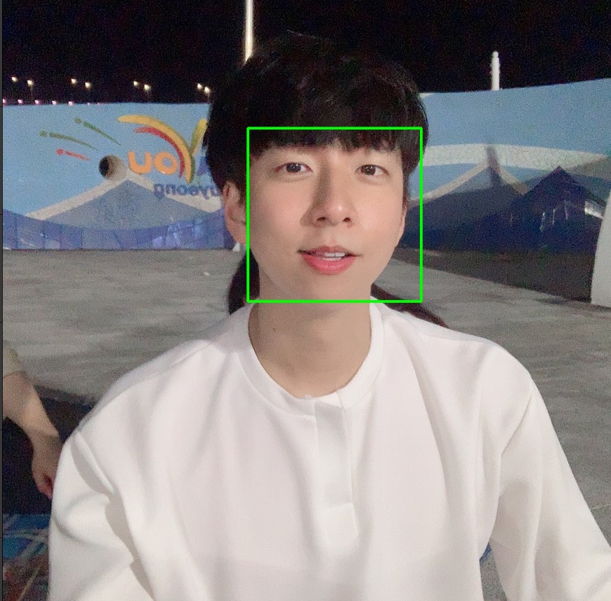
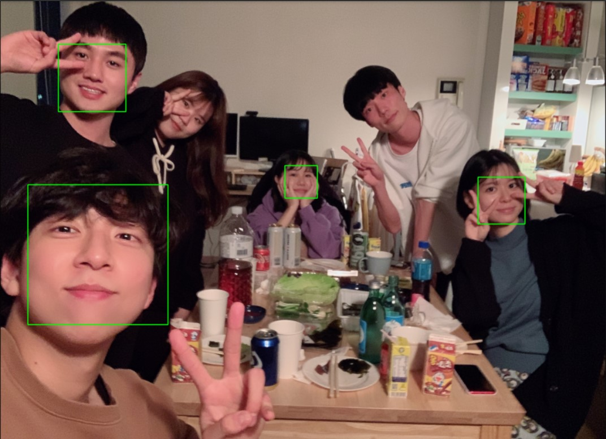
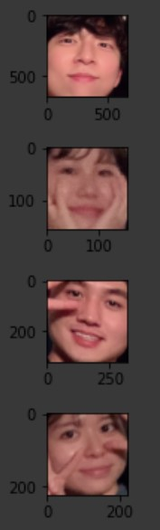

# 자기주도 PJT

2020.12.21 - 2020.12.23

---

[TOC]

---


## 1. 소프트웨어 개발 방법론

### 1) 요구사항 정의

> - 프로젝트 주제 정의
> - 시스템에서 필요한 요구사항 정의
> - 주제에 맞는 세부 요구사항까지 명확하게 기재

- 예시: Edu.ssafy.com 홈페이지 제작
  - 회원가입 후 승인 프로세스

**기능정의서**


### 2) 설계

> 개발에 들어가기 전 필요한 문서를 작성하는 프로세스

- 예시
  - Wire Frame 화면 설계
  - Story Board 작성
  - ERD Diagram 설계

### 3) 개발

> 실질적으로 프로젝트를 개발한다.

### 4) 테스트

> Test-Case를 작성하여, 시스템에서 해당 테스트 케이스들이 작동하는지를 확인한다.

- 예시: `회원가입 시, ID는 영어 + 숫자 혼합 8글자 이내여야 한다.`
  - ID를 9글자 이상 입력하여 테스트해본다.
  - ID를 8글자 이하로 영어로만 입력해 본다.
  - 등등

### 5) 유지보수

> 외부에서 접속할 수 있도록 서버(AWS 등)에 시스템을 구동시켜 본다.

- AWS 서버에서 EC2 서버를 발급받아서 개발한 프로젝트를 해당 서버에 이관하여 구동시킨다.


## 2. Google Colab 기반 얼굴인식 입문PJT

### Google Colab

> 마크다운 에디터 + 소스코드 추가/편집 + 소스코드 실행 + 실행결과를 웹화면에 출력/저장 + 고속의 구글 클라우드 서버

**특징**

- Google에서 서비스하는 웹 기반 Python 실행환경
- 무료로 Google Cloud Server의 GPU 및 TPU 사용가능
- 코드와 실행결과 / 마크다운 텍스트를 문서내에 포함가능
- 미리 정의된 코드를 간단하게 클릭해서 적용 가능 (코드스니펫)
- Data Science와 Machine Learning에 최적의 개발환경
- 무료 서비스의 경우 12시간 이상 연속 접속이 불가능

**코드 스니펫**

> **스니펫**(**snippet**)은 재사용 가능한 소스 **코드**, 기계어, 텍스트의 작은 부분을 일컫는 프로그래밍 용어이다. (출처: 위키백과)

- Google Colab에서 왼쪽 메뉴바 3번째 아이콘을 클릭하면 코드 스니펫을 볼 수 있다.


### OpenCV

> 가장 널리 쓰이는 그래픽 라이브러리
>
> [공식사이트](https://opencv.org/)
> [OpenCV 파이썬 튜토리얼](https://docs.opencv.org/master/d6/d00/tutorial_py_root.html)

```python
import cv2
import numpy as np
from matplotlib import pyplot as plt

# 이미지 버퍼 생성
buffer = np.full((256, 256, 3), 255, np.uint8)

# 이미지 버퍼 가공

# 이미지 버퍼 출력
plt.imshow(buffer)
plt.show
```

**도형 그리기**

> 다양한 모양의 도형을 그릴 수 있다.

:ballot_box_with_check: **Line** 

`cv2.line(img, start, end, color, thickness)`

> - `img` - 그림을 그릴 이미지 파일
> - `start` - 시작 좌표(ex. (0,0))
> - `end` - 종료 좌표(ex. (500, 500))
> - `color` - BGR 형태의 Color(ex. (255, 0, 0) = Blue)
> - `thickness` (int) - 선의 두께. pixel

```python
import numpy as np
import cv2

#모두 0으로 되어 있는 빈 Canvas(검정색)
img = np.zeros((512, 512, 3), np.uint8)
img = cv2.line(img, (0, 0), (511, 511), (255, 0, 0), 5)

cv2.imshow('image',img)
cv2.waitKey(0)
cv2.destroyAllWindows()
```

:ballot_box_with_check: **Rectangle**

`cv2.rectangle(img, start, end, color, thickness)`

```python
img = cv2.rectangle(img, (384, 0), (510, 128), (0,255,0), 3)
```

:ballot_box_with_check: **Circle**

`cv2.circle(img, center, radian, color, thickness)`

> - `img` - 그림을 그릴 이미지
> - `center` - 원의 중심 좌표 (x, y)
> - `radian` - 반지름
> - `color` - BGR 형태의 Color
> - `thickness` - 선의 두께, -1이면 원 안쪽을 채움

```python
img = cv2.circle(img, (447,63), 63, (0,0,255), -1)
```

:ballot_box_with_check: **Ellipse(타원)**

`cv2.ellipse(img, center, axes, angle, startAngle, endAngle, color[, thickness[, lineType[, shift]]] -> img)

> - `center` - 타원의 중심
> - `axes` - 중심에서 가장 큰 거리와 작은 거리
> - `angle` - 타원의 기울기 각
> - `startAngle` - 타원의 시작 각도
> - `endAngle` - 타원이 끝나는 각도
> - `color` - 타원의 색
> - `thickness` - 선 ㅜ께 -1이면 안쪽을 채움

```python
img = cv2.ellipse(img, (256,256), (100,50), 0, 0, 180, 255, -1)
```

:ballot_box_with_check: **Polygon**

`cv2.polylines(img, pts, isClosed, color, thickness)

> - `img` - image
> - `pts` (array) - 연결할 꼭지점 좌표
> - `isClosed` - 닫힌 도형 여부
> - `color` - Color
> - `thickness` - 선 두께

```python
pts = np.array([[10,5], [20,30], [70,20], [50,10]], np.int32) # 각 꼭지점은 2차원 행렬로 선언
# 이미지에 표현하기 위해 3차원 행렬로 변환. 변환이전과 이후의 행렬 갯수는 동일해야함.
# -1은 원본에 해당하는 값을 그대로 유지.
pts = pts.reshape((-1, 1, 2))
img = cv2.polylines(img, [pts], True, (0,255,255))
```

:ballot_box_with_check: **이미지에 Text 추가**

`cv2.putText(img, text, org, font, fontScale, color)`

> - `img` - image
> - `text` - 표시할 문자열
> - `org` - 문자열이 표시될 위치. 문자열의 bottom-left corner 점
> - `font` - font type. CV2.FONT_XXX
> - `fontScale` - Font Size
> - `color` - font coloe

```python
cv2.putText(img, 'OpenCV', (10,500), cv2.FONT_HERSHEY_SIMPLEX, 4, (255,255,255), 2)
```


### face-recognition 1.3.0

> [얼굴인식 오프소스](https://pypi.org/project/face-recognition/)
>
> * 참고: Google Teachable Machine
> * 어떻게 활용할 수 있을까?
>   * `오프라인 매장 초개인화 마케팅 데이터`

```bash
$ pip install face-recognition
```

**특징**

- distance(0.0 ~ 1.0)가 0.6 이하면 동일인으로 볼 수 있다.
- 그러나 실제로는 다른 사람의 얼굴이 0.5x 대의 수치를 반환하는 경우가 있음
- 엄격하게 사용하려면 distance 0.5 이하를 동일인으로 가정

**Face Detaction 연습**

- Google Colab에서는 pip install을 다음과 같이 진행할 수 있다.

```python
!pip install face-recognition
```

- 먼저 패키지를 import하고, Google Drive의 이미지파일 경로를 입력한다.

```python
import cv2, os
import face_recognition as fr
from IPython.display import Image, display
from matplotlib import pyplot as plt

image_path = "/content/drive/My Drive/omg.jpg"
```

- 이미지를 불러오기 전, **드라이브 접근 권한**을 받는다.

```python
from google.colab import drive
drive.mount('/content/drive')
```

- 이후 이미지를 불러와서 Face Detaction을 하는 코드를 작성한다.

```python
image = fr.load_image_file(image_path)
face_locations = fr.face_locations(image)

for (top, right, bottom, left) in face_locations:
  cv2.rectangle(image, (left, top), (right, bottom), (0,255,0), 3)

# 이미지 버퍼 출력
plt.rcParams["figure.figsize"] = (16, 16)
plt.imshow(image)
plt.show()
```

- 오마이걸 사진을 face detaction하면 다음과 같은 결과가 나온다.


**Face Recognition 연습**

- 먼저 동일인물 사진 2장과 나머지 다른 인물의 사진을 준비한다.
  
  - <참고> 인물 사진은 [unsplash - 무료 공개 이미지 사이트](http://unsplash.com)에서 가져와서 사용할 수 있다.
  
- 예시 사진은 다음과 같다.

  - 비교 target

  

  - 비교 data

  

```python
## 인물 얼굴 가져오기
!pip install face-recognition
import cv2, os
import face_recognition as fr
from IPython.display import Image, display
from matplotlib import pyplot as plt

from google.colab import drive
drive.mount('/content/drive')

plt.rcParams["figure.figsize"] = (1, 1)

# 이미지 파일을 로드하여 img_list 리스트 생성
img_list = []
img_list.append(fr.load_image_file("/content/drive/My Drive/Colab Notebooks/faces2.jpg"))

# 얼굴 인식을 하여 감지된 부분을 잘라낸 다음 known_face_list에 저장
known_face_list = []
for person in fr.face_locations(img):
  # 얼굴좌표를 알아내서 잘라낸다
  top, right, bottom, left = person
  face_image = img[top:bottom, left:right]

  # known_face_list에 잘라낸 face_image를 저장
  known_face_list.append(face_image)

# known_face_list에 저장된 얼굴들 출력
for face in known_face_list:
  plt.imshow(face)
  plt.show()
```

- 얼굴을 인식하여 감지된 부분을 잘라내어 저장한 known_face_list는 다음과 같다.



- 비교대상의 얼굴을 가져온다.

```python
## 비교 대상 가져오기

# 기존리스트에 없는 새로운 파일을 열어서
unknown_person = fr.load_image_file("/content/drive/My Drive/Colab Notebooks/face1.jpg")

# 얼굴좌표를 알아내서 잘라낸다
top, right, bottom, left = fr.face_locations(unknown_person)[0]
unknown_face = unknown_person[top:bottom, left:right]

# unknown_face 라는 타이틀을 붙여서 표시
plt.title("unknown_face")
plt.imshow(unknown_face)
plt.show()

# unknown_person_face를 인코딩
enc_unknown_face = fr.face_encodings(unknown_face)

# 화면에 표시해보면 다음과 같다.
plt.imshow(enc_unknown_face)
plt.show()
```

- 비교 대상이 되는 unkown_face는 다음과 같다.


- 마지막으로 동일인물인지 비교한다.

```python
# 등록된 얼굴리스트를 비교
for face in known_face_list:

  # 등록된 얼굴을 128-dimensional face 인코딩
  enc_known_face = fr.face_encodings(face)
  # 등록된 얼굴과 새로운 얼굴의 distance를 얻기
  distance = fr.face_distance(enc_known_face, enc_unknown_face[0])
  # distance 수치를 포함한 얼굴 출력
  if distance < 0.5:
    plt.title("distance: " + str(distance))
    plt.imshow(face)
    plt.show()
```

- distance가 0.5 미만, 즉 동일인물이라고 판단되는 known_face_list의 face 결과를 출력하면 다음과 같다.
  - `distance는 보통 0.6 이하, 엄격하게 적용하면 0.5 이하일 때 동일 인물이라고 간주할 수 있다.`


## 3. 블록체인 구현

> 블록체인(block chain)은 관리 대상 데이터를 '**블록**'이라고 하는 소규모 데이터들이 **P2P** 방식을 기반으로 생성된 **체인** 형태의 연결고리 기반 **분산** 데이터 저장 환경에  저장하여 누구라도 임의로 수정할 수 없고 누구나 변경의 결과를 열람할 수 있는 분산 컴퓨팅 기술 기반의 **원장** 관리 기술이다. (출처: 위키백과)
>
> - **블록** : 가치있는 정보를 저장하는 데이터 구조
> - 블록체인은 본질적으로 특정한 구조를 지닌 데이터베이스일 뿐이며 순서가 지정된 링크드 리스트이다.

### Hash Function

> 임의의 길이의 데이터를 고정된 길이의 데이터로 매핑하는 함수 (블록해시)
>
> - 예시 : n 값의 나머지 범위인 (0 ~ n-1)

- 각 블록이 해시 값을 가지고 있다. (블록)
- 또한 각 블록이 이전 해시 값을 가지고 다른 블록과 연결되어 있다. (체인)
  - Genesis 블록의 경우, empty 값(null과는 다른) 혹은 random 값을 넣어주면 된다.

**해시의 활용**

- 비밀번호 저장시, DB에서는 해시함수로 암호화하여 저장

- 버전관리 혹은 문서 복제 등을 검사하기 위해 사용
  
  - 해시함수는 문자열로 축소하기 때문에 문서의 모든 단어를 비교하는 것보다 속도가 빠르다.
  
- 문자를 숫자나 저장되는 주소로 치환하여 검색에 사용

  ```markdown
  # 블록체인 활용 분야
  
  - 음식의 유통 경로 추적
  - 소프트웨어 개발에 보안 더하기
  - 디지털 콘텐츠 관리
  - 의료 기록 추적
  - 대출 승인
  - 보험금 청구
  - 감사 추적
  - 투표
  - 스마트 계약
  - 암호화폐
  ```

  - `출처: 보안뉴스 (https://www.boannews.com/media/view.asp?idx=65690, 검색일: 2020.12.24)`

### Nonce

> 암호화 임시값
>
> nonce를 사용하여 정해진 규칙에 부합하는 hash 값을 생성할 수 있다.

- Proof of Work(Pow) : nounce를 변경해가면서 최종 해시를 구하는 작업
- 마이닝(채굴) : 작업증명(Pow)을 통해 최종 블록을 생성하는 것

### <실습> 블록체인 코드 구현1

**블록 구조체 구현**

- 하나의 정보단위인 block을 정의한다.

```python
import datetime as dt
import hashlib  ## hash function 이용

class Block(object):
    # index, 블록 생성 시간, 데이터, 이전 hash value 등을 이용해서 새로운 hash를 가지는 블록 생성
    def __init__(self, index, timestamp, data, previous_hash):
        self.index = index
        self.timestamp = timestamp
        self.data = data    # important
        self.previous_hash = previous_hash
        self.hash = self.hash_block()

    def hash_block(self):
        # 아래 hash 함수를 보면 이전 block의 hash를 가져와서 다시 hash함수를 만든다.
        # 즉, 새롭게 hash값을 만들 때 이전 블록의 hash 값을 참고해서 만들기 때문에 이를 활용해서 무결성이 확보될 수 있다.
        sha = hashlib.sha256()
        new_str_bin = str(self.index) +  str(self.timestamp) + str(self.data) + str(self.previous_hash)
        sha.update(new_str_bin.encode())
        return sha.hexdigest()
```

- `hash_block()` 함수는 아래와 같이 정의할 수도 있다.

  ```python
  def hash_block(self):
      return hashlib.sha256(str(self.index).encode() + str(self.data).encode() + str(self.nonce).encode() + str(self.timestamp).encode() + str(self.previousHash).encode()).hexdigest()
  ```

**Blcok 인스턴스 생성 함수**

- Genesis 블록을 생성하는 함수를 정의한다.
- 이전 블록과 연결되는 블록을 생성하는 함수를 정의한다.

```python
# Genesis 블록을 만드는 함수
def create_genesis_block():
    return Block(0, dt.datetime.now(), data='genesis block', previous_hash="0")

def create_next_block(last_block):
    return Block(
        index = last_block.index+1,
        timestamp = dt.datetime.now(),
        data = f"Hey, I am blcok {last_block.index+1}",
        previous_hash = last_block.hash
    )
```

**blcok 생성하기**

```python
# 블록체인이기는 하지만, linear한 linked 구조라고 생각하면 된다.
# 따라서 각 주소값을 리스트에 넣어서 관리해도 편하다.

blockchain = [create_genesis_block()]
previous_block = blockchain[-1]

num_of_block_to_add = 5
for i in range(num_of_block_to_add):
    # 이전 블록에 이어서 새로운 블록 생성
    block_to_add = create_next_block(previous_block)
    blockchain.append(block_to_add)
    previous_block = blockchain[-1]
    print(f"{block_to_add.data}")
    print(f"prevhash: {block_to_add.previous_hash}")
    print(f"hash: {block_to_add.hash}")
    print()
```


### <실습> 블록체인 코드 구현2

```python
import hashlib, time

class Block():
    def __init__(self, index, timestamp, data):
        self.index = index
        self.timestamp = timestamp
        self.data = data
        self.prevhash = ''
        self.nonce = 0
        self.hash = self.getHash()

    def getHash(self):
        # 주석의 코드를 하면 속도가 느리다.
        # sha = hashlib.sha256()
        # new_str_bin = str(self.index) +  str(self.timestamp) + str(self.data) + str(self.prevhash)
        # sha.update(new_str_bin.encode())
        # return sha.hexdigest()
        return hashlib.sha256(
            str(self.index).encode() + str(self.data).encode() + 
            str(self.nonce).encode() + str(self.timestamp).encode() + 
            str(self.prevhash).encode()
        ).hexdigest()

    # 조건: 앞의 5자리까지가 0 (difficulty)
    # 위의 조건에 만족하는 hash값을 찾는 함수
    def mine(self, difficulty):
        ans = ["0"]*difficulty
        answer = "".join(ans)
        while str(self.hash)[:difficulty] != answer:
            self.nonce += 1
            self.hash = self.getHash()
        return self.hash


class BlockChain:
    def __init__(self, ):
        self.chain = []
        self.difficulty = 5
        self.createGenesis()

    def createGenesis(self):
        self.chain.append(Block(0, time.time(), 'Genesis Block'))

    def addBlock(self, nBlock):
        nBlock.prevhash = self.chain[len(self.chain)-1].hash
        nBlock.hash = nBlock.mine(self.difficulty)
        self.chain.append(nBlock)

    def getLatestBlock(self):
        return self.chain[len(self.chain)-1]

blocks = BlockChain()
blocks.addBlock(Block(len(blocks.chain),time.time(), "2nd"))
blocks.addBlock(Block(len(blocks.chain),time.time(), "3rd"))
for block in blocks.chain:
    print(f'nonce: {block.nonce}')
    print(f'data: {block.data}')
    print(f'prevhash: {block.prevhash}')
    print(f'hash: {block.hash}')
    print()
```

- hash 값을 구하는 함수에서 아래의 코드로 작성하면 계산이 되지 않는다. (시간이 지체가 된다.)

  ```python
      def getHash(self):
          sha = hashlib.sha256()
          new_str_bin = str(self.index) +  str(self.timestamp) + str(self.data) + str(self.prevhash)
          sha.update(new_str_bin.encode())
          return sha.hexdigest()
  ```

  - 정상적으로 작동하는 코드

  ```python
  def getHash(self):
          return hashlib.sha256(
              str(self.index).encode() + str(self.data).encode() + 
              str(self.nonce).encode() + str(self.timestamp).encode() + 
              str(self.prevhash).encode()
          ).hexdigest()
  ```

  - `왜 그럴까?`

- 위의 코드를 실행하면 아래와 같은 결과값을 출력한다.

```console
$ python blockchain.py

nonce: 0
data: Genesis Block
prevhash:
hash: 81d46e8b146c73799c8317545b57a841dc8b73ae277ffd22810017ce31caefc6

nonce: 830748
data: 2nd
prevhash: 81d46e8b146c73799c8317545b57a841dc8b73ae277ffd22810017ce31caefc6
hash: 00000c04cb0ab258b1eab58da76e798ac497148b74db851a3a3fc44c3a01160d

nonce: 244822
data: 3rd
prevhash: 00000c04cb0ab258b1eab58da76e798ac497148b74db851a3a3fc44c3a01160d
hash: 00000249ef371ca574bbba7b02fccd726e8d16ffc80c2054ef32f69be9bea381
```


이더리움(Ethereum)

- 블록체인 기술을 기반으로 스마트 ㄱ

솔리디티(Solidity)


***Copyright* © 2020 Song_Artish**