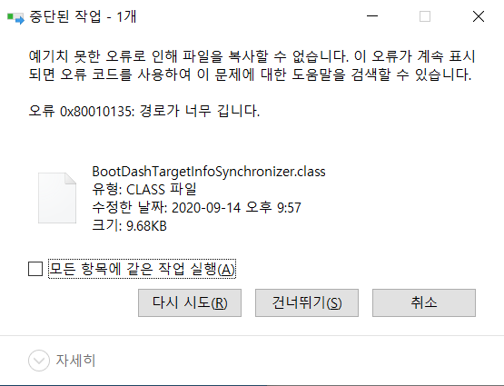

# Vue.js 프로젝트 실습

2020.12.07

---

[TOC]

---


## 설치하기

### Open JDK

> Java를 설치한다.

**파일 다운로드**

- [사이트](https://kr.azul.com/downloads/zulu-community/)에서 OS에 맞는 버전의 JDK 설치파일 다운로드

  > Java 8 (LTS) - Windosws - x86 64bit - JDK - `.msi`파일

**환경 세팅**

- `환경변수` > `시스템변수` 새로 만들기
  - 변수이름 : `JAVA_HOME`
  - 값 : `<JDK 설치경로>` (예시 : `C:\Program Files\Zulu\zulu-8`)
- `환경변수` > `Path` 선택 후 편집
  - 새로 만들기 : `%JAGA_HOME%\bin`
- :white_check_mark: 여기서 `\`는 실제로는 원화 마크가 표시된다.

**java 버전 확인**

- `cmd`에서 아래 명령어로 자바 버전 확인

```cmd
java -version
```

```cmd
javac -version
```


### STS

> 스프링 프레임워크 개발툴인 `Spring Tool Suite`을 설치한다.

**파일 다운로드**

- [사이트](https://github.com/spring-projects/toolsuite-distribution/wiki/Spring-Tool-Suite-3)에서 OS에 맞는 버전의 STS 설치파일 다운로드

  > ##### full distribution on Eclipse 4.15 > `.zip`파일


- 설치 후 압축 풀기

- 압축을 푸는 과정에서 아래와 같은 오류가 발생하면 `반디집`을 이용해서 압축을 풀어준다.

  

- :white_check_mark: 압축 풀기가 완료된 파일은 `한글` 경로가 포함되지 않은 곳에 위치시켜준다.


### MySQL

**파일 다운로드**

- [사이트](https://dev.mysql.com/downloads/mysql/)에서  OS에 맞는 버전의 MySQL 설치파일 다운로드

  > | **Windows (x86, 32-bit), MSI Installer** | 8.0.22 | 405.2M | [Download](https://dev.mysql.com/downloads/file/?id=499590) |
  > | ---------------------------------------- | ------ | ------ | ----------------------------------------------------------- |
  > | (mysql-installer-community-8.0.22.0.msi) |        |        |                                                             |

- 사이트 가입 절차가 다소 번거로운데, 사이트 가입을 차근차근 완료한 후 파일을 다운로드한다.
  - `Developer Default` 선택 후 `Next`
  - `Execute` 클릭해서 `Visual C++` 설치 후 `Next`
  - `Execute` 클릭해서 following products 설치 후 `Next`
  - `Next`
  - `Standalone MySQL Server` 선택 후 `Next`
  - 다음의 설정 확인 후 `Next`
    - Config Type : `Development Computer`
    - TCP/IP : 체크
      - Port : `3306`
      - `Open Windows Firewall ports for network access` : 체크
  - `Use Legacy Authentication Method` 선택 후 `Next` (기존 프로그램과의 호환성)
  - root 계정 비번 설정 후 Add User를 이용하여 계정 추가 후 `Next`
    - :heavy_check_mark:계정 추가는 나중에 해도 된다!
  - `Window Service name = MySQL80` 확인 후 `Next`
  - `Exectue` 클릭해서 configuration completed 확인 후 `Finish`
  - `Next`
  - `Finish`
  - `Next`
  - 계정 입력 후 연결 성공 여부 확인 후 `Next`
  - `Execute` 클릭해서 configuration completed 확인 후 `Finish`
  - `Next`
  - Installation Complete 확인 후 `Finish`


### Node JS

- [사이트](https://nodejs.org/ko/)에서 LTS 버전 다운로드

- 설치 확인을 해본다.

  ```bash
  node -v
  node --version
  ```

  ```bash
  npm -v
  ```


### @VUE/CLI

- [npmjs 사이트](https://www.npmjs.com/)에서 검색창에 `@vue/cli` 검색 후 설치 명령어 확인

```bash
npm install -g @vue/cli
```

- 설치 확인을 해본다.

```bash
vue -V
vue --version
```


## MySQL 가이드

### MySQL Workbench 사용하기

- `MySQL Connections > `root 계정으로 접속

**로그인**

- `Database > Connect to Database` (`Ctrl + U`)에서 설치 시 생성한 계정으로 로그인
  - Username : admin (혹은 ssafy)
  - Password > `Store in Valut ...` : <비밀번호 입력>

**Schema 생성**

- `스키마 생성` 아이콘을 클릭한다.
- `스키마 이름`을 입력하고, `utf8`, `utf8_bin`을 설정한후 `Apply`한다.
- 왼쪽 창에 해당 스키마가 생선된 것을 확인한다.

**Script 실행**

1. `Open a script SQL file` 아이콘 클릭 후, 제공된 `.sql` 파일 선택
2. `Execute the selected portion ...` 아이콘을 클릭하여 script file 실행
3. Schemas Navigator(왼쪽 창)에서 table 생성 확인

**Script 파일 정상 실행 확인**

1. SQL Editor 창에서 `. select * from employees;`이라는 Query 작성
2. `Execute the statement under ...` 아이콘 클릭하여 Query문 실행
3. Resultset Grid에 출력 결과 확인


### MySQL 계정 및 권한

**MySQL 계정 생성**

```
create user '<아이디>'@'<외부접속정보>' identified by '비밀번호';
```

- 예시

```
create user 'ssafy'@'211.183.1.152' identified by 'ssafy';
```

- `<외부접속정보>` : 모든 아이피 접속이 가능하게 하려면 `%`를 입력하면 된다.

**MySQL 권한 설정**

```
grant <권한목록> on <데이터베이스.객체> to '<아이디>'@'<외부접속정보>';
```

- `with grant option`

  > 권한을 부여 받은 사용자도 부여 받은 권한을 다른 사용자/role로 부여할 수 있게 된다.

- 예시

```
grant select, insert, delete, update on ssafydb.emp to 'ssafy'@'%';
```

- 모든 DB에 대해서 root와 동일 권한 부여하는 경우

```
grant all privileges on *.* to 'ssafy'@'%' with grant option;
```

- 설정한 권한이 바로 적용되도록 실행 (적용이 안되는 경우)

```
flush privileges;
```

**MySQL 권한 확인 및 해제**

- 권한 확인

```
show grants;
```

- 권한 해제

```
revoke <권한목록> on <데이터베이스.객체> from '<아이디>';
```

- 예시

```
revoke select, insert, delete, update on 'ssafyDB'.'emp' from 'ssafy';
```

- 모든 DB의 부여된 권한을 모두 회수하는 경우

```
revoke all on *.* from 'ssafy';
```

**MySQL 계정 삭제**

```
drop user '<아이디>'
```

- 예시

```
drop user 'ssafy'
```


**참고**

:ballot_box_with_check: 설치한 툴에서 `unable to load authentication plugin 'caching_sha2_password'` 라는 에러가 발생하는 경우

- MySQL 8.0.4부터 MySQL 서버의 기본 인증 플러그인이 `mysql_native_password`에서 `caching_sha2_password`로 변경되었기 때문이다.

- 해결방법

  ```
  ALTER USER 'ssafy'@'%' IDENTIFIED WITH mysql_native_password BY 'ssafy';
  ```


## 시작하기

### :ballot_box_with_check: STS 프로젝트 생성

- STS 프로그램 실행 후, `File > New > Spring Starter Project`을 클릭한다.
- 창이 뜨면 아래의 사진과 같이 값을 입력한다.
  - :white_check_mark: `Type = Maven`, `Java Version = 8`, Package 값 등에 주의한다!


- 이후 나타나는 창에서는 (교수님께서 알아서 세팅해주기 때문에 설정할 필요가 없다고 하긴 하셨는데) `Available` 창에서 `web`을 입력하고 프로젝트를 생성한다.

- 


### :ballot_box_with_check: STS 프로젝트 데이터 가져오기

- 프로젝트가 생성되면 `프로젝트 폴더(board_vue) 우클릭 > import`를 클릭한다.
- 다음 창에서 `General > File System`을 선택한 후 `Next` 버튼을 누른다.
- 가져올 데이터가 들어있는 폴더를 선택 후 `[폴더 선택]`을 클릭한다.
- 그 중, `src 폴더`와 `pom.xml` 파일만 선택한 후 `Finish` 버튼을 누른다.
  - 여기서 `pom.xml`은 설정 데이터를 담고 있는 파일이다.
- 이후 덮어쓰기 질문 창이 나오면, `[Yes to All]`을 클릭한다.

- 다음으로는 `프로젝트 폴더(board_vue) 우클릭 > Maven > Update Project`을 클릭한다.
- 나타나는 창에서 프로젝트 폴더를 선택 후 `Ok` 버튼을 누른다.


### :ballot_box_with_check: MySQL 데이터 불러오기

**데이터 가져오기**

- STS에서 `프로젝트 폴더 > src/main/resources > schema > board.sql `을 클릭하여 창을 연다.
  - `.sql` 파일을 열 때는 STS 내부 창이나, txt로 열 수 있다.
- 해당 파일의 내용을 전체 복사한다.

**데이터 불러오기**

- MySQL에서 로그인을 한 후, Query1(빈 파일)에 위에서 복사한 내용을 붙여준다.
- 그리고 `번개 모양 아이콘(Execute)`를 눌리면 데이터가 등록된다.

**MYSQL DB 확인하기**

- MySQL에서 불러온 데이터는 `Tables`의 table에 마우스를 올리면 3가지 아이콘이 뜨는데
- 그 중 `제일 오른쪽에 있는 아이콘(스케줄 모양 아이콘)`을 클릭하면 DB의 내용을 확인할 수 있다.


### :ballot_box_with_check: 서버 실행하기

- STS에서 `프로젝트 폴더 > src/main/java > com.ssafy.board > BoardVueApplication.java` 파일을 더블클릭하여 오픈한다.
- 해당 파일에서 `재생 모양 아이콘(Run as) > 3 Spring Boot App`을 클릭하여 서버를 실행한다.


### :ballot_box_with_check: 클라이언트 실행하기

> 클라이언트는 Vue를 사용한다. Vue 폴더를 새로 가져왔다면 먼저 npm을 설치해준다.
>
> ```bash
> npm install
> ```

- Vue 서버를 실행한다.

```bash
npm run serve
```

- 이후 사이트에서 `MySQL`에 등록되어 있는 DB의 유저 정보로 로그인이 되는지 확인한다.


### :ballot_box_with_check: swagger 사용하기

- STS에서 `프로젝트 폴더 > src/main/java > com.ssafy.board.java > WebConfiguration.java` 파일을 오픈한다.
- STS 서버를 실행한 후, 해당 url에 해당하는 swagger 사이트로 접속한다.
  - 여기서는 http://localhost:8000/board/swagger-ui.html


## :small_red_triangle: Vue 새로 학습한 내용

### :triangular_flag_on_post: Vuex 데이터 수정하기

> Vuex를 사용할 때, getters의 함수를 활용해서 vuex 데이터를 수정할 수 있다.

- 데이터

```javascript
// index.js
states: {
	count = 0
},
```

- getters 함수

```javascript
getters: {
	countMsg(state) {
	state.count += 1
	}
}
```

- 각각의 vue에서는 다음과 같이 호출하여서 vuex의 데이터 값을 증가시킬 수 있다.

```javascript
this.$store.getters.countMsg;
```


### :triangular_flag_on_post: $router, $route

- 라우터 설정

```javascript
const router = new VueRouter({
    routes: [
        ...,
        {
        	path: '/board/:no',
        	component: BoardView,
        },
        ...
    ],
})
```

- 라우터 링크

```vue
<router-link to="/board/30">30번 게시글</router-link>
```

- 전체 라우터 정보

```javascript
this.$router
```

- 현재 호출된 해당 라우터 정보

```javascript
this.$route
```

```javascript
this.$router.params.no
```

```javascript
this.$route.path
```


## <실습> 게시판 만들기


### :ballot_box_with_check: 유저정보 가져오기

> 유저정보는 아래와 같은 로직으로 가져올 수 있다. **오늘 제공된 파일에는 기본적으로 설정이 되어 있었다.**

```javascript
// @/store/index.js
import jwt_decode from "jwt-decode";
import { findById } from "@/api/user.js";

let decode = jwt_decode(token);
decode.userid
```

```javascript
// @/api/user.js
import { createInstance } from "./index.js";

const instance = createInstance();
// const config = {
//   headers: { "access-token": localStorage.getItem("access-token") }
// };

function login(user, success, fail) {
  instance.defaults.headers["access-token"] = window.localStorage.getItem(
    "access-token"
  );
  const body = {
    userid: user.userid,
    userpwd: user.userpwd
  };

  instance
    .post("user/confirm/login", JSON.stringify(body))
    .then(success)
    .catch(fail);
}

async function findById(userid, success, fail) {
  instance.defaults.headers["access-token"] = window.localStorage.getItem(
    "access-token"
  );
  await instance
    .get(`/user/info/${userid}`)
    .then(success)
    .catch(fail);
}

export { login, findById };
```

```javascript
// @/api/index.js

import axios from "axios";
import { API_BASE_URL } from "../config";

function createInstance() {
  const instance = axios.create({
    baseURL: API_BASE_URL,
    headers: {
      "Content-Type": "application/json"
    }
  });
  return instance;
}

export { createInstance };
```

```javascript
// @/config/index.js

const API_BASE_URL = "http://localhost:8000/board";

export { API_BASE_URL };
```


### :ballot_box_with_check: 생성(create) 시점 이전에 유저 정보 가져오기

- 다음과 같이 `main.js`에 `async beforeCreate()`를 사용하여 Vue 생성 시점 이전에 유저 정보를 가져올 수 있다.

```javascript
// @/main.js

new Vue({
  router,
  store,
  async beforeCreate() {
    let token = localStorage.getItem("access-token");
    if (store.state.userInfo == null && token) {
      await store.dispatch("GET_MEMBER_INFO", token);
    }
  },
  render: (h) => h(App)
}).$mount("#app");
```


### :ballot_box_with_check: `.js`로 함수 관리하기

- `@/src` 안에 `board.js`와 `memo.js`를 생성한다.
  - `board.js` : 게시글에 대한 함수를 생성한다.
  - `memo.js` : 이후 댓글에 대한 함수를 생성한다.
- `createInstance` 함수를 가져와서 `board.js`와 `memo.js`에 붙여준다.

```javascript
import { createInstance } from "./index.js";

const instance = createInstance();
// const config = {
//   headers: { "access-token": localStorage.getItem("access-token") }
// };
```

- 이후 원하는 함수를 `board.js`에서 정의하면 된다!


### :ballot_box_with_check: Article List를 가져오는 함수 정의

- `board.js`에서 게시글 리스트를 가져오는 함수를 다음과 같이 정의한다.

```javascript
// board.js

function listArticle(para, success, fail) {
  instance
    .get("article", { params : para })
    .then(success)
    .catch(fail);
}

export { listArticle };
```

- Vue 파일에서 위에서 정의한 함수를 호출한다.

```javascript
// List.vue

import { listArticle } from "@/api/board.js"

// created 넣기
created() {
    let para = {
      pg: 1,  // page
      spp: 20, 
      key: '',
      word: ''
    };
    listArticle(
      para,
      (response) => {
        console.log(response)
        this.items = response.data;
      },
      (error) => {
        console.log(error)
      }
    );
  },
```


### :ballot_box_with_check: Article 생성 함수 정의

- Vue에서 vuex의 데이터에 접근하여 사용자 정보를 불러온다.

```javascript
// Register.vue
import { mapState } from "vuex"

  data() {
    return {
      form: {
        userid: "",
        subject: "",
        content: ""
      }
    };
  },
  computed: {
    ...mapState(["userInfo"])
  },
```

- 사용자 정보를 넘겨주는 이벤트를 작성한다.

```javascript
// Register.vue
  methods: {
    onSubmit(event) {
      event.preventDefault();
      this.form.userid = this.userInfo.userid;
      alert(JSON.stringify(this.form));
    },
    onReset(event) {
      event.preventDefault();
      this.form.subject = "";
      this.form.content = "";
      this.$router.push({ name: "board-list" });
    }
  }

```

- 게시물을 생성하는 함수를 `board.js`에서 만들어준다.

```javascript
// board.js

function registerArticle(article, success, fail) {
  instance
    .post("article", JSON.stringify(article))
    .then(success)
    .catch(fail);
}

export { listArticle, registerArticle };
```

- 위 함수를 Vue에서 가져와서 로직을 작성한다.

```javascript
// Register.vue

import { registerArticle } from "@/api/board.js"

onSubmit(event) {
    event.preventDefault();
    this.form.userid = this.userInfo.userid;
    // alert(JSON.stringify(this.form));
    registerArticle(
        this.form,
        (response) => {
            console.log(response)
            this.$router.push({name: "board-list"})
        },
        (error) => {
            console.log(error)
        }
    )
},
```


### :ballot_box_with_check: Article Detail 페이지 만들기

- Article Detail 페이지의 데이터를 초기화해준다.

```javascript
// Detail.vue

  data() {
    // const articleno = Number(this.$route.params.articleno);
    // console.log(articleno + "번글입니다.");
    return {
      article: {
        articleno: 0,
        subject: "",
        content: "",
        userid: "",
        hit: "",
        regtime: ""
      },
      memos: [1, 2, 3, 4, 5]
    };
  },
```

- `board.js`에서 함수를 정의해준다.

```javascript
// board.js

function getArticle(articleno, success, fail) {
  instance
    .get(`article/${articleno}`)
    .then(success)
    .catch(fail);
}


export { listArticle, registerArticle, getArticle };
```

- 위의 함수를 Vue에서 가져와서 로직을 완성한다.

```javascript
// Detail.vue

import { getArticle } from "@/api/board.js"

created() {
    getArticle(
      this.$route.params.articleno,
      (response) => {
        console.log(response)
        this.article = response.data;
      },
      (error) => {
        console.log(error)
      }
    );
  },
```


### :ballot_box_with_check: Article 삭제 함수 생성

- `board.js`에서 함수를 정의한다.

```javascript
function deleteArticle(articleno, success, fail) {
  instance
    .delete(`article/${articleno}`)
    .then(success)
    .catch(fail);
}

export { listArticle, registerArticle, getArticle, modifyArticle, deleteArticle };
```

- Detail.vue에서 methods에 함수를 만들어준다.

```javascript
// Detail.vue
import { getArticle, deleteArticle } from "@/api/board.js"

deleteArticle() {
    console.log(this.article.articleno + "글삭제!!");
    if(confirm("정말로 삭제???")) {
        deleteArticle(
            this.$route.params.articleno,
            (response) => {
                console.log(response)
                this.$router.push({ name: "board-list" })
            },
            (error) => {
                console.log(error)
            }
        );
    }
}
```


### :ballot_box_with_check: Article 수정 함수 정의

- `board.js`에서 함수를 정의해준다.

```javascript
// board.js

function modifyArticle(article, success, fail) {
  instance
    .put("article", JSON.stringify(article))
    .then(success)
    .catch(fail);
}

export { listArticle, registerArticle, getArticle, modifyArticle, deleteArticle };
```

- Detail.vue에서는 Update 버튼을 누르면 다음의 함수로 연결되어 있다.

```javascript
// Detail.vue

moveModifyArticle() {
      this.$router.replace({
        name: "board-modify",
        params: { articleno: this.article.articleno }
      });
      //   this.$router.push({ path: `/board/modify/${this.articleno}` });
    },
```

- `Modify.vue`가 생성되는 시점에 `getArticle`로 데이터를 가져와서 `form 데이터`에 기존 데이터를 채워준다.

```javascript
// Modify.vue

import { getArticle, modifyArticle } from "@/api/board.js"

  created() {
    getArticle(
      this.$route.params.articleno,
      (response) => {
        console.log(response)
        this.form = response.data;
      },
      (error) => {
        console.log(error)
      }
    );
  },

```

- 마지막으로 이벤트를 등록해준다.

```javascript
// Modify.vue

onSubmit(event) {
    event.preventDefault();
    // alert(JSON.stringify(this.form));
    modifyArticle(
        this.form,
        (response) => {
            console.log(response)
            this.form = response.data
            this.$router.push({ name: "board-list" })
        },
        (error) => {
            console.log(error)
        }
    )
},
```


## <실습> 댓글 CRUD 구현하기

- 먼저 `@/api/memo.js`에서 인스턴스 생성 함수를 불러왔는지 확인한다.

```javascript
// memo.js
import { createInstance } from "./index.js";

const instance = createInstance()
```


### :ballot_box_with_check: 댓글 리스트(Read)

- Detail.vue에서 memo 데이터를 정의한다.

```javascript
// Detail.vue

memos: {
    memono: 0,
    articleno: 0,
    userid: "",
    content: ""
}
```

- `memo.js`에서 함수를 정의한다.

```javascript

```


### :ballot_box_with_check: 댓글 Create

- MemoWrite.vue에서 데이터를 정의한다.

```javascript
form: {
    userid: "",
    content: "",
    articleno: 0,
}
```

- v-model로 데이터를 input 값과 연결해준다.

```vue
<!-- MemoWrite.vue -->
      <b-form-textarea
        id="content"
        v-model="form.content"
        placeholder="댓글 입력..."
        rows="2"
      ></b-form-textarea>
```

- 사용자 정보를 가져온다.

```javascript
// MemoWrite.vue
import { mapState } from "vuex"

computed: {
    ...mapState(["userInfo"])
  },
```

- `memo.js`에서 함수를 정의한다.

```javascript
function registerMemo(memo, success, fail) {
  instance
    .post("memo", JSON.stringify(memo))
    .then(success)
    .catch(fail);
}
```

- button을 클릭했을 때 실행할 이벤트를 등록한다.

```javascript
import { registerMemo } from "@/api/memo.js"

```


### :ballot_box_with_check: 댓글 Update

### :ballot_box_with_check: 댓글 Delete

### 

***Copyright* © 2020 Song_Artish**