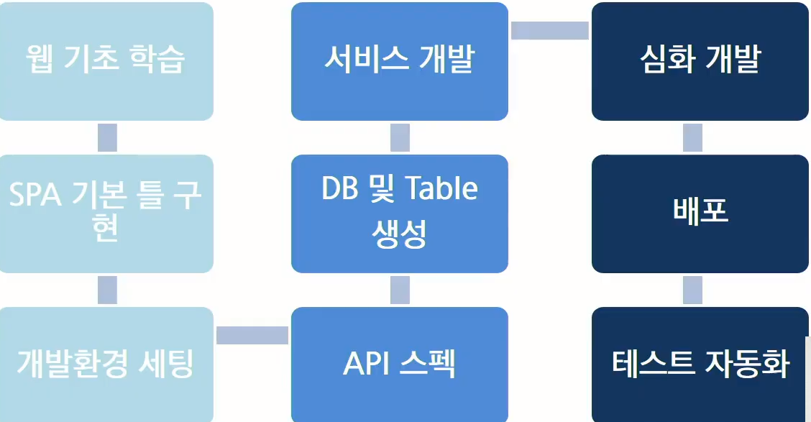

# 소프트웨어 개발 방법론

2020.12.21

---

[TOC]

---

## 1. 요구사항 정의

> - 프로젝트 주제 정의
> - 시스템에서 필요한 요구사항 정의
> - 주제에 맞는 세부 요구사항까지 명확하게 기재

- 예시: Edu.ssafy.com 홈페이지 제작
  - 회원가입 후 승인 프로세스

**기능정의서**

## 2. 설계

> 개발에 들어가기 전 필요한 문서를 작성하는 프로세스

- 예시
  - Wire Frame 화면 설계
  - Story Board 작성
  - ERD Diagram 설계

## 3. 개발

> 실질적으로 프로젝트를 개발한다.

## 4. 테스트

> Test-Case를 작성하여, 시스템에서 해당 테스트 케이스들이 작동하는지를 확인한다.

- 예시: `회원가입 시, ID는 영어 + 숫자 혼합 8글자 이내여야 한다.`
  - ID를 9글자 이상 입력하여 테스트해본다.
  - ID를 8글자 이하로 영어로만 입력해 본다.
  - 등등

## 5. 유지보수

> 외부에서 접속할 수 있도록 서버(AWS 등)에 시스템을 구동시켜 본다.

- AWS 서버에서 EC2 서버를 발급받아서 개발한 프로젝트를 해당 서버에 이관하여 구동시킨다.

**개발 흐름**

***Copyright* © 2020 Song_Artish**