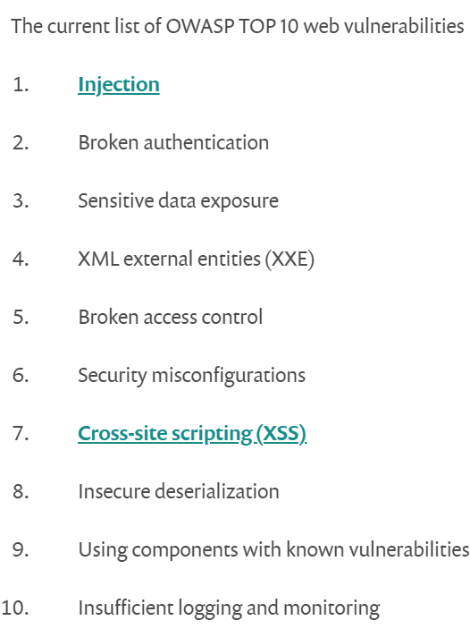
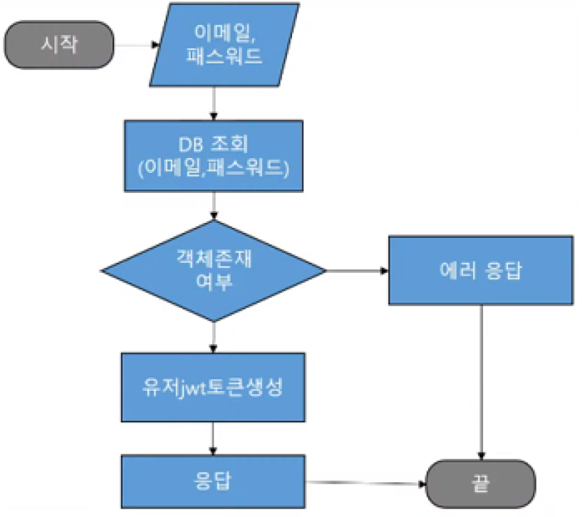
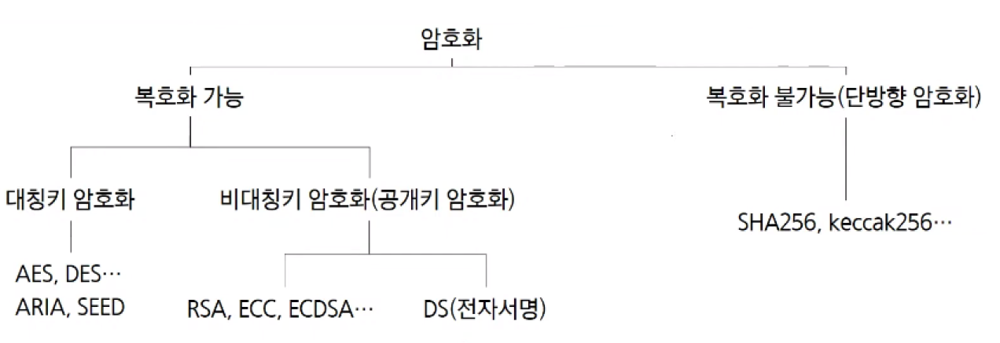
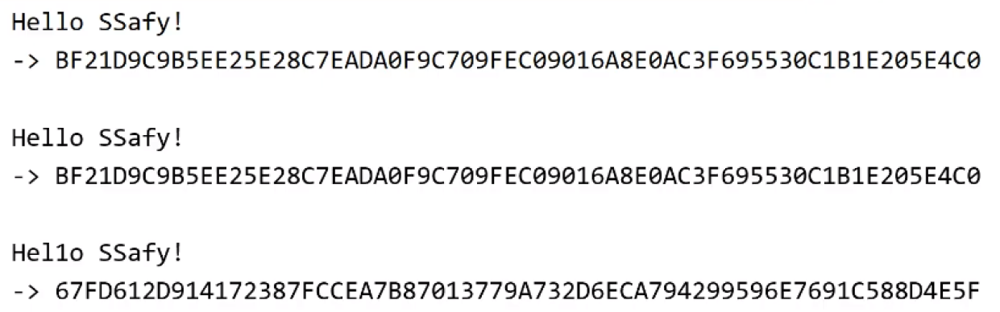

# Secure Coding

> 소프트웨어(SW)를 개발함에 있어 개발자의 실수, 논리적 오류 등으로 인해 SW에 내포될 수 있는 보안취약점(vulnerability)을 배제하기 위한 코딩 기법

2021.02.19

---

[TOC]

---


## 1. OWASP Top 10

소프트웨어 상용화를 위해서는 **개인정보 암호화**와 **시큐어 코딩 인가**를 받아야 한다.

- 우리나라에서는 `KISA(한국인터넷진흥원)`에서 인가를 받아야한다.
- 외국에서는 `OWASP(Open Web Application Security Project)`라는 비영리 단체가 있는데, 여기서 가장 빈번하고 critical한 [취약점 유형 TOP 10](https://snyk.io/learn/owasp-top-10-vulnerabilities/)을 정하고 있다.



- 몇 년째 부동의 1위를 지키고 있는 유형은 **SQL Injection**이다.


## 2. SQL Injection 방지하기



`(출처: 박종철 컨설턴트님 강의 자료)`

- **아이디 글자수를 제한**하는 것은 외부 공격을 막는 방법 중 하나이다.
  - 보통 조작을 위해서 입력된 문자열의 길이는 길기 때문이다.
  - 이러한 방법은 FE는 물론 BE에서도 검증이 이루어져야한다.
- 선택된 문자만을 입력할 수 있게 해주는 **화이트리스트**를 활용한다.
- 입력 받는 비밀번호는 **해시함수로 암호화**한다.
- **개인정보 암호화**는 정부 행정 지침이기 때문에 꼭 이루어져야하며,  OWASP TOP 10에서 3위에 해당하는 Sensitive Data Exposure와도 관련 있는 내용이다.


## 3. 암호화



`(출처: 신채원 코치님 필기)`

- 암호화 방식에는 크게 **복호화 기능 암호와**와 **복호화 불가능 암호화(단방향 암호화)**가 있다.
- 복호화 불가능한 암호화에는 대표적으로 **해시 함수**가 있다.
  - 실무에서 `SHA256`, `keccak256` 등이 가장 많이 사용된다.

#### 3.1 SHA256 암호화 예시



`(출처: 신채원 코치님 필기)`

- 동일한 글자여도 `SHA256`으로 해시 암호화된 모습은 굉장히 다르다.
- 복호화가 불가능하기 때문에 **검증을 할 때 사용**한다.

### 3-2 보안을 높이기 위해 바뀐 코드 예시

```java
@GetMapping("/newlogin/{userid}/{password}")
@ApiOperation(value = "로그인")
public Object newlogin(@PathVariable String userId, @PathVariable String password) thorws SQLException, IOException {
    
    String newUserId - userId.subString(0, 12);
    if (!java.util.regex.Pattern.compile("[a-zA-Z0-9]+").matcher(newUserId).matches()) return null;
    Optional<User> userOpt - userDto.findByName(newUserId);
    
    if (userOpt.isPresent()) {
        if (!userOpt.get().getPassword().equals(SHA256(password))) return null;
        User tokenuser = new User();
        tokenuser.setEmail(userOpt.get().getEmail());
        tokenuser.setPassword(userOpt.get().getPassword());
        String token = jwtService.createLoginToken(tokenuser);
        return new ResponseEntity<>(token, HttpStatus.ACCEPTED);
    } else {
        return new ResponseEntity<>(null, HttpStatus.BAD_REQUEST);
    }
}

private String SHA256(String password) {
    // encrypt
    return "";
}
```


## <참고> 좋은 코딩 습관

1. String 비교 시 `string.equals("")` 대신에 `"".equals(string)`을 사용한다.

   - 아래의 예시에서 윗줄보다는 아랫줄과 같이 쓰는 것이 Null exception 에러를 방지할 수 있다.

   ```java
   request.getCheckType().equals("business");
       
   "business".equals(request.getCheckType());
   ```

2. `@RequestBody` 바인딩 되는 부분을 JPA Entity 객체로 받으면 안된다. 대신에 Map을 사용해서 아래와 같이 받는다.

   ```java
   @PostMapping("/kakaologin")
   @ApiOperation(value = "카카오 로그인")
   public Object viewInfo(@RequestBody Map<String, Object> request) throws SQLException, IOException {
       String email = request.get("email").toString();
   }
   ```


***Copyright* © 2021 Song_Artish**