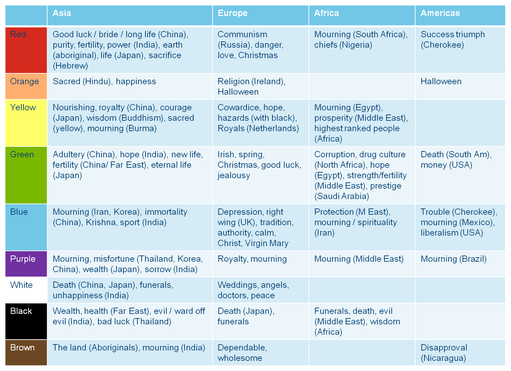

# UI 기초

2021.01.08

> User Interface

---

[TOC]

---

## Inspirations

- 아래의 사이트에서 디자인 영감을 얻을 수 있다.

  :ballot_box_with_check: Behance

  :ballot_box_with_check: Dribbble

  :ballot_box_with_check: Pinterest

- 아래와 같은 검색 키워드로 영감을 얻을 수 있다.

  :ballot_box_with_check: `netflix ui redesing`

  :ballot_box_with_check: `Sharing App UI`

  :ballot_box_with_check: `Co work app UI`

## Color

- 색상마다 주는 인상이 다르므로, 이러한 요소를 고려하여서 색상을 활용한다.

`(출처: https://seopressor.com/wp-content/uploads/2015/06/colour-culture1.png)`

## Tools

디자이너가 가장 많이 사용하는 툴

- Photoshop
- Sketch

***Copyright* © 2021 Song_Artish**