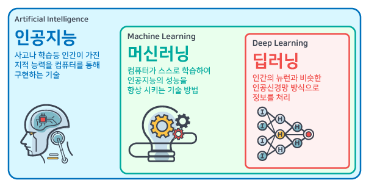
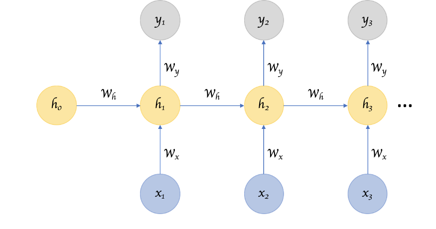
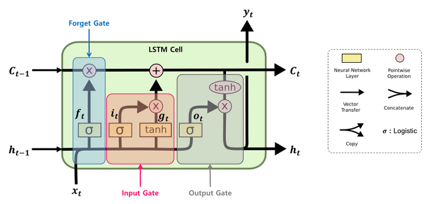

# DL Concept

> Deep Learning

---

[TOC]

---

`(출처: http://tobetong.com/?p=9393)`

## 과정

### 1. Dataset

데이터셋 준비

### 2. Pre-Processing

준비한 데이터 쌍을 모델이 처리가능한 형태로 변환

### 3. Training

데이터가 준비되면 모델 학습 진행

### 4. Validating, Saving Models

학습이 잘 진행되고 있는지 중간평가 및 로그기록으로 지속적으로 확인

### 5. Testing

학습이 완료된 후, 가장 좋은 성능을 보인 모델을 선정

## RNN

Recurrent Neural Networks

> 입력과 출력을 sequence 단위로 처리하는 모델

RNN 구조

`(출처: https://towardsdatascience.com/recurrent-neural-networks-d4642c9bc7ce)`

| 변수 |      의미       |
| :--: | :-------------: |
|  x   |  **입력 벡터**  |
|  y   |  **출력 벡터**  |
|  h   | **(메모리) 셀** |

- RNN은 결과값을 출력층 방향뿐 아니라, 은닉층 노드의 다음 계산의 입력으로도 보내는 특징을 가지고 있다.
- 셀은 일정 기간 기억을 컨트롤하여 과거 상태와의 의존성을 제어
- 이렇게 RNN 셀을 이용하여 이전 시점들에 대한 기억을 하고, 이를 현재 시점의 출력에 반영

## LSTM

Long Short Term Memory

> RNN은 이론상 이전의 모든 time step들의 상태가 현재의 타임 스텝(t)에 영향을 줘야한다. 하지만 입력 데이터가 길어지면 학습 능력이 저하되는 현상이 나타난다. (데이터 뒤쪽으로 갈수록 앞쪽의 입력 데이터에 대한 기억을 잊어버리게됨) 이를 해결하기 위해 몇가지 게이트(gate)를 추가한 LSTM이 등장하게 되었다.

LSTM 구조

`(출처: https://colah.github.io/posts/2015-08-Understanding-LSTMs/)`

- LSTM 내부를 살펴보면 총 4개의 모듈이 있고, 이는 총 3개의 게이트로 표현된다.
- 각 게이트는 sigmoid 함수를 사용하기 때문에 출력 범위 `0 ~ 1`을 갖고, 0이면 정보를 잃고, 1이면 정보를 온전히 기억하게 된다.
  - `forget gate(f)`: 과거 정보를 잊기 위한 게이트
  - `input gate(i)`: 현재 정보를 기억하기 위한 게이트
  - `output gate(o)`: 최종 결과 h를 위한 게이트

## GRU

Gated Recurrent Unit

> LSTM은 RNN에 비해 비교적 복잡한 구조를 담고 있기 때문에, LSTM에 비해 게이트 숫자를 줄여 간소화환 GRU가 등장한다.

GRU 구조

`(출처: https://excelsior-cjh.tistory.com/185)`

- `update gate`와 `reset gate` 두가지만 존재
- :white_check_mark: LSTM보다 더 낫다고 단정지을 수 없기 때문에, LSTM과 GRU를 비교해 사용하는 것이 좋다.

## Seq2Seq

Sequence-to-Sequence

> 입력된 sequence로부터 다른 도메인의 sequence를 출력하는 다양한 분야에서 사용되는 모델 구조

`(출처: https://wikidocs.net/24996)`

|        구조        |                         설명                         |
| :----------------: | :--------------------------------------------------: |
|    **Encoder**     |          입력 문장으로부터 정보를 압축 표현          |
|    **Decoder**     | 압축된 정보를 바탕으로 번역된 단어를 순차적으로 출력 |
| **Context Vector** |                  중간에 압축된 정보                  |

- seq2seq 모델 내부 구조는 RNN을 사용하지만, 보통은 성능 향상을 위해 LSTM 혹은 GRU를 사용한다.

## Attention Mechanism

> seq2seq 모델은 입력 가변 길이 정보 전체(많은 양)를 하나의 고정된 크기의 context vector로 압력하기 때문에, 정보 손실이 발생하여 정확도가 떨어잔다, 따라서 입력이 길더라도 출력 정화도를 보정해주기 위해 **attention 메커니즘**이 등장하였다.

기본 아이디어

- 디코더에서 출력 단어를 예측하는 매 시점마다 인코데어싀 전체 입력 sequence를 다시 한 번 참고
- 이 때, 전부 다 동일한 비율로 참고하는 것이 아닌 해당 시점에서 예측해야 할 단어와 연관이 있는 입력 단어 부분을 더 집중(attention)해서 보게됨

## TTS

> Text-to-Speech(TTS)는 문자열을 입력으로 받아 음성을 합성하는 기술이다.

- 최근 주목받는 연구는 딥러닝 기반 **end-to-end** 음성 합성 방식
  - 발음기호 변환, 운율 예측, 음향 모델링 등 음성학 관련 단계 제거
  - 문자열 입력과 과형 출력간의 관계를 직접적으로 모델을 통해 학습

### Tacotron2

> TTS Model

`(출처: https://arxiv.org/abs/1712.05884)`

>위 그림 기준으로 아래에서부터 인코더, 디코더, 보코더로 구성

**1. 인코더**

문자열을 character embedding으로 변환한 벡터를 입력으로 받아 convolution layer와 bidirectional LSTM layer을 거쳐 feature를 인코딩

- character embedding은 문자를 그대로 사용하는 것이 아닌, 각 문자에 해당하는 벡터를 정의하고 매핑해 사용
- Bidirectional LSTM은 이전 time step의 상태뿐만 아니라 다음 time step의 상태를 참고하여 현재 값을 더 정확히 추론할 수 있음

**2. 디코더**

인코더에서 얻은 encoded feature를 바탕으로 context vector를 만들고, 여기에 attention mechanism을 적용하여 최종적으로 디코더에서 mel-spectrogram을 생성

- :white_check_mark: Attention 메커니즘을 이용하면 매 시점마다 mel-spectrogram을 생성할 때 encoded feature의 어떤 부분에 집중해야 하는지를 참고할 수 있다.

**3. 보코더**

디코더를 통해 생성한 mel-spectrogram을 보코더에 입력하여 음성 waveform을 합성할 수 있다.

- 
  - **인코더**: 

***Copyright* © 2021 Song_Artish**