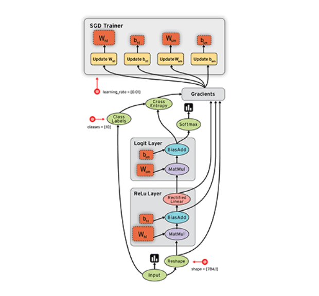

# TensorFlow B

> open source software library for <u>numerical computation</u> using <u>data flow graphs</u>
>
> - with Python
> - by Google

2021.08.20

---

[TOC]

---


## Data Flow Graph



- **Node**s in the graph represent mathematical <u>operations</u>
  - circle one, mathematical opertaions
- **Edge**s represent the multidimensional <u>data</u> arrays(tensors) communicated between them
  - lines connecting nodes, data, tensors


## Installing

- install guide [page](https://www.tensorflow.org/install)

```bash
# Requires the latest pip
pip install --upgrade pip

# Current stable release for CPU and GPU
pip install tensorflow
```

- import tensorflow library as follows:

```python
import tensorflow as tf
```


## TensorFlow Hello World!

```python
import tensorflow as tf

# Create a constant op
# This op is added as a NODE to the default graph
hello = tf.constant("Hello, TensorFlow!")

# run the op and get result
print(hello)
```

- TF 2.0 supports eager execution which means we don't have to explicitly create a session and run the code in it.

```
tf.Tensor(b'Hello, TensorFlow!', shape=(), dtype=string)
```

- **b'String**: `b` indicates Bytes literals


## Computational Graph

```python
# Filtering Log: info = 1, warning = 2, error = 3
import os
os.environ['TF_CPP_MIN_LOG_LEVEL'] = '2'

import tensorflow as tf

node1 = tf.constant(3.0, tf.float32)
node2 = tf.constant(4.0)    # also tf.float32 implicitly

@tf.function
def add():
    return node1 + node2

print("node1:", node1, "node2:", node2)
print("node3:", add())
```

- result as follows:

  ```
  node1: tf.Tensor(3.0, shape=(), dtype=float32) node2: tf.Tensor(4.0, shape=(), dtype=float32)
  node3: tf.Tensor(7.0, shape=(), dtype=float32)
  ```


## Tensor

**Ranks**

| Rank | Math Entity |       Description       |        Python Example        |
| :--: | :---------: | :---------------------: | :--------------------------: |
|  0   |   Scalar    |     magnitude only      |           s = 483            |
|  1   |   Vector    | magnitude and direction |     v = [1.1, 2.2, 3.3]      |
|  2   |   Matrix    |    table of numbers     |  m = [[1, 2, 3], [4, 5, 6]]  |
|  3   |  3-Tensor   |     cube of numbers     | t = [[[2], [4]], [[6], [8]]] |
|  n   |  n-Tensor   |    you get the idea     |             ...              |

**Shapes**

- how many items in each element

| Rank |        Shape        | Dimension Number |                 Example                 |
| :--: | :-----------------: | :--------------: | :-------------------------------------: |
|  0   |         []          |       0-D        |         A 0-D tensor. A scalar          |
|  1   |        [D0]         |       1-D        |       A 1-D tensor with shape [5]       |
|  2   |      [D0, D1]       |       2-D        |     A 2-D tensor with shape [3, 4]      |
|  3   |    [D0, D1, D2]     |       3-D        |    A 3-D tensor with shape [1, 4, 3]    |
|  n   | [D0, D1, ..., Dn-1] |       n-D        | A tensor with shape [D0, D1, ... ,Dn-1] |

- if t = [[1, 2, 3], [4, 5, 6], [7, 8, 9]], shape is [3, 3]
  - it's like matrix notation

**Types**

| Data Type |  Python Type   |      Description       |
| :-------: | :------------: | :--------------------: |
| DT_FLOAT  | **tf.float32** | 32 bits floating point |
| DT_DOUBLE |   tf.float64   | 64 bits floating point |
|  DT_INT8  |    tf.int8     | 8 bits signed integer  |
| DT_INT16  |    tf.int16    | 16 bits signed integer |
| DT_INT32  |  **tf.int32**  | 32 bits signed integer |
| DT_INT64  |    tf.int64    | 64 bits signed integer |
|    ...    |                |                        |

