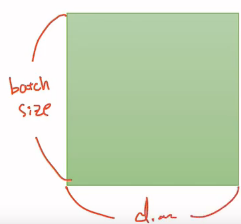
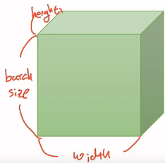
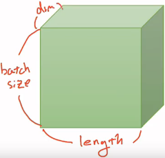
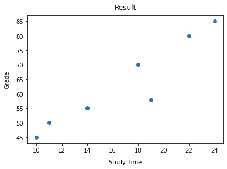

# PyTorch 기초

> [wikidocs](https://wikidocs.net/57168)를 많이 참고하였다.

---

[TOC]

---


## 소개

> [PyTorch](https://tutorials.pytorch.kr/beginner/blitz/tensor_tutorial.html)는 Python을 위한 오픈소스 머신 러닝 프레임워크이다. 

- 페이스북이 주도적으로 개발/유지하고 있는 머신러닝 및 딥러닝 개발 프레임워크
- Simplicity, Great API, Performance


## 1. 패키지 구성

### 1.1 torch

---

 메인 네임스페이스. 텐서 등의 다양한 수학 함수가 포함되어져 있으며, `Numpy`와 유사한 구조를 가진다.

### 1.2 torch.autograd

---

 자동 미분을 위한 함수들이 포함되어 있다. 자동 미분의 on/off를 제어하는context manager(enable_grad/no_grad)나 자체 미분 가능 함수를 정의할 때 사용하는 기반 클래스인 `Function` 등이 포함되어져 있다.

### 1.3 torch.nn

---

 신경망을 구축하기 위한 다양한 데이터 구조나 레이어 등이 정의되어 있다.

### 1.4 torch.optim

---

 확률적 경사 하강법(Stochastic Gradient Descent, SGD)를 중심으로 한 파라미터 최적화 알고리즘이 구현되어 있다.

### 1.5 torch.utils.data

---

 SGD의 반복 연산을 실행할 때 사용하는 미니 배치용 유틸리티 함수가 포함되어 있다.

### 1.6 torch.onnx

---

 ONNX(Open Neural Network Exchange)의 포맷으로 모델을 export할 때 사용한다. ONNX는 서로 다른 딥 러닝 프레임워크 간에 모델을 공유할 때 사용하는 포맷이다.


## 2. Tensor 조작

> **다중선형사상(multilinear map)**. 선형 관계를 나타내는 다중선형대수학의 대상 

### 2.1 Vector, Matrix and Tensor

> 딥러닝을 위한 가장 기본적인 수학적 지식인 벡터, 행렬, 텐서에 대해서 알아본다.

|    단위    |        차원         |        (a.k.a.)        |
| :--------: | :-----------------: | :--------------------: |
| **Scalar** |   차원이 없는 값    |           .            |
| **Vector** | 1차원으로 구성된 값 | 1차원 벡터, 1차원 텐서 |
| **Matrix** | 2차원으로 구성된 값 | 2차원 행렬, 2차원 텐서 |
| **Tensor** | 3차원으로 구성된 값 |       3차원 텐서       |

> tensor 크기는 다음과 같이 표현한다.

**2D Tensor**

- typical simple setting
- `|t| = (Batch size, dim)`
  - 행(덩어리)의 크기가 batch size, 열의 크기가 dim



**3D Tensor(Vision)**

- typical computer vision
- Vision 분야(이미지, 영상 처리)에서의 3차원 텐서
- `|t| = (batch size, width, height)`
  - 세로는 batch size, 가로는 너비(width), 안쪽으로는 높이(height)



**3D Tensor(NLP)**

- typical natural language processing
- NLP(자연어 처리) 분야에서의 3차원 텐서
- `|t| = (batch size, length, dim)`
  - (batch size, 문장 길이, 단어 벡터의 차원)




### 2.2 Numpy Review

> PyTorch는 `Numpy`와 유사하다. 따라서 Numpy로 tensor를 만들어본다.

- 먼저 `numpy`를 가져와준다.

```python
import numpy as np
```

- `numpy`에서는 **[숫자, 숫자, 숫자]**의 형식으로 만들고 **np.array()**로 감싸주면 tensor를 만들 수 있다.

**1D with Numpy**

`np.array()`

- 아래와 같이 `np.array()`로 1차원 벡터를 만들 수 있다.

```python
t = np.array([0., 1., 2., 3., 4., 5., 6.])
print(t)
```

`.ndim`, `.shape`

- 아래의 `.ndim`과 `.shape`로 1차원 벡터의 **차원**과 **크기**를 출력할 수 있다.

```python
print(t.ndim)	# 결과값 1
print(t.shape)	# 결과값 (7,)
```

- Python에서 리스트에 접근하는 방법과 동일한 방법으로 numpy의 벡터에 접글할 수 있다.

```python
print('t[0] t[1] t[-1] = ', t[0], t[1], t[-1]) # 인덱스를 통한 원소 접근
```

- **슬라이싱(Slicing)**으로 범위를 지정할 수도 있다.

```python
print('t[:2] t[3:]  = ', t[:2], t[3:])
```

**2D with Numpy**

`np.array()`

- 아래와 같이 numpy로 2차원 행렬을 만들 수도 있다.

```python
t = np.array([[1., 2., 3.], [4., 5., 6.], [7., 8., 9.], [10., 11., 12.]])
```


### 2.3 PyTorch Tensor Allocation

> Numpy로 실습을 해보았다. 이제 PyTorch 텐서 선언 방법에 대해서 알아본다.

- 우선 `torch`를 import한다.

```python
import torch
```

**1D with PyTorch**

`torch.FloatTensor()`

- PyTorch로 1차원 벡터를 선언한다.

```python
t = torch.FloatTensor([0., 1., 2., 3., 4., 5., 6.])
```

`.dim()`, `.shape`, `.size()`

- `.dim()`을 사용하여 현재 텐서의 차원을 보여준다.
- `.shape`나 `.size()`를 사용하면 크기를 확인할 수 있다.

```python
print(t.dim())  # rank. 즉, 차원
print(t.shape)  # shape
print(t.size()) # shape
```

- Python 리스트에서와 같이 인덱스로 접근하거나 슬라이싱을 사용할 수도 있다.

```python
print(t[0], t[1], t[-1])  # 인덱스로 접근
print(t[2:5], t[4:-1])    # 슬라이싱
print(t[:2], t[3:])       # 슬라이싱
```

**2D with PyTorch**

`torch.FloatTensor()`

- PyTorch로 2차원 행렬을 선언한다.

```python
t = torch.FloatTensor([[1., 2., 3.], [4., 5., 6.], [7., 8., 9.], [10., 11., 12.]])
```

- 나머지 method도 1차원 텐서와 동일하게 사용할 수 있다.


### 2.4 Matrix Multiplication

> 행렬 연산에 대해서 이해한다.

:ballot_box_with_check: **Broadcasting**

> 행렬을 덧셈/뺄셈 할 때에는 두 행렬의 크기가 같아야하며, 곱셈을 할 때에는 A의 마지막 차원과 B의 첫번재 차원이 일치해야 한다. 하지만, 딥 러닝을 하게되면 불가피하게 크기가 다른 행렬/텐서에 대한 사칙 연산을 수행할 필요가 있는 경우가 생긴다. 이를 위해 PyTorch는 **자동으로 크기를 맞춰서 연산을 수행하게 만드는** 브로드캐스팅이라는 기능을 제공한다.

- :one: vector + vector

  ```python
  m1 = torch.FloatTensor([[3, 3]])
  m2 = torch.FloatTensor([[2, 2]])
  print(m1 + m2)
  
  tensor([[5., 5.]])
  ```

- :two: vector + scalar

  - scalar를 값을 복사해 vector로 만든 후 연산을 수행한다.

  ```python
  m1 = torch.FloatTensor([[1, 2]])
  m2 = torch.FloatTensor([3]) # [3] -> [3, 3]
  print(m1 + m2)
  
  tensor([[4., 5.]])
  ```

- :three: 2x1 vector + 1x2 vector

  - 두번째 벡터 크기를 (2, 2)로 변경하여 연산을 수행한다.

  ```python
  m1 = torch.FloatTensor([[1, 2]])
  m2 = torch.FloatTensor([[3], [4]])
  print(m1 + m2)
  
  tensor([4., 5.], [5., 6.]])
  ```

**행렬 곱셈과 곱셈의 차이** (Matrix Multiplication Vs. Multiplication)

**평균** (Mean)

**덧셈** (Sum)

**최대와 아그맥스** (Max & ArgMax)


## 3. Methods

### 3.1 차원 & 형태

`.dim()`

- 차원을 보기 위함

`.shape()`, `.size()`

- 텐서의 형태를 보기 위함

### 3.2 Mul과 Matmul

`matmul()`

- 내적과 같은 연산

`.mul()` 혹은 `*`

- 각각의 원소별로 곱하는 연산

### 3.3 view

**.view**

- 텐서의 shape를 바꿔야할 경우 사용
- numpy의 경우는 `reshape`

### 3.4 axis

- 다차원 배열의 축

### 3.5 squeeze & unsqueeze

- 특정 차원이 1인 경우 축소시키거나 차원을 확장시킬 때 사용

### 3.6 type casting

> 형 변환(type casting)

- 상황에 따라서, 또는 필요에 따라서 자료형(data type)이 다른것으로 변환되는 것을 말한다

### 3.7 concatenate

- 연결하기


## <실습> 0223 실습

### 1) tensor 선언하기

- pytorch를 사용하여 tensor를 선언한다.

```python
import torch

time = torch.FloatTensor([10., 11., 14., 18., 19., 22., 24.])
grade = torch.FloatTensor([45., 50., 55., 70., 58., 80., 85.])

print(time.shape)
print(time.dim())
```

### 2) 그래프 그려보기

- 위의 데이터를 x, y축으로 선언한다.

```python
x_train = torch.FloatTensor([10., 11., 14., 18., 19., 22., 24.])
y_train = torch.FloatTensor([45., 50., 55., 70., 58., 80., 85.])
```

- 다음으로 `matplotlib` 라이브러리를 활용하여 산점도를 그린다.

```python
import matplotlib.pyplot as plt

# 산점도 그리기
scatter = plt.scatter(x_train, y_train)

# 그래프 타이틀과 x, y축 라벨링
plt.title('Result', pad=10)
plt.xlabel('Study Time', labelpad=10)
plt.ylabel('Grade', labelpad=10)

# 출력
plt.show()
```

- 아래와 같은 결과를 확인할 수 있다.



### 3) Colab에서 Gdrive csv 문서 가져오기

- Colab과 Gdrive 모두 google에서 제공하는 서비스이므로 2개를 연동시킬 수 있다.

```python
from google.colab import drive
drive.mount('/content/gdrive')

# 이후 접근권한을 허용한다.
```

```python
import pathlib
path = pathlib.Path('/content/gdrive/My Drive/health_data.csv') # 구글 드라이브 최상단의 health_data.csv 파일을 가져온다.

data_file = pd.read_csv(path)
data_file.head()
```


### 4) 데이터셋이 비어있는지 확인하기

- `pandas`의 [isnull()](https://pandas.pydata.org/pandas-docs/stable/reference/api/pandas.isnull.html)을 이용하여 데이터셋 안에 `NaN` 혹은 `null`이 있는지 체크한다.

```python
import pandas

pandas.isnull(data_file)
```


### 5) 미완성 행 제거하기

- `pandas`의 [dropna()](https://pandas.pydata.org/pandas-docs/stable/reference/api/pandas.DataFrame.dropna.html)를 이용해서 미완성 되어 있는 행 제거하기

```python
data_file = data_file.dropna()
data_file.head()
```


### 6) csv to tensor

- 위의 csv 파일을 **torch.tensor()**을 이용하여 pytorch에서 사용할 수 있는 tensor의 형태로 변환한다.

```python
height = torch.tensor(data_file.height.values)
weight = torch.tensor(data_file.weight.values)
```


### 7) 랜덤 생성

- **torch.radint()**를 이용하여 랜덤한 숫자를 50개 정도 뽑는다.
  - `torch.randint()`는 정수를 뽑는다.
  - `torch.randint(첫 숫자, 마지막 숫자, (뽑을 개수, ))`

```python
x_train = torch.randint(145, 190, (50,))
y_train = torch.randint(45, 85, (50, ))
```


### 8) concatenate

- `torch.cat()`을 이용하여 2개의 tensor를 연결한다.
  - `torch.cat((텐서1, 텐서2), dim)`
  - 여기서 0은 dim(차원)을 의미한다.

```python
height = torch.cat((height, x_train), 0)
weight = torch.cat((weight, y_train), 0)
```


***Copyright* © 2021 Song_Artish**