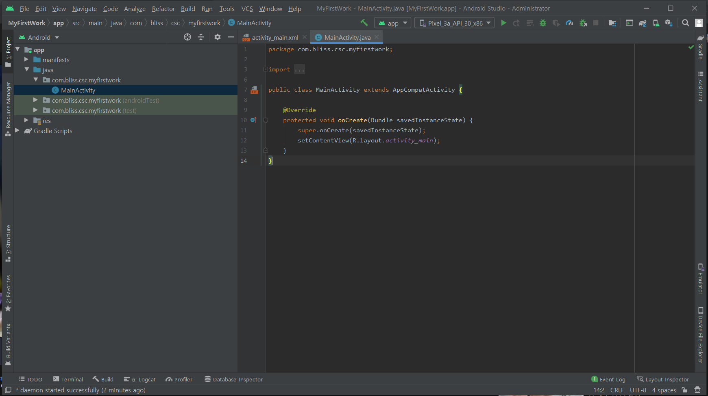
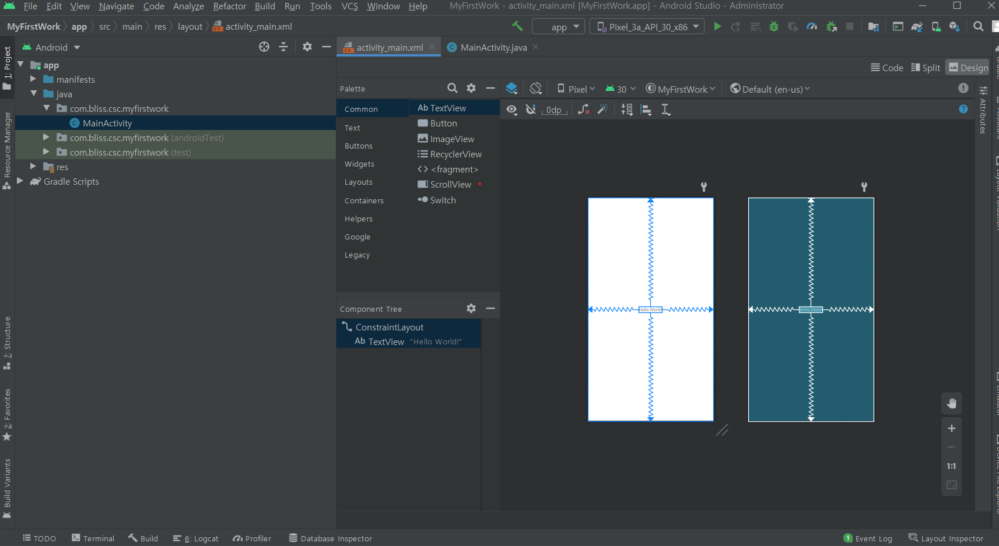

# Android Studio 기초


---

[TOC]

---


Before installing Android Studio, make sure JDK 8(Java SE Development Kit 8) is installed on your computer.

- You can download JDK 8 on the [Oracle Website](http://www.oracle.com/technetwork/java/javase/downloads/jdk8-downloads-2133151.html).

- Add `JAVA_HOME` as system variable.

  - Using CMD

    ```bash
    $ SETX JAVA_HOME /m "C:\Program Files\Java\"
    ```

    - The route for the JDK installation directory should be typed in the `""`.


## Installation

> System Requirements for Android Studio is as below in Windows environment.
>
> - Microsoft Windows 7/8/10 (64-bit)
> - minimum 4 GB RAM, 8 GB RAM recommended
> - minimum 2 GB of available disk space, 4 GB recommended
> - 1280 x 800 minimum screen resolution

You can download Android Studio on the [Android Studio Website](https://developer.android.com/studio?hl=ko).


- Complete Android Studio Setup.
- 처음 Android Studio를 설치하는 경우 이전에 설정된 세팅 내용이 ㅇ벗기 때문에 `Do not import settings`를 선택하고 `OK` 버튼을 클릭한다.
- :white_check_mark: `Install Type`의 경우 나만의 개발환경을 만들고 싶으면 `Custom`을 선택한다.
- 이후의 과정은 기본 설정대로 진행하고 기본적인 세팅을 완료하면 된다.


## 프로젝트 생성

- 프로젝트를 생성한다.
- 다음으로 `Empty Activity`를 선택해본다.


- Activity



- Layout




***Copyright* © 2021 Song_Artish**