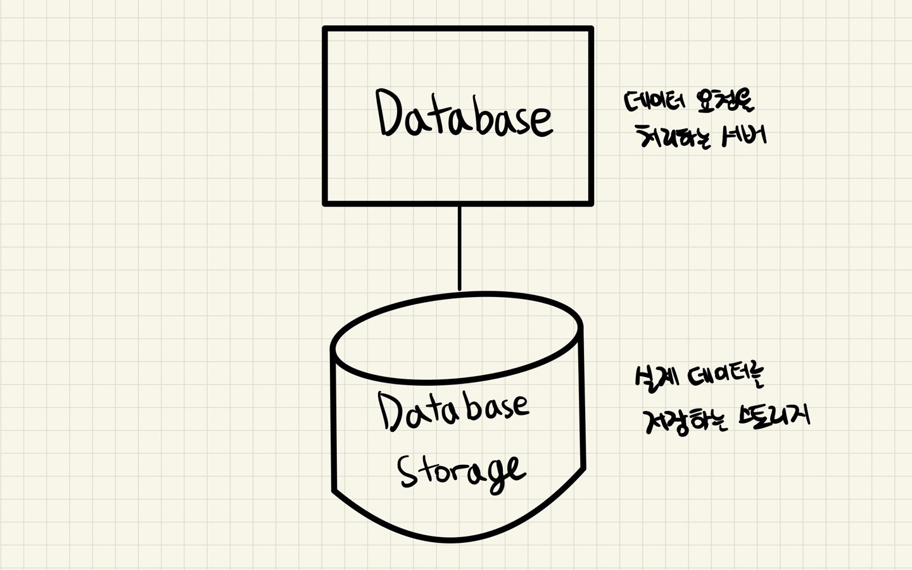
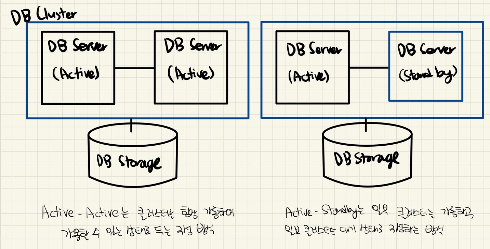
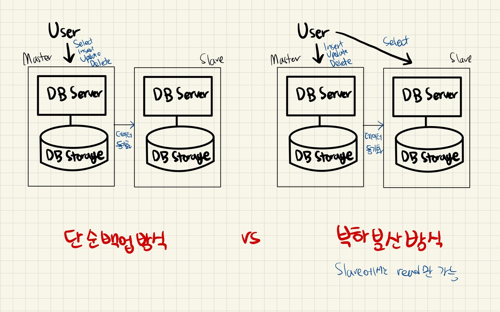
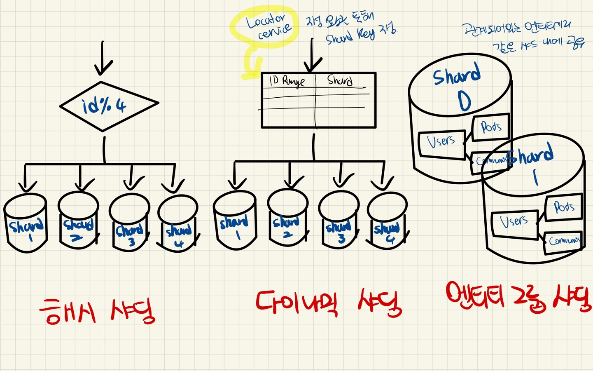

# DDBMS

---

[TOC]

---

## Overview

분산 데이터베이스(Distributed Database)는 **하나의 데이터베이스 관리 시스템(DBMS)으로, 여러 CPU에 연결된 저장 장치들을 제어하는 형태의 데이터베이스**이다. 물리적으로는 여러 위치에 분산 저장하고 흩어져 있는 시스템이지만, 논리적으로는 하나인 것처럼 활용한다.

데이터베이스는 아래 그림과 같이 데이터 요청을 처리하는 서버, 실제 데이터를 저장하는 스토리지가 각 1개씩 있다.

## 투명성 목표

분산 데이터베이스는 여러 위치의 저장소, 즉 노드들은 네트워크를 통해 연결되며, **투명성 확보**가 중요하다. 목표로 하는 투명성은 총 6가지로 아래와 같다.

|   종류   |                         내용                          |           특징           |
| :------: | :---------------------------------------------------: | :----------------------: |
|   병행   |      다수의 트랜잭션 수행 시 결과가 일관성 유지       | 지원처리 양 및 속도 개선 |
|   장애   |     장애 발생이 ALL or Nothing 유지(원자성 유지)      |      데이터 일관성       |
| 지역사상 |     개별 지역의 물리적 이름과 관계 없이 접근 가능     |       확장성 확보        |
|   위치   | 데이터를 물리적 저장 위치가 아닌 논리적 입장에서 접근 |   생산성, 활용성 강화    |
|   중복   |  데이터를 지역별로 중복 저장하여도 데이터 처리 가능   |      병목현상 해소       |
|   분할   | 물리적 구조가 여러 단편으로 분한 저장되어 논리적 사용 |         성능향상         |

## 대표적 기술

### 클러스터링

데이터베이스 서버 죽었을 떄의 문제를 해결하기 위해 서버를 여러 개로 만드는 기술.

**장점**

- 데이터베이스 서버 하나가 죽어도 다른 서버가 역할을 대신할 수 있어 지속 서비스 제공 가능
- 서버가 여러 대이기 때문에 성능적으로 유리함

**단점**

- 데이터베이스는 1개이기에 병목이 생길 수 있음
- 서버 여러 대를 동시에 운영해야 하기 때문에 비용이 많이 들어감

### 레플리케이션

저장된 데이터가 손실되는 문제를 해결하기 위해, 데이터베이스 스토리지를 여러 개로 하는 기술

**장점**

- 데이터베이스 read(select) 성능을 높일 수 있음
- 비동기 방식으로 운영되어 지연 시간이 거의 없음

**단점**

- 각 노드 간의 데이터 동기화 보장이 어려움
- Master 노드가 다운되면 복구 및 대처가 어려움

### 샤딩(Sharding)

데이터가 많아 검색 성능이 좋지 않은 경우 해결하기 위해, 테이블을 row 단위로 나누어서 저장하는 방식

**장점**

- 서버의 수평적 확장이 가능함
- 스캔 범위를 줄여주기 때문에 쿼리 반응 속도가 빨라짐

**단점**

- 데이터를 적절히 분리하지 못하면 오히려 샤딩 전보다 비효율적일 수 있음
- 한 번 분할되면 이전으로 다시 합치기 어려움

이때 데이터를 보다 잘 분산시키는 것이 중요한데, 이를 위해 Shart key를 통해 나눠진 샤드 중 어떤 샤드를 결정할지에 대해 정한다. Shard key 결정 방식에 따라서 샤딩 방법이 나뉜다.

|      샤딩 종류       | 장점                                                         | 단점                                                         |
| :------------------: | ------------------------------------------------------------ | ------------------------------------------------------------ |
|    **해시 샤딩**     | 구현이 간단함 (샤드 수만큼 해싱하면 됨)                      | 샤드가 늘어나면 해시 함수가 달라져야 하기에 확장성이 떨어짐 단순히 해시함수를 통해 나누기에 각 샤드별 공간에 대한 효율을 고려하지 않음 |
|  **다이나믹 샤딩**   | 샤드가 하나 더 추가되면 Locator service에 Shard key를 추가하는 방식으로 확장성 유연함 | 데이터를 재배치 시 Locator service 역시 동기화 요구됨 Locator service에 의존적이라 해당 테이블에 문제가 생기면 데이터베이스에도 문제가 전이됨 |
| **엔티티 그룹 샤딩** | 단일 샤드 내에서 쿼리가 효율적 단일 샤드 내에서 강한 응집도 가짐 | 다른 샤드의 엔티티와 연관이 되는 쿼리의 경우 실행 효율 떨어짐 |

## 특징

- **투명한 분산**

  분산 데이터 베이스를 마치 하나의 데이터베이스를 사용하는 것처럼 하되, 실제로는 분산된 형태를 가질 수 있도록 구현해야 한다.

- **투명한 트랜잭션**

  각 트랜잭션은 다중 데이터베이스에 걸쳐 일관성을 보장해야 한다.

이러한 특징으로 인해 다음과 같은 장단점을 가진다.

|              장점               |                 단점                 |
| :-----------------------------: | :----------------------------------: |
|       시스템 가용성 확보        | 트랜잭션에 대한 처리 알고리즘이 복잡 |
| 지역 업무에 특화된 서비스 제공  |       관리 복잡으로 비용 증대        |
|      시스템 확장 및 적응성      |  통신망 장애 시 부가적 피해 가능성   |
|     장애에 대한 신뢰성 증진     |       잠재적 오류 내재 가능성        |
| 지역별 자원 활용 및 확장성 용이 |        설계 및 구현의 어려움         |

**장점**

- **조직 구조 반영 가능**: 기업에서 부서별로 DB를 놓고 각 DB를 통합하여 분산 데이터베이스처럼 사용할 수 있다.
- **부분 자율성**: 각 부서는 자체 보유한 데이터를 제어할 수 있다.
- **중요한 데이터의 보호**: 화재 등의 재해가 발생했을 때, 데이터가 분산되어 있으면 전체를 한 번에 잃는 것을 예방할 수 있다.
- **성능 향상**: 자주 사용하는 데이터는 가까운 위치에 있으면서, 전체가 병렬적으로 작동하기 때문에 DB의 부하 분산이 가능하다. 일부가 과부화 되어도 분산 DB 전체에 미치는 영향이 적다.
- **모듈화**: 분산 DB의 다른 모듈(시스템)에 영향을 주지 않고 개별 시스템을 갱신, 추가, 삭제할 수 있다.
- 하나의 사이트에 장애가 발생해도 **전체 기능은 손상되지 않으며**, **모든 거래를 ACID 특성**을 따른다.

**단점**

- **복잡성**: 투명성을 보장하기 위해서는 일반적인 DB보다 구현하는 방법이 까다롭다. 또한 각 DB들이 서로 하드웨어가 다르거나, 접속이 끊어졌을 때의 동작을 고려해야 한다.
- **비용**: 시스템의 규모와 복잡성이 증가함에 따라 관리 비용도 증가한다.
- **보안**: 개별 사이트의 보안을 확보하고도, 사이트 간 네트워크의 보안도 확보하기 않으면 전체의 보안도 위험해진다.
- **무결성 보장의 어려움**: 분산 DB는 미성숙한 분야이며, 실제 사례가 비교적 적다.
- **표준의 부족**: 중앙 DBMS를 분산 DBMS로 변환하기 위한 표준적인 방식이 없다.
- **데이터베이스 설계의 복잡성**: 일반 DB 설계 이외에, 데이터를 각 사이트에 어떻게 배치하거나 복제를 어떻게 할 것인가 등 설계 시 고려해야 할 사항이 늘어난다.
- **추가 소프트웨어**를 필요로 한다.
- **운영 체제가 분산 컴퓨팅을 지원**해야 한다.
- **동시성 제어**가 중요하다.

## DDB vs Blockchain

분산 데이터베이스와 구별되는 블록체인(퍼블릭 블록체인)의 가장 큰 특징은 다음과 같다.

1. **악의적인 사용자를 전제하고 만들어진 시스템 (합의 알고리즘)**
2. **운영 주체가 사라져도 시스템 유지 가능 (거버넌스)**

분산 데이터베이스는 일반적으로 **재해 복구, 백업, 성능** 상의 이점만을 고려했다.

***Copyright* © 2022 Song_Artish**