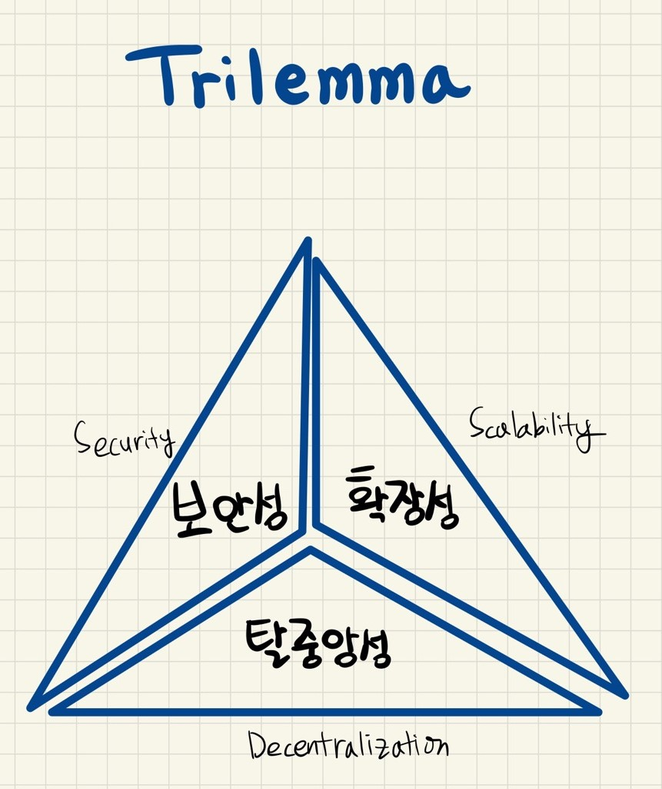

# 블록체인 트릴레마

---

[TOC]

---


## Trilemma

> - Dilemma: 선택해야 하는 길은 2개뿐인데 그 어느 쪽도 바람직하지 못한 결과를 초래하는 상황
> - Trilemma: 선택해야 하는 길은 3개인데 그 어느 쪽을 선택해도 남은 2개 혹은 1개의 문제를 악화시키는 상황

블록체인 기술의 3대 요소(`아래 세 가지`)를 모두 만족시키는 것이 이상적이지만 현실적으로 어렵다는 것이다.

- **확장성(Scalability)**: 사용자가 늘어나더라도 유연하게 대응할 수 있는 정도

  > TPS(Transaction Per Second): 초당 트랜잭션 처리 속도로, 블록체인 네트워크의 성능지표로 사용된다.

- **보안성(Secuirty)**: 블록체인 내 데이터/프로그램을 권한 없는 이용자가 사용할 수 없도록 제한하여, 외부 공격으로부터 프로그램 보호

- **탈중앙성(Decentralization)**: 분산된 소규모 단위가 모여 자율적으로 운영되는 방식(P2P 방식)




## 장단점

### 확장성 중심 네트워크

장점

- 네트워크가 많은 양의 트랜잭션을 지원할 수 있도록 함
- 소셜 메시징 애플리케이션과 같이 보안이 주요 초점이 아닌 애플리케이션에서 유용

단점

- 확장성은 보안을 희생해야 함
- 네트워크가 확장됨에 따라 합의 매커니즘도 확장해야 중앙집중화를 벗어날 수 있음

### 보안 중심 네트워크

장점

- 기존 가치 이전보다 빠르고 저렴한 대규모 가치 이전이 가능
- 퍼블릭 블록체인의 보안은 네트워크 참여자에게서 나오는데, 높은 보안ㅇㄴ 복제하기 쉽지 않은 높은 네트워크 효과를 의미함

단점

- 더 많은 자원, 즉 더 많은 투자가 필요함

### 탈중앙화 네트워크

장점

- 탈중앙화를 통해 사용자가 단일 엔티티를 신뢰하지 않고도 합의를 유지할 수 있음
- 분산화는 시스템의 견고성을 증가시키는데, 네트워크를 검열에 저항하게 하여 누구나 네트워크 사용이 가능하게 되며 재산권을 향상시킴

단점

- 분산화는 네트워크 속도 등의 지연을 초래함
- 중복성을 도입하기 때문에 비용이 많이 들며, 모든 애플리케이션에는 바람직하지 않음


## 해소방안

- Layer-1 솔루션
  - 장점: 대규모 프로토콜 개선을 효과적으로 할 수 있음
  - 단점: 기존 채굴자들 입장에서는 인센티브가 축소될 여지가 있음 (PoW -> PoS)
- Layer-2 솔루션
  - 장점: 훨씬 빠르게 확장성을 향상할 수 있음
  - 단점: 사용 방법에 따라 기존 블록체인의 보안성을 희생해야 할 수도 있음

> :warning: 하지만 이런 솔루션이 확장성 트릴레마를 해결하지 못할 수도 있다.

### Layer-1 솔루션

> Layer 1은 블록체인 네트워크 그 자체를 의미한다. (비트코인, 이더리움 등의 블록체인 프로토콜)

레이어 1 솔루션은 기존의 블록체인의 규칙 또는 메커니즘을 **직접적**으로 개선하는 것을 의미한다.

#### 합의 프로토콜 개선

비트코인과 이더리움은 모두 분산된 합의 프로토콜(PoW)을 활용한다. PoW(작업 증명)는 안전하지만, 확장성이 떨어진다. 예를 들어, 비트코인의 경우 7TPS에 불과하다. 이 때문에 많은 블록체인 네트워크(ex. 이더리움 2.0 업그레이드)가 PoS(지분증명)으로의 전환을 시도하고 있다.

#### 샤딩(Sharding)

샤딩은 트랜잭션을 샤드(shard, 조각)라고 하는 더 작은 데이터 세트로 나눈다. 샤드는 네트워크에서 동시에 병렬로 처리되므로 동시에 수많은 트랜잭션에 대한 순차적 작업이 가능하다. 각 네트워크가 모든 블록 사본을 보유하지 않고, 서로 다른 노드에 의해 분화되고 유지될 수 있게 하며 각 노드는 그 자체로 일관성을 유지한다. 샤드는 메인체인에 증거를 제공하고 교차 샤드 통신 프로토콜을 사용하여 주소, 잔액 및 일반 상태를 공유하기 위해 상호 작용한다.

샤딩은 본래 분산 데이터베이스에서 활용되는 솔루션인데, 블록체인에도 도입되어 현재 가장 인기 있는 레이어 1 확장 솔루션 중 하나가 되었다.

### Layer-2 솔루션

> Layer 2는 다른 블록체인(Layer 1) 위에 구축된 네트워크를 의미한다.

레이어 2 솔루션은 최근 몇 년 동안 엄청난 성장을 이룩했으며, 특히 PoW 네트워크의 확장성 문제를 극복하는 가장 효율적인 방법을 입증하고 있다.

#### 롤업

```markdown
스펙을 높이는 대신, 전송 데이터를 줄이는 방법이다.
```

롤업은 레이어 1 외부(`사이드 체인`)에서 트랜잭션을 실행하지만, 레이어 1에 트랜잭션 데이터를 저장하는 방식이다. 보안성을 유지하면서도 확장성을 강화할 수 있다는 장점이 있다.

1. 레이어 1 외부에서 트랜잭션 실행

2. 트랜잭션 데이터는 레이어 1에 저장

   > 이더리움 체인(레이어 1)과 사이드 체인은 `Relayer`나 `Aggregator`를 통해 연결됨

3. 레이어 1의 트랜잭션 데이터를 사용하여 레이어 2에서 올바른 트랜잭션 실행을 할 수 있는 롤업 스마트 계약

롤업 기수른 대표적으로 2가지로 나뉜다.

1. **Optimistic Rollup**: 애플리케이션이 바로 상호 작용할 수 있게 해주어 누구나 레이어 1 클론에 연결할 수 있다.
2. **Zero Knowledge Rollup**: 자체 환경에서 사일로로 존재하기 때문에 사용자들이 자체 롤업으로 애플리케이션에 연결해야 한다.

#### 중첩 블록체인

중첩 블록체인은 메인 블록체인을 활용하여 더 넓은 네트워크에 대한 매개변수를 설정하고, 실행은 보조 체인의 상호 연결된 웹에서 수행되는 분산형 네트워크 인프라이다. 여러 블록체인 레벨이 이 메인 체인에 구축되며 이러한 레벨은 부모-자식 연결을 사용한다. 부모 체인 대리자는 자식 체인의 작업 결과를 다시 부모에게 보내는 작업을 수행하며, 기본 블록체인은 분쟁 해결이 필요한 경우가 아니면 네트워크 기능에 참여하지 않는다. 이 모델에 따른 작업 분배는 메인체인의 처리 부담을 줄여 확장성을 기하급수적으로 향상시킨다.

대표적으로, OMG Plasma 프로젝트는 더 빠르고 저렴한 거래를 촉진하기 위해 레이어 1(이더리움) 위에서 활용되는 레이어 2 중첩 블록체인 인프라이다.

#### 상태 채널

상태 채널은 전체 트랜잭션 용량과 속도를 개선하기 위해 다양한 메커니즘을 사용하여 블록체인과 오프체인 트랜잭션 채널 간의 양방향 통신을 용이하게 한다. 다중 서명 또는 스마트 계약 메커니즘을 사용해 봉인된 네트워크 인접 리소스이기 때문에, 트랜잭션을 검증하기 위해 즉각적인 miner 개입이 필요하지 않다. 

트랜잭션 또는 트랜잭션 배치가 상태 채널에서 완료되면 채널의 최종 상태와 모든 고유한 전환이 기본 블록체인에 기록된다. 트렐리마 trade-off에서 상태 채널은 더 큰 확장성을 달성하기 위해 어느 정도의 탈중앙화를 희생한다.

대표적으로 비트코인 라이ㅌ닝 네트워크, 이더리움의 라이덴(Raiden) 등이 상태 채널의 예이다.

#### 사이드체인

사이드체인은 대규모 배치 트랜잭션에 사용되는 블록체인 인접 트랜잭션 체인이다. 사이드체인은 속도와 확장성을 위해 최적화할 수 있는 원래 체인에 대한 독립적인 합의 메커니즘을 사용하는 반면, 유틸리티 토큰은 종종 사이드체인과 메인체인 간의 데이터 전송 메커니즘의 일부로 사용된다.

메인체인의 주요 역할은 전반적인 보안 및 분쟁 해결을 유지하는 것이며, 사이드체인은 여러 가지 통합 방식으로 상태 채널과 구별된다. 사이드체인 트랜잭션은 참가자 간 공개적으로 원장에 기록되며, 또한 사이드체인 보안 침해는 메인체인이나 다른 사이드체인에 영향을 미치지 않는다. 사이드체인을 구축하려면 인프라가 처음부터 구축되기 때문에 상당한 노력이 필요하다.


## 세대 & 체인공개유형에 따른 트릴레마

### 확장성을 타협한 암호화폐

#### Bitcoin

- 높은 탈중앙화
- 높은 보안
- 확장성 <u>한계</u>

비트코인은 7 TPS 정도의 처리 속도를 가지고 있는데, 3세대 블록체인이라고 불리는 이오스의 3,000 TPS에 비하면 현저히 낮은 수치이다. 비트코인 개발자들은 확장성 문제 해결을 위해 라이트닝 네트워크(Lightning Network)와 같은 방법으로 속도를 높이고자 했지만, 노드 수를 섣불리 줄이거나 노드 일부만 검증하는 방식을 적용하게 되면 보안이 떨어지는 문제에 봉착하게 된다. 이에 비트코인은 보안을 위해 트랜잭션 속도를 포기했으며, 지금까지도 확장성은 비트코인의 최대 단점으로 꼽힌다.

#### Ethereum

현재 이더리움은 dApp 상에서 이루어지는 거래를 1초에 약 20건 밖에 처리할 수 없는 속도를 가지고 있다. 이를 위해 이더리움 2.0에서는 PoW 방식을 PoS로 전환하고, 샤딩(sharding) 기술을 바탕으로 실생활에서 이더리움을 사용할 수 있는 수준까지 끌어올리려는 시도를 하고 있다.

### 탈중앙화를 타협한 암호화폐

#### EOS

3세대 플랫폼 EOS는 이더리움과 다르게, DPoS(위임지분증명) 합의 알고리즘을 채택하여 탈중앙화와 확장성 문제를 해결하려고 한다. 전체 코인 보유자들이 21명의 BP(Block Producer, 블록 생성자)를 선출한 후 그들에게 블록체인 운영을 맡기는 방식이다. 어느 정도 탈중앙화를 위한 방법을 마련했지만, 여전히 탈중앙화에서 벗어났다고 볼 수 있으며, 보안이 떨어진다.

#### Hyperledger

하이퍼리저는 프라이빗 블록체인의 대표주자로, 기업용(Enterprise Version) 블록체인 기술 개발을 위한 오픈소스 프로젝트이다. 하이퍼레저의 합의 과정에 참여하려면 사전 승인이 필요하며, 이 때문에 익명성이 없고, 중앙관리 주체가 존재하며, 이 주체가 참가자의 범위를 결정한다. 

합의 알고리즘이 퍼블릭 블록체인에 비해 간단하고, 네트워크 운영에 참여한 보상이 필요 없다. 정보의 외부 유출을 원치 않고(보안성) 처리 속도를 중요시(확장성)하는 기업을 중심으로 개발되고 있으며, 고도이 보안이 필요한 정부에서도 주로 이런 형태의 블록체인 도입을 고려 중이라고 한다.

대표적 기업형 블록체인을 표방하고 있는 하이퍼레저 패브릭은 합의가 아닌, 수행 순서만 보증하는 Kafka를 사용하고 있다.

> Kafka: 메시징 시스템


## 해소방안 연구

### 알트코인: Bitcoint Cash

> 알트코인은 `Alternative`와 `Coin`의 합성어로, 비트코인을 개량한 암호화폐 전체를 의미한다.

비트코인 캐시(Bitcoint Cash)는 비트코인에서 체인분기(하드포크)한 알트코인으로, 블록의 크기를 2~8배까지 확장하는 방법으로 트랜잭션 속도를 올렸다.

하지만 비트코인의 기존 구조를 거의 변경하지 않았기 때문에 확정성이 제한적이며, 또한 PoW 방식을 사용하기 때문에 비트코인과 마찬가지로 자본의 집중으로 인한 채굴권력을 분산사키지 못한다는 문제점을 가지고 있다.

### 오프체인: Lightning Network

라이트닝 네트워크(Lightning Network)는 `양방향 채널`이라는 아이디어를 기반으로한 비트코인 레이어 2 솔루션이다. 개별 거래를 별도의 채널(Off-Chain)에서 처리한 후 그 결과만 블록체인에 기록하는 방식으로 작동하는 알고리즘이다.

탈중앙화 보안을 기본으로 두고 확장성을 높이기 위한 작업으로, 개별 노드 간 일상적으로 반복되는 소액 거래 내역을 처리할 수 있도록 메인 블록체인 외부에 별도 채널을 구축한 오프체인 솔루션이다. 거래된 내용은 계약 당사자들끼리 합의를 통해 확정되고 블록체인에 저장되지 않으며, 반복적인 거래가 모두 끝난 후 오프체인을 닫을 때 비로소 최종 거래내역만 블록체인에 저장된다. 

### 플랫폼

#### Cardano

카르다노(Cardano)는 3세대 블록체인으로 PoS 메인넷 중 가장 탈중앙화가 잘 이루어진 메인넷이다. 블록체인 트릴레마 해결을 위해 거래와 연산을 구분하는 2개의 레이어를 사용해 스마트 컨트랙트 사용에 따른 트랜잭션 체증을 방지하였다. 또한, 우로보로스 지분증명(Ouroboros PoS)이라는 합의 알고리즘을 사용해 지분 증명의 예상되는 공격들을 사전에 방지하여 안전성을 높였다.

하지만 동시성 이슈로 인해 스마트 컨트랙트 도입 시 확장성 문제가 대두되고 있다.

#### Algorand

알고랜드(Algorand)는 무허가형 순수지분증명(PPoS) 합의 알고리즘을 통해 블록체인 트릴레마를 해결을 시도하는 플랫폼이다.

순수지분증명 방식은 두 단계로 진행된다.

1. 알고랜드 네트워크의 블록 생성자가 토큰 보유자 중 무작위로 한 명을 선정한다.
2. 다시 무작위로 뽑힌 1천 명이 1단계에서 선정된 위원이 생성한 블록을 검증한다.

매번 새로운 사람이 블록을 채택하기 때문에 보안성을 갖출 수 있다. 또한 **임의성**을 통해 탈중앙화 수준을 어느 정도 유지한다. 임의성(Randomness)은 목표로 하는 분산화 수준을 달성하고 네트워크가 "51% 공격"에 당하지 않도록 예방해주는 강력한 도구이다.

블록체인에서는 다음 블록 선택 방법에 따라 거래의 유용성/효율성이 달라지는데, 알고랜드는 이에 다음 세 가지 솔루션을 제시했다.

- 순수지분증명(Pure Proof of Stake): 모든 토큰에 할당된 권리는 같으며, 누구나 블록 생성에 참여할 수 있다. 또한, ㅔ인의 개념에서 이슈가 되는 포크(fork)가 일어날 수 없다.
- 즉각적인 제시&합의(Immediate Propose&agree): 한 명의 사용자만이 블록을 생성하는 것이 아닌 전체가 블록을 선택하고 생성한다. 이 과정은 빠르고 정교하게 발생한다.
- 진화하는 합의(Consensual Evolvability): 알고랜드의 합의는 99.9% 바로 이루어진다. 시스템을 개선해야 할 때도 공정한 과정을 통해 진행되며, 토큰 알고리즘과 통화 정책도 마찬가지다.


***Copyright* © 2022 Song_Artish**