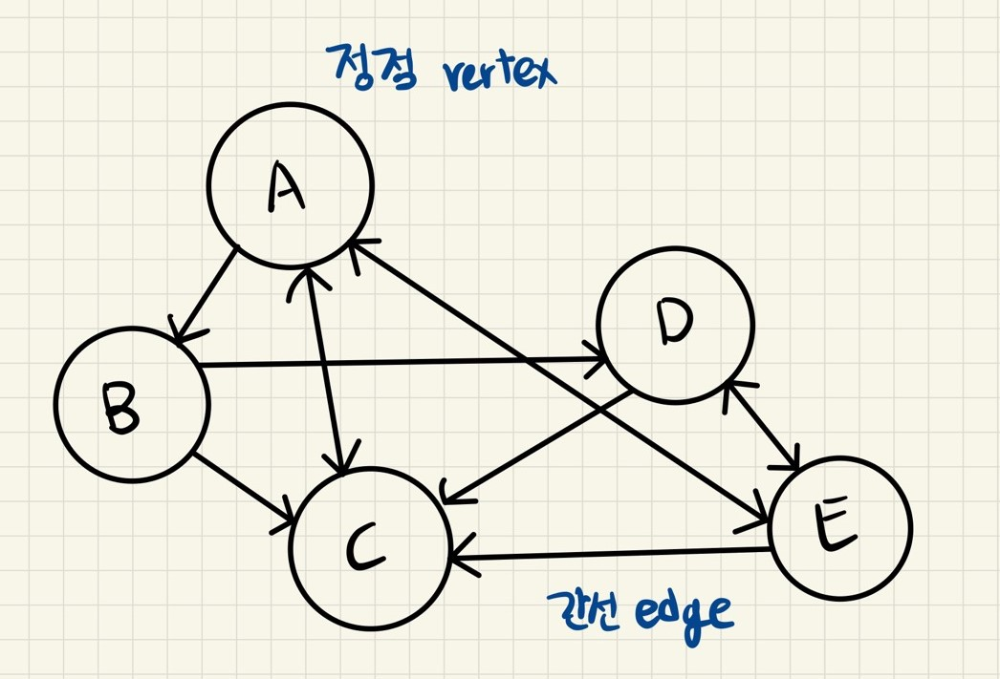
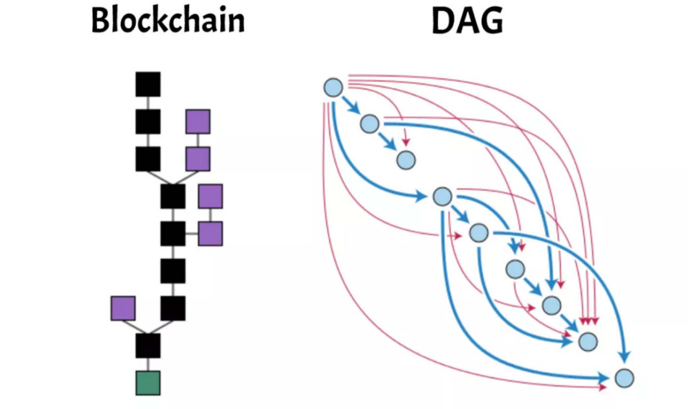

# Directed Acyclic Graph

---

[TOC]

---

## Overview

DAG(Directed Acyclic Graph, 방향성 비순환 그래프)는 그래프 형태의 데이터 구조 중 하나이다.

## 그래프

그래프는 **여러 개의 점이 서로 연결된 관계를 표현한 자료구조**이다.

- 직접적인 관계: 두 점 사이를 이어주는 선이 존재
- 간접적인 관계: 몇 개의 점과 선에 걸쳐서 이어짐

그래프에서 하나의 점을 **정점(vertex)**, 하나의 선은 **간선(edge)**이라고 표현한다.

## DAG

방향성 비순환 그래프(Directed Acyclic Graph, DAG)는 방향 그래프 중 순화이 발생하지 않는 그래프를 의미한다. 한 정점에서 시작해 다시 해당 정점으로 돌아오지 않는 일방향성이라는 특징을 가진다.

## 암호화폐에서의 DAG

### 블록체인 vs DAG

일반적으로 암호화폐 플랫폼에서는 데이터 구조로 블록체인을 사용하지만, 블록체인 대신 DAG를 사용하는 경우도 있다. 블록체인에서는 각 정점이 `블록`으로 구성되어 있고 블록 안에 트랜잭션이 담겨있다. 하지만, 이전 트랜잭션이 처리되지 않는 경우 다음 트랜잭션을 기다려야 한다는 단점이 있다.

`(출처: medium.com)`

### 작동 방식

DAG에서의 각 정점은 블록이 아닌 **개별 트랜잭션**이다. 블록 개념이 없기 때문에 채굴 과정도 필요하지 않으며, 대신 트랜잭션들은 서로를 **참조**함으로써 해당 트랜잭션의 유효성을 검증한다.

**유효성 검사 방법**

1. 노드가 트랜잭션을 네트워크에 제춘한다.

2. 새로운 트랜잭션은 네트워크 내에 있는 이전 트랜잭션을 참조해야 승인되기 때문에, 이전 트랜잭션을 찾는다.

   > :ballot_box_with_check: 꼭 직전의 트랜잭션이 아니어도 된다. 일부 시스템에서는 새로운 트랜잭션이 더 많이 검증된 트랜잭션을 선택하는 알고리즘을 사용하도록 하는데, 더 많이 검증된 트랜잭션을 채택하므로 시스템이 안전하게 성장할 수 있게 된다.

3. 이전 트랜잭션을 찾았다면, 해당 트랜잭션의 유효성을 검사한다.

   - 해당 트랜잭션의 송신자가 잔고 확인을 위해, 그래프의 가장 처음 트랜잭션까지의 경로로 올라가면서, 해당 트랜잭션의 유효성을 확인한다.
   - 만약, 해당 트랜잭션이 유효하지 않다면, 새로운 트랜잭션은 이 트랜잭션을 참조하지 않고, 다른 이전 트랜잭션을 참조한다.

4. 해당 트랜잭션이 승인되기 위해, 이후 새로운 트랜잭션이 해당 트랜잭션을 참조하여 유효성을 검사해주어야 한다.

   참조되기 전까지는 유효한 트랜잭션으로 승인된 거시 아니다.

## 특징

- **트랜잭션 처리 속도**: 블록 개념도 없고, 트랜잭션이 선형적으로가 아닌 병렬적으로 처리되기 때문에 빠른 속도로 트랜잭션이 처리된다.
- **채굴이 없음**: 채굴 과정 자체가 없기 때문에, 채굴자에게 지불할 수수료도 없으며, PoW로 인한 과도한 에너지 사용도 없어 환경친화적이다.
- **확장성 문제에서 비교적 자유로움**: 트랜잭션이 늘어날수록 새로운 트랜잭션들이 이전 트랜잭션을 많이 검증할 수 있기 때문에 확장성 문제에서 자유롭다.

## 대표적인 플랫폼

### IOTA

- 목적: IoT를 위한 새로운 트랜잭션 결제 및 데이터 전송 계층으로, micro payment 거래를 가능하게 하는 높은 확장성을 가지고 있음
- DAG 적용 방식: 새로운 트랜재셕을 만드는 노드가 2개의 이전 트랜잭션을 승인해야
- 기존 블록체인 플랫폼과의 차별점: Tangle(IOTA의 분산원장)은 트랜잭션 발행과 유효성 검사를 동시에 모두 수행하는 노드로 구성되며, 높은 확장성을 가지고 있음

### ByteBall

- 목적: 
- DAG 적용 방식:
- 기존 블록체인 플랫폼과의 차별점: 

***Copyright* © 2022 Song_Artish**