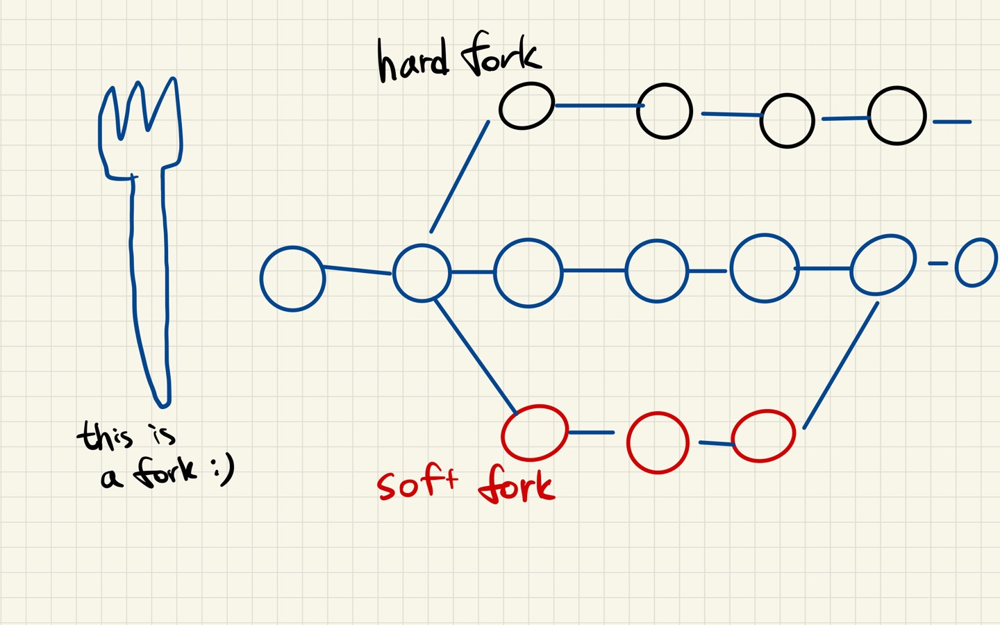

# Fork

---

[TOC]

---

## Hard Fork

하드포크(Hard Fork)는 **블록체인의 기본 기능 자체를 수정하는 포크**이다. 문제 해결 및 업그레이드 방식의 하나로서, 업그레이드 이후에는 기존 문제를 해결하고 이전 블록체인과 전혀 다른 프로토콜을 가지는 **새로운 블록체인**이 된다. 이러한 하드포크 이후에 채굴 노드들은 새로운 버전으로 반드시 업그레이드해야 한다고 해서 하드(Hard)포크라고 한다.

## Soft Fork

소프트포크(Soft Fork)는 **기존 블록체인의 기능 일부를 수정하는 포크**이다. 기존 블록체인의 기본 구조는 변경되지 않고 부분적인 기능 개선만 이루어지기 때문에 기존 블록체인 노드들은 간단한 시스템 업그레이드만으로도 새로운 시스템으로 이전할 수 있게 된다.

***Copyright* © 2022 Song_Artish**