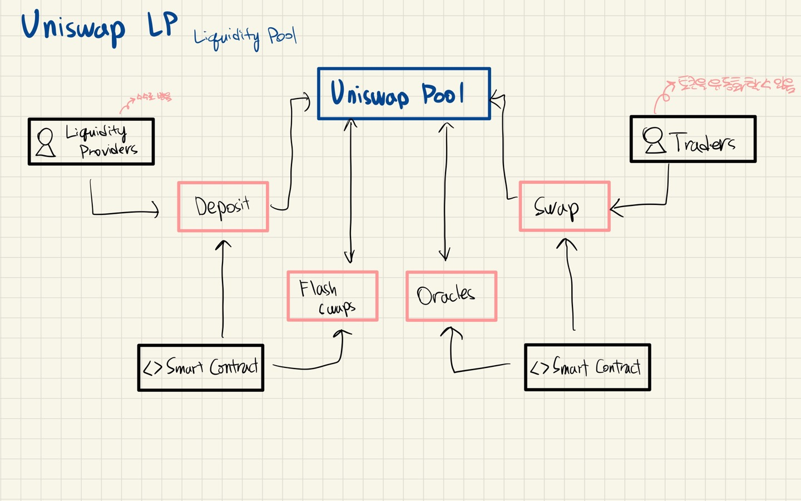

# De-Fi

---

[TOC]

---

## Ce-Fi

Ce-Fi(Centralized Finance)는 전통적인 중앙집권형 금융을 말한다. 은행을 이용하는 사람/기업의 데이터는 은행으로 모이고, 외부로 공개되지 않으며, 은행만이 이 데이터를 활용할 수 있었다.

## De-Fi

De-Fi(Decentralized Finance, 탈중앙화 금융)은 블록체인 기술과 함께 등장한 새로운 형태의 금융으로, 공개된 장부에 거래내역을 투명하게 작성한다. 개개인은 가지고 있는 자산을 암호화된 지갑으로 관리할 수 있으며, 익명성이 보장된다.

최초의 암호화폐인 비트코인은 실물경제의 화폐와 직접 거래되면서 자산으로서의 가치를 지니게 되었다. 이더리움은 예치와 대출이 <u>스마트 컨트랙트</u>를 기반으로 운용된다.

## 토큰거래소

### 유니스왑

유니스왑(Uniswap)은 이더리움 기반의 스왑을 위한 탈중앙화 거래소의 대표주자이다. 유니스왑에서는 누구나 자신이 발행한 토큰 또는 다른 사람이 발행한 토큰으로 스왑(교환)할 수 있다. 모든 스왑은 스마트 컨트랙트에 의해 자동으로 체결되며, 사람이 개입하지 않기 때문에 탈중앙화 금융이라고 할 수 있다.

또한, 스왑 외에도 유동성 풀을 제공하는데, 이는 가격 변동성의 위험을 분산할 수 있게 해준다.

### 기타

이외에도 클레이튼 기반의 클레이스왑, 트론 기반의 저스트스왑(Just swap) 등 블록체인 네트워크마다 스왑을 위한 탈중앙화 거래소가 각각 존재한다.

***Copyright* © 2022 Song_Artish**