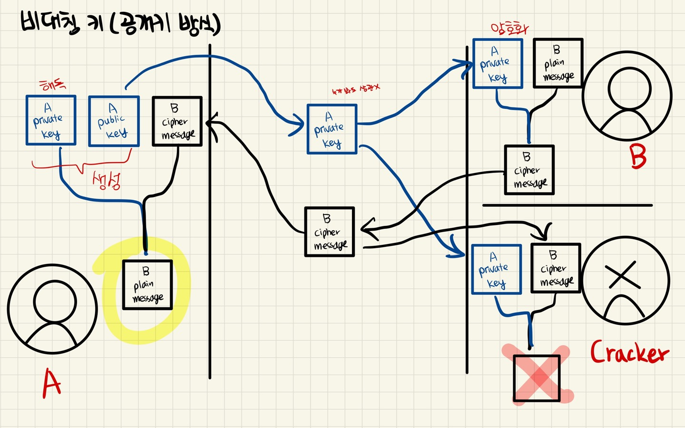
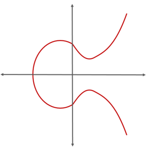
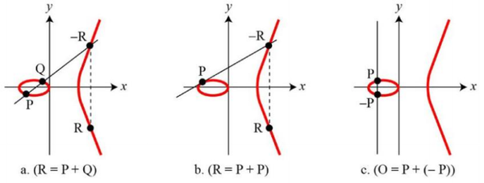
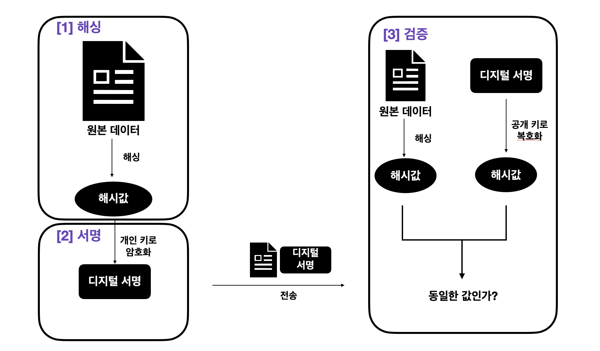
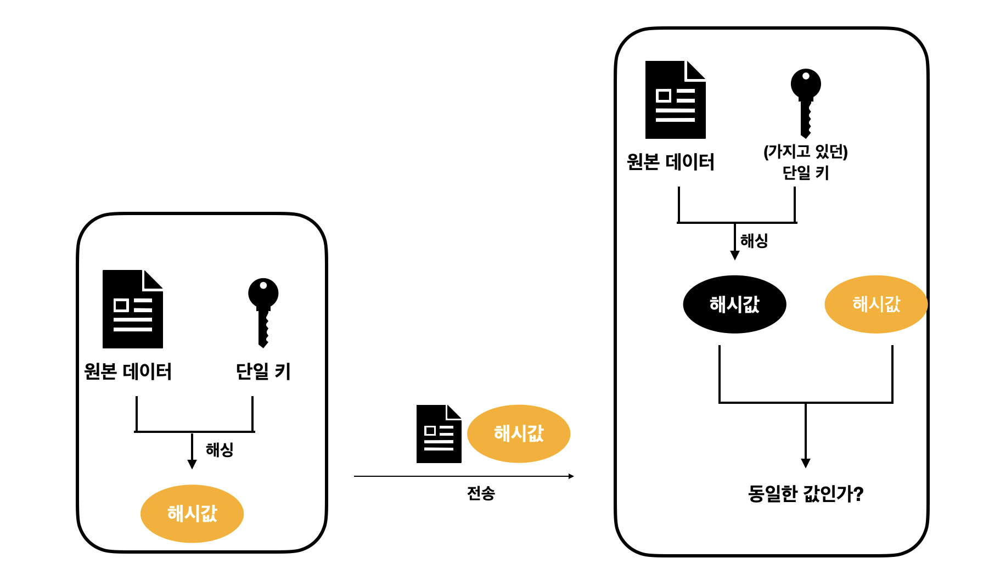

# Cryptography

---

[TOC]

---


## 암호학

암호학이란 안전한 의사소통을 위한 **암호화/복호화** 과학이다. 블록체인과 암호 기술을 불가분의 긴밀한 관계이다.

```markdown
암호화: 일반 메시지(평문)를 이해하기 어려운 암호문으로 변경하는 과정
복호화: 암호문을 읽을 수 있는 일반 메시지(평문)로 변경하는 과정
```

**고대의 암호학**

- 스파르타의 스키테일(Skytale): 특정 굵기의 원통형 막대에 양피지를 돌돌 감아 메시지를 작성 및 해석
- 카이사르 암호: 알파벳과 같은 문자를 숫자나 다른 문자로 치환하여 작성하는 방식

**중세의 암호학**

- 아랍 수학자 알 킨디(Al-Kindi)의 빈도 해석: 기호 대체 암호를 쉽게 해독할 수 있는 암호해독학 방법
- 레오네 알베르디(Leone Alberti)의 다중문자 암호(Polyalphabetic Cipher): 2개의 디스크를 이용해 하나의 알파벳을 전혀 다른 알파벳으로 암호화

**근대의 암호학**

- 제퍼슨 디스크(Jefferson Disk): 26개의 바퀴를 이용해 알파벳을 다른 알파벳으로 치환하는 방식
- 에니그마 장치: 바퀴를 사용하여 암호화 했으며, 동일한 에니그마 장치가 없으면 해독이 불가능

**컴퓨터 시대의 암호화**

- 양자암호학
- 암호 화폐: 해시 함수, 공개 키 암호화, 디지털 서명 등 다양한 암호화 기술을 사용
- 타원곡선 전자서명 알고리즘(Elliptical Curve Digital Signature Algorithm, ECDSA): 블록체인에 기록된 자산을 정당한 소유주만이 사용할 수 있도록 보장


## 블록체인에서의 암호

블록체인에서의 암호는 대표적으로 `보안`의 위해서 사용되고, 기밀성, 무결성, 인증 및 부인 방지를 위해 사용한다.

- 기밀성: 타인이 볼 수 없도록 암호화하여 숨김
- 무결성: 메시지가 수정되지 않았는지 검증
- 인증/부인 방지: 본인이라는 것을 확인

위의 기능들은 크게 **대칭키 암호 방식**과 **비대칭키 암호 방식**, 그리고 **해시 함수**를 사용하여 구현된다.


## 대칭키 암호 방식

**암호화를 할 때의 키와 복호화를 할 때의 키가 같은** 것을 대칭 키라고 한다. 하나의 키로 원본 데이터를 암호화하여, 암호화한 데이터를 키와 함께 송신한다. 이를 받는 사람 역시 동봉된 동일한 키를 사용해 암호화된 데이터를 복호화한다. 대칭 키 암호 방식에서는 블록 암호 방식이나 스트림 암호 방식을 사용할 수 있다.

- **블록 암호 방식**: 데이터를 미리 정해둔 사이즈로 잘라 chunk 단위로 그룹화하고, 각 블록을 개인 키로 암호화

- **스트림 암호 방식**: 원본 데이터의 길이와 같은 키로 Key Stream을 생성하고, 원본 데이터와 key stream을 XOR 연산하여 암호화한다. 나중에 복호화 할 때도 암호화된 값과 키 스트림을 XOR 연산을 하며 원본 데이터가 나오게 된다.

  > XOR 연산: 두 임의의 값 A, B가 모두 참이거나 거짓일 때는 거짓, 둘 중 하나만 참일 경우에는 참을 출력하는 연산

하지만, 대칭 키를 사용하게 되면 `키 배송 위험`이라는 데이터 보안 위협이 존재한다.


## 비대칭키 암호 방식

비대칭 키 암호 방식은 단일 키가 아닌, `공개 키`와 `개인 키` 2가지를 사용한다. 비대칭 키 암호 방식에는 2가지가 있다. (일반적으로 비대칭키 암호 방식이라고 하면, 공개 키 암호 방식을 의미한다!)



1. **공개 키 암호 방식**

   일반적으로, 공개 키는 전송자가 정보를 암호화하는데 사용하며, 개인 키는 수신자가 데이터를 복호화하는데 사용한다. 공개 키는 외부에 공개하고, 개인 키는 기밀로 유지한다. 공개 키 암호 방식(비대칭 키 암호 방식)은 기존의 대칭 키 암호 방식이 가졌던 **키 배송 위험 문제를 해결**하여 컴퓨터 보안을 강화하며, **데이터의 무결성을 확인**하는데 사용할 수도 있다.

   그러나, 암호화 및 복호화의 수학적 계산이 매우 복잡하기 때문에, 대량의 데이터를 처리할 경우 **오버헤드가 발생**하여 속도가 느려질 수 있다. 또한, 개인 키가 안전하지 않은 공간에 노출되는 경우, 대응하는 공개 키로 암호화된 모든 데이터의 보안이 위협받게 된다.

2. **개인 키 암호 방식**

   개인 키로 암호화를 하고, 공개 키로 복호화를 한다. 이 방식은 `데이터 보호`보다 `신원 확인(보장)`을 위해 사용된다. 공개 키와 개인 키는 한 쌍으로, 한쪽 키로 암호화를 했다면 다른 한쪽 키로 복호화를 할 수 있다는 특성을 활용하여, 공개 키와 한 쌍인 개인 키로 암호화했다는 것을 증명한다. 블록체인에서 이 방식은 **전자 서명**에 사용된다.

> :point_right: 비대칭 키 암호 방식 알고리즘

오늘날 사용되는 비대칭 키 암호 방식 알고리즘은 **RSA 암호 방식(소인수분해)**과 **타원 곡선 알고리즘**이다.

### 1) RSA 암호 방식(소인수분해)

> Rivet, Shamir, Adelman 세 사람의 첫 이름을 따서 RSA라고 만든 암호 알고리즘이다.

RSA 암호 방식은 **2개의 소수를 곱하여 얻어낸 계수를 사용해 공개 키와 개인 키를 생성**한다. 이 방식은 **아주 큰 수는 소인수분해 하는 것이 어렵다는 것에 기반을 둔 방식**이다. 따라서, 큰 수의 소인수분해를 빠르게 할 수 있는 알고리즘이 발견된다면 RSA 암호 방식은 더 이상 쓰이지 않을 것이다.
$$
A * B = C
$$
여기서 A와 B는 C의 소인수이다. 이러한 점을 사용해, 개인 키 암호 방식도 구현할 수 있다.
$$
개인 키 * 개인 키 = 공개 키
$$
개인 키와 개인 키를 곱하는 것은 아주 쉽기에, 공개 키를 유추할 수 있다. 그러나 공개 키를 소인수분해하려면 엄청난 시간이 걸리기 때문에, 개인 키를 유추할 수 없다. 공개 키를 전달하여 암호화를 하고, 개인 키를 사용하여 복호화를 할 수 있다.

### 2) 타원곡선 알고리즘(ECDSA)

타원곡선 알고리즘(Elliptic Curve Algorithm, ECDSA)은, 비트코인의 비대칭키 알고리즘으로 유명하다. RSA보다 짧은 키의 길이와, 빠른 연산 속도를 가지지만 동일한 수준의 보안 강도를 가지고 있기 때문에 RSA의 대안으로 나왔던 알고리즘이다. 타원곡선 알고리즘도 유한한 시간 이내에 계산은 가능하지만, 실제로 계산하기에는 너무 큰 시간을 할애한다는 점을 중점으로 두고 있다.

타원 곡선은 `y^2 = x^3+ax+b`를 만족하는 (x, y) 점들의 집합을 의미하며, x축을 중심으로 대칭이 되는 곡선을 말한다.
$$
y^2 = x^3+ax+b
$$


`(출처: 해시넷 위키)`

그리고 **타원곡선 그래프에 찍힌 임의의 점에 대한 이산 로그를 구하는 것(타원곡선 덧셈 연산)**이 타원곡선 알고리즘이다. 이 암호화를 통한 경우의 수는 `10^77`로, 실제로 계산하기는 거의 불가능하다.

아래 예시 그림 a에서, P와 Q의 덧셈은 점 P와 Q를 지나는 직선이 타원과 만나는 제3의 교점 -R(타원곡선으로 이은 교점)을 x축으로 대칭시킨 R로 정의한다(R=P+Q). 그리고 그림 b에서 P=Q인 경우에도 P점에서 타원곡선으로 이은 교점을 -R의 X축인 R로 정의한다(R=2P).



`(출처: 코드스테이츠)`

그리고 이 타원곡선 알고리즘을 N번 덧셈 연산을 하면 개인 키를 생성할 수 있다.
$$
A(임의의 점, 개인 키) * B(이동 횟수, 개인 키) = C(결과값, 공개 키)
$$
임의의 점으로부터 타원 곡선 덧셈 연산을 하고, 나온 결과 값을 다시 임의의 점으로 지정하여 타원곡선 덧셈 연산을 한다.  그렇게 N번의 덧셈 연산을 하여 나온 결과 값이 공개키가 된다. 이 결과값을 가지고 임의의 점 A와 이동 횟수인 B를 찾는다는 것은 매우 어렵다.

또한, 비트코인의 개인 키에 해당하는 `B`인 `이동 횟수`는 `2^256`의 경우의 수 안에서 무작위로 생성되기 때문에 개인 키를 예측한다는 것은 사실상 불가능하다. 2진수로 표현하게 되면 매우 길어지기 때문에 보통 16진수의 64자리로 표현하게 되는데, 이것이 블록체인에서 흔하게 볼 수 있는 그 문자열이다.

`df6724dcf00c43fa0e000a0172fc830e77a7f77483376f98fbcd00203890988`

공개 키도 마찬가지로 결과 값인 `C`를 사용하여 보통 지갑 주소로 활용하지만, 보안과 길이 측면에서 한 번 더 해시한 값을 활용한다.


## 대칭 키 vs 비대칭 키 차이점

공개 키 암호 방식(비대칭 키 암호 방식)과 대칭 키 암호 방식에는 다음과 같은 차이점이 있다.

1. 키의 길이
   - 대칭 키: 키의 길이가 임의로 지정되며, 보안 수준에 따라 128비트나 256비트로 설정된다.
   - 공개 키: 공개 키와 개인 키가 수학적으로 한 쌍을 이루어야 하기 때문에 수학적 패턴을 가지고 있으며, 이는 패턴이 쉽게 간파될 수 있다. 따라서, **더 긴 키를 사용**해야 하는데, 일반적으로 128비트의 대칭 키와 2,048비트의 공개 키가 비슷한 수준의 보안을 제공한다.
2. 연산 속도
   - 대칭 키: 연산이 단순하기 때문에 연산 속도가 빠르며, 대용량 데이터를 전송해야 할 때 많이 사용한다.
   - 공개 키: 복잡한 수학적 연산을 수행해야 하므로 비교적 속도가 느리며, 키 길이가 길기 때문에 훨씬 더 많은 연산 능력이 필요하다. 주로 데이터 전송에 앞서 안전한 통신 채널을 인증하고 구축하기 위한 소규모 트랜잭션(ex. TLS)에 많이 사용된다.
3. 보안
   - 대칭 키: 단일한 개인 키를 공유하기 때문에, 키 노출 시 보안 위협이 크다.
   - 공개 키: 암호화 할 때는 공개 키를 사용하고, 복호화에는 개인 키를 사용하여 노출 시 위협으로부터 안전하다.
4. 알고리즘
   - 대칭 키: 잘 안려진 알고리즘에는 RC4, AES, DES, 3DES 등이 있다.
   - 공개 키: RSA, 디피-헬만, ECC 등이 있다.


## Digital Envelope

- 대칭키 암호 방식: 비교적 간결하기 때문에 네트워크나 PU의 오버헤드가 적고 빠르게 작동한다.
- 비대칭키 암호 방식: 키 배송 위험 문제를 해결하였지만, 많은 연산을 요구하기 때문에 속도가 느리며 용량이 큰 파일을 암호문으로 처리하는 데에 한계가 존재한다.

그렇기 때문에 **대부분의 웹 프로토콜은 대칭 암호화와 공개키 암호 방식을 혼합**하여 사용하는  **전자봉투(Digital Envelope)** 기술을 사용한다. 전자봉투는 **데이터를 빠른 공개 키로 암호화한 뒤, 암호화에 사용된 대칭키를 비대칭 키로 암호화하여 전송하는 기술**이다. 대표적으로 TLS(Transport Layer Security)의 암호화 프로토콜로, TLS에서는 공개 키 암호 방식을 사용해 대칭 키 암호 방식에 사용할 키를 공유한다.


## Digital Signature

디지털 서명(Digital Signature)은 메시지나 디지털 문서의 진위성과 무결성을 검증하는데 사용하는 수학적 메커니즘으로, 공개 키 암호화 방식을 사용한다. 디지털 서명은 메시지나 문서에 첨부된 코드로, 이 코드는 생성된 이후부터 수신자에게 전송되기까지의 과정에서 메시지의 내용이 변조되었는지 확인할 수 있도록 해준다.

**동작 방식**

디지털 서명은 크게 해싱, 서명, 검증 세 단계로 나뉜다.

1. **해싱**

   원본 데이터를 해싱한다.원본 데이터 크기에 관계 없이, 해싱되었을 때는 동일한 길이의 해시값을 가지게 된다. 원본 데이터 해싱은 필수는 아니나, 해싱을 함으로써 고정된 길이의 값을 비교하는 것이 무결성을 검증하는데 훨씬 간편하기 때문에 일반적으로는 데이터를 해싱한다.

2. **서명**

   일반적으로 **송신자의 개인 키로 해시값을 암호화**한다. 이 암호화된 결과값이 디지털 서명이다.

   디지털 서명은 공개 키로 복호화 할 수 있으며, 정상적으로 복호화 될 경우 원본 데이터의 해시값이 나오게 된다. 서명이 완료되면 송신자는 `원본 데이터`와 `디지털 서명`, `송신자의 공개 키`를 함께 전송한다.

3. **검증**

   수신자는 `송신자의 공개 키`를 가지고 **디지털 서명을 복호화**하고, 원본 데이터를 해싱하여 데이터의 해시 값을 구한다. 그리고 디지털 서명을 복호화하여 얻은 해시값과 원본 데이터를 해시하여 얻은 해시값을 비교하여 서로 일치한다면, 데이터가 정상적으로 송신자에 의해 서명된 것임을 확인할 수 있다.



`(출처: 코드스테이츠)`

**특징**

디지털 서명은 세 가지 특징을 가지고 있다.

1. **데이터 무결성**: 수신자는 메시지가 전송되는 동안 위변조가 일어나지 않았음을 검증할 수 있다.
2. **진위성**: 송신자의 개인 키가 안전하게 보관되었다는 전제 하에, 수신자는 디지털 서명이 송신자에 의해 생성되었음을 확인할 수 있다.
3. **부인 방지**: 송신자의 개인 키가 안전하게 보관되었다는 전제 하에, 서명이 생성되고 나면 이 서명이 송신자에 의해 서명되었다는 사실을 부정할 수 없다.

**필요 조건**

디지털 서명 시스템은 다음의 세 가지 요소를 필수적으로 갖추어야 한다.

- **알고리즘**: 알고리즘 수준이 중요하며, 신뢰할 수 있고 널리 사용되어 안전성이 입증된 해시 함수와 암호화 알고리즘을 사용해야 한다.
- **구현**: 디지털 서명 방식은 데이터의 무결성 및 진위성과 직결되기 때문에 결점 없는 시스템을 구현하는 것 역시 중요하다.
- **개인 키**: 개인 키가 유출/손상 시 진위성과 부인 방지 속성이 무효화된다. 특히, 암호화폐에서 개인 키 분실의 경우 재정적 손실로 이어지기도 한다.

블록체인에서 디지털 서명은 송금을 위해 트랜잭션을 생성하여 서명하고 승인하는 데 사옹된다. 특히 월렛 방식을 사용하는 비트코인에서는 개인 키를 소유한 사람만이 코인을 사용할 수 있기 때문에 개인 키를 안전하게 보호하는 것이 중요하다.


## 다양한 암호화 기술

### ECDSA

ECDSA(Elliptic Curve Digital Signature Algorithm, 타원곡선 디지털서명 알고리즘)는 비대칭 키 방식 중 하나인 ECC(Elliptic Curve Cryptography, 타원곡선암호)에 디지털 서명 방식을 접목한 알고리즘이다.

디지털 서명은 개인 키로만 생성할 수 있어야 하며, 수신자가 트랜잭션에 작성된 디지털 서명과 송신자의 공개키를 통해 송신자의 디지털 서명인지 판별할 수 있어야 한다. ECC는 타원곡선으로 수학적으로 연결된 개인 키와 공개 키 한 쌍을 생성하고, 개인 키로 암호화한 디지털 서명을 공개 키로 복호화할 수 있다.

### HMAC

HMAC(Hash-based Message Authentication Code)는 대칭 키 암호 방식을 사용하여 디지털 서명을 구현한다. 송신자와 수신자가 **단일 키를 공유**하고, 해당 단일 키와 원본 데이터를 해싱한 값과 원본 데이터를 함께 트랜잭션으로 보내 데이터의 무결성을 증명한다. HMAC의 디지털 서명 공식은 다음과 같다.

```
HMAC 트랜잭션 = Hash(원본 데이터, 단일 키) + Message
```



`(출처: 코드스테이츠)`

### PKI

PKI(Public Key Infrastructure, 공개 키 기반 구조)는 디지털 인증서와 공개 키를 생성, 관리, 배포, 사용, 저장 및 해지하는데 필요한 일련의 하드웨어, 소프트웨어, 정책, 프로세스와 절차의 집합이다. PKI는 대규모 사용자 집단에서 디지털 서명 및 암호화와 같은 기술을 사용할 수 있는 기반이다. PKI의 목적은 데이터를 안전하게 전송하는 것이며, 이를 위해 시스템 및 리소스 접근 권한, 데이터 보호, 트랜잭션 무결성 및 진위성, 기밀성을 보장한다.

PKI는 공개 키 암호 방식을 사용하여 웹 서버, 임베디드 시스템, 서로 연결된 장치, 비즈니스 프로세스를 실행하는 소프트웨어 간에 데이터를 안전하게 교환할 수 있도록 해준다.

### 슈노르 서명

슈노르 서명에서는 키 집합(Key Aggregation)을 사용하여 서명하는 당사자의 공개 키들을 결합하여 단일한 하나의 공개 키를 구성한다. 그리고 각 당사자의 개인 키를 사용하여 해당 메시지에 서명을 할 수 있다. 또한 당사자들의 서명을 결합하여 합쳐진 단일 공개 키에 유효한 단일 서명을 구성할 수 있다. 검증 노드가 당사자들이 모두 메시지에 서명했는지 확인할 때는 단일 서명과 단일 공개키로 확인할 수 있다.

슈노르 서명은 당사자들의 정보를 하나로 통합하기 때문에 개인 정보 보호에 유리하며, 블록에 들어가는 멀티시그(Multi-Signature, 다중서명) 공개 키들과 서명들의 크기를 일반적인 블록 크기 정도로 줄이기 때문에 블록 공간을 매우 절약하고, 검증의 속도를 빠르게 할 수 있다.


***Copyright* © 2022 Song_Artish**