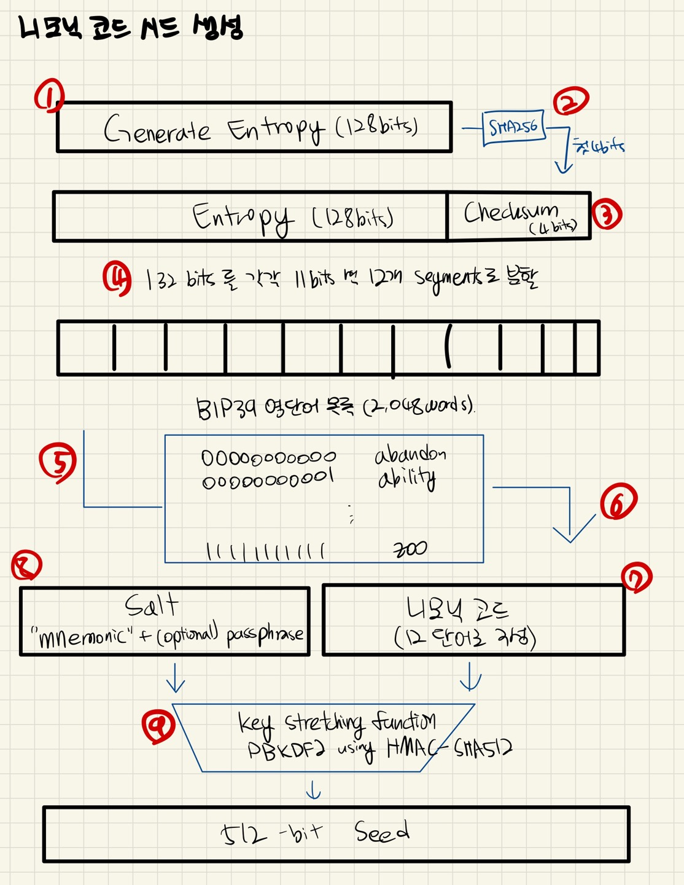
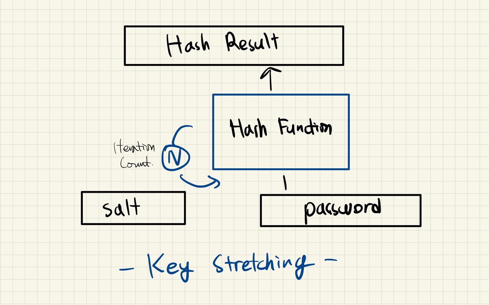

# Wallet

---

[TOC]

---


## 지갑

블록체인 지갑은 블록체인에서 실행되고, 개인 키와 공개 키를 저장하고, 해당 키와 관련된 모든 트랜잭션을 블록체인에 모니터링하고 유지하는 소프트웨어이다. 즉, 비트코인, 이더리움 등의 암호화폐를 보관할 수 있는 계정을 뜻한다. 채굴(Mining)과 노드(Node)에서 노드가 바로, 지갑(Wallet)이다.

지갑의 **종류**는 다음과 같다.

- 데스크탑(PC) 지갑
- 모바일 지갑
- 하드웨어 지갑
- 웹 지갑

지갑의 **구조**는 다음과 같다.

- **주소(Public Key, 공개키)**: 다른 사람들이 암호화폐를 송금할 수 있도록 공개해도 됨
- **암호(Private Key, 개인키)**: 오직 소유자 본인만 알고 있어야 함


> - **비트코인**: 코인이 지갑에 저장되지 않고 UTXO에 저장된다. ([Bitcoin UTXO](23_Bitcoin_UTXO.md))


## 이더리움의 Account

이더리움 주소(address)와 개인키(private key)의 조합(쌍)을 어카운트(account)라고 한다. 이더리움 블록체인에서 주소와 키는 이더리움의 소유권과 전송을 나타내는데 주로 사용되며, 이더리움 계정은 이더 잔고를 보유하고 트랜잭션을 전송할 수 있다.

- **주소(Address)**: 이더리움 블록체인에서 사용자의 신분증에 해당한다.
- **키(Key)**: 개인키와 공개키로 구분되어 사용된다.
  - **개인키(Private Key)**: 무작위로 생성되며 비밀 키로써 유지해야 한다.
  - **공개키(Public Key)**: 개인키를 연산하여 생성되며 계정을 식별하는 요소로 사용된다.

**장점**

- **단순성(Simplicity)**: 직관적인 모델
- **효율성(Efficiency)**: 전송 계정이 거래 비용을 지불하기에 충분학 잔액을 가지고 있는지 확인하기만 하면 되므로 효율적

**단점**

- **이중 지불**: 이중 지불 공격에 노출되지만, nonce를 통해 대응하고 있음

### 주소 생성 과정

1. 개인키를 생성하고, 개인키로부터 공개키를 생성한다.
2. Keccak-256 알고리즘으로 공개키의 해시값을 계산한다.
3. 생성된 해시값의 뒤쪽 20byte만 남기고 제외 후 이더리움 주소를 생성한다.

### 계정 유형

1. **외부 소유 계정(EOA)**: 공개 주소와 개인키의 조합이다. 외부 소유 계정, 또는 외부 계정을 사용하면 다른 계정과 이더를 송수신하고 스마트 컨트랙트에 트랜잭션을 보낼 수 있다.
2. **컨트랙트 계정(CA)**: 상응하는 개인키가 없으며, 스마트 계약을 블록체인에 배포할 때 생성된다. 컨트랙트(혹은 컨트랙트 계정)는 다른 계정과 이더를 송수신하고, 관련된 코드를 담고(EOA와 다름), EOA나 다른 컨트랙트의 호출을 받아 트랜잭션을 발생시키는 기능을 가지고 있다.


## 지갑 유형

### 핫 월렛 & 콜드 월렛

암호화폐 지갑은 **인터넷 연결 유무**에 따라 크게 핫 월렛과 콜드 월렛으로 구분할 수 있다.

- 핫 월렛: 온라인
- 콜드 월렛: 오프라인

핫 월렛 콜드 월렛은 각각의 장단점을 비교하여 선택하면 된다. 일반적으로 거래소에서는 전체 자산의 70%는 콜드 월렛에 안전하게 보관하며, 30%를 핫 월렛에 보관한다.

#### 핫 월렛

핫월렛(Hot Wallet) 또는 온라인 지갑은 인터넷 주소가 네트워크에 연결되어 있어 온라인 상태에서 실시간으로 거래 정보를 주고받을 수 있다는 장점이 있다. 하지만, 개인키가 온라인에 노출되기에 해킹 등 보안 문제에 취약하다는 단점도 있다.

대표적으로 웹 월렛, 데스크탑 월렛, 모바일 월렛이 있다. 이더리움 플러그인인 메타마스크(MetaMask), 클레이튼의 카이카스(Kaikas), 클립(Klip)이 핫 월렛의 일종이다.

#### 콜드 월렛

콜드 월렛(Cold Wallet) 또는 오프라인 지갑은 지갑의 개인 키를 오프라인에 보관하는 지갑으로, 보안 측면에서 안전하다는 장점이 있다. 하지만, 실시간 거래가 불가능해 불편하다는 단점도 있다. 대표적으로 페이퍼 월렛과 하드웨어 월렛이 있다.

##### 페이퍼 월렛

페이퍼 월렛(Paper Wallet)은 지갑 주소를 만들고 주소를 종이에 써서 보관하는 형식이다. 간단히 말해서 암호화폐의 개인 키를 종이에 인쇄한 것이다. 온라인 해킹 등에 의한 위협에서 상대적으로 안전하지만, 종이를 분실한 위험도 존재한다.

##### 하드웨어 월렛

하드웨어 월렛(Hardware Wallet)은 개인 키를 USB나 카드에 보관하는 방식이다. 하드웨어 지갑을 다른 장치에 연결한 다음, 사용자는 소프트웨어를 통해 자신의 잔고를 확인하거나 트랜잭션을 생성할 수 있다.

### 스마트 컨트랙트 월렛

일반적으로 이더리움에서는 사용자가 개인 키를 사용하는 EOA로 자신의 자산을 관리한다. EOA는 기능이 제한적이며 코드(스마트 컨트랙트)를 담을 수 없다.

> - **EOA(Externally Owned Account)**: 개인 키에 의해 통제되는 계정 정보. 사용자 계정.
> - **CA(Contract Accounts)**: 컨트랙트 코드에 의해 통제되는 계정 정보

반면, 스마트 컨트랜트 월렛은 스마트 컨트랙트를 이용하는 월렛이다. CA에 컨트랙트 코드를 이용해 누가 어떤 조건에서 자산에 접근할 수 있는지를 프로그래밍화 할 수 있으며, EOA 기반 월렛보다 더 높은 수준의 보안, 유연성, 편의성을 제공한다. 사용자는 스마트 컨트랙트 코드를 사용해 다음의 기능도 사용할 수 있다.

- 멀티 시그 트랜잭션
- 일일 송금 제한
- 긴급 계정 동결
- 안전한 계정 복구
- dApp과의 상호작용

**특징**

- **2단계 이증**: 인증 앱 및 기본 지갑 솔루션을 통해 추가 보안 기능 제공
- **ATM과 같은 인출 제한**: 트랜잭션 금액 제한 설정이 가능
- **화이트리스트 & 블랙리스트**: 사용자는 자신이 지정한 주소(화이트리스트)로만 전송할 수 있고, 차단한 주소(블랙리스트)에는 전송이 제한됨
- **사기 경보 및 긴급 잠금**: 장치 분실 혹은 도난의 경우 계정을 잠그거나 손상된 장치에서 계정에 대한 액세스를 비활성화 할 수 있다.

#### 웹 월렛

웹 기반으로 호스팅되는 지갑으로, 사용자가 계정을 생성하고 보관할 수 있다. 인터넷 브라우저를 통해 접속하는 지갑으로, 대부분 브라우저(크롬 등) 확장 프로그램이나 웹 사이트 형태로 제공된다. 항상 인터넷에 노출되어 있어 보안에 가장 취약하지만, 즉시 거래가 가능하기 때문에 가장 실용적이다.

#### 데스크탑(PC) 월렛

Windows, Mac 또는 Linux 같은 OS에 다운로드하여 작동할 수 있는 앱이다. 인터넷 접속 여부에 따라 핫 월렛 혹은 콜드 월렛으로 작동할 수 있다. 웹 월렛보다는 불편하지만, 필요시 인터넷에 연결하여 거래가 가능하기 때문에 하드웨어 월렛에 비해 실용적이다.

#### 모바일 월렛

데스크탑 & 웹 지갑의 모바일 형태로, 인터넷 접속 여부에 따랑 핫 월렛 혹은 콜드 월렛으로 작동할 수 있다. 스마트폰 앱으로 다운받아 사용할 수 있으며, 언제 어디서나 거래가 가능하기 때문에 편리하다.

#### 하드웨어 월렛

거래에 서명할 때 개인 키를 인터넷에 노출하지 않기 때문에 온라인 상태에서 자산에 액세스하는 가장 안전한 방법이다.

#### 멀티 시그 월렛

멀티 시그 월렛(Multi-Signature Wallet)은 멀티시그(Multi-Sig)를 통해서만 송금이 가능하다는 특징이 있다. 멀티 시그 월렛은 하나의 지갑에 N명의 사용자가 소유 권한을 가지고, 트랜잭션을 만들는 경우 N명 중 k명이 트랜잭션에 서명해야 한다.

기존 핫 월렛과 콜드 월렛은 하나의 개인 키가 노출될 경우 문제가 발생하는데, 이를 보완하기 위한 월렛으로, 일반 지갑에 비해 보안이 우수하다는 장점이 있다. 그러나 스마트 컨트랙트 상에서 구현되기 때문에 사용성이 부족하며, 컨트랙트 코드 오류로 문제가 발생할 수도 있다. 멀티 시그 월렛에는 ConsenSys, Gnosis, Argent, BitGo 등이 있다.

### 비결정적 월렛 & 결정적 월렛

#### 비결정적 월렛

매번 비밀 키를 무작위로 생성하는 방식의 지갑으로, 매 트랜잭션마다 새로운 주소를 위한 새로운 지갑 파일으 생성해야 한다.지갑 데이터 분실 시 스마트 컨트랙트에 접근할 수 없으며, 지갑 데이터를 자주 백업해야 한다는 관리 측면에서 불편함이 있다.

#### 결정적(시드) 월렛

이러한 비결정적 월렛의 불편함을 해결하는 방식의 지갑이 바로 결정적 월렛이다. 결정적 월렛은 하나의 시드에서 하나의 시드 키를 가지고 있으며, 이 시드 키는 비밀 키를 만들기 위한 난수인데, 이를 **니모닉 코드 단어(Mnemonic Code Words)**라고 한다.

비밀키는 시드 키를 인덱스 또는 다른 데이터와 결합하여 만들며, 이 시드 키는 자신으로부터 만들어진 비밀 키를 복구할 수 있다. 이러한 특징 때문에 시드 키로부터 만들어지는 모든 비밀키는 그 값이 미리 정해져 있다고 볼 수 있으며, 이를 결정적 지갑이라고 한다.

##### HD 월렛(결정적)

HD(Hierarchical Deterministic, 계층적 결정적) Wallet은 하나의 시드(seed) 값만 가지고 있으면 여러 개의 주소를 쉽게 생성할 수 있는 암호화폐 지갑이다. 하나의 키로 다목적 관리를 할 수 있다는 장점이 있다. Hierarchical은 하나에서 다른 하나를 유도하는 것, Deterministic은 트리 구조가 상위의 비밀 키만 알면 하위는 다 알 수 있다는 뜻이다.HD Wallet은 BIP-32에서 제안되었고, BIP-44에서 개선되었다.

HD Wallet 계정 생성을 위해서는 크게 2가지가 필요하다. 하나는 정수로된 시드(seed) 값, 다른 하나는 그 계정까지의 경로(path)이다.HD Wallet의 경로는 여러 개의 정수로 구성되며, 개수에 제한이 없다. HD Wallet은 시드와 경로가 있으면 항상 동일한 값의 자식 키를 구할 수 있다.

- **시드(Seed)**

  HD Wallet은 시드로부터 마스터키를 생성한다. 시드는 128, 256, 512bits의 루트 시드(root seed)로 만들며, **니모닉(mnemonic)**으로부터 생성된다. HD Wallet의 모든 키는 루트 시드에서 결정적으로 파생되었으며, 생성된 시드로부터 자손 HD Wallet을 재생성할 수 있다. 이렇게 루트 시드를 파생시킨 니모닉을 전송하는 것만으로도 수천/수백만 개의 키가 포함된 HD Wallet의 내보내기, 백업, 복원, 가져오기를 쉽게 할 수 있다.

- **경로(Path)**

  HD Wallet 키의 경로에는 규칙을 사용하여 식별하며, 각 트리 레벨은 슬래시(`/`) 문자로 구분한다. 마스터 비밀 키로부터 파생된 비밀 키는 m, 마스터 공개키에서 파생된 공개키는 M으로 시작한다.

**참고**

- **BIP-32**

  BIP-32에서는 결정적 지갑을 이진 트리 형식으로 계층화하여 끝없이 비밀 키를 생성할 수 있는 구조를 제안하였다. HD 지갑은 BIP32에서 제안한 지갑 구조를 프로그래밍화 한 것이며, HD 지갑은 BIP32에서 처음 제안되었고, BIP39, BIP44 등 여러 버전이 존재한다.

- **BIP-44**

  BIP-44는 여러 계정이 여러 목적에 맞게 여러 지갑을 사용할 수 있는 HD 지갑 구조를 제안하였다. BIP-44는 다섯 가지 트리 레벨로 구성된다.

  1. 목적: 항상 44로 설정된다.
  2. 코인 종류: 어떤 종류의 코인인지 나타낸다. SLIP-0044 문서에 각 코인의 종류와 할당된 번호가 있다.
  3. 계정: 사용자는 자신의 지갑을 논리적 계정으로 나눌 수 있다. 가령 `m/44'/0'/0'`과 `ㅡ/44'/0'/1'`은 하나의 HD 지갑에 2개의 비트코인 계정이 있는 것이다.
  4. 잔액 계정 여부: 비트코인의 잔액 계정 여부. 하위 트리에 있는 값이 입금 주소인지 잔액 주소인지 표기하며, 잔액 주소이면 1을 넣고, 아니면 0을 넣는다. 이더리움에서는 UTXO가 아닌 어카운트 기반이기 때문에 잔액 주소가 필요 없어 항상 0 값을 갖는다.
  5. 사용 가능한 주소: 입금 주소나 잔액 주소를 표기한다.

  ```markdown
  `M/44'/60'/0'/0/2`: 이더리움 계정에 대한 세 번째 수신 공개키
  `M/44'/0'/3'/1/14`: 4번째 비트코인 계정의 15번째 주소 변경 공개키
  `m/44'/118'/0'/0/1`: 트랜잭션 서명을 위한 아톰코인 메인 계정의 두 번째 개인 키
  ```

- **DRBG**

  DRBG(Deterministic Random Bits Generate)는 컴퓨터로 만든 난수를 해시함수를 통해 진짜 난수로 만드는 알고리즘이다. HD 지갑에서는 시드 키를 생성할 때 DRBG를 사용한다.

- **HMAC-SHA512**

  HMAC-SHA512는 부모의 키 값을 패딩하여 XOR 연산을 하고, 그 결과값을 해싱하는 것으로, 이것이 자식 키가 된다. 마스터키는 시드 키에 HMAC-SHA512를 연산한 결과값이다.

  > - **패딩(Padding)**: 블록암호 알고리즘에서 블록의 크기를 일정하게 맞추기 위해 빈 부분을 채워주는 것
  > - **XOR 연산**: 입력 값이 같지 않으면 1을 출력 (두 입력 중 하나만이 배타적으로 참일 경우에만 발생)

### 기타 월렛

#### 브레인 월렛

브레인 월렛(Brain Wallet)은 비밀 키를 랜덤하게 생성하지 않고, 일련의 단어 목록이나 문장(Seed Phrase)을 사용해 비밀 키를 만드는 지갑이다.

- 장점
  - 비밀 키 생성 시 사용한 단어 목록이나 문장을 기억하고 있으면 언제든지 비밀 키를 복구할 수 있기 때문에 저장 방식이 간편함
  - 익숙한 문장을 시드로 삼는 경우 어딘가에 기록하지 않고도 사용할 수 있기 때문에 안전함
- 단점
  - 컴퓨터가 만들어내는 난수에 비해 임의성(Randomness)이 부족하기 때문에 무차별 대입 공격을 통해 비밀 키를 해킹당할 수도 있음

따라서, 오늘 날에는 브레인 월렛이 잘 사용되지 않는다.


## 니모닉(Mnemonic)

니모닉(Mnemonic)이란 **결정적 지갑**에서 난수를 12개의 영단어로 인코딩한 영단어 그룹으로, **BIP39**에서 제안되었다. 숫자/문자로 구성된 난수였던 기존 시드 키(비밀 키)에 반해, 사용자가 기억하고 사용하기 쉬운 형태로 구성되어 있다는 장점이 있다.

```markdown
- 시드 키:
8979644bfb6b206792bd...f8f94
- 니모닉:
endless convice patrol calm apology scene client jungle fitness blind grass pause
```

블록체인에서 니모닉은 지갑을 복구하기 위한 일반적인 단어들의 조합을 뜻한다. MetaMask에서 사용되는 `비밀 복구 구문`이 대표적인 예시이다.

- 니모닉 Wallet: 니모닉을 사용하여 비밀키 관리를 용이하게 해주는 암호화폐 지갑이다. 유저는 비밀키를 복구할 때 니모닉을 사용하게 된다.

### 니모닉 코드와 시드 생성 9단계

니모닉 코드는 해시 함수를 재귀적으로 반복하는 키 스트레칭 과정을 거쳐 마스터 시드를 생성하고, 그 마스터 시드는 HD 지갑 주소 생성의 바탕이 된다. BIP-39에 정의된 니모닉 코드와 시드 생성 9단계는 다음과 같다.

1. 128bit 또는 256bit 길이의 난수를 생성한다.

2. 난수를 SHA-256 알고리즘으로 해싱하고, 해시값에서 `(시드 키의 길이) / 32`만큼을 떼어낸다.

   예를 들어, 난수의 길이가 128bit라면, 해시값에서 4bit (128/32)를 떼어내 체크섬으로 만든다.

   > **체크섬(Checksum)**: 어떤 일련의 데이터에 오류가 존재하는지 확인하기 위한 검사용 데이터

3. 체크섬을 난수의 뒤에 붙인다.

4. 체크섬을 붙인 난수를 11bit 단위로 잘라낸다.

5. 각 11bit의 단어를 사전에 정의된 단어로 치환한다.

6. 각 11bit의 순서를 유지하여 일련의 니모닉 코드로 만든다.

   위의 과정을 통해 128~256bit 길이의 엔트로피를 표현하는 니모닉 코드가 생성되었다. 이제 이 엔트로피와 **키 스트레칭 함수 PBKDF2**를 사용하여 더 긴(512bit) 시드를 파생시킨다. 키 스트레칭 함수에는 **니모닉 코드**와 **솔트(salt)**라는 두 가지 파라미터를 넣는다.

7. PBKDF2 키 스트레칭 함수의 첫 번째 인자는 6단계에서 생성된 **니모닉 코드**이다.

8. PBKDF2 키 스트레칭 함수의 두 번째 인자는 **솥트**이다. 솔트는 문자열 상수 "mnemonic"과 선택적으로 사용자가 지정한 암호문을 연결하여 구성한다.

9. PBKDF2는 최종 출력으로 512비트 값을 만드는 HMAC-SHA512 알고리즘으로, 2048해시 라운드를 사용하여 니모닉과 솔트 파라미터를 확장하여, 이 결과로 나온 512 비트 값이 **seed**이다.



### 용어

- **솔팅(Salting)**: 원본 데이터에 임의의 문자열인 솔트(salt)를 추가하여 해싱하는 방식이다. 솔팅 방식으로 비밀번호를 암호화하여 데이터베이스에 보관하면, 더욱 안전하다.
- **키 스트레칭(Key Strectching)**: 솔팅 방식을 여러 번 반복하는 것이다. 솔팅의 결과값을 다시 솔트 함수의 입력값으로 하여 다시 솔팅하고, 이 과정을 반복한다. 키 스트레칭은 사용자가 입력한 비밀번호에 대한 예측을 더욱 어렵게 한다.




## 지갑 예시

### MetaMask

이더리움을 보유, 송금, 관리할 수 있는 암호화폐 지갑

Chrome 확장 프로그램으로 사용되며, 지갑 생성은 니모닉 코드(Mnemonic Code)를 사용한다.

**지갑 생성**

MetaMask 지갑 만드는 방법은 [게시물](https://songzerotwo.tistory.com/entry/%EB%B8%94%EB%A1%9D%EC%B2%B4%EC%9D%B8-%EC%A7%80%EA%B0%91-MetaMask-%EB%A7%8C%EB%93%A4%EA%B8%B0-Chrome)을 참고한다.

**이더리움 입금/송금 (테스트넷)**

> **테스트넷**: 이더리움 네트워크와 거의 동일하게 작동하는 네트워크지만, 토큰들의 실제 가치가 없는 곳. 개바자들은 테스트넷을 사용하여 컨트랙트 등을 개발한다.

MetaMask에 접속하여 네트워크를 테스트 네트워크로 전환해준다. 여기서는 **Ropsten 테스트 네트워크**를 사용한다.

> 테스트넷 별 차이점은 [링크](https://ethereum.stackexchange.com/questions/27048/comparison-of-the-different-testnets/30072#30072)를 참고한다.

MetaMask 주소를 복사하고, [Ropsten testnet faucet](https://faucet.egorfine.com/) 사이트에 들어가서 자신의 주소를 입력하면 테스트용 ETH를 받을 수 있다.

MetaMask에서 `보내기` 버튼을 누르고 다른 사람의 주소를 입력하면 송금을 할 수도 있다.

**하드웨어 지갑 연결**

Profile 아이콘을 클릭하고 `하드웨어 지갑 연결` 버튼을 누른다. 해당 페이지에서 `Ledger`, `Trezor` 등 보유하고 있는 하드웨어 지갑을 연결할 수 있다.

### 마이이더 월렛(MEW)

이더리움을 보관, 입출금할 수 있는 암호화폐 지갑

사용자들은 마이이더월렛을 이용하여 블록체인과 바로 통신할 수 있고, 이더리움 지갑을 만들어 이더리움 및 ERC20 토큰들을 보관/전송/수령할 수 있다.

**특징**

- 하드웨어 지갑 스타일 보안 기능

- 거래를 보호하기 위한 이중 인증

- 개인 키를 얻을 수 없다. (사용자가 개인키를 점유하지 않음)

- 탈중앙화

  P2P 통신을 사용, 개인 데이터를 수집X, 오픈 소스

**사용 방법**

1. [마이이더월렛](https://www.myetherwallet.com/)에 접속해서 `Create a new wallet`을 클릭한다.

2. 지갑 생성 방법에서 가장 아래 `Software`를 선택한다.

3. `Keystore File`을 클릭한다.

4. 비밀번호를 입력 후 `Create Wallet` 버튼을 클릭한다.

5. `Acknowledge & Download`를 클릭한다.

6. Keystore 파일 다운로드가 완료되면, `Access Wallet` 버튼을 클릭한다.

7. 접근 방법으로 제일 아래의 `Software`을 클릭하고 `Keystore` 파일을 업로드한다.

   > 각 하드웨어월랫 별 연동 방법은 [Access Wallet](https://help.myetherwallet.com/en/collections/3043244-access-wallet) 페이지에서 확인할 수 있다.

8. 설정했던 `비밀번호`를 입력 후 `Access Wallet`을 클릭하면 접속이 완료된다.

**테스트 네트워크에서 송금**

- Dashboard 우측의 네트워크에서 `테스트 네트워크`(Ropsten)로 변경한다.
- 이더를 송금한다.

### Geth Wallet

Geth(go-ethereum) is an Ethereum client implemented in Go.

> 공식 문서: https://geth.ethereum.org/docs/

**설치하기**

Ubuntu에서 PPA(Personal Pacakge Archives)를 사용하여 Geth를 설치한다.

1. 런치패드 저장소 활성화를 위해 다음 명령어를 실행한다.

   ```shell
   sudo add-apt-repository -y ppa:ethereum/ethereum
   ```

2. Geth를 설치한다.

   ```shell
   sudo apt-get update
   sudo apt-get install ethereum
   ```

**Geth 계정 만들기**

1. Geth 명령어를 사용하여 새로운 계정을 만든다.

   ```shell
   geth account new
   ```

2. `비밀번호`와 `재확인 비밀번호`도 입력한다.

3. 알맞게 입력했다면, 새로운 키를 생성했다는 말과 함께 `address`와 `secret key file 경로`를 알려준다.

   > :warning: `address`, `secret key file 경로`, `비밀번호`를 잊지 않도록 주의해야 한다!

4. 다음 명령어를 통해 현재 자신의 계정 리스트를 확인할 수 있다.

   ```shell
   geth account list
   ```

**테스트넷 이더 받기**

1. Geth JavaScript 콘솔을 사용하여 Ropsten 테스트넷에 접속한다.

   ```shell
   geth console 2> /dev/null --ropsten
   ```

   아래 명령어를 통해 네트워크 연결이 잘 되어 있는지 확인할 수 있다.

   ```shell
   > net.listening
   true
   ```

2. Ropsten 테스트넷 용 계정을 생성한다.

   ```shell
   > personal.newAccount()
   Passphrase:
   Repeat passphrase:
   "0xb46728...26efbb098e0"
   ```

   아래 명령어를 통해 계정 리스트를 확인할 수 있다.

   ```shell
   > eth.accounts
   []	# 생성 전
   ["0xb46728...26efbb098e0"]	# 생성 후
   ```

3. 테스트 이더 받는 페이지에서 테스트 이더를 받은 후 입금을 확인한다.

   ```shell
   > eth.getBalance(eth.accounts[0])
   ```

**이더스캔으로 내 계정 확인하기**

이더스캔(Etherscan)은 이더리움 블록체인에서 일어나고 있는 모든 활동과 정보를 쉽게 검색할 수 있는 사이트이다. (블록 생성 내역, 트랜잭션 조회, 지갑 정보 조회, 이더리움 기반 토큰 검색 등)

1. [이더스캔](https://ropsten.etherscan.io/)에 접속하여, 검색창에 지갑 주소를 붙여넣는다.
2. 지갑이 보유하고 있는 계정 정보를 확인한다.

### 클레이튼 Kaikas 월렛

카이카스(Kaikas)는 클레이튼 기반의 지갑이다.

**설치하기**

카이카스는 크롬 웹 브라우저에서 설치할 수 있다.

- [바로가기](https://chrome.google.com/webstore/detail/kaikas/jblndlipeogpafnldhgmapagcccfchpi?hl=ko)

**카이카스 지갑 불러오기**

KaiKas에서 MetaMask의 지갑을 `Import`하거나 반대로 MetaMask에서 `Import`할 수 있다.


## 디지털 자산 지갑

디지털자산을 주고받거나 거래하기 위한 나만의 '주소'를 의미한다.

**특징**

- 디지털 환경에 적합한 디지털 서명을 사용하며, 이는 암호화된 비대칭키를 이용한다.
- 디지털 자산 지갑을 만들 때, 지갑의 소유권을 증명하기 위한 암호화된 비대칭키를 생성한다.

**종류**

- MetaMask(이더리움 기반)
- TronLink(트론 기반)
- Kaikas(클레이튼 기반)

### Klip

Klip은 클레이튼 기반의 디지털 자산 지갑이다.

카카오톡 계정과 연동하여 개인키를 보관하기 때문에, 개인키 분실 우려가 없다. 카카오톡 친구와 토큰이나 NFT를 주고받을 수 있으며, 다양한 D'app과 연동하여 사용할 수 있다.

### baobab 테스트넷

클레이튼 기반 테스트

***Copyright* © 2022 Song_Artish**