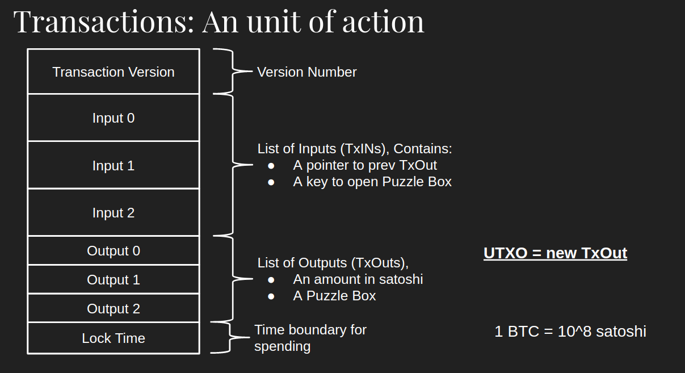

# Bitcoin 블록구조

---

[TOC]

---


## Overview

비트코인의 블록은 **Header**와 **Transaction(거래)**으로 구성되어 있다.


## Header

실제 [예시](https://www.blockchain.com/btc/block/1)를 참고한다.


### 1. Version

비트코인의 **어떤 버전**을 쓰고 있는지를 표기한다. 이는 소프트웨어 프로토콜 업그레이드 추적을 위한 버전 번호이기도 하다.

### 2. Previous Block Header Hash

블록체인을 **체인**으로 만드는 중요한 개념으로, 해시는 실제로 블록 전체가 아닌, **헤더**를 해시한다. **이전 블록(N-1번째 블록)에 대한 헤더 해시**를 직접 계산(정확히는 2번 해시)하여 헤더에 넣는다.

### 3. Time Stamp

유닉스 타임(1970년 1월 1일) 기준으로 초 단위 해당 **블록 채굴 시각**을 기록하게 된다.

### 4. Merkle Tree

> 구성 방법

트랜잭션 수(Number of Transactions)만큼의 Tx들을 각각 해싱하여 2개씩 짝지어서 또 해싱하고, 이를 반복해 **최종적으로 하나라 남을 때까지 해싱한 트리**이다. 머크 트리를 구성하는 과정은 다음과 같다.

1. 최초 데이터(트랜잭션)를 **SHA256 형태의 해시값**으로 변환한다.
2. 가장 가까운 노드 2개를 한 쌍으로 묶어 합친 후 해시값으로 변환한다.
3. 계속해서 해시값으로 변환하여 마지막 하나가 남을 때까지 이 과정을 반복한다.

> 이점

머클 루트는 모든 거래정보를 포함하나 항상 64자로 길이가 일정하기 때문에, 라이트 노드들이 최소한의 정보로 블록이나 거래 유효성을 검사할 수 있다. 하나의 트랜잭션이 변조되면 머클 루트까지 모든 값이 바뀌게 되는 **쇄도 효과(Avalanche Effect)**가 있기 때문이다.

> 한계 및 극복 방안

하지만, 머클 루트를 활용해 블록 자체의 유효성은 판단할 수 있지만, 포함되어 있는 개별 트랜잭션을 검증하기는 어렵다.  이 경우 **풀 노드(Full Node)**에게 **머클 경로**를 받음으로써 쉽게 검증을 할 수 있다. 머클 경로를 따라가다 보면 머클 루트와 결과값이 같은지 알 수 있으며, 다른 경우 잘못된 트랜잭션임을 알 수 있다.

> 중요성

머클트리가 다음과 같은 이유로 중요하게 여겨진다.

1. 데이터 유효성 검증을 O(log_2 N)만에 할 수 있다.
2. 모든 데이터를 가지고 있지 않아도 머클루트와 머클경로로 해결할 수 있기 때문에 용량 절감이 엄청나다.

### 5. Difficulty Bit

- **난이도(Difficulty)**: 해당 블록을 채굴할 때의 난이도로, 숫자는 블록의 높이에 따라 자동 설정된다.
- **목표값(Bit)**: 블록 생성 시 해당 난이도에 맞는 목표값으로, 이 수는 계수와 지수로 이루어져 있다.

$$
Difficulty = MaxTarget / CurrentTarget
$$

- `Max Target`: **첫 난이도**로, 비트코인 블록체인이 처음 구동될 때 설정된 난이도 값 1을 의미하며, 4byte(1byte=8bit)로 `1d00ffff`라고 표기되었다.

- `Current Target`: 목표값.
  $$
  목표값(target) = 계수*2^(8(지수-3))
  $$
  예를 들어, `bits = 386,632,843 = 0x170b8c8b`일 때, 첫 1byte는 지수, 이후 3byte는 계수가 된다. 즉, 해당 bits의 지수는 `0x17`, 계수는 `0x0b8c8b`이며, 목표 값은 `0x0b8b8c * 2 ^ (0x08(0x17 - 0x03)) = 756875 * 2 ^ (8 * (23-3)) = 1.106174051754828e.54`이 된다. 이 10진수 값을 다시 16진법으로 변화하면 **목표 해시값**이 나오게 된다. (`0x0000 0000 0000 0000 000b 8c8b 0000 0000 0000 0000 0000 0000 0000 0000 0000 0000`)

  그리고 블록 헤더 해시값은 이 목표값보다 작은 값을 찾아서 넣어주는데, 이 과정을 채굴이라고 한다. 목표값이 낮아지면 난이도가 높아졌음을 의미하는데, 특정 길이의 공간에서 **앞자리 0의 숫자(Leading Zeros)**가 길수록 난이도가 높다고 표현할 수 있다.

**자동 난이도 조절**

비트코인은 10분에 블록 1개가 생성될 수 있도록 난이도가 자동 조절된다.
$$
Next Difficulty = Current Difficulty * 2 weeks / T (Time in which previous 2016 blocks found)
$$

6. ### Nonce

논스(Nonce)는 모든 랜덤한 과정에  있어서 유일하게 변하는 값(Number+Once)이다. 논스는 0부터 시작해서 무수히 큰 숫자까지 증가시키며 목표값보다 낮은 해시 결과값을 찾도록 쓰인다.

> 채굴 과정

모든 채굴 과정은 논스를 무작위 대입하여, 계산되는 블록 해시값이 특정 숫자(목표값)보다 작아지도록 하는 논스 값을 찾아내는 과정이다.즉,  블록 해시가 특정 숫자보다 낮게 나올 때의 논스값이 바로 작업 증명을 나타내는 논스값이다.


## Transaction



하나의 트랜잭션은 위와 같은 모양이며, 다양한 데이터 구조들로 구성되어 있다.

### 1. Transaction Version

네트워크에서 트랜잭션의 유형을 지정하는 버전 번호이다. 트랜잭션은 버전 별로 구조와 규칙이 조금씩 다르다.

### 2. Lock Time

Lock Time(잠금 시간)은 트랜잭션을 블록체인에 바로 포함시킬 수 있는지, 아니면 지정된 시간이 지나면 포함시킬 수 있는지를 지정한다.


### 3. Inputs

**포인터(Pointer)**와 **해제키(Unlocking Key)**가 들어있다. 포인터(Pointer)는 이전 트랜잭션의 출력을 가리키며, 키(Key)는 포인터로 가리키고 있는 이전 출력을 해제하는 데 사용된다.

- **Prev. Tx ID, TxIndex**: 해제하고자 하는 이전의 출력을 가리키는 포인터
- **ScriptSig**: 이전의 출력을 해제하는 키

### 4. Outputs

**잠금(Lock)**과 **값(Value)**으로 구성되어 있다. 기본적으로 잠겨있으며, 값(Value)은 출력 내에 잠겨있는 사토시(비트코인의 단위)의 양을 의미한다.

- **ScriptPubkey**: 잠금. ScriptPubkey의 소유자(해당 공개키의 소유자)만이 ScriptSig를 만들 수 있다.
- **Amount**: 잠긴 비트코인의 양(단위: 사토시)

```markdown
예시
트랜잭션 출력은 일종의 5만원 권, 트랜잭션 입력은 지불할 치킨 값 2만원과 비슷하다. 그리고 남은 3만 원은 돈을 지불한 사람에게 돌려주어야 하기 때문에, 새로운 출력을 만든다.
```

정리하자면, 출력에는 자산이 잠겨있고, 입력으로 출력을 해제하여 출력에 있는 값을 꺼내, 새로운 출력에 자산을 담는다. 따라서, **트랜잭션은 이전 출력을 해제하고, 새로운 출력을 만드는 추상적인 액션**이라고 볼 수 있다. 그리고 **입력에 의해 생성된 후, 다른 입력에 의해 해제되지 않은 트랜잭션 출력을 UTXO**라고 한다.


***Copyright* © 2022 Song_Artish**