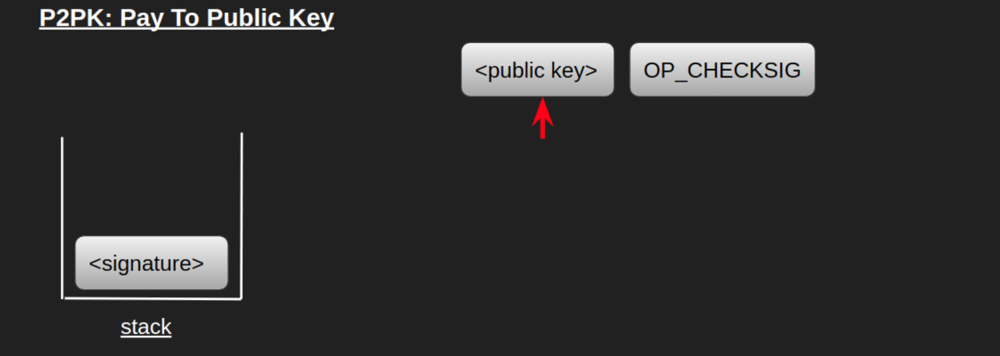
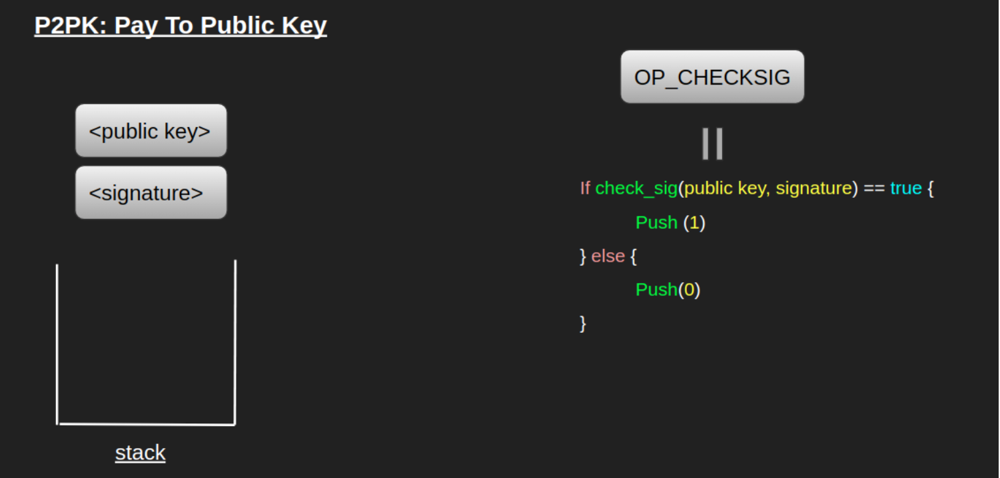
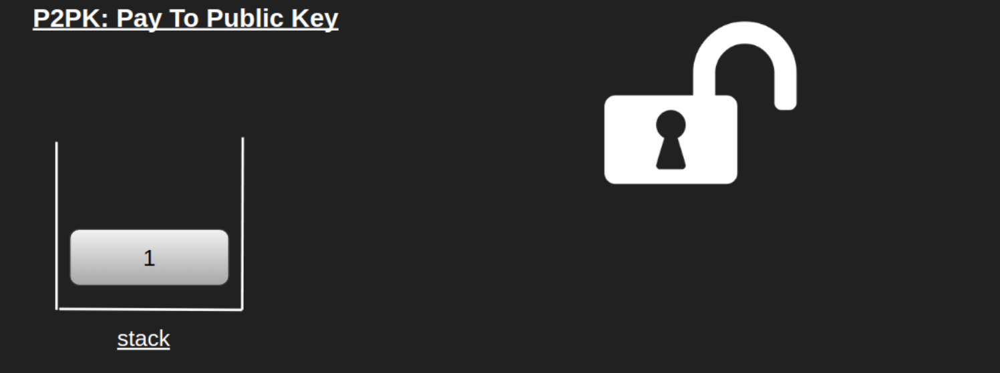
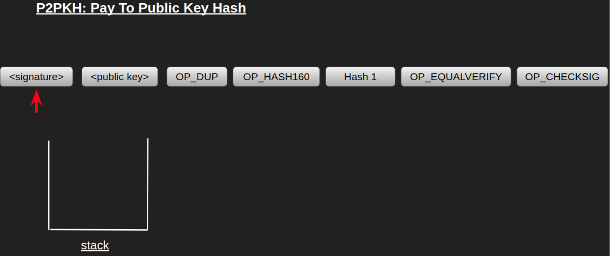
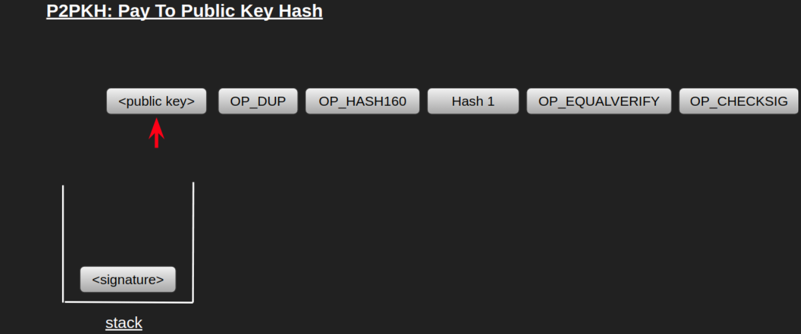
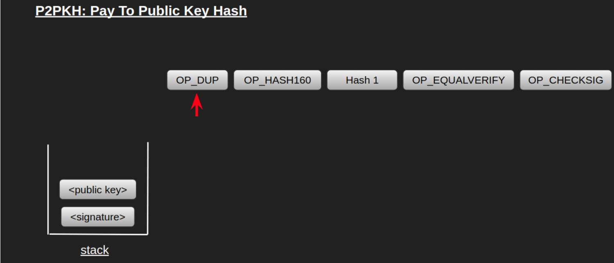
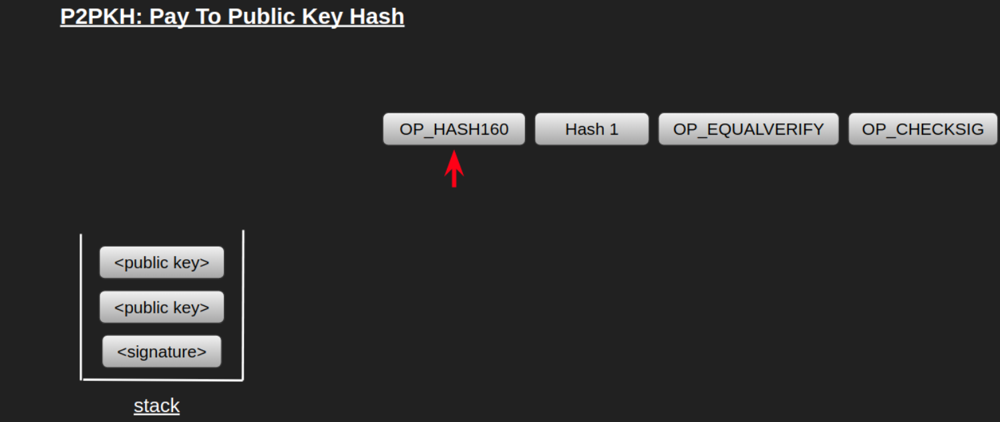
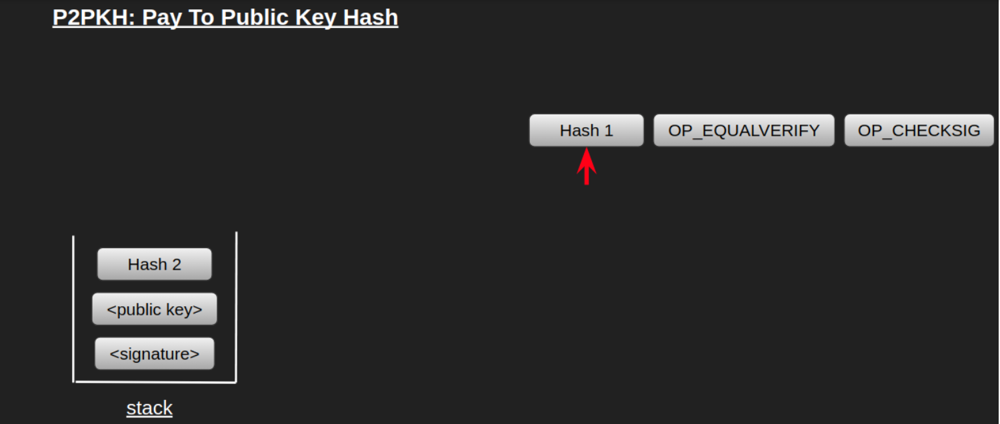
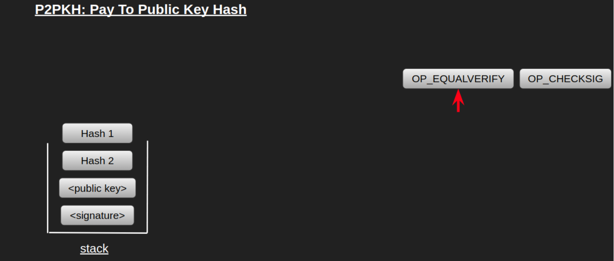
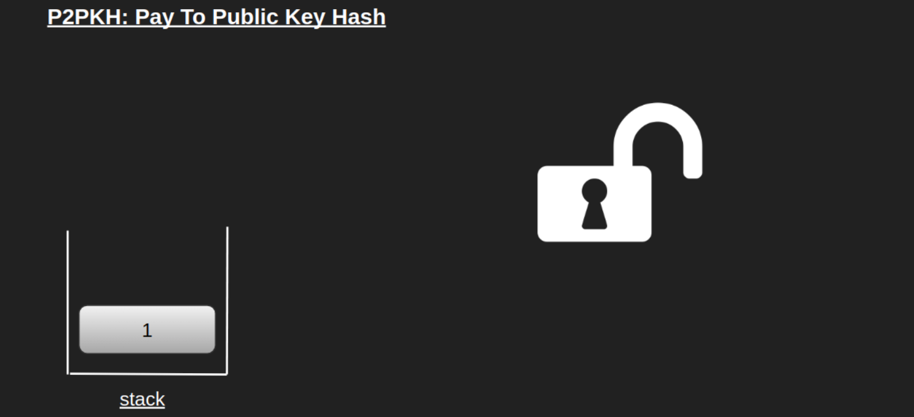

# Bitcoin에서의 Smart Contract

---

[TOC]

---


## 배경지식

### 트랜잭션 구조


하나의 트랜잭션은 위와 같은 모양이며, 다양한 데이터 구조들로 구성되어 있다.

- **Transaction Version**

  네트워크에서 트랜잭션의 유형을 지정하는 버전 번호이다. 트랜잭션은 버전 별로 구조와 규칙이 조금씩 다르다.

- **Lock Time(잠금 시간)**

  트랜잭션을 블록체인에 바로 포함시킬 수 있는지, 아니면 지정된 시간이 지나면 포함시킬 수 있는지를 지정한다.


- **Inputs**

  **포인터(Pointer)**와 **해제키(Unlocking Key)**가 들어있다. 포인터(Pointer)는 이전 트랜잭션의 출력을 가리키며, 키(Key)는 포인터로 가리키고 있는 이전 출력을 해제하는 데 사용된다.

  - **Prev. Tx ID, TxIndex**: 해제하고자 하는 이전의 출력을 가리키는 포인터
  - **ScriptSig**: 이전의 출력을 해제하는 키

- **Outputs**

  **잠금(Lock)**과 **값(Value)**으로 구성되어 있다. 기본적으로 잠겨있으며, 값(Value)은 출력 내에 잠겨있는 사토시(비트코인의 단위)의 양을 의미한다.

  - **ScriptPubkey**: 잠금. ScriptPubkey의 소유자(해당 공개키의 소유자)만이 ScriptSig를 만들 수 있다.
  - **Amount**: 잠긴 비트코인의 양(단위: 사토시)

```markdown
예시
트랜잭션 출력은 일종의 5만원 권, 트랜잭션 입력은 지불할 치킨 값 2만원과 비슷하다. 그리고 남은 3만 원은 돈을 지불한 사람에게 돌려주어야 하기 때문에, 새로운 출력을 만든다.
```

정리하자면, 출력에는 자산이 잠겨있고, 입력으로 출력을 해제하여 출력에 있는 값을 꺼내, 새로운 출력에 자산을 담는다. 따라서, **트랜잭션은 이전 출력을 해제하고, 새로운 출력을 만드는 추상적인 액션**이라고 볼 수 있다. 그리고 **입력에 의해 생성된 후, 다른 입력에 의해 해제되지 않은 트랜잭션 출력을 UTXO**라고 한다.


### UTXO

> Unspent Transaction Output


UTXO는 입력에 의해 생성된 후, 다른 입력에 의해 해제되지 않은 트랜잭션 출력이며, 비트코인을 담고 있는 상자이다.

처음 비트코인을 가지게 되면 블록체인에서는 UTXO를 하나만 가지고 있을 것이다. 그리고 트랜잭션이 일어나면 누군가에게 코인을 전달해야 하기 때문에 UTXO 상자에서 코인을 모두 꺼내고, 새로운 상자에 지불해야 할 코인을 담아 전달하고, 다른 새로운 상자에는 남은 코인을 저장한다.


위 그림의 거래에서 보면, 트랜잭션은 입력을 통해 우선 10BTC가 든 출력을 해제한 후에 2가지 새로운 출력을 만든다. 하나는 Bob에게 지불되어야 할 6BTC가 든 출력, 다른 하나는 Alice에게 거슬러줄 4BTC가 든 출력이다. 이 새로운 추력들은 아직 다른 입력에 의해 해제되지 않았기 때문에 UTXO(미사용 트랜잭션의 출력값)가 된다.

UTXO 모델은 확장성이 좋다는 장점이 있다. 트랜잭션 로직이 매우 단순하기 때문에 병렬적으로 트랜잭션을 검증할 수 있다.


## Bitcoin Script

비트코인에서는 **스크립트(Script)**라는 스크립터 언어를 사용해 스마트 컨트랙트를 구현한다. 비트코인 스크립트는 공식적인 문법이나 구문이 대신, Opcode라고 하는 간단한 연산 목록으로 구성되어 있으며, C++로 작성되어 있다.

> **Opcode(오피코드)**: 비트코인에서 스마트 컨트랙트를 동작시키는 연산들의 집합

스크립트는 트랜잭션에 연결되어 있다. 네트워크의 모든 노드는 트랜잭션을 받을 때마다 자신의 로컬 컴퓨터에서 트랜잭션에 연결된 스크립트를 실행하며 이를 통해 비트코인의 송금이 이루어진다. 이러한 특징으로 인해 비트코인은 **프로그래밍 가능한 화폐(Programmable Money)**에 대한 대중성을 부여했다고 볼 수 있다.


### 입력값/출력값

노드는 peer로부터 트랜잭션을 받으면 먼저 해당 트랜잭션 안에 들어있는 입력과 출력 목록에서 각 입력과 출력에 해당하는 ScriptSig와 ScriptPubkeys를 추출한다. 그리고 기존 블록들을 찾아보며 입력과 연결된 이전 출력을 찾고, 각 입력과 출력에 들어있는 ScriptSig와 ScriptPubkey를 연결시킨다. ScriptSig와 ScriptPubkey는 각각 연속적인 정보를 담고 있다. 노드가 ScriptSig와 ScriptPubkey를 연결하고 그 연결한 전체 sequence를 파싱하면 온전한 스크립트 코드가 나타나게 된다. 노드는 이 코드를 단계별로 실행한다.


### 동작 원리

스크립트는 역폴란드 표기법(Reverse Polish Notation)으로 작성된 스택 기반 튜링 불완전 언어로, **스택** 구조(FILO)로 작동한다. 스크립트는 빈 스택에서 시작하며, 이 스택에서 데이터가 들어오거나(Push) 나가게(Pop) 된다. 스크립트 프로그램은 두 종류의 객체를 가지고 있다.

- Opcode: 덧셈, 뺄셈, 곱셈과 같은 연산 작업을 나타낸다.
- 데이터: OP_CODE가 아닌 모든 데이터는 원시 데이터로 해석되며, 스택에 들어가게 된다.

> **Opcode**
>
> low-level 기계 언어로, 약 140 종류의 연산이 있으며, 다음과 같다.
>
> - 스택 조작 연산: POP, PUSH, DUP, SWAP
> - 산술/비교/비트연산: ADD, SUB, GT, LT, OR
> - 환경 연산: CALLER, CALLVE, NUMBER
> - 메모리 조작 연산: MLOAD, MSTORE, MSTORES, MSIZE
> - 스토리지 조작 연산: SLOAD, SSTORE
> - 프로그램 카운터 관련 연산: JUMP, JUMPI, PC, JUMPDEST
> - 작업 중지 연산: STOP, RETURN, REVERT, INVALID, SELFDESTRUCT

스크립트는 이 Opcode와 DATA를 일렬로 늘어놓은 것이다. 여기서 포인터(Pointer)는 일렬로 늘어진 Opcode와 데이터를 순서대로 하나씩 가리킨다. 만약 포인터가 데이터를 가리키면 데이터를 스택에 넣고, Opcode를 가리키면 스택에서 데이터를 꺼내온다.

스크립트 실행이 성공적이면, 스택의 가장 상단에 있는 요소는 1(TRUE)이 된다. 만약 스크립트를 끝까지 실행했는데도 스택 최상단이 1이 아닌 다른 값이 들어있다면 스크립트 실행을 실패한 것으로 간주한다.

노드가 네트워크로부터 새로운 트랜잭션을 받으면, ScriptSig와 ScriptPubkey 필드를 추출하여 연결하여 최종적으로 `<ScriptSig>` `<ScriptPubkey>` 형태의 스크립트를 얻게 된다. 노드는 이 스크립트와 빈 스택 하나를 사용해 스크립트를 실행하고, 실행이 완료되면 최상위 스택 요소가 1인지 확인한다. 1이면 트랜잭션이 유효하다고 간주하고 노드는 트랜잭션을 주변 노드들에게 전파한다. 만약 트랜잭션이 유효하지 않은 경우 트랜잭션을 공유하지 않는다.


### 자주 쓰이는 비트코인 스크립트

#### P2PK(Pay To PubKey)

두 개의 데이터와 하나의 Opcode만 사용하는 가장 간단한 종류의 비트코인 스크립트으로, 퍼블릭 키에 직접 코인을 송금하는 데 사용한다. 비트코인 초기 버전에서 사용되었으나, 수신자의 공개 키를 직접 노출하기 때문에 보안에 취약하여 오늘날에는 사용하지 않는다.


- ScriptSig: 해제 키를 정의하는 데이터 구조로, 트랜잭션 입력(Input) 내부에 존재한다.
- ScriptPubkey: 잠금을 정의하는 데이터 구조로, 트랜잭션 입력이 잠금 해제하려는 이전 트랜잭션의 출력(Output)에서 추출된다.

"잠금을 해제한다"는 것은 ScriptSig와 ScriptPubkey를 연결하여 스크립트 코드로 만들어 실행하고, 실행 후 스택 최상단에 값이 1인 요소를 남기는 프로세스이다. `OP_CHECKSIG`(Opcode)는 서명이 주어진 공개 키와 연결되었는지 확인하고, 연결되면 스택에 1을 반환하고, 아니면 0을 반환한다. 자세한 순서는 다음과 같다.

1. 빈 스택에서 포인터가 서명(`<signature>`)을 가리킨다.

   

2. 서명은 데이터(`<>`로 감싸져 있는 것은 데이터)이므로 스택에 들어간다. 포인터는 그 다음 요소인 공개 키(`<public key>`)를 가리킨다.

   

3. 공개 키도 데이터이니 스택에 넣는다. 포인터는 이제 `OP_CHECKSIG`를 가리킨다.

   

4. `OP_CHECKSIG`는 스택에서 item 2개(여기서는 공개키와 서명)를 꺼내는 Opcode이다. `OP_CHECKSIG`는 스택에서 공개키와 서명을 꺼내고, ECDSA 알고리즘을 사용해 서명을 검증한다. 만약 검증에 성공하면 1, 실패하면 0을 스택에 넣는다.

   > **ECDSA 알고리즘**: ECDSA(Elliptic Curve Digital Signature Algorithm)은 타원곡선 알고리즘에 디지털 서명을 추가한 알고리즘으로, 비트코인과 이더리움에서 서명을 검증할 때 사용한다.

   

5. 검증을 마치고 스택에 1이 들어있으면, 트랜잭션 검증이 완료되고 UTXO가 해제된다.

   

   스크립트가 성공적으로 실행되면 트랜잭션은 유효한 것으로 간주된다. 이전 UTXO가 소비되고, 해당 트랜잭션의 출력 목록에 따라 새로운 UTXO가 생성된다.

#### P2PKH (PayToPubKeyHash)

P2PKH에서는 ScriptPubkey가 공개 키의 **해시값**을 가지고 있어, UTXO는 수신자의 공개 키를 공개할 필요가 없어 P2PK에 비해 더 좋은 프라이버시를 제공한다.


- ScriptSig: 서명과 공개키가 들어있다.
- ScriptPubkey: 여러 개의 Opcode를 가지고 있으며, 수신자의 공개키를 해싱한 값인 Hash 1 객체가 들어있다.

자세한 순서는 다음과 같다.

1. 빈 스택에서, 포인터는 서명을 가리킨다.

   

2. 서명은 데이터(`<>`에 감싸져있으면 데이터)이기 때문에 스택에 들어가고, 포인터는 다음 요소인 공개 키를 가리킨다.

   

3. 공개 키도 데이터이기 때문에 스택에 들어가고, 포인터는 다음 요소인 `OP_DUP`을 가리킨다.

   

4. `OP_DUP`은 스택 최상단 요소를 복사(Duplicate)하는 Opcode이다. `OP_DUP`이 실행되면 스택에는 공개 키가 두 개 쌓이게 된다. 포인터는 다음 요소인 OP_HASH160을 가리킨다.

   

5. `OP_HASH160`은 스택 최상단 요소를 해싱하는 Opcode이다. 최상단에 있는 공개 키가 해싱되어 Hash 2가 된다. 포인터는 다음 요소인 Hash 1을 가리킨다.

   

6. Hash 1은 데이터이기 때문에 스택에 쌓인다. 포인터는 다음 요소인 `OP_EQUALVERIFY`를 가리킨다.

   

7. `OP_EQUALVERIFY`는 스택에 있는 두 요소가 같은지 확인하는 op_code이다. 만약 두 요소가 같다면, 해당 요소 두 개를 제거하고, 다르다면 실행에 실패(오류 발생)하게 된다.

   만약 ScriptSIg에 올바른 공개 키가 들어있다면 ScriptPubkey에 들어있던 Hash 1과 공개키를 해싱한 값인 Hash 2가 동일할 것이고, 스택에서 제거된다. 이제 포인터는 다음 요소인 `OP_CHECKSIG`를 가리킨다.

   

8. `OP_CHECKSIG`는 앞의 P2PK와 동일하게 동작한다. ECDSA 알고리즘으로 서명을 검증하고, 서명이 올바르면 스택에 1을 쌓는다.

   

   실행이 완료되고 1이 남았다면 검증이 성공한 것이고, UTXO가 해제된다.

#### 기타

P2PK와 P2PKH 외에도 직접 스크립트를 작성할 수 있다. 직접 작성한 스크립트는 regtest라는 비트코인 테스트 네트워크에서 테스트할 수 있으며, [btcdeb](https://github.com/bitcoin-core/btcdeb)라는 CLI를 사용해 스크립트를 디버깅 할 수도 있다.


## 한계

비트코인은 최초의 블록체인 알고리즘이지만 확장성, 성능 등의 한계가 존재했다. 오늘날에는 비트코인의 단점을 극복하기 위한 다양한 플랫폼과 프로젝트가 존재한다.

- **Lightning Network**

  비트코인의 트랜잭션 처리 속도(성능) 문제를 해결하기 위해 등장하였다. 트랜잭션 내용은 블록체인 외부에 저장하고, 트랜잭션의 최종 결과만 블록체인에 올린다. 트랜잭션이 블록체인 밖에서 이루어지기 때문에 트랜잭션이 처리되기까지 대기 시간이 필요하지 않아 즉시 처리된다. 핵심 기술은 다음과 같다.

  - 다중 서명(Multi-Sig): 블록체인 외부에서 트랜잭션을 실행할 때는 계약 당사자들끼리 합의를 진행하고, 트랜잭션 결과를 체인에 기록할 때 계약 당사자들의 개인 키로 공동 계좌를 만들어 비밀 키를 생성
  - 시간 잠금 계약(Hashed Timelock Contract): 일정 시간이 지나 트랜잭션이 확정되었을 때까지 트랜잭션을 변경할 수 없게 하여 계약 당사자가 트랜잭션을 임의로 수정하지 못하도록 함

- **Rootstock(RSK)**

  비트코인에 스마트 컨트랙트 기능을 탑재하는 사이드 프로젝트로, 비트코인의 스크립트의 불완전한 튜링, 연산에 대한 수수료 문제 등을 해결하기 위해 등장하였다. 2-Way peg를 이용해 비트코인에 **튜링 완전한 스마트 컨트랙트**를 지원하는 블록체인을 쌍방향으로 연결하여, 병합 채굴(Merge-Mining)을 통해 비트코인 채굴 노드가 사이드체인 블록까지 채굴할 수 있도록 연결한다.

- **TapRoot**

  2021년 11월에 이루어진 비트코인 업그레이드로, 슈노르 서명과 MAST 등 중요한 사항들이 포함되어 있다.

  - 슈노르 서명(Schnorr Signature)

    기존의 서명 방식인 `다중 서명 방식`의 단점을 보완하기 위해 도입되었다. 다중 서명은 여러 개의 서명을 받기 때문에, 트랜잭션의 크기가 커져 외부에서 추적하기 쉬어 프라이버시에 취약했으며, 트랜잭션 처리 속도에 영향을 주었다. 슈노르 서명은 여러 개의 서명을 기반으로 하나의 공동 서명을 만들기 때문에 트랜잭션의 크기가 커지지 않는다.

  - MAST(Merkelized Abstract Syntax Tree, 머클 추상화 구문트리)

    비트코인 스크립트에서 해시 값을 추출하는 자료구조로, 스크립트의 조건 중 필요한 부분만 먼저 검증할 수 있도록 하였다. 또한, MAST를 슈노르 서명과 결합시키는 경우, 서명을 한 번만 해도 트랜잭션이 이루어질 수 있기 때문에 속도가 개선되고 효율성이 증대되는 효과가 있다.


***Copyright* © 2022 Song_Artish**