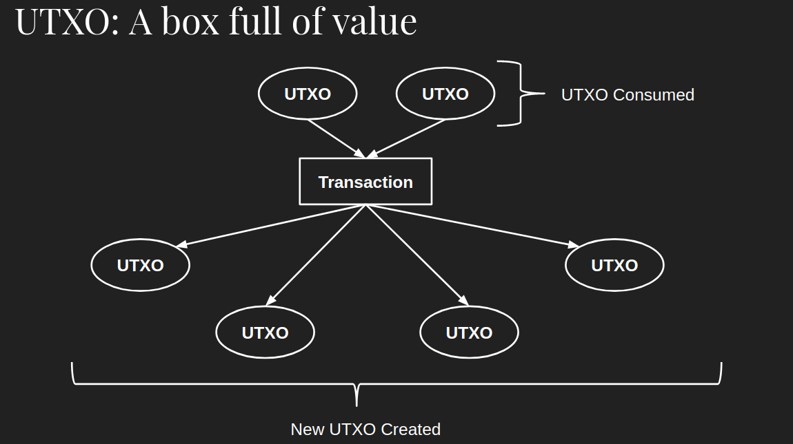
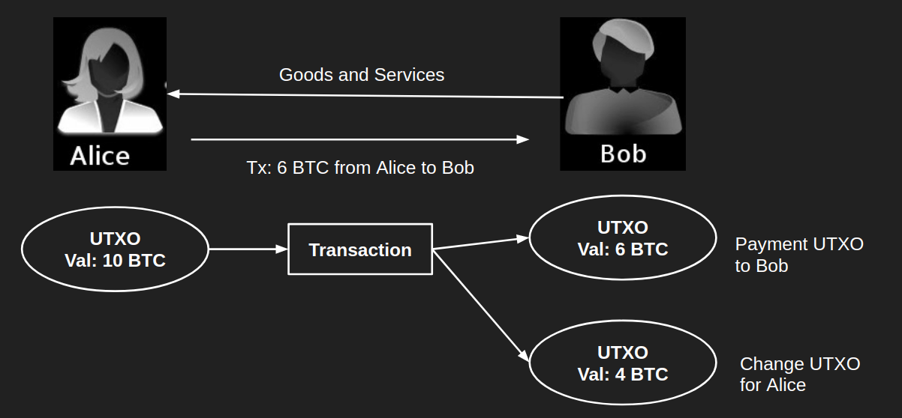

# Bitcoin UTXO

---

[TOC]

---

## UTXO

> Unspent Transaction Outpus

UTXO(Unspent Transaction Outpus)는 미사용 트랜잭션 출력값(미지출 거래 출력)을 뜻한다. 비트코인은 계정이나 잔고가 없고, 블록체인에 기록된 **소비되지 않은 출력 값**을 통해 거래의 유효성을 검사하여 코인의 존재 여부를 확인한다. 따라서 비트코인에서는 코인이 지갑(wallet)에 저장되지 않고 UTXO에 저장된다고 보면 된다.

UTXO는 입력에 의해 생성된 후, 다른 입력에 의해 해제되지 않은 트랜잭션 출력이며, 비트코인을 담고 있는 상자이다.

## 예시

처음 비트코인을 가지게 되면 블록체인에서는 UTXO를 하나만 가지고 있을 것이다. 그리고 트랜잭션이 일어나면 누군가에게 코인을 전달해야 하기 때문에 UTXO 상자에서 코인을 모두 꺼내고, 새로운 상자에 지불해야 할 코인을 담아 전달하고, 다른 새로운 상자에는 남은 코인을 저장한다.

위 그림의 거래에서 보면, 트랜잭션은 입력을 통해 우선 10BTC가 든 출력을 해제한 후에 2가지 새로운 출력을 만든다. 하나는 Bob에게 지불되어야 할 6BTC가 든 출력, 다른 하나는 Alice에게 거슬러줄 4BTC가 든 출력이다. 이 새로운 추력들은 아직 다른 입력에 의해 해제되지 않았기 때문에 UTXO(미사용 트랜잭션의 출력값)가 된다.

## 특징

**장점**

- **이중 지불 방지**: 트랜잭션을 발생시키면 해당 UTXO는 검증을 받은 후 TX Pool에 들어간다. 그러므로 이중지불이 발생하면 채굴자들은 Pool에서 UTXO 검사 후 사용 기록이 있다면 해당 거래를 무효화할 수 있다.

- **잔고의 증명**: 추적하기가 용이하여, 거래에 대한 유효성을 검증하기가 매우 쉽다.

- 확장성이 좋다.

- 트랜잭션 로직이 매우 단순하기 때문에 병렬적으로 트랜잭션을 검증할 수 있다.

  

**단점**

- UTXO가 너무 과하게 생성될 경우: 잔고 조회 시 흩어져 있는 UTXO를 모두 모아야 되기 때문에, 소액 결제를 자주하거나, 채굴로 이자를 받게 되면 과도한 UTXO로 인해서 불필요한 수수료를 내야할 수 있다.

***Copyright* © 2022 Song_Artish**