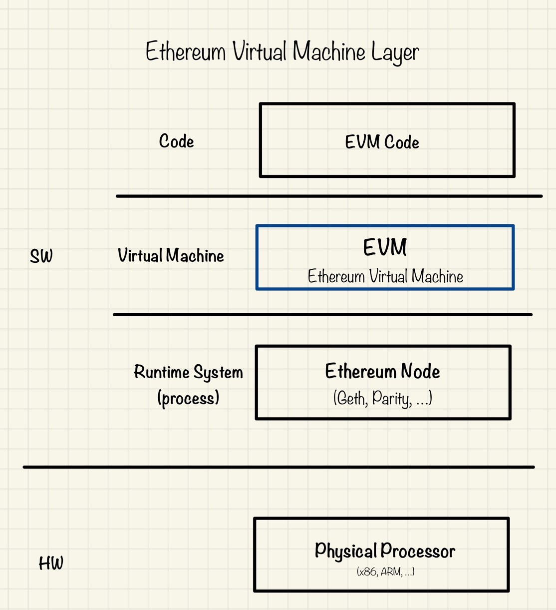
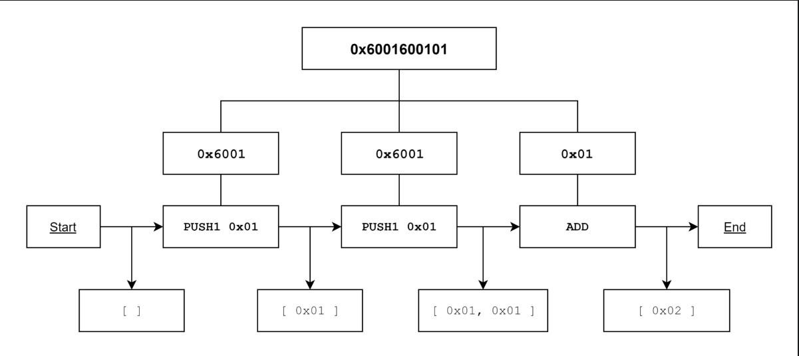

# Ethereum에서의 Smart Contract

---

[TOC]

---


## Overview

이더리움은 블록체인 기술을 활용해 스마트 컨트랙트와 암호화폐 거래를 제3자 없이 안전하게 이뤄질 수 있도록 하는 오픈소스 퍼블릭 서비스로, 누구든지 분산형 어플리케이션(dApp)을 이더리움 네트워크에 배포할 수 있다.

이더리움은 개발자들이 dApp을 만들 수 있도록 튜링 완전한 언어인 **솔리디티(Solidity)**를 제공하였으며, 이더리움 네트워크에 올라간 솔리디티 코드는 **EVM(Ethereum Virtual Machine)**을 통해 실행된다.


## EVM

> **Virtual Machine**: 가상머신(VM)은 프로그램과 하드웨어(컴퓨터) 사이에 존재하는 계층으로, 소프트웨어의 이식성을 향상시키고, 애플리케이션이 서로 분리되어 독립적으로 실행할 수 있도록 한다.

EVM(Ethereum Virtual Machine)은 작성한 코드(EVM code)와 이더리움 블록체인 사이에 있는 가상 머신으로, 블록체인에서 코드가 실행될 수 있도록 한다.



### 흐름

EVM은 기계이기 때문에 솔리디티 언어를 **바이트코드(bytecode)**로 변환해주고, 이후 바이트코드를 EVM이 해석할 수 있는 OP 코드로 변환 후 비로소 코드를 실행할 수 있다.

1. 솔리티디 언어로 코드를 작성한다.
2. solc라는 이더리움 컴파일러를 EVM이 읽을 수 있는 **바이트코드(bytecode)**로 변환해준다.
3. Geth를 이용해 바이트코드를 이더리움 네트워크에 올리면, EVM에서 바이트코드를 Opcode로 변환하여 실행한다.

### 작동 방식

내부적으로 EVM은 Opcode(명령어 집합)을 사용하여 특정 작업을 실행한다. Opcode를 효율적으로 저장하기 위해, Opcode는 바이트코드(Bytecode)로 인코딩된다. 모든 Opcode에는 1byte가 할당되며, 100개가 넘는 고유한 Opcode가 있어 충분한 리소스만 있다면 무엇이든 계산할 수 있다.

Opcode는 다음과 같이 분류할 수 있다.

- 스택 조작 연산: POP, PUSH, DUP, SWAP
- 산술/비교/비트연산: ADD, SUB, GT, LT, AND, OR
- 환경 연산: CALLER, CALLVALUE, NUMBER
- 메모리 조작 연산: MLOAD, MSTORE, MSTORES, MSIZE
- 스토리지 조작 연산: SLOAD, SSTORE
- 프로그램 카운터 연산: JUMP, JUMPI, PC, JUMPDEST
- 중지 연산: STOP, RETURN, REVERT 등

```markdown
0x00 = STOP
0x01 = ADD
...
0x60 = PUSH1
(0x60 ~ 0x7f = PUSH1 ~ PUSH32)
```




***Copyright* © 2022 Song_Artish**