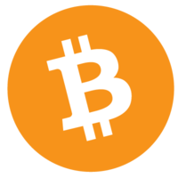

# Bitcoin Cash

## 요약

- 2017년 8월 1일 기준으로 비트코인은 블록 저장 용량을 늘리기 위해 SegWit이라는 소프트포크를 진행
- 하지만, SegWit을 진행하면 기존의 에이식부스터 방식 채굴이 불가능
- 이에 따라, 중국 채굴업체들을 중심으로 ASIC 채굴기 사용 지속을 위해 기존 비트코인 블록에서 분리된 Bitcoin Cash(BCH)를 하드포크함

## 내용

비트코인 캐시(Bitcoin Cash)는 기존 비트코인의 블록 당 저장 용량을 늘리기 위한 **세그윗(SegWit)**을 계기로 `우지한`이 이끄는 비트메인(Bitmain) , 비아비티시(viaBTC) 등 중국의 채굴업체들이 중심이 되어 새로 만든 암호화폐로 SHA-256 해시 알고리즘 기반의 작업증명(PoW) 방식으로 채굴한다.

> **세그윗(Segregated Witness, SegWit)**: 비트코인의 블록에서 디지털 서명 부분을 분리함으로써 블록당 저장 용량을 늘리는 소프트웨어 업그레이드

2017년 8월 1일을 기준으로 전 세계 비트코인은 세그윗(SegWit)이라는 소프트포크(Soft Fork)를 진행하였다. 기존의 비트코인은 거래내역을 기록하는 블록 크기가 1MB에 불과해 초당 7건, 하루 최대 60만 건의 거래내역밖에 처리하지 못하는 한계가 있었는데, 이를 해결하기 위해 비트코인 블록에서 디지털 서명 부분을 분리하여 별도로 저장함으로써, 블록당 저장 용량을 늘릴 수 있게 되었다.

한편, 세그윗을 진행할 경우 중국의 채굴업자들이 사용하던 **에이식부스트(AsicBoost)** 방식의 비트코인 채굴이 불가능해지기 때문에, 앤트풀(Antpool), 비아비티시(viaBTC) 등 중국의 채굴업체들을 중심으로 기존 ASIC 채굴기를 사용한 비트코인 채굴을 지속하기 위해 기존 비트코인 블록에서 분리된 비트코인 캐시(BCH, Bitcoin Cash)라는 이름의 새로운 암호화폐를 생성했다.

> **에이식부스터(AsicBoost)**는 비트코인 채굴 속도를 약 20% 정도 높이는 방법이다.

***Copyright* © 2022 Song_Artish**