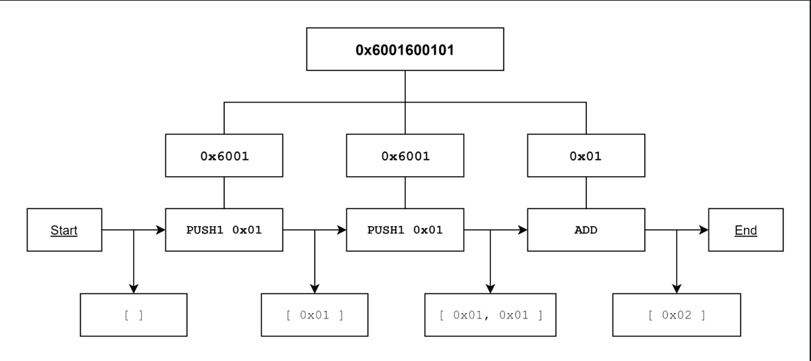
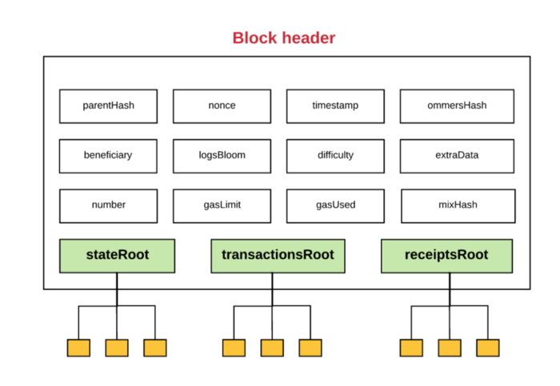
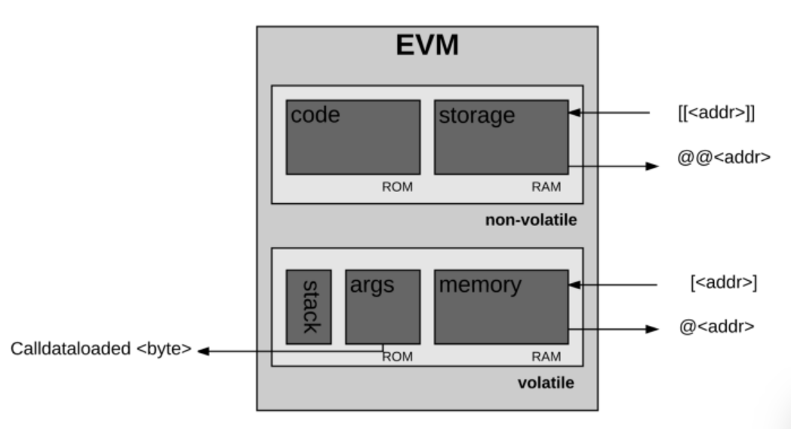
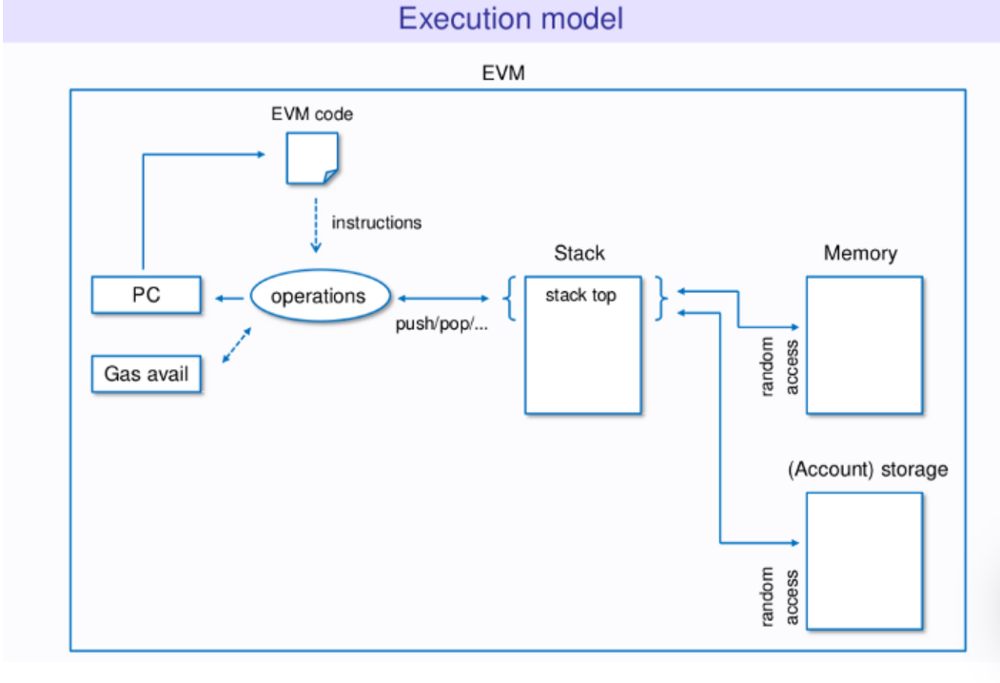

# EVM

---

[TOC]

---


## Virtual Machine

가상머신(VM)은 프로그램과 하드웨어(컴퓨터) 사이에 존재하는 계층으로, 소프트웨어의 이식성을 향상시키고, 애플리케이션이 서로 분리되어 독립적으로 실행할 수 있도록 한다.


## Ethereum Virtual Machine

EVM(Ethereum Virtual Machine)은 작성한 코드(EVM code)와 이더리움 블록체인 사이에 있는 가상 머신으로, 블록체인에서 코드가 실행될 수 있도록 한다.


## 흐름

EVM은 기계이기 때문에 솔리디티 언어를 **바이트코드(bytecode)**로 변환해주고, 이후 바이트코드를 EVM이 해석할 수 있는 OP 코드로 변환 후 비로소 코드를 실행할 수 있다.

1. 솔리티디 언어로 코드를 작성한다.
2. solc라는 이더리움 컴파일러를 EVM이 읽을 수 있는 **바이트코드(bytecode)**로 변환해준다.
3. Geth를 이용해 바이트코드를 이더리움 네트워크에 올리면, EVM에서 바이트코드를 Opcode로 변환하여 실행한다.


## 작동 방식

내부적으로 EVM은 Opcode(명령어 집합)을 사용하여 특정 작업을 실행한다. Opcode를 효율적으로 저장하기 위해, Opcode는 바이트코드(Bytecode)로 인코딩된다. 모든 Opcode에는 1byte가 할당되며, 100개가 넘는 고유한 Opcode가 있어 충분한 리소스만 있다면 무엇이든 계산할 수 있다.

Opcode는 다음과 같이 분류할 수 있다.

- 스택 조작 연산: POP, PUSH, DUP, SWAP
- 산술/비교/비트연산: ADD, SUB, GT, LT, AND, OR
- 환경 연산: CALLER, CALLVALUE, NUMBER
- 메모리 조작 연산: MLOAD, MSTORE, MSTORES, MSIZE
- 스토리지 조작 연산: SLOAD, SSTORE
- 프로그램 카운터 연산: JUMP, JUMPI, PC, JUMPDEST
- 중지 연산: STOP, RETURN, REVERT 등

```markdown
0x00 = STOP
0x01 = ADD
...
0x60 = PUSH1
(0x60 ~ 0x7f = PUSH1 ~ PUSH32)
```




## 내부 동작 구조

### 이더리움은 상태 머신

이더리움은 **거래에 기반을 둔 상태 머신(Transaction-based State Machine)**이다.

> **상태 머신**: 일련의 입력을 읽고, 그 입력을 기반으로 새로운 상태로 전환하는 것

이더리움이라는 상태 머신은 Genesis State에서 시작한다. 그리고 트랜잭션이 실행되면, 다음 상태로 전환하게 되며, 더이상 트랜잭션이 들어오지 않은 마지막 상태가 바로 이더리움의 현재 상태이다. 이더리움 상태에는 수천 개의 트랜잭션이 있으며, 이 트랜잭션은 **블록**이라는 그룹에 묶여 있고, 블록은 직전에 만들어진 블록과 이어져있다.

### EOA와 CA

이더리움에는 두 종류의 계정이 있다.

- EOA(External Owned Account)
- CA(Contract Account)

모든 계정은 주소로 식별되며, 동일한 주소 공간을 가진다. EVM은 이 160bit 길이의 주소들을 처리한다.

EOA와 CA는 모두 다음과 같이 구성되어 있다.

- Balance: 계정의 현재 이더 잔고
- Nonce: EOA의 경우 해당 EOA로부터 보내진 트랜잭션의 숫자, CA의 경우 해당 CA로부터 생성된 컨트랙트의 숫자
- StorageRoot: 머클 패트리샤 트리의 루트 노드를 해싱한 값
- Contract Code: EVM이 실행할 코드의 해싱된 값(EOA에는 코드를 저장할 수 없기 때문에 비어있음)

EOA의 주소는 상응하는 비밀키를 가지고 있지만, CA는 비밀키가 없다. 또한, CA는 스스로 새로운 트랜잭션을 만들 수 없으며, CA는 EOA나 다른 CA에게서 받은 트랜잭션에 대한 응답에 대해서만 트랜잭션을 만들 수 있다. 따라서, 이더리움 블록체인에서 일어나는 모든 액션은 항상 EOA에서 만든 트랜잭션에서부터 시작한다.

### 전역 상태

이더리움의 전역 상태는 **계정 주소**와 **계정 상태**를 매핑한 것으로 구성되어 있으며, 이 매핑은 머클 패트리샤 트리(Merkle Patricia Tree) 형태로 저장되어 있다.

이더리움 블록 헤더에는 세 개의 머클 트리 구조의 루트 노드의 해시값이 저장되어 있다.

1. State Tree: 트랜잭션과 연관된 계정의 상태 정보 저장
2. Transaction Tree: 현재 블록의 트랜잭션 정보 저장
3. Receipt Tree: 현재 블록의 거래 영수증 정보 저장



이 루트노드는 머클 트리의 특성 상 데이터에 대한 보안 ID처럼 사용될 수 있다. 또한, 블록 헤더가 상태, 트랜잭션, 영수증 트리의 루트 노드 값을 가지고 있기 때문에, 네트워크의 노드들은 모든 상태를 저장하고 있지 않더라도 이더리움의 상태 일부분을 검증할 수 있다.

### 트랜잭션과 메시지

이더리움은 트랜잭션 기반 상태 머신이기 때문에, 계정 간 일어난 트랜잭션은 이더리움의 전역 상태를 하나의 상태에서 다음 상태로 이동시킨다. 기본적으로 트랜잭션은 EOA에서 생성되고, 일련의 과정을 거쳐 블록체인에 올라간 **암호화 서명된 명령어의 집합**이다. 그 외의 트랜잭션은 **메시지 호출(Message Call)**과 **컨트랙트 생성(Contract Creations)** 두 종류로 나뉜다.

이더리움의 모든 트랜잭션은 항상 EOA에서 만들어지고 블록체인에 올라간다. 즉, 트랜잭션은 외부 세계를 이더리움 내부의 상태로 연결해주는 다리와 같으며, 그리고 연결 창구가 바로 CA이다.

이더리움 전역 상태에 있는 CA는 **메시지(Message)**나 **내부 트랜잭션(Internal Transaction)**을 통해 다른 CA와 상호작용 할 수 있으며, 오로지 CA에게서만 생성된다. 또한 메시지와 내부 트랜잭션은 일반 트랜잭션과는 다르게 EVM에만 존재하는 가상 객체이다.

한 CA가 다른 CA에 내부 트랜잭션을 보내면, 수신하는 CA에 있는 관련 코드가 실행된다.


### CA 생성

트랜잭션의 두 종류 중 **컨트랙트 생성(Contract-Creating)** 트랜잭션에 대해 다룬다.

다음의 과정을 통해 새로운 CA를 만들 수 있다.

1. Nonce를 0으로 설정한다.
2. 송신자가 CA 생성 트랜잭션에 이더를 함께 보낸 경우, 이를 CA의 잔금(Balance)으로 설정한다.
3. 잔금에서 Value 만큼을 제외한다.
4. CA의 스토리지를 빈 값으로 초기화한다.
5. CA의 코드를 빈 문자열의 해시값으로 초기화한다.

한 번 계정을 초기화하고 나면, 트랜잭션에서 보낸 init 코드를 사용해 새로운 CA를 생성할 수 있다. 이 init 코드가 실행되는 동안에는 계약 생성자에 따라 CA의 스토리지를 업데이트하거나, 다른 CA를 새롭게 생성하거나, 다른 메시지 호출을 만드는 등 다양한 일이 발생할 수 있다.

계약을 초기화하는 이 init 코드를 실행할 때는 gas를 사용한다. 트랜잭션은 남아있는 가스보다 더 많은 가스를 소비할 수 없기 때문에, 만약 남아있는 가스를 다 사용한 경우 OOG(Out-of-Gas) 예외처리와 함께 코드 실행이 종료된다. OOG로 인한 트랜잭션 종료가 발생하면 상태는 트랜잭션 실행 이전 상태로 돌아간다.

> 이더리움에서는 트랜잭션에 있는 연산을 수행할 때마다 비용을 청구하는데, 이 비용의 단위를 Gas라고 한다. 트랜잭션을 보낼 때는 코드에 수행되는만큼의 가스를 함께 보내야 한다.

트랜잭션이 실패해도 트랜잭션 송신자는 소진된 가스를 환불받을 수 없다. 그러나 송신자가 트랜잭션과 함께 이더 값을 보낸 경우, 이더는 환불된다.

init 코드가 성공적으로 실행되면, 마지막으로 CA 코드에 대한 비용이 지불된다. 이 비용은 스토리지 비용이며, 생성된 CA 코드의 크기에 비례한다. 만약 CA 코드에 대한 비용 지불 가스가 남아있지 않으면 트랜잭션은 OOG 예외와 함께 중단되며, 예외없이 트랜잭션 생성이 완료된 경우 미사용된 가스는 송신자에게 환불되고 변경된 상태가 저장된다.

### 메시지 호출(Message Call)

메시지 호출은 새 계정이 생성되지 않기 때문에 init 코드가 포함되지 않는다. 그러나 입력 데이터를 가지고 있을 수는 있다. 메시지 호출은 한 번 실행되면 출력 데이터를 포함한 추가적인 요소들을 가지게 될 수도 있는데, 이 추가 요소들은 뒤에 이어질 다른 실행에 필요한 데이터이다.

CA 생성과 마찬가지로, 메시지 호출은 실행할 때 가스가 부족하거나 트랜잭션이 잘못되어 종료되는 경우(stack overflow, jump 실행 결과가 올바르지 않거나, 잘못된 명령어인 경우 등) 남은 가스는 모두 소비되며, 상태는 직전 상태로 돌아간다.

### 트랜잭션 실행 모델과 EVM

트랜잭션 처리를 실제로 처리하는 프로토콜은 EVM이다. EVM의 구성 요소는 다음과 같다.

- **스택**

  EVM은 스택 기반 아키텍처를 가지고 있다. EVM 내에는 하나의 빈 스택이 있으며, 스택에 들어가는 요소의 크기는 256bit이며, 스택의 최대 크기는 1024bit이다.

- **메모리**

  메모리에서는 Word-Address 형식의 바이트 배열로 데이터를 저장한다. 휘발성이기 때문에 프로그램이 종료되면 메모리에 들어있는 데이터는 사라진다.

- **스토리**

  스토리지는 비휘발성이며 시스템 상태에 따라 유지된다. EVM은 특정한 명령어로만 접근할 수 있는 **가상 ROM**이라는 공간에 프로그램 코드를 분리해서 저장해둔다.



EVM이 솔리디티 코드를 컴파일한 바이트코드를 받으면 실행이 시작된다. 맨 처음에는 메모리와 스택은 비어있으며, 프로그램 카운터(연산 실행 횟수)는 0이다.

```solidity
PC(Program Counter): 0
Stack: []
Memory: []
Storage: {}
```

EVM은 트랜잭션을 반복적으로 실행하며, 각 사이클에서 **시스템 상태(이더리움의 전역 상태)**와 **머신 상태(Machine State)**를 계산한다. 머신 상태는 다음과 같이 구성된다.

- 사용 가능한 가스
- 프로그램 카운터
- 메모리에 들어있는 값
- 메모리에서 활성화된 단어의 수
- 스택에 들어있는 값

코드가 실행되면서 스택에 있는 요소들은 왼쪽에서부터 순서대로 추가/제거되며, 남은 가스에서 적절한 양의 가스가 제거되고, 프로그램 카운터가 올라간다.



매 사이클이 끝날 때 다음과 같은 3가지 케이스가 발생할 수 있다.

1. 예외 상황을 만나 중지되고 변경 사항이 폐기된 경우

   가스 부족, 명령어가 잘못된 경우, 스택에 잘못된 요소가 들어간 경우, 스택에 있는 요소가 1,024 bit를 넘은 경우 등

2. 다음 사이클을 돌아야하는 경우

3. 머신이 프로세스 실행을 끝낸 경우

머신이 정상적으로 실행을 마치면, 결과적으로 발생한 상태와 남아있는 가스, 발생한 세부 상태, 결과값을 생성한다.


***Copyright* © 2022 Song_Artish**