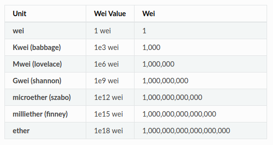

# Geth

---

[TOC]

---


## 시작하기

Geth을 Ubuntu로 실행한다. 여기서는 이에 앞서, **Docker로 Ubuntu를 실행**한다.

1. Docker에서 Ubuntu 이미지를 받아온다.

   ```bash
   docker search ubuntu
   docker pull ubuntu
   ```

   이미지가 잘 받아와졌는지 확인한다.

   ```bash
   docker image ls
   ```

2. `ubuntu` 이미지를 바탕으로 컨테이너를 생성한다. 여기서는 `con_ubuntu`라는 이름으로 컨테이너를 생성한다.

   ```bash
   docker create -it --name con_ubuntu ubuntu
   ```

3. `con_ubuntu` 컨테이너를 시작한다.

   ```bash
   docker start con_ubuntu
   ```

   실행 중인 컨테이너 목록을 확인한다.

   ```bash
   docker ps
   ```

4. 터미널에 컨테이너를 연결한다.

   ```bash
   docker attach con_ubuntu
   ```

   git-bash에서 위 명령어가 작동하지 않을 경우, 앞에 `winpty`를 붙여준다.

   ```bash
   winpty docker attach con_ubuntu
   ```

5. 터미널에서 컨테이너를 세팅한다.

   ```shell
   apt update -y && apt install -y software-properties-common
   add-apt-repository ppa:ethereum/ethereum
   
   apt-get install vim -y
   apt update -y && apt install geth
   apt-get install git -y
   cd ~
   git clone https://github.com/ethereum/go-ethereum
   apt-get install -y build-essential golang
   ```

   설치한 geth의 버전을 확인한다.

   ```shell
   geth version
   ```

   

## <실습> 계정 생성과 채굴

### 1. 로컬 테스트넷에서 Geth 실행하기

로컬 테스트넷에서 Geth을 실행하기 위해서는 **데이터 디렉터리**와 `genesis.json` 파일이 필요하다.

- **데이터 디렉터리**: 1) 송수신한 블록 데이터 2) 계정 정보를 저장
- **`genesis.json`**: Genesis 블록 정보가 저장된 json 형태의 텍스트 파일

1. 데이터 디렉터리와 `genesis.json` 파일을 생성한다.

```
go-ethereum
ㄴ test_data	// 폴더
ㄴ genesis.json
```

2. geth를 실행하여 정상적으로 작동하는지 확인한다.

   ```shell
   geth
   ```

3. geth이 정상적으로 실행되면 `ctrl` + `c`를 눌러 실행을 종료한다.

### 2. Geth console을 사용하여 계정 생성

1. 계정을 생성한다.

   ```shell
   geth --datadir test_data account new
   ```

   :ballot_box_with_check: 비밀번호를 입력하면 **계정의 주소값**이 나온다. 이 주소값은 `genesis.json` 파일에서 사용하기 때문에 기억해둔다.

2. 계정이 잘 생성되었는지 확인한다.

   ```노디ㅣ
   geth -datadir test_data account list
   ```

### 3. Genesis Block 생성

1. genesis.json` 파일을 연다.

   ```shell
   vim genesis.json
   # 혹은
   nano genesis.json
   ```

2. 터미널에 다음의 내용을 붙여 넣고 저장한다.

   ```json
   {
       "config": {
           "chainId": 8484,
           "homesteadBlock": 0,
           "eip150Block": 0,
           "eip155Block": 0,
           "eip158Block": 0
       },
       "difficulty": "20",
       "gasLimit": "2100000",
       "alloc": {
           "<계정의 주소값>": { "balance": "999999999999999999999" }
       }
   }
   ```

   `genesis.json`의 속성값의 의미는 다음과 같다.

   - `config`: 이더리움 관련 설정 포함

     - `config.chainId`: 현재 chain을 구별하는 값으로 [replay attack](https://en.wikipedia.org/wiki/Replay_attack)을 보호해주는 역할을 한다.

     ```markdown
     아래 4가지 설정(`config.homesteadBlock`, `config.eip150Block`, `config.eip155Block`, `config.eip158Block`)은 사설 블록체인을 만들 때 기본적으로 동일한 설정이다.
     ```

     - `config.homesteadBlock`: 속성값이 0인 경우 true를 의미한다.

       > homestead는 이더리움 4단계 로드맵(Frontier-Homestead-Metropolis-Serenity) 중 두 번째 메이저 단계이다.

     - `config-eip150Block`: IO가 맣은 작업에 대한 가스 변경 비용을 위한 설정: [EIP-150(Gas cost changes for IO-heavy operations)](https://github.com/ethereum/EIPs/blob/master/EIPS/eip-150.md)

     - `config-eip155Block`: replay attack을 막기 위한 설정: [EIP-155(Simple replay attack protection)](https://github.com/ethereum/EIPs/blob/master/EIPS/eip-155.md)

     - `config-eip158Block`: EIP158은 계정의 상태가 변경되고, 변경된 결과값으로 인해 계정의 nonce와 balance 값이 0이 되고 code와 storage가 빈 값이 되는 경우 해당 계정을 삭제한다: [EIP-158(State clearing)](https://github.com/ethereum/EIPs/blob/master/EIPS/eip-158.md)

   - `difficulty`: 채굴 난이도. 값이 클수록 채굴 난이도가 상승한다.

   - `gasLimit`: 블록 당 담을 수 있는 가스(수수료)의 한도.하나의 블록 안에 담을 트랜잭션 개수를 결정하는데 사용하는 옵션으로, 값이 클수록 트랜잭션을 많이 보내고 다양한 테스트를 할  수 있다.

   - `alloc`: genesis block 생성과 동시에 `alloc`에 등록된 주소로 이더를 전송

     > `alloc`의 금액 단위는 wei이다.
     > 1 wei * 10^18 = 1 ether

     

     `(출처: ETH Gas Station)`

**:warning: Fatal; Failed to write genesis blcok 에러가 발생한 경우**

geth 서버 데이터가 이미 존재하는 경우 발생하기 때문에, 초기 설정에 geth 서버에 관련된 데이터를 모두 삭제한 후 계좌 생성부터 다시 시작하면 된다.

### 4. Genesis Block 생성 및 초기화

1. Genesis Block을 생성 및 초기화한다.

   ```shell
   geth --datadir test_data init test_data/genesis.json
   ```

   Successfully wrote genesis state라는 문구가 보이면 성공적으로 초기화한 것이다.

2. test_data 디렉터리에 생성된 파일을 확인한다.

   `tree` 모듈을 설치하고, tree 모듈을 사용하여 트리 형태로 디렉터리 구조를 확인한다.

   ```shell
   apt-get install tree -y	# 트리 모듈 설치
   tree test_data/
   ```

### 5. Geth 실행

geth를 초기화했다면 이제 실행해본다.

1. 아래 명령어로 geth를 실행한다.

   ```shell
   geth --networkid 8484 --nodiscover --datadir test_data -allow-insecure-unlock --http.addr 0.0.0.0 --http --http.port 8545 --http.corsdomain "*" --http.api="db,eth,net,web3,personal,web3,miner,admin" --miner.threads 1 console 2>> test_data/geth.log
   ```

   Geth 자바스크립트 콘솔이 실행되면 프롬프트 표시(`>`)가 나타난다.

   각 명령어는 다음을 의미한다.

   - `--nodiscover`: 생성자의 노드를 다른 노드에서 검색할 수 없게 하는 옵션이다. 같은 제네시스 블록과 베트워크 ID에 있는 블록들이 연결되는 것을 방지한다.
   - `--datadir test_data`: 데이터 디렉터리를 지정
   - `networkid 8484`: 네트워크 식별자
   - `http`: 이전에는 rpc였으나 현재 http로 변경됨
   - `http.addr "ip"`: IP는 현재 사용 중인 IP를 입력하면 된다.
   - `http.port "port"`: 포트 번호를 원하는 것으로 설정한다.
   - `http.corsdomain "*"`: 접속할 수 있는 RPC 클라이언트 URL을 지정하는 것으로, `"*"`인 경우 전체 허용이다.
   - `http.api "db,eth,net,web3,personal"`: rpc에 의해 접근할 수 있는 api (geth 내에서 사용할 수 있는 명령어)
   - `--maxpeers 0`: 생성자의 노드에 연결할 수 있는 노드의 수 지정. 0을 지정하면 다른 노드와 연결하지 않음
   - `console`: 대화형 자바스크립트 콘솔을 기동한다.
   - `2>> test_data/geth.log`: 로그 파일을 만들 때 사용할 옵션으로, 에러를 해당 경로의 파일에 저장.

### 6. Etherbase 설정하기

이더리움 2가지 종류의 계정이 있다.

- **EOA(Externally Owned Account)**: 일반 사용자가 사용하는 계정으로, 비밀키로 관리하며, Ether를 송금하거나 계약을 실행할 수 있다.
- **CA(Contract Account)**: 컨트랙트를 블록체인에 배포할 때 만들어지는 계정으로 블록체인에 존재한다.

Geth console에서 `personal.newAccount` 명령으로 EOA를 만들 수 있다.

1. 먼저, 처음에 만들었던 계정이 잘 등록되어 있는지 확인한다.

   ```shell
   eth.accounts
   ```

2. 새로운 계정을 추가한다.

   ```shell
   personal.newAccount('<패스워드>')
   ```

   `eth.accounts` 명령어로 확인한다.

3. 채굴 시 보상받을 계정을 선택한다.

   이더리움을 채굴하고 보상받는 계정을 **Etherbase**라고 한다. Etherbase는 `eth.coinbase` 변수에 저장되며, 기본적으로 `eth.accounts[0]`이 설정된다.

   ```shell
   miner.setEtherbase(personal.listAccounts[1])
   ```

   설정 후 `eth.coinbase`를 확인하면 새 계정 주소로 Etherbase가 변경된 것을 확인할 수 이다.

   ```shell
   eth.coinbase
   ```

   `miner.setEtherbase` 명령어를 통해, 다른 계정으로도 계속 변경 가능하다.

4. 각 계정의 잔고를 확인한다.

   ```shell
   eth.getBalance(eth.accounts[0])
   eth.getBalance(eth.accounts[1])
   ```

   첫 번째 계정의 경우, genesis block 생성 시 30,000wei가 할당되었기 때문에 잔액이 존재하는 것을 확인할 수 있다.

5. wei가 아닌 ether 단위로 변환하여 표기할 수도 있다.

   ```shell
   web3.fromWei(eth.getBalance(eth.coinbase), 'ether')
   web3.fromWei(eth.getBalance(eth.accounts[0]), 'ether')
   ```

6. 블록체인의 블록 수와 블록 정보를 확인할 수 있다.

   ```shell
   eth.blockNumber	# 생성된 블록 수 조회
   eth.getBlock(0)	# 0번째 블록 정보 출력
   ```

7. 계정 상태를 확인한다.

   ```shell
   personal.listWallets[0].status
   ```

   계정의 상태는 `Locked` 또는 `Unlocked`를 반환한다.

8. 다음 세 명령어 중 하나로 Locked 계정을 해지한다.

   ```shell
   personal.unlockAccount("<주소>")
   personal.unlockAccount("<주소>", "<패스워드>")
   personal.unlockAccount("<주소>", "<패스워드>", <유효기간>)
   # 유효기간을 0을 입력하면 geth 프로세스가 종료될 때까지 unlock 상태를 유지한다.
   ```

   ```shell
   # 예시
   personal.unlockAccount(eth.coinbase, "<비밀번호>")
   ```

### 7. 이더리움 채굴하기

1. `miner.start(n)` 명령어로 채굴을 시작한다. (n은 스레드 개수)

   ```shell
   miner.start(1)
   ```

2. `eth.mining` 명령어를 통해 채굴 진행 여부를 확인한다.

   ```shell
   eth.mining
   ```

3. `eth.blockNumber` 명령어를 통해 가장 최근에 추가된 블록의 숫자를 확인한다.

   ```shell
   eth.blockNumber
   ```

   시간이 지남에 따라 블록이 쌓이는 것을 확인할 수 있다.

   ```shell
   eth.blockNumber
   eth.blockNumber
   ...
   ```

4. `miner.stop()` 명령어로 채굴을 종료한다.

   ```shell
   miner.stop()
   ```

5. Etherbase 계정을 조회하면 채굴에 대한 보상으로 잔액이 늘어난 것을 확인할 수 있다.

   ```shell
   eth.getBalance(eth.coinbase)
   # 이렇게도 확인 가능
   web3.fromWei(eth.getBalance(eth.accounts[0]), "ether")
   ```


## <실습> 트랜잭션 생성과 채굴

### 1. 이더 송금

1. `eth.pendingTransactions`은 처리해야 할 트랜잭션 목록을 의미한다.

   ```shell
   eth.pendingTransactions
   ```

   아무런 트랜잭션이 없는 경우 `[]`와 같이 빈 배열로 나타난다.

2. account0에서 account1로 1이더를 전송해본다.

   ```shell
   eth.sendTransaction({
   	from:eth.accounts[0],
   	to:eth.accounts[1],
   	value:web3.toWei(2, 'ether'),
   	data:web3.toHex('send message')
   })
   ```

   - `from`: 트랜잭션을 보내는 계정 주소
   - `to`: 수신자 계정 주소
   - `value`: 전송할 금액
   - `data:` 전송할 메시지
   - `web3.toHex`: 인자로 주어진 값을 16진수 값으로 변환, 문자열의 경우 UTF-8 문자열로 표현됨

3. 다시 거래내역을 확인해본다.

   ```shell
   eth.pendingTransactions
   ```

   새롭게 생성된 트랜잭션이 아직 pending 상태인 것을 확인할 수 있다. 또한, blockHash, blockNumber, transactionIndex가 null인 것을 확인할 수 있는데, 이는 트랜잭션이 블록에 담겨 채굴되지 않았기 때문이다.

4. 송금하기 위해 블록을 채굴한다.

   ```shell
   miner.start(1)
   ```

   `eth.pendingTransactions`가 빈 배열이 되면 트랜잭션이 처리된 것이므로, `miner.stop()` 명령어로 채굴을 중단한다.

   ```shell
   eth.pendingTransactions
   miner.stop()
   ```

5. 이더를 전송받은 account1의 잔액을 확인한다.

   ```shell
   eth.getBalance(eth.coinbase)
   # 혹은
   web3.fromWei(eth.getBalance(eth.accounts[1]), "ether")
   ```

### 2. 트랜잭션 및 블록 정보 확인

1. 이전에 트랜잭션을 생성하면서 얻었던 트랜잭션 해시값을 사용해, 트랜잭션에 대한 정보를 확인할 수 있다.

   ```shell
   eth.getTransaction("<자신의 트랜잭션 해시값>")
   ```

   `input`은 거래 생성 시 입력한 `data`가 들어가며, `value`에는 전송한 금액이 들어가 있는 것을 확인할 수 있다.

   ```shell
   {
     blockHash: "0xf0823913d5c3f0a79e4919faca3bc3d60eb3426b85b4ffea6bb26c6d139b94ec",
     blockNumber: 8,
     from: "0x0b27688efbf20a13921248d2a80b70f093e09f7f",
     gas: 21816,
     gasPrice: 1000000000,
     hash: "0xaf80158242e7a6483ea82778462919cb400bbcd761b00df346c92f0eaf0d0876",
     input: "0x73656e64206d657373616765",	# data(메시지)
     nonce: 0,
     r: "0x84b510a9e509c77d5053b0e49d4d54b9e6fd2efb3f58718de88cf368ca8c7996",
     s: "0x3158f0ce9cf1c8f194fe9af30caef492bf95bd3f3105a78e87a2103e91ce145e",
     to: "0xdf8991f8d1172fecfcfb33510542313b2dffd7b3",
     transactionIndex: 0,
     type: "0x0",
     v: "0x426b",
     value: 2000000000000000000	# 전송 금액
   }
   ```

2. 블록 번호(`BlockNumber`)를 통해서도 Transaction 내용을 조회할 수 있다.

   ```shell
   eth.getTransactionFromBlock(<블록 번호>)
   ```

3. 블록에 대한 정보도 확인할 수 있다.

   ```shell
   eth.getBlock(<블록 번호>)
   ```

### 3. 송금 수수료 확인

여기서는 송금자(gas fee 지불자)와 채굴자를 달리 해서, 송금 수수료가 지급되는 것을 확인한다.

1. 새로운 계정을 만든다.

   ```shell
   personal.newAccount('<패스워드>')
   ```

2. 새로 만든 계정(`eth.accounts[2]`)을 Etherbase로 저장한다.

   ```shell
   miner.setEtherbase(eth.accounts[2])
   eth.coinbase
   ```

3. `eth.accounts[0]`에서 `eth.accounts[1]`로 이더를 전송한다.

   ```shell
   eth.sendTransaction({
   	from:eth.accounts[0],
   	to:eth.accounts[1],
   	value:web3.toWei(2, 'ether'),
   })
   ```

4. `ether.accounts[2]`로 블록을 채굴한다.

   ```shell
   miner.start(1)
   eth.mining
   miner.stop()
   ```

5. 각 계정의 잔금을 확인한다.

   ```shell
   web3.fromWei(eth.getBalance(eth.accounts[0]), 'ether')
   web3.fromWei(eth.getBalance(eth.accounts[1]), 'ether')
   web3.fromWei(eth.getBalance(eth.accounts[2]), 'ether')
   ```


## <실습> 로컬에서 2개의 노드 연결

실제 이더리움처럼 여러 개의 노드를 연결하여 동기화가 일어나도록 구성해본다.

### 시작하기

1. 2개의 Docker CLI로 접속한다.

   먼저, 도커 CLI를 이용해 도커의 접속을 수정한다. 

   - 기존의 `attach` 명령어: 서로 다른 여러 터미널로 도커에 접속하더라도 하나의 도커 터미널에 연결됨
   - `exec` 명령어: 하나의 도커에서 다양한 터미널 활동을 할 수 있음

   ```bash
   # 실행 중인 container list 확인
   docker ps -a
   # container 실행; 여기서는 'con_ubuntu'
   docker start con_ubuntu
   # container 이름에 따라 일부 수정하여, 다음 명령어로 도커에 접속 실행
   docker exec -it con_ubuntu bash	# 혹은
   winpty docker exec -it con_ubuntu bash
   ```

   :ballot_box_with_check: **다른 터미널**에서도 동일하게 docker CLI에 접속한다.

   ```bash
   winpty docker exec -it con_ubuntu bash
   ```

2. 앞의 실습에서 생성했던 `go-ethereum` 폴더로 이동한다.

3. 다음 명령어로 `go-ethereum` 하위에 2개의 폴더를 생성한다.

   ```shell
   mkdir test_node1 test_node2
   ```

4. geth 노드 생성을 위해, 두 개의 폴더 아래 각각 `genesis.json` 파일을 생성한다.

   ```shell
   cd test_node1	# test_node2에서도 동일하게 진행
   touch genesis.json
   nano genesis.json
   ```

   ```json
   {
     "config": {
       "chainId": 1007,
       "homesteadBlock": 0,
       "eip150Block": 0,
       "eip155Block": 0,
       "eip158Block": 0
     },
     "difficulty": "0x20000",
     "gasLimit": "0x2fefd8",
     "alloc": {},
     "coinbase": "0x0000000000000000000000000000000000000000",
     "extraData": "",
     "nonce": "0x0000000000000000",
     "mixhash": "0x0000000000000000000000000000000000000000000000000000000000000000",
     "parentHash": "0x0000000000000000000000000000000000000000000000000000000000000000",
     "timestamp": "0x00"
   }
   ```

   > 이번에는 `alloc`에 초기 지갑 주소가 없다.

   잘 생성되었는지 확인한다.

   ```shell
   tree test_node1 test_no2
   ```

### 1. 첫 번째 Node 생성

`genesis.json` 파일로 genesis block을 생성한다.

```shell
geth --datadir test_node1 init test_node1/genesis.json
geth --datadir test_node2 init test_node2/genesis.json
```

`Successfully wrote genesis state` 메시지가 표시되면, 성공적으로 생성한 것이다.

### 2. 두 개의 노드 연결

1. 터미널 1에서 첫 번째 노드에 연결한다.

   ```shell
   geth --networkid 1007 --datadir test_node1 --nodiscover --port 30303 --allow-insecure-unlock --http --http.port "8545" --http.addr "0.0.0.0" --http.corsdomain "*" --http.api "eth, net, web3, miner, debug, personal, rpc" console
   ```

2. 터미널 2에서 두 번째 노드에 연결한다.

   ```shell
   geth --networkid 1007 --datadir test_node2 --nodiscover --port 30304 --allow-insecure-unlock --http --http.port "8546" --http.addr "0.0.0.0" --http.corsdomain "*" --http.api "eth, net, web3, miner, debug, personal, rpc" console
   ```

3. 터미널 1에서 다음 명령어를 입력한다.

   ```shell
   admin.nodeInfo.enode
   ```

   `enode://`로 시작하는 문자열이 결과로 표시된다. **이 문자열을 복사한다.**

4. 터미널 2에서 다음 명령어를 실행한다.

   ```shell
   admin.addPeer("<첫 번째 노드의 enode 주소>")
   ```

   노드와 연결된 피어 정보를 확인한다.

   ```shell
   admin.peers
   ```

5. 터미널 1에서도 노드 연결상태를 확인한다.

   ```shell
   admin.peers
   ```

   만약 연결되어 있지 않다면, 같은 방식으로 두 번째 노드의 enode 문자열을 얻고, 첫 번째 노드에서 연결한다.

### 3. 채굴(마이닝)

직접 노드로 채굴해보면, 두 노드 사이의 네트워크가 정상적으로 연결되었는지 확인할 수 있다.

1. 첫 번째 노드에서 새로운 계정을 생성한다.

   ```shell
   personal.newAccount()
   # Passphrase 입력
   ```

   아래 명령어로 언제든지 지갑 주소를 확인할 수 있다.

   ```shell
   eth.coinbase
   personal.listAccounts
   ```

2. 생성한 계정으로 채굴을 시작한다.

   ```shell
   miner.start()
   ```

   위 명령어를 입력하면 새로운  출력이 발생하면서 블록이 생성된다.

3. 출력을 무시하고 채굴을 종료한다.

   ```shell
   miner.stop()
   ```

4. 생성된 블록 개수를 확인한다.

   ```shell
   eth.blockNumber
   ```

5. 두 번째 노드에서 같은 명령어를 통해 동일한 블록 개수가 표시되는 것을 확인할 수 있다.

   ```shell
   eth.blockNumber
   ```

### 4. 트랜잭션 생성

1. 두 번째 노드에 계정 계정을 생성한다.

   ```shell
   personal.newAccount()
   # Passphrase 입력
   personal.listAccounts
   ```

2. 첫 번째 노드(터미널 1)에서 계정의 잔액을 확인해본다.

   ```shell
   web3.fromWei(eth.getBalance(eth.coinbase), 'ether')
   ```

3. 첫 번째 노드의 지갑의 잠금을 해제하고, 트랜잭션을 보낸다.

   ```shell
   personal.unlockAccount(eth.coinbase)
   # Passphrase 입력
   ```

   ```shell
   # 다음의 to에는 두 번째 노드의 지갑 주소를 입력한다.
   eth.sendTransaction({
   	from: eth.coinbase,
   	to: "<두 번째 노드 지갑 주소>",
   	value: web3.toWei(5, "ether")
   })
   ```

4. 방금 보낸 거래가 대기 중(pending)인 것을 확인할 수 있다.

   ```shell
   eth.pendingTransactions
   ```

5. 채굴을 시작한다.

   ```shell
   mining.start()
   mining.stop()
   ```

6. 두 번째 노드의 지갑 주소로 송금한 ETH가 드어온 것을 확인할 수 있다.

   ```shell
   web3.fromWei(eth.getBalance(eth.coinbase), 'ether')
   ```


## <실습> 스마트 컨트랙트 빌드하기

Geth console과 Web3를 사용해 스마트 컨트랙트를 이더리움 Ropsten Testnet에 배포한다.

1. `simpleStorage.sol` 코드를 디렉토리에 저장한다.

   ```solidity
   // simpleStorage.sol
   
   // SPDX-License-Identifier: GPL-3.0
   pragma solidity 0.8.15;	// (compiler 버전과 맞게 작성해야 한다.)
   
   contract SimpleStorage {
   	uint storedData;
   	
   	function set(uint x) public {
   		storedData = x;
   	}
   	
   	function get() public view returns (uint) {
   		return storedData;
   	}
   }
   ```

2. 배포할 스마트 컨트랙트 코드를 **solc**를 사용해 컴파일한다.

   > 여기서부터는 Ubuntu에서 실행해야 한다. Windows bash에서 하면 명령어가 제대로 작동하지 않는 것 같다.

   터미널에 다음과 같이 입력한다.
   
   ```bash
   solc --abi --bin simpleStorage.sol
   ```
   
   콘솔창에 ABI와 바이트코드가 출력된 것을 확인할 수 있다. 출력된 결과물을 잠시 복사해둔다.
   
   ```
   ======= simpleStorage.sol:SimpleStorage =======
   Binary:
   608060405234801561001057600080fd5b50610150806100206000396000f3fe608060405234801561001057600080fd5b50600436106100365760003560e01c806360fe47b11461003b5780636d4ce63c14610057575b600080fd5b610055600480360381019061005091906100c3565b610075565b005b61005f61007f565b60405161006c91906100ff565b60405180910390f35b8060008190555050565b60008054905090565b600080fd5b6000819050919050565b6100a08161008d565b81146100ab57600080fd5b50565b6000813590506100bd81610097565b92915050565b6000602082840312156100d9576100d8610088565b5b60006100e7848285016100ae565b91505092915050565b6100f98161008d565b82525050565b600060208201905061011460008301846100f0565b9291505056fea26469706673582212205abb23b8f847e2e8514fcf94c635014f10154e830201a3ed316e7b289b012eda64736f6c634300080f0033
   Contract JSON ABI
   [{"inputs":[],"name":"get","outputs":[{"internalType":"uint256","name":"","type":"uint256"}],"stateMutability":"view","type":"function"},{"inputs":[{"internalType":"uint256","name":"x","type":"uint256"}],"name":"set","outputs":[],"stateMutability":"nonpayable","type":"function"}]
   ```
   
3. geth console을 실행한다. 이더리움 ropsten 테스트넷에 배포할 예정이기 때문에, `--ropsten` 옵션을 포함한다.

   ```shell
   geth console 2> /dev/null --ropsten
   ```

4. `simpleAbi` 변수를 선언하고, 컴파일한 결과값 중 ABI로 초기화한다.

   ```shell
   var simpleAbi = <컴파일한 결과값 중 ABI>
   # 에시
   var simpleAbi = [{"inputs":[],"name":"get","outputs":[{"internalType":"uint256","name":"","type":"uint256"}],"stateMutability":"view","type":"function"},{"inputs":[{"internalType":"uint256","name":"x","type":"uint256"}],"name":"set","outputs":[],"stateMutability":"nonpayable","type":"function"}]
   ```

   `simpleAbi`를 터미널에 입력하여 변수가 잘 초기화 되었는지 확인한다.

   ```shell
   simpleAbi
   ```

5. `simpleBytecode` 변수를 선언하고, 컴파일한 결과값 중 Bytecode로 초기화한다.

   ```shell
   var simpleBytecode = "<컴파일한 결과값 중 Bytecode>"
   # 예시
   var simpleBytecode = "608060405234801561001057600080fd5b50610150806100206000396000f3fe608060405234801561001057600080fd5b50600436106100365760003560e01c806360fe47b11461003b5780636d4ce63c14610057575b600080fd5b610055600480360381019061005091906100c3565b610075565b005b61005f61007f565b60405161006c91906100ff565b60405180910390f35b8060008190555050565b60008054905090565b600080fd5b6000819050919050565b6100a08161008d565b81146100ab57600080fd5b50565b6000813590506100bd81610097565b92915050565b6000602082840312156100d9576100d8610088565b5b60006100e7848285016100ae565b91505092915050565b6100f98161008d565b82525050565b600060208201905061011460008301846100f0565b9291505056fea26469706673582212205abb23b8f847e2e8514fcf94c635014f10154e830201a3ed316e7b289b012eda64736f6c634300080f0033"
   ```

   `simpleBytecode`를 터미널에 입력하여 변수가 잘 초기화되었는지 확인한다.

   ```shell
   simpleBytecode
   ```

6. `eth.contract()`를 사용해 ABI를 설정한다.

   ```shell
   var simpleContract = eth.contract(simpleAbi)
   ```

   `simpleContract`에는 컨트랙트 관련 정보가 들어간다.

   ```shell
   simpleContract
   ```

7. 컨트랙트 배포를 위해서는 gas가 필요하다. 컨트랙트를 배포할 계정의 lock을 풀어준다.

   ```shell
   personal.unlockAccount(eth.accounts[0])
   ```

   비밀번호를 입력한 후, `true`가 반환되면 정상적으로 lock이 풀린 것이다.

8. `SimpleContract.new()`를 입력하면 배포가 시작된다.

   `new()`에는 객체가 인자로 들어가며, 객체에는 `from`, `data`, `gas`가 들어간다.

   - `from`: 컨트랙트를 배포할 계정
   - `data`: 컨트랙트 바이트코드
   - `gas`: 계정에서 소비할 가스

   ```shell
   var contractObj = simpleContract.new({from: eth.accounts[0], data: simpleBytecode, gas: 2000000});
   
   var contractObj = simpleContract.new(simpleTransferObject);
   ```

   > :warning: Error Case
   >
   > 혹시 아래와 같은 오류가 발생하는 경우, `simpleBytecode` 변수에서 기존 값 앞에 `0x`를 붙여서 재정의해준다.
   >
   > ```
   > Error: invalid argument 0: json: cannot unmarshal hex string without 0x prefix into 
   > Go struct field TransactionArgs.data of type hexutil.Bytes
   > ```

   `contractObj` 객체를 통해 컨트랙트 정보를 얻을 수 있다.

   `address`가 `undefined`인 이유는 아직 컨트랙트를 배포한 트랜잭션이 채굴되지 않았기 때문이다. 시간이 잠시 지난 후 다시 확인해보면 `address`와 컨트랙트 내 함수가 정상적으로 나오는 것을 확인할 수 있다.

9. contractObj의 `transactionHash`를 [ropsten.etherscan.io](http://ropsten.etherscan.io)에 검색하면, 스마트 컨트랙트가 정상적으로 배포된 것을 확인할 수 있다.


## 명령어

### Geth 실행 시 옵션

#### `--networkid value`

geth로 생성된 블록체인 **네트워크의 ID를 지정**해준다.

- 1~4는 미리 정해진 숫자이기 때문에 다른 숫자를 입력해준다.

  ```markdown
  1: Frontier
  2: Modern
  3: Ropsten
  4. Rinkeby
  ```

별도로 지정하지 않을 경우 default 값은 1이다.

```bash
geth --datadir data --networkid 15
```

#### `--http` 관련 옵션

http-rpc 서버와 관련된 옵션으로, 해당 옵션을 사용하면 외부에서 geth에 접근할 수 있다.

> **RPC(Remote Procedure call)**: 별도의 원격 제어를 위한 코딩 없이 다른 주소 공간에서 리모트의 함수나 프로시저를 실행 할 수 있게 해주는 프로세스간 통신

외부에서 geth에 접근할 때 어떤 포트로 접근하는지, 어떤 모듈을 사용하게 할 것인지 등을 지정할 수 있다.

```shell
--http				   # Enable the HTTP-RPC server
--http.addr value		# HTTP-RPC server listening interface (default: "localhost")
--http.port value		# HTTP-RPC server listening port (default: 8545)
--http.api value		# API's offered over the HTTP-RPC interface
--http.corsdomain value	 # Comma separated list of domains from which to accept cross origin requests (browser enforced)
```

#### `--ws` 관련 옵션

geth에서는 websocket을 지원하며, 사용법은 http 옵션과 비슷하다.

```shell
--ws				# Enable the WS-RPC server
--ws.addr value		 # WS-RPC server listening interface (default: "localhost")
--ws.port value		 # WS-RPC server listening port (default: 8546)
--ws.api value		 # API's offered over the WS-RPC interface
--ws.origins value	 # Origins rom which to accept websockets requests
```

### 외부 계정 unlock

geth에서는 보안 상의 이유로 rpc를 사용할 때 외부에서 계정을 unlock하는 것을 금지하고 있다. 따라서 외부에서 계정으로 unlock하기 위해서는 다음의 옵션을 사용해야 한다.

```shell
--unlock value				# Comma separated list of accounts to unlock
--allow-insecure-unlock		 # Allow insecure account unlocking when account related RPC's are exposed by http
--password value			# Password file to use for non-interactive password input
```


***Copyright* © 2022 Song_Artish**