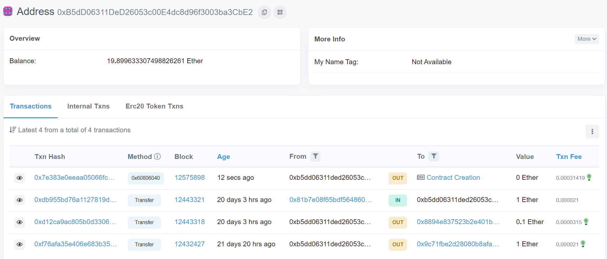

# Ethereum Testnet

---

[TOC]

---


## Ropsten

여기서는 다음의 과정을 다룬다.

- MetaMask를 통해 연동된 이더리움 Ropsten 테스트넷에, 작성한 컨트랙트 코드를 배포하는 과정

- Ropsten 테스트넷에 올린 컨트랙트 코드를 EtherScan에서 검증하고 등록하는 과정

  > 우리가 네트워크에 올린 컨트랙트를 다른 사람이 사용하려고 접근하면 바이트코드만 확인할 수 있다. 사용자가 직접 컨트랙트 코드를 확인하여 어떤 컨트랙트인지 확인할 수 있도록 이더스캔에서 우리의 컨트랙트의 솔리디티 코드를 등록할 수 있다.

### Ropsten 테스트넷에서 테스트 이더 받기

1. MetaMask에 접속하여 주소를 복사한다.

2. https://faucet.dimensions.network/에 접속한다.

   해당 사이트가 안 될 경우 [여기](https://faucet.egorfine.com/)서 시도해본다.

3. 'Enter your Ropsten address'에 복사한 주소를 붙여넣고, 'Send Ropsten Eth' 버튼을 누른다.

4. 잠시 후 ropsten.etherscan.io에서 이더를 받는 주소를 검색하면 이더를 전송받는 트랜잭션이 생긴 것을 확인할 수 있다.

### Ropsten 테스트넷에 컨트랙트 배포하기

1. 현재 Remix에는 MetaMask를 통해 Ropsten 테스트넷에 연동되어 있는 상태이다.

2. Deploy 버튼을 누른다.

3. 다음과 같은 팝업창이 뜬다. 예상되는 gas 수수료가 나오는 것을 확인한다.

   > 메인넷이 아닌 **Ropsten 테스트 네트워크**가 맞는지 꼭 확인한다!

4. Ropsten 네트워크에 스마트 컨트랙트를 배포하는 트랜잭션이 실행되고, 트랜잭션 정보가 터미널에 출력된다.

   

### 이더스캔에서 컨트랙트 검증 및 등록하기

1. 트랜잭션 정보 중 transaction hash 값을 복사해둔다. transaction hash 값으로 컨트랙트를 배포한 트랜잭션을 식별할 수 있다.

   transaction hash는 remix에서 컨트랙트 배포 후 터미널 창에서 확인할 수 있다.

   ```
   # 예시 transaction hash
   0x7e383e0eeaa05066fc326e1de18f62d647a9de2e1d0bfc6d117dfe4afab9144e
   ```

2. [Ropsten Etherscan](https://ropsten.etherscan.io/)에 접속한다.

3. Ropsten Testnet Explorer에 아까 복사해둔 transaction hash를 입력하고 검색 버튼을 누른다.

4. 테스트넷에 보낸 트랜잭션이 나온다. 이 중 To 부분은 우리가 배포한 컨트랙트 계정(CA) 주소이다. To 부분에 있는 값을 클릭하여 컨트랙트 계정 정보로 이동한다.

   ```
   # 예시 CA 주소
   0xc320a7488A39271826057627486FaCb29a03488B
   ```

5. 배포한 컨트랙트에 대한 정보가 나온다. 이 중 Contract 탭으로 들어간다.

6. Contract 탭에는 배포한 컨트랙트 코드가 이진 형태로 나와있다. 이 코드를 솔리디티 형태로 이더스캔에서 등록하여 다른 사람이 볼 수 있도록 한다. Verifiy & Publish 링크를 누른다.

7. 컨트랙트 코드를 검증하기 위한 옵션을 다음과 같이 입력한다. 입력이 완료되면 Continue 버튼을 누른다.

   - Contract Address: (자동입력 됨)
   - Compiler Type: `Solidity (Single file)`
   - Compiler Version: `v0.8.7+commit.e28d00a7`
   - Source License Type: `1) No License (None)`

8. 다음 표시되는 페이지 중간 쯤의 "Enter the Solidity Contract Code below" 부분에 Remix에서의 솔리디티 코드를 입력한다.

   ```solidity
   // SPDX-License-Identifier: GPL-3.0
   pragma solidity >=0.4.16 <0.9.0;
   
   contract SimpleStorage {
   	uint storedData;
       function set(uint x) public {
           storedData = x;
       }
       function get() public view returns (uint) {
           return storedData;
       }
   }
   ```

   그리고 하단으로 내려가 '로봇이 아닙니다'에 체크하고, 'Verify & Publish' 버튼을 누른다.

   이렇게 하면 이더스캔은 테스트넷에 올라간 컨트랙트 바이크코드와, 방금 작성해주었던 솔리디티 코드를 비교하여 동일한 코드인 경우, 이더스캔에 해당 트랜잭션에 대한 솔리디티 코드를 등록한다.

9. 검증과 등록이 완료되면 다음으로 나타나는 화면의 Compiler Output에 `Successfully generated ByteCode and ABI for Contract Address ~`와 같은 메시지가 표시된다.

10. 다시 컨트랙트 계정 페이지로 이동하면, 컨트랙트 소스 코드를 확인하고, 직접 컨트랙트 함수를 호출(`Write Contract`에서)할 수도 있다.


***Copyright* © 2022 Song_Artish**