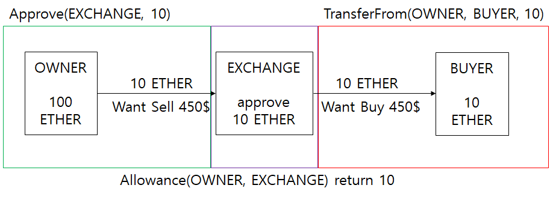

# ERC-20

> Fungible Token을 만들 수 있는 Solidity reference code

---

[TOC]

---


## ERC-20

ERC-20(20은 리퀘스트 숫자)은 [EIP-20](https://eips.ethereum.org/EIPS/eip-20)에서 논의되어 생성된 표준(Standard)로, 이더리움 블록체인 네트워크에서 정한 **표준 토큰(FT; Fungible Token) 스펙**이다. ERC-20 기반으로 생성된 토큰들은 이더리움 플랫폼을 기반으로 한 다른 dApp의 토큰들과 상호 호환이 가능하고, 동일한 이더리움 지갑으로 전송이 가능하다.

> - **EIP(Ethereum Improvement Proposals)**: 이더리움 **개선 제안**
> - **ERC(Ethereum Request for Comments)**: 이더리움 **기능 표준**

ERC-20 토큰은 되기 위한 기준은 스마트 컨트랙트 기능 포함여부이다. ERC-20 기준을 맞춰 dApp을 설계한 후 토큰을 발행하면, 이더리움을 쉽게 교환할 수 있고, 표준 이더리움 지갑(My Ether Wallet, Meta Mask, Mist 등)에 자유롭게 전송할 수 있다.


## <실습> ERC-20 토큰 개발하기

Remix와 Metamask를 활용한다.

### 전체 코드

이 코드를 ERC-20 토큰이라고 한다. 토큰을 만드는 사람에 따라 기본 코드에 추가로 함수를 더할 수 있다.

```solidity
// SPDX-License-Identifier: GPL-3.0
pragma solidity 0.8.14;

interface ERC20Interface {
    function totalSupply() external view returns (uint256);
    function balanceOf(address account) external view returns (uint256);
    function transfer(address recipient, uint256 amount) external returns (bool);
    function approve(address spender, uint256 amount) external returns (bool);
    function allowance(address owner, address spender) external view returns (uint256);
    function transferFrom(address spender, address recipient, uint256 amount) external returns (bool);

    event Transfer(address indexed from, address indexed to, uint256 amount);
    event Transfer(address indexed spender, address indexed from, address indexed to, uint256 amount);
    event Approval(address indexed owner, address indexed spender, uint256 oldAmount, uint256 amount);
}

contract SimpleToken is ERC20Interface {
    mapping (address => uint256) private _balances;
    mapping (address => mapping (address => uint256)) public _allowances;

    uint256 public _totalSupply;
    string public _name;
    string public _symbol;
    uint8 public _decimals;
    uint private E18 = 1000000000000000000;

    constructor(string memory getName, string memory getSymbol) {
        _name = getName;
        _symbol = getSymbol;
        _decimals = 18;
        _totalSupply = 100000000 * E18;
        _balances[msg.sender] = _totalSupply; // 추가
    }

    function name() public view returns (string memory) {
        return _name;
    }

    function symbol() public view returns (string memory) {
        return _symbol;
    }

    function decimals() public view returns (uint8) {
        return _decimals;
    }

    function totalSupply() external view virtual override returns (uint256) {
        return _totalSupply;
    }

    function balanceOf(address account) external view virtual override returns (uint256) {
        return _balances[account];
    }

    function transfer(address recipient, uint amount) public virtual override returns (bool) {
        _transfer(msg.sender, recipient, amount);
        emit Transfer(msg.sender, recipient, amount);
        return true;
    }

    function allowance(address owner, address spender) external view override returns (uint256) {
        return _allowances[owner][spender];
    }

    function approve(address spender, uint amount) external virtual override returns (bool) {
        uint256 currentAllowance = _allowances[msg.sender][spender];  
        require(_balances[msg.sender] >= amount,"ERC20: The amount to be transferred exceeds the amount of tokens held by the owner.");
        _approve(msg.sender, spender, currentAllowance, amount);
        return true;
    }

    function transferFrom(address sender, address recipient, uint256 amount) external virtual override returns (bool) {
        _transfer(sender, recipient, amount);
        emit Transfer(msg.sender, sender, recipient, amount);
        uint256 currentAllowance = _allowances[sender][msg.sender];
        require(currentAllowance >= amount, "ERC20: transfer amount exceeds allowance");
        _approve(sender, msg.sender, currentAllowance, currentAllowance - amount);
        return true;
    }

    function _transfer(address sender, address recipient, uint256 amount) internal virtual {
        require(sender != address(0), "ERC20: transfer from the zero address");
        require(recipient != address(0), "ERC20: transfer to the zero address");
        uint256 senderBalance = _balances[sender];
        require(senderBalance >= amount, "ERC20: transfer amount exceeds balance");
        _balances[sender] = senderBalance - amount;
        _balances[recipient] += amount;
    }

    function _approve(address owner, address spender, uint256 currentAmount, uint256 amount) internal virtual {
        require(owner != address(0), "ERC20: approve from the zero address");
        require(spender != address(0), "ERC20: approve to the zero address");
        require(currentAmount == _allowances[owner][spender], "ERC20: invalid currentAmount");
        _allowances[owner][spender] = amount;  
        emit Approval(owner, spender, currentAmount, amount);
    }
}
```

### ERC20Interface

```solidity
// ...
interface ERC20Interface {
	function totalSupply() external view returns (uint256);
	function balanceOf(address account) external view returns (uint256);
	function transfer(address recipient, uint256 amount) external returns (bool);
	function approve(address spender, uint256 amount) external returns (bool);
	function allowance(address owner, address spender) external view returns (uint256);
	function transferFrom(address spender, address recipient, uint256 amount) external returns (bool);
	
	event Transfer(address indexed from, address indexed to, uint256 amount);
	event Transfer(address indexed spender, address indexed from, address indexed to, uint256 amount)
	event Approval(address indexed owner, address indexed spender, uint256 oladAmount, uint256 amount);
}
// ...
```

#### Interface

> Interface는 사용할 함수의 형태를 선언할 때 사용하며, 실제 함수의 내용은 Contract에서 사용한다.

`ERC20Interface`는 예제에서 쓰일 SimpleToekn 컨트랙트에서 사용할 함수의 형태를 선언하며, ERC-20에서 사용하는 함수들의 형태를 선언한 것을 확인할 수 있다.

#### Function & Event

**함수(function)**는 이더리움에서 제공하는 함수이며, **event**는 이더리움에서 제공하는 로그이다. function과 event를 선언할 때 입력값과 반환값은 선택할 수 있으나, function의 자료형, 이름, 순서를 주의해야 한다. ERC20Interface의 **Transfer 이벤트**는 토큰이 이동할 때마다 로그를 남기고, **Approval 이벤트**는 `approve` 함수가 실행될 때 로그를 남긴다.

#### 함수의 구성

Solidity에서 함수(function)는 다음과 같이 구성된다.

```solidity
function (<parameter types) [internal | external | public | private] [pure | constant | view | payable] [(modifiers)] [returns (<return types>)]
```

#### Parameter Types

함수에서 받아올 매개변수를 타입과 함께 선언한다.

#### Visibility Keyword

Visibility Keyword는 Java나 C++에서 Public, Private, Protected와 같은 접근제어자(access contral) 역할을 한다. Solidity 언어에서 스마트 컨트랙트 내의 **상태 변수(State variable)**와 함수에 적용할 수 있는 visibility는 4가지가 있다.

- **`internal`**: Smart contract의 interface로 비공개한다. 계약서(contract)의 해당 내용을 비공개로 한다는 의미이며, 계약서의 외부에서 사용하는 함수라는 것을 표시한다. 계약서 자신과 상속받은 계약서만 사용할 수 있다. (상태변수는 internal이 기본값)
- **`external`**: Smart contract의 interface로 공개한다. 계약서(contract)의 해당 내용을 공개한다는 의미이며, 계약서의 외부에서 사용하는 함수라는 것을 표시한다. 계약서 내부에서 사용할 경우 this를 사용해서 접근해야 한다. (상태변수는 external일 수 없다.)
- **`public`**: 공개함수이다. 공개 기능은 계약 인터페이스의 일부이며 내부적으로 또는 메시지를 통해 호출할 수 있다. 공개 상태 변수의 경우 자동 getter 함수가 생성된다.
- **`private`**: 비공개함수이다. 계약서 내부에서도 자신만 사용하는 함수라는 것을 표시한다. 상태변수와 함수 모두 파생된 계약이 아닌 정의된 계약에서만 볼 수 있다.

#### 함수 동작 관련 키워드

- **`pure`**: storage에서 변수를 읽어오거나 쓰지 않는 함수임을 명시한다.
- **`constant`, `view`**: 상태를 변경하지 않는 함수임을 명시한다.
- **`payable`**: 입금을 받을 수 있는 함수임을 명시한다.


### Contract(SimpleToken)

ERC20Interface에서는 함수의 형태만 선언을 하고, 함수의 내용은 SimpleToken 컨트랙트에서 사용한다.

```solidity
// ...
contract SimpleToken is ERC20Interface {
	mapping (address => uint256) private _balances;
	mapping (address => mapping (address => uint256)) public _allowances;
	
	uint256 public _totalSupply;
	string public _name;
	string public _symbol;
	uint8 public _decimals;
	uint private E18 = 1000000000000000000;
	
	constructor(string memory getName, string memory getSymbol) {
		_name = getName;
		_symbol = getSymbol;
		_decimals = 18;
		_totalSupply = 100000000 * E18;
		_balances[msg.sender] = _totlaSupply;	// 추가
	}
	
	function name() public view returns (string memory) {
		return _name;
	}
	
	function symbol() public view returns (string memory) {
		return _symbol;
	}
	
    function decimals() public view returns (uint8) {
        return _decimals;
    }

    function totalSupply() external view virtual override returns (uint256) {
        return _totalSupply;
    }

    function balanceOf(address account) external view virtual override returns (uint256) {
        return _balances[account];
    }
    
    function transfer(address recipient, uint amount) public virtual override returns (bool) {
    	_transfer(msg.sender, recipient, amount);
    	emit Transfer(msg.sender, recipient, amount);
    	return true;
    }
    
    function allowance(address owner, address spender) external view override returns (uint256) {
    	return _allowances[owner][spender];
    }
    
    function approve(address spender, uint amount) external virtual override returns (bool) {
    	// uint256 currentAllowance = _allowances[spender][msg.sender];	// 삭제
    	uint256 currentAllowance = _allowances[msg.sender][spender];	// 추가
        require(_balances[msg.sender] >= amount,"ERC20: The amount to be transferred exceeds the amount of tokens held by the owner.");
        _approve(msg.sender, spender, currentAllowance, amount);
        return true;
    }
    
    function transferFrom(address sender, address recipient, uint256 amount) external virtual override returns (bool) {
    	_transfer(sender, recipient, amount);
    	emit Transfer(msg.sender, sender, recipient, amount);
    	uint256 currentAllowance = _allowances[sender][msg.sender];
        require(currentAllowance >= amount, "ERC20: transfer amount exceeds allowance");
        _approve(sender, msg.sender, currentAllowance, currentAllowance - amount);
        return true;
    }
    
    function _transfer(address sender, address recipient, uint256 amount) internal virtual {
        require(sender != address(0), "ERC20: transfer from the zero address");
        require(recipient != address(0), "ERC20: transfer to the zero address");
        uint256 senderBalance = _balances[sender];
        require(senderBalance >= amount, "ERC20: transfer amount exceeds balance");
        _balances[sender] = senderBalance - amount;
        _balances[recipient] += amount;
    }

    function _approve(address owner, address spender, uint256 currentAmount, uint256 amount) internal virtual {
        require(owner != address(0), "ERC20: approve from the zero address");
        require(spender != address(0), "ERC20: approve to the zero address");
        require(currentAmount == _allowances[owner][spender], "ERC20: invalid currentAmount");
        _allowances[owner][spender] = amount;  // 삭제
        emit Approval(owner, spender, currentAmount, amount);
    }
}
// ...
```

#### 상속

SimpleToken 컨트랙트는 다음과 같이 선언되었다.

```solidity
contract SimpleToken is ERC20Interface {...}
```

이렇게 하면 `SimpleToken` 컨트랙트가 `ERC20Interface` 함수를 사용할 수 있게 된다. 

#### 이중 객체

이중으로 매핑된 `_allowances`는 변수는 일종의 이중 객체로, 객체의 키는 OWNER의 address(주소값)이며, 값은 토큰을 양도받은 SPENDER에 대한 객체이다.

- KEY: OWNER의 address
- VALUE: (KEY: SPENDER의 address, VALUE: 맡겨둔 TOKEN의 개수)

```solidity
contract SimpleToken is ERC20Interface {
	mapping (address => uint256) private _balances;
	mapping (address => mapping (address => uint256)) public _allowances;	// 이중 객체
}
```

#### ERC-20 함수

ERC-20에는 다음과 같은 함수가 있다.

> ERC-20에서는 토큰의 owner가 직접 토큰을 다름 사람에게 전송할 수도 있지만, 토큰을 양도할만큼 등록해두고, 필요할 때 제3자를 통해 토큰을 양도할 수 있다.
>
> - 직접 토큰을 다른 사람에게 전송할 경우 `transfer` 함수
> - 토큰을 등록하는 방식을 사용하는 경우 `approve`, `allowance`, `transferFrom` 함수
>
> 
>
> `(출처: codestates)`

- **`totalSupply`**: 해당 스마트 컨트랙트 기반 ERC-20 토큰의 총 발행량 확인

  토큰의 총 발행량을 반환한다.

  ```solidity
  	function totalSupply() external view virtual override returns (uint256) {
          return _totalSupply;
      }
  ```

- **`balanceOf`**: owner가 가지고 있는 토큰의 보유량 확인

  매핑된 값인 `_balanceOf`에서 입력한 address인 account가 가지고 있는 토큰의 수를 리턴한다.

  ```solidity
      function balanceOf(address account) external view virtual override returns (uint256) {
           return _balances[account];
      }
  ```

- **`transfer`**: 토큰을 전송

  `transfer`의 내부 함수인 `_transfer`을 호출한다. 호출이 정상적으로 완료되었을 경우 Transfer event를 발생시킨다.

  ```solidity
      function transfer(address recipient, uint amount) public virtual override returns (bool) {
          _transfer(msg.sender, recipient, amount);
          emit Transfer(msg.sender, recipient, amount);
          return true;
      }
  
      function _transfer(address sender, address recipient, uint256 amount) internal virtual {
          require(sender != address(0), "ERC20: transfer from the zero address");
          require(recipient != address(0), "ERC20: transfer to the zero address");
          uint256 senderBalance = _balances[sender];
          require(senderBalance >= amount, "ERC20: transfer amount exceeds balance");
          _balances[sender] = senderBalance - amount;
          _balances[recipient] += amount;
      }
  ```

  `_transfer`은 `require`를 통해 세 가지 조건을 검사한다.

  1. 보내는 사람의 주소가 잘못되었는지 체크한다.
  2. 받는 사람의 주소가 잘못되었는지 체크한다.
  3. `transfer` 함수를 실행한 사람(sender)이 가진 토큰(senderBalance)이 신청한 값(amount)보다 많읁 토큰을 가지고 있는지 체크한다.

  위 세 조건을 충족하는 경우, 실행한 사람(sender)이 가진 토큰의 지갑에서 토큰을 개수만큼 빼고, 받을 사람(recipient)의 토큰 지갑에 개수만큼 더해준다.

- **`approve`**: spender에게 value만큼의 토큰을 인출할 권리를 부여 (이 함수 이용 시 반드시 Approval 이벤트 함수를 호출해야 함)

  ```solidity
     function approve(address spender, uint amount) external virtual override returns (bool) {
          uint256 currentAllowance = _allowances[msg.sender][spender];
          require(_balances[msg.sender] >= amount,"ERC20: The amount to be transferred exceeds the amount of tokens held by the owner.");
          _approve(msg.sender, spender, currentAllowance, amount);
          return true;
      }
  
      function _approve(address owner, address spender, uint256 currentAmount, uint256 amount) internal virtual {
          require(owner != address(0), "ERC20: approve from the zero address");
          require(spender != address(0), "ERC20: approve to the zero address");
          require(currentAmount == _allowances[owner][spender], "ERC20: invalid currentAmount");
          _allowances[owner][spender] = amount;
          emit Approval(owner, spender, currentAmount, amount);
      }
  ```

  내부 함수인 `_approve`를 호출한다. `_approve`에서는 내가 토큰을 양도할 상대방(spender)에게 양도할 값(amount)를 allowances에 기록한다. 이 상태에서는 양도가 실제로 이루어진 것이 아니라, 양도를 할 주소와 양을 정한 것이다.

  `approve`는 단순 변경을 위한 함수이기 때문에 내부적으로 값을 올리고 내리는 `increaseApproval`과 `decreaseApproval` 함수를 사용하기도 한다. `approve`는 spender가 당신의 계정으로부터 amount 한도 내에서 여러 번 출금하는 것을 허용한다. 이 함수를 여러 번 호출하면, 단순히 허용량을 amount로 재설정한다.

- **`allowance`**: owner가 spender에게 양도 설정한 토큰의 양을 확인

  입력한 2개의 주소 값에 대한 _allowances 값, 다시 말 해 owner가 spender에게 토큰을 등록한 양을 반환한다.

  ```solidity
      function allowance(address owner, address spender) external view override returns (uint256) {
          return _allowances[owner][spender];
      }
  ```

- **`transferFrom`**: spender가 거래 가능하도록 양도 받은 토큰을 전송

  ```solidity
      function transferFrom(address sender, address recipient, uint256 amount) external virtual override returns (bool) {
          _transfer(sender, recipient, amount);
          emit Transfer(msg.sender, sender, recipient, amount);
          uint256 currentAllowance = _allowances[sender][msg.sender];
          require(currentAllowance >= amount, "ERC20: transfer amount exceeds allowance");
          _approve(sender, msg.sender, currentAllowance, currentAllowance - amount);
          return true;
      }
  
      function _transfer(address sender, address recipient, uint256 amount) internal virtual {
          require(sender != address(0), "ERC20: transfer from the zero address");
          require(recipient != address(0), "ERC20: transfer to the zero address");
          uint256 senderBalance = _balances[sender];
          require(senderBalance >= amount, "ERC20: transfer amount exceeds balance");
          _balances[sender] = senderBalance - amount;
          _balances[recipient] += amount;
      }
  
      function _approve(address owner, address spender, uint256 currentAmount, uint256 amount) internal virtual {
          require(owner != address(0), "ERC20: approve from the zero address");
          require(spender != address(0), "ERC20: approve to the zero address");
          require(currentAmount == _allowances[owner][spender], "ERC20: invalid currentAmount");
          _allowances[owner][spender] = amount;
          emit Approval(owner, spender, currentAmount, amount);
      }
  ```

  `transferFrom`은 양도를 수행하는 거래 대행자(msg.sender)가 sender가 허락해준 값만큼 상대방(recipient)에게 토큰을 이동한다. 이동을 위해 _transfer 함수를 실행시킨다. `_transfer`에서는 양도를 하는 sender의 잔고를 amount만큼 줄이고, recipient의 잔고를 amount만큼 늘린다. `_transfer` 함수 실행이 완료디고 require를 모두 통과한다면 currentAllowance를 체크하여 _approve 함수를 실행한다.


## <실습> ERC-20 이더리움 테스트넷 배포

### Ropsten 테스트넷에 ERC-20 배포하기

MetaMask 지갑, Ropsten 테스트 네트워크, Remix IDE를 사용한다. 테스트용 Ropsten rETH는 [여기](https://faucet.egorfine.com/)서 받는다.

1. MetaMask에 접속하고 Ropsten 테스트 네트워크를 선택한다.

2. Remix IDE에서 `SimpleToken.sol` 파일을 생성한다.

3. 위에 있는 ERC-20 코드를 입력한다.

4. SOLIDITY COMPILER 메뉴로 이동하여 `SimpleToken.sol` 파일을 컴파일한다.

5. DEPLOY & RUN TRANSACTIONS 메뉴로 이동 후, 배포 옵션을 다음과 같이 설정한다.

   - Injected Web3로 변경하여 MetaMask(`Ropsten (3) network`)와 연동한다.
   - Account를 내가 발행할 계정으로 변경한다.
   - CONTRACT에서 `SimpleToken.sol`이 지정되었는지 확인한다.
   - DEPLOY의 상세 옵션을 연 후 들어갈 인자값을 입력한다.
     - `GETNAME`: MySimpleToken
     - `GETSYMBOL`: MST

   설정이 완료되면 `transact` 버튼을 누른다.

6. MetaMask에서 계약 생성에 대한 내역을 확인하고, 확인 버튼을 눌러 진행한다.

7. 계약 생성이 완료되면 Remix 내 Deployed Contracts에서 계약을 확인할 수 있다. (이더스캔에서도 확인 가능)

   MetaMask에서 토큰을 사용하기 위해 <u>컨트랙트 주소</u>를 복사한다.

8. MetaMask 하단의 Import tokens를 클릭한다.

9. 토큰 계약 주소에 Remix에서 복사한 주소를 입력한 후, `Add Custom Token`을 클릭한다.

   - `토큰 기호`: MST
   - `토큰 십진수`: 18

10. ERC-20 코드의 totalSupply 개수만큼 잔액이 적용된 토큰을 확인할 수 있다.

### 토큰 보내기

1. 토큰 화면에서 `보내기`를 클릭해 보낼 계정의 주소를 입력한다.
2. 보낼 토큰의 개수를 입력하여 트랜잭션을 생성한다.


## <실습> ERC-20 라이브러리 - SafeMath

> - Overflow: 어떠한 것이 용량을 초과해 흘러 넘치는 것
> - Underflow: 어떠한 것이 정해진 범위 아래로 마이너스가 되는 것

기본 연산자에 있어서 안전하게 연산이 가능하도록 **SafeMath**라는 함수를 만들어본다.

### 전체 코드

```solidity
// SPDX-License-Identifier: GPL-3.0
pragma solidity 0.8.10;

interface ERC20Interface {
     // ~~ 이전 코드 참조 ~~
}

library SafeMath {
  	function mul(uint256 a, uint256 b) internal pure returns (uint256) {
		uint256 c = a * b;
		assert(a == 0 || c / a == b);
		return c;
  	}

  	function div(uint256 a, uint256 b) internal pure returns (uint256) {
	    uint256 c = a / b;
		return c;
  	}

  	function sub(uint256 a, uint256 b) internal pure returns (uint256) {
		assert(b <= a);
		return a - b;
  	}

  	function add(uint256 a, uint256 b) internal pure returns (uint256) {
		uint256 c = a + b;
		assert(c >= a);
		return c;
	}
}

contract SimpleToken is ERC20Interface {
    using SafeMath for uint256;

         // ~~ 이전 강의 참조 ~~

    function transferFrom(address sender, address recipient, uint256 amount) external virtual override returns (bool) {
        _transfer(sender, recipient, amount);
        emit Transfer(msg.sender, sender, recipient, amount);
        uint256 currentAllowance = _allowances[sender][msg.sender];
        require(currentAllowance >= amount, "ERC20: transfer amount exceeds allowance");
        _approve(sender, msg.sender, currentAllowance, currentAllowance - amount);
        return true;
    }

    function _transfer(address sender, address recipient, uint256 amount) internal virtual {
        require(sender != address(0), "ERC20: transfer from the zero address");
        require(recipient != address(0), "ERC20: transfer to the zero address");
        uint256 senderBalance = _balances[sender];
        require(senderBalance >= amount, "ERC20: transfer amount exceeds balance");
        _balances[sender] = senderBalance - amount;
        _balances[recipient] += amount;
    }
}
```

### SafeMath 라이브러리 사용방법

메인 커트랙트인 SimpleToken에서 자료형 uint256(0부터 2^256-1 만큼의 값을 제공)에 대해서 SafeMath 라이브러리를 사용하도록 선언해준다.

```solidity
	using SafeMath for uint256;
```

uint256으로 선언된 함수에 대해서 SafeMath Library를 이용해서 해당 함수를 사용할 수 있다.

### SafeMath 사용 예시

**`transferFrom`**과 **`_transfer`**에서 사용되는 연산자(`+`, `-`)를 SafeMath 라이브러리 함수를 사용해 안전한 연산자로 변경할 수 있다.

```solidity
    function transferFrom(address sender, address recipient, uint256 amount) external virtual override returns (bool) {
        _transfer(sender, recipient, amount);
        emit Transfer(msg.sender, sender, recipient, amount);
        uint256 currentAllowance = _allowances[sender][msg.sender];
        require(currentAllowance >= amount, "ERC20: transfer amount exceeds allowance");
        // 다음의 코드에서 currentAllowance.sub(amount)이 SafeMath 라이브러리 함수를 사용한 예시입니다.
        _approve(sender, msg.sender, currentAllowance, currentAllowance.sub(amount));
        return true;
    }

    function _transfer(address sender, address recipient, uint256 amount) internal virtual {
        require(sender != address(0), "ERC20: transfer from the zero address");
        require(recipient != address(0), "ERC20: transfer to the zero address");
        uint256 senderBalance = _balances[sender];
        require(senderBalance >= amount, "ERC20: transfer amount exceeds balance");
        _balances[sender] = senderBalance.sub(amount);
        _balances[recipient] = _balances[recipient].add(amount);
    }
```


***Copyright* © 2022 Song_Artish**