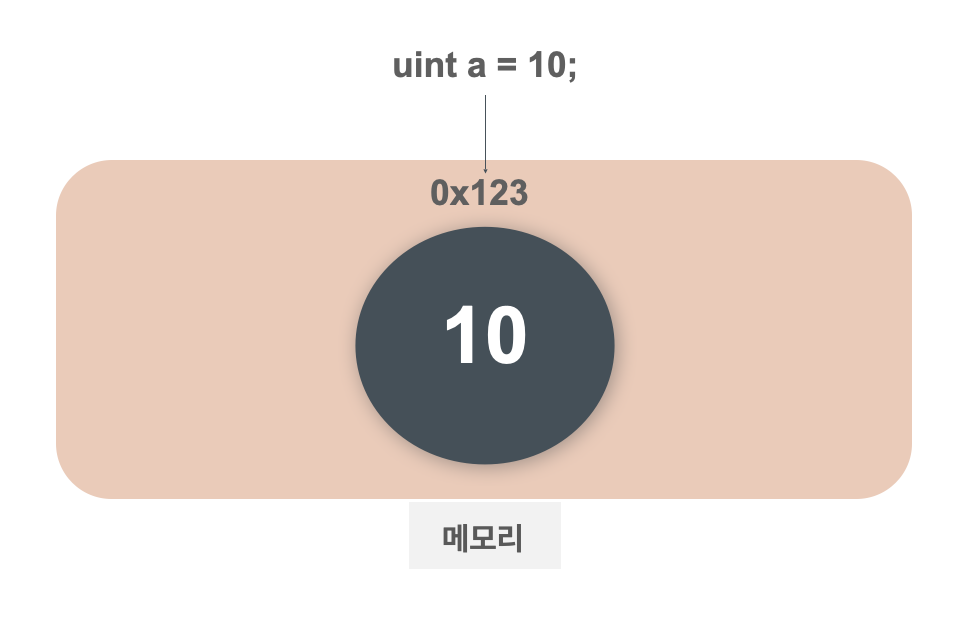
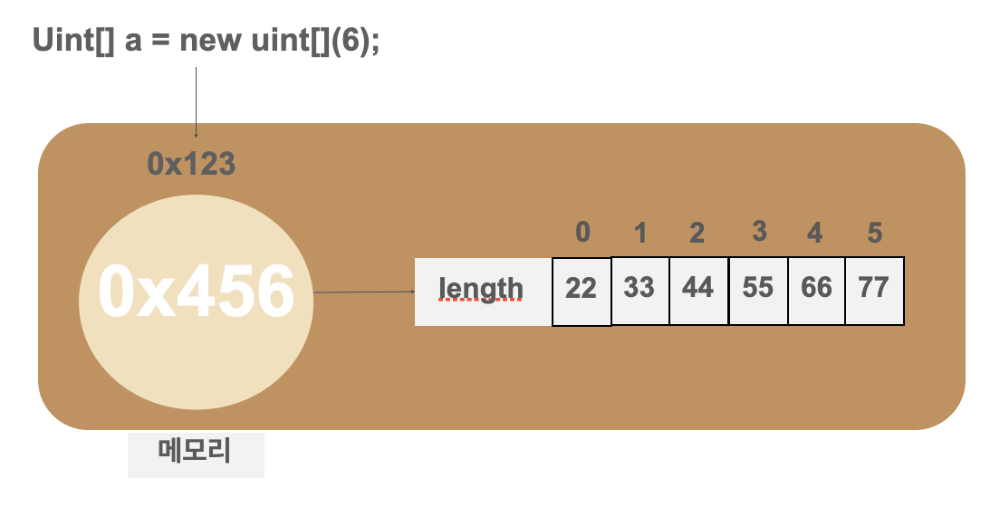
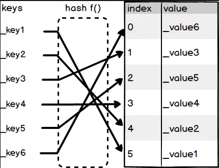

# Solidity 자료형

---

[TOC]

---


## Value Types



### 1. bool

`true`나 `false` 값을 가진다.

```solidity
bool isOpen = true;
bool isSold = false;
```

### 2. int, uint

부호(`+`, `-`)가 있는 경우에는 int, 부호가 없는 0 이상의 값에는 uint를 사용한다. int, uint 뒤에 8 ~ 256의 8의 배수의 숫자를 붙여 변수의 크기를 비트 단위로 지정할 수도 있다. (ex. int8, int16, int24, uint64, uint128, ...)

각 숫자에 따라 정수는 특정 범위로 제한된다. 일반적으로 뒤에 숫자가 없는 int, uint는 `int256`, `uint256`을 의미한다.

```markdown
예를 들어
- int16은 -32768 ~ 32767 사이의 정수를 의미
- uint16은 0 ~ 65535 사이의 정수를 의미
```

```solidity
int8 seoulTemp = -20
uint16 myAge = 30
```

### 3. address

주소 타입은 크게 두 가지 유형으로 나뉜다.

- **address**: 20byte의 이더리움 주소 값을 가짐
- **address payable**: address와 동일한 값을 가지지만 추가 멤버인 transfer, send를 가짐

주소 객체는 0x로 시작하고 최대 40자리의 16진수로 구성되는 문자열을 값으로 가진다.

```solidity
address yourAddress = 0x10abb5efEcdc01234f7b2384912398798E089Ab2;
```

0.8 버전부터 `address` 형식은 **송금이 불가능한 주소값**이며, 스마트 컨트랙트에서 특정 주소 값으로 송금하기 위해서는 `address payable` 형식을 사용해야 한다. `address payable` 형식에는 이더 송금을 위한 `transfer()`와 `send()` 함수가 내장되어 있다.

`address payable` 형식 데이터는 `address` 형식 데이터를 `payable()` 함수에 인자로 담아 만들 수 있다.

```solidity
address addr1;
address payable p_addr1 = payable(addr1)
```

`uint160` 또는 `bytes20` 형식의 데이터를 `address payable`로 바꾸기 위해서는 먼저 `address()`를 사용하여 주소 형태로 만들고, 다시 `payable()`을 사용해 `address payable` 형식으로 바꿀 수 있다.

```solidity
uint160 num;
address addr = address(num);
address payable p_addr = payable(addr);
```

컨트랙트를 `address payable`로 변환할 수도 있다. 만약 컨트랙트가 이더를 받을 수 있는 컨트랙트인 경우, `address(컨트랙트)`를 수행했을 때 `address payable` 형식의 주소값을 반환한다.

```solidity
contract C {	// 이더를 받을 수 있는 컨트랙트
	constructor () payable {}
}
address payable addr = address(C);	// address(C)는 address payable 형식의 주소값을 반환한다.
```

반면, 컨트랙트가 이더를 받지 않는 컨트랙트인 경우, `address(컨트랙트)`를 수행했을 때 `address` 형식의 주소값을 반환한다. 이 경우 결과값을 `payable()`에 넣어 `address payable` 형식으로 만들 수 있다.

```solidity
contract D {	// 이더를 받지 않는 컨트랙트
	constructor () {}
}
address addr = address(D);	// address(D)는 address 형식의 주소값을 반환
address payable addr_p = payable(addr);	// payable()을 사용해 address payable 형식의 주소값을 만들 수 있다
```

### 4. byte

데이터를 binary 형태로 저장하기 위해 사용하며, bytes1 ~ bytes32까지의 **고정된 크기**의 배열을 선안한다. 정해진 바이트 크기와 값의 크기가 다르면 에러가 난다.

```solidity
bytes3 alphabetsalphabets[0] = 'abc';
alphabets[0] // 'a'
alphabets[1] // 'b'
alphabets[2] // 'c'
```

byte 배열(가변 크기)는 참조형 타입이다.

### 5. enum

> 범주형 변수

열거형(enum)은 특정 값들로 집합을 지정하고, 집합에 있는 데이터만을 값으로 가진다. 각 집합의 데이터는 내부적으로는 순서에 따라 0부터 1씩 올라가는 정수를 값으로 가진다.

```solidity
enum EvalLevel { Bad, Soso, Great }	// 열거형 집합을 지정
EvalLevel kimblock = EvalLevel.Bad	// 열거형으로 변수 선언
int16 kimblockValue = int16(kimblock);	// kimblock 열거형 값 0을 정수형으로 변환
```

> 추가적으로 `(u)fixedMxN` 형식으로 표현되는 `고정소수점` 타입이 존재하지만 현재 솔리디티에서는 완전히 지원되지 않기에 다루지 않는다.
>
> - 참고: https://docs.soliditylang.org/en/v0.8.14/types.html#fixed-point-numbers


## Reference Types



참조형 변수(Reference Type)는 배열과 같이, 연속되어 저장되는 값의 첫 번째 메모리 **주소**를 값으로 가지는 변수 타입이다. 데이터 저장 영역에는 3 종류가 있는데, 참조형 변수를 선언할 때는 `메모리`에 저장할지 `스토리지`에 저장할지 명시해야 한다.

- **메모리**: 프로그램이 동작하는 동안에만 값을 기억하고, 종료되면 값을 잃는 데이터 영역
- **스토리지** 블록체인에 기록되어 영구적으로 값이 유지되는 데이터 영역
- **calldata**: 메모리와 비슷하지만 수정 불가능하고 비영구적인 데이터 영역

(상태변수는 무조건 스토리지에 저장된다.)

```solidity
function f() {
	// 5개의 int32 형태의 데이터를 메모리에 저장하는 변수 fixedSlots 선언
	int32[5] memory fixedSlots;
	fixedslots[0] = 13;
}
```

### 1. array

배열(array)은 저장하고자 하는 데이터 형식에 `[]`을 붙여 선언한다. 가령 uint8 형식의 데이터를 저장하는 배열을 만드는 경우, `uint8[]`과 같이 자료형을 작성한다.

배열에는 2가지 종류가 있다.

- **정적 배열**: `uint[4] {배열 이름}`과 같은 형식으로 사용할 **배열의 크기를 지정**하여 선언한다.
- **동적 배열**: `uint[] {배열 이름}`과 같은 형식으로 **배열의 크기를 지정하지 않고** 선언한다.
  - 5개의 동적 배열로 구성된 배열은 `uint[][5]`로 작성된다.

`new` 키워드를 사용해 동적 배열을 메모리에 할당할 수도 있다.

### 2. byte array

바이트(bytes)는 특수한 형태의 배열로, **가변 크기**를 가진다. 배열식 표현의 `byte[]`와 유사하지만 calldata와 메모리를 활용한다는 점이 다르다.

```solidity
bytes alphabets = 'abc';
```

### 3. string

문자열(string) 역시 특수한 형태의 배열로서, 바이트 배열(가변 크기)에 기반한 문자열 타입이다. string은 bytes와 동알하지만, index, push, length, concat 등을 지원하지 않으며 문자열 리터럴로 초기화한다.

```solidity
string name = 'kimblock';
```

### 4. struct

구조체(struct)는 서로 다른 유형의 항목을 포함하는 집합으로, 사용자 정의 형식이다. 배열과 매핑의 내부에서 사용될 수 있으며, 반대로 구조체에 배열과 매핑을 포함할 수도 있다. 하지만 구조체가 동이한 구조체 타입의 멤버를 포함할 수는 없다. 구조체는 다음과 같이 정의한다.

```solidity
contract exampleC {
	struct User {
		address account;
    	string lastName;
		string firstName;
		mapping(uint => Funder) funders;
	}
	mapping (uint => User) users;
}
```

구조체를 사용할 때는 각 항목에 대한 값을 객체 형식으로 추가한다.

```solidity
contract exampleC {
	struct User {
		address account;
		string lastName;
		string firstName;
	}
	
	function newUser (address newAddress, string newLastName, string newFirstName) {
		User memory newOne = User({ account: newAddress, lastName: newLastName, firstName: newFirstName});
	}
}
```

### 5. mapping

매핑(mapping)은 스토리지 데이터 영역에서 `key-value` 구조로 데이터를 저장할 때 사용하는 참조형이다. `mapping({key 형식} => {value 형식}) {변수명}` 형태로 선언한다.

- key 형식: 매핑, 구조체, 배열 제외한 유형의 값이 다 될 수 있다.
- value 형식: 모든 유형의 값이 다 될 수 있다.

```solidity
mapping(address => int) public userAddress;
```



매핑은 일반적인 프로그래밍 언어에서의 해시 테이블 또는 딕셔너리(JavScript의 객체)와 유사하다. Key 자체가 실제로 저장되지는 않고, key의 keccak256 해시를 이용해 값에 접근한다. 매핑은 오직 `스토리지` 영역에만 저장될 수 있으므로 상태 변수, 내부 함수에서의 스토리지 참조 타입, 라이브러리 함수의 매개 변수에만 허용된다.


***Copyright* © 2022 Song_Artish**