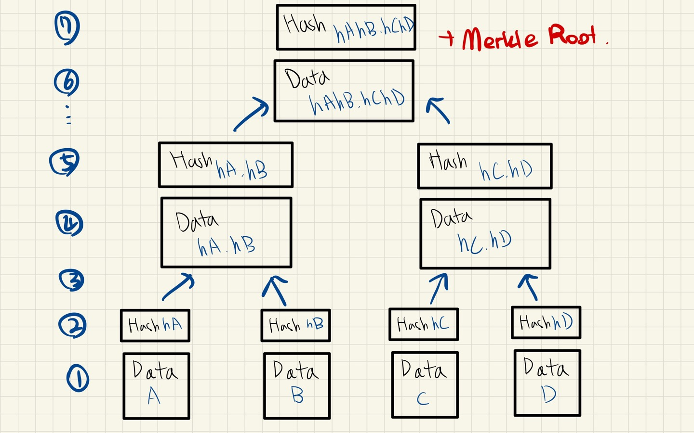
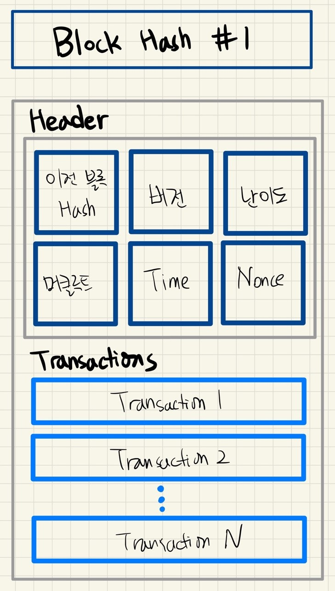

# Merkle Tree

---

[TOC]

---

## 머클트리란?

머클트리(혹은 해시트리)는 여러 데이터에 대해 단계적으로 해시함수를 적용하여 하나의 해시값으로 나타내는 데이터 구조이다. 블록체인에 있는 **데이터의 위변조를 방지**하고, **데이터가 변하지 않았음을 보장**하는데 사용한다.

## 동작 방식

1. 머클 루트를 만들기 위한 데이터 A, B, C, D가 있다.
2. 각 데이터를 해시함수에 넣어, 해시값을 만든다.
3. 각 해시값을 두개 씩 짝지어서 연결한다.
4. 연결된 두 해시값을 해싱한다. hA와 hB를 하나로 연결하고, 이를 해시 함수에 넣어 해싱한다.
5. 이런 식으로 최종적으로 하나의 해시값만 남을 때까지 반복한다.
6. 마지막으로 남은 해시값을 다시 한 번 더 해싱한다.

이렇게 최종적으로 나온 해시값이 바로 **머클 루트(Merkle Root)**이다. 머클 루트는 트리의 루트이자, 모든 데이터를 모아 해싱한 값이다.

## 무결성을 보장하는 방법

위의 그림에서 만약 머클 트리의 데이터 C가 1바이트라도 변경된다면, 데이터 C의 해시값 hC도 변경될 것이다. 이는 연쇄적으로 영향을 주어 hC.hD, hAhB.hChD, ..., 머클 루트 값까지 전부 변경되게 할 것이다. 이렇게 머클트리는 해시 함수의 충돌저항성(서로 다른 입력에 대해 동일한 출력값을 가지는 특성)을 활용하여여러 데이터의 집합 중 단 하나라도 변경되었는지 찾을 수 있다.

## 블록체인에서의 사용법

비트코인의 블록 구조는 대략 다음 그림과 같다.

- **블록 해시값**: 모든 블록은 고유한 해시값을 가지고 있으며, 이 값은 블록 헤더의 모든 값을 연결하여 해싱한 값이다.
- **헤더 > 머클루트**: 트랜잭션을 사용해 머클 트리를 만들고, 그 결과로 나온 머클 루트 값

이 때문에 악의적인 노드가 브록내 트랜잭션을 조작하려고 하면, 머클 트리의 특성에 따라 머클루트 값이 변경되며, 블록 헤더의 모든 값을 연결하여 해싱한 값인 블록 해시값도 변경된다. 그리고 블록 해시값이 변경되는 경우, 다음 블록의 헤더 안에 있는 "이전 블록의 hash"도 함께 바꾸어야 한다. 이런 식으로 특정 블록에 들어있는 트랜잭션을 하나라도 변경하는 경우, 블록은 체인처럼 연결되어 있어 해당 블록 이후의 연결되된 모든 블록을 수정해야 한다.

블록의 논스값을 찾는데 10분 정도 걸리기 때문에, 트랜잭션을 하나 수정하기 위해서는 연결된 모든 블록의 논스값을 다시 찾는 것은 매우 비용이 많이 들 것이다. 따라서 블록체인에 올라간 데이터를 수정하는데 많은 비용이 들며, 위변조가 매우 어렵다.

## :ballot_box_with_check: 머클 패트리샤 트리

> 비트코인과 다르게, 이더리움에서는 단순 이진 머클 트리가 아닌, 머클 트리의 개선된 버전인 머클 패트리샤 트리(Merkle Patricia Tree)를 채택하여 사용하고 있다.

Patricia Merkle Tree(=Merkle Tree, Radix Tree) provides a cryptographically authenticated data structure that can be used to store all `(key, value)` bindings.

- 이더리움의 전역 상태는 **계정 주소**와 **계정 상태**를 매핑한 것으로 구성되어 있다.
- 부모 노드는 **두 자식 노드를 모아** 해싱한 값을 가진다.
- 자식 노드의 값이 조금이라도 바뀌면 부모 노드의 값도 바뀐다.
- 이더리움 블록 헤더는 상태트리, 트랜잭션 트리, 영수증 트리, 이렇게 세 트리의 **루트 노드 해시값이 저장**되어 있다.
- 블록 헤더에 루트 노드들의 값을 가지고 있지만, 이더리움의 **상태 일부분을 검증**할 수 있다.
- 트리 맨 아래에 있는 노드들은 데이터를 가지고 있다.

***Copyright* © 2022 Song_Artish**