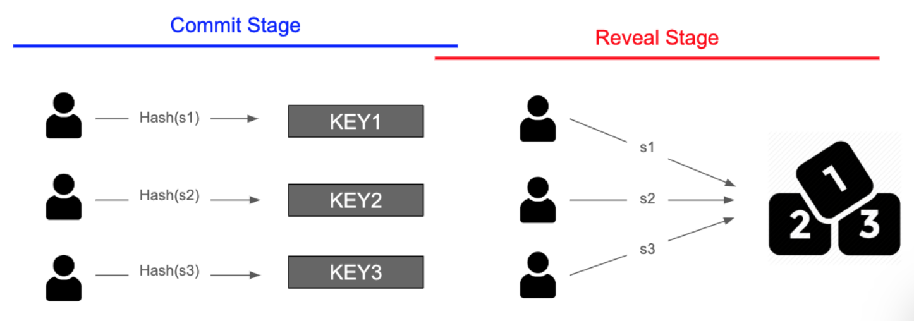
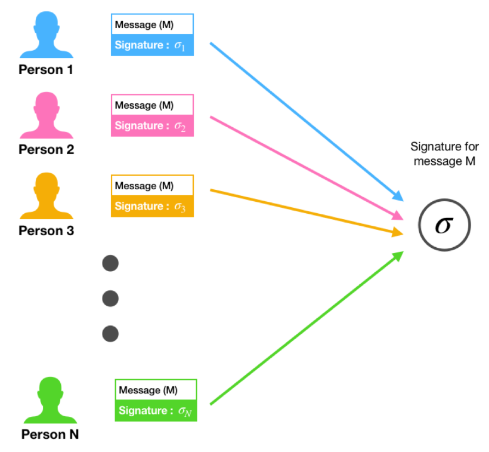

# Oracle

---

[TOC]

---

## Oracle

오라클(Oracle)은 Web API나 마켓 데이터 피드와 같은 방식을 통해 블록체인과 스마트 컨트랙트용 **외부 데이터를 검색하고 검증**하는 것을 의미한다. 스마트 컨트랙트에서 요구하는 데이터 종류에는 가격 정보, 날씨 정보 또는 게임을 위한 난수 생성 등이 있다.

오라클은 특정 정보에 대해 데이터 자원을 쿼리하고, 블록체인과 외부 데이터 간의 인터페이스를 제공하는 것으로 구성된다. 그 결과, 스마트 컨트랙트는 외부 데이터로부터 오는 특정 정보에 의해 실행될 수 있다. 외부에서 오는 데이터는 결정적(Deterministic)이지 않은데, 오라클은 외부에서 오는 비결정적인 정보를 블록체인이 이해하고 특정 조건에서 실행할 수 있도록 하는 형식으로 만들어주는 가교 역할을 한다.

## 오라클 문제

서드 파티 오라클과 스마트 컨트랙트의 무신뢰성 실행 간 보안, 인증, 신뢰 충돌 문제에 관한 것이다. 스마트 컨트랙트로 들어오는 데이터에 대한 출처나 신뢰도가 불명확할 수 있으며, 출처가 분명하다라도 가져오는 과정에서 위변조가 일어날 수 있기 때문에, 이러한 문제로 인해 데이터 자체에 대한 신뢰성에 의문이 제기될 수 있다.

## 난수 생성 문제

대표적인 오라클 문제이다. 컴퓨터 과학에서 난수는 2가지로 나뉜다.

- **유사 난수(Pseudo Random)**: 컴퓨터에 있는 데이터와 알고리즘을 통해 얻게 되는 난수로, 특정한 패턴을 가지게 되고 이로 인해 **예측**할 수 있다.
- **진짜 난수(True Random)**: 컴퓨터 외부로부터 불확실성(ex. 외부 소음)을 가져와 생성한 난수 값으로, 조작할 수 없으며 따라서 예측할 수 없다.

블록체인에서 난수를 생성하는 방식은 다음과 같이 <u>상정</u>할 수 있다.

1. 물리 현상 가져오기

   소음과 같은 외부 값을 가져와서 무작위성을 확보할 수 있다. 하지만 블록체인에서는 난수를 생성하는 과정에서 노드가 자신에게 유리한 값이 나올 때까지 물리 현상을 관측하고, 유리한 값이 나오면 그 값을 스마트 컨트랙트에 사용할 수도 있다.

2. 여러 사용자가 가져온 값 사용하기

   일반적으로 여러 사람이 참여했기 때문에 조작이 불가능하다고 생각하기 쉽지만, 값을 보내는 여러 사용자 중 악의적인 사용자가 다른 사용자들의 값을 참고하여 자신에게 유리한 값이 나오는 값을 보내 난수 생성을 조작할 수도 있다.

3. 블록체인 내부의 값 사용하기

   블록체인에 사용되는 블록 해시 값 등을 사용할 수도 있다. 하지만 블록 해시는 이전 블록의 해시값을 참조하기 때무넹 블록을 생성하는 채굴 노드가 자신에게 유리한 블록 해시 값이 나올 때까지 해시 값을 조작할 수 있다.

블록체인에서는 모든 노드들이 트랜잭션을 검증함으로써 데이터 무결성을 보장하기 때문에, 모든 동작은 결정적인 방식으로 일어난다. 하지만 난수 생성은 결정적이면 안 된다. 따라서 블록체인에서 조작하거나 예측할 수 없는 진짜 난수를 만들 때는 이 난수 값이 **정말로 조작되지 않았는지** 증명할 수 있어야 한다.

### 블록체인에서 난수 생성하기

1. **Commit Reveal Scheme**

   기존의 "여러 사용자가 가져온 값을 사용하는 경우"를 개선한 방식이다. 기존에는 서로의 값을 알 수 있었지만, 스마트 컨트랙트를 사용하면 서로의 값을 모른 채로 값을 제출할 수 있다.

   

   - Commit Stage - 자신이 보내려는 값을 암호화하고 일정 금액의 토큰(예치금 역할)과 함께 스마트 컨트랙트에 보낸다. 
   - Reveal Stage - 일정 기간이 지나면 참여자들은 자신이 제출하려고 했던 원래 값을 스마트 컨트랙트에 보낸다. 스마트 컨트랙트는 사용자가 보낸 원래 값을 암호화하여, 이전에 보낸 암호화된 값과 비교한다. 만약 다른 값을 보냈다면 이 유효성 검사를 통과하지 못하게 된다. 사용자가 올바른 값을 보냈다면 토큰을 돌려준다. 그리고 스마트 컨트랙트는 주어진 값들을 사용해 난수를 생성한다.

   Commit Reveal Scheme을 사용하면 서로가 어떤 값을 보내는지 모르기 때문에 난수 값을 예상하거나 난수 생성을 조작할 수 없으며, 유효성 검사 과정을 통해 난수값을 조작할 수 없다는 것을 증명할 수 있다.

2. **BLS Scehme**

   

   BLS Scheme은 임계값 서명의 한 종류이다. N명의 사용자가 개인키 S를 쪼개어 가지고 있다가, 난수를 생성해야 할 때 참여자들은 각자 개인키 조각을 제출한다. 이 때 개인키를 k명 이상이 제출하면 k개의 개인키 조각을 가지고 난수를 생성한다.

   Commit Reveal Scheme은 한두명이 정직하지 않더라도 난수 생성이 불가능해질 수 있지만, BSL Scheme은 k명의 사람만 정직해도 난수를 생성할 수 있다는 장점이 있다.

***Copyright* © 2022 Song_Artish**